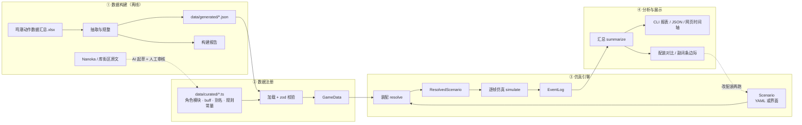
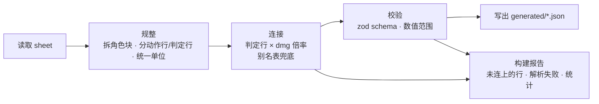
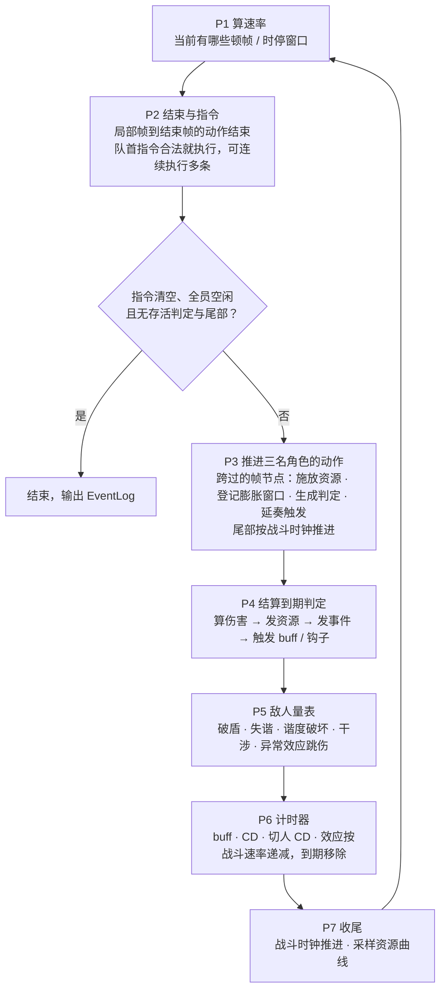
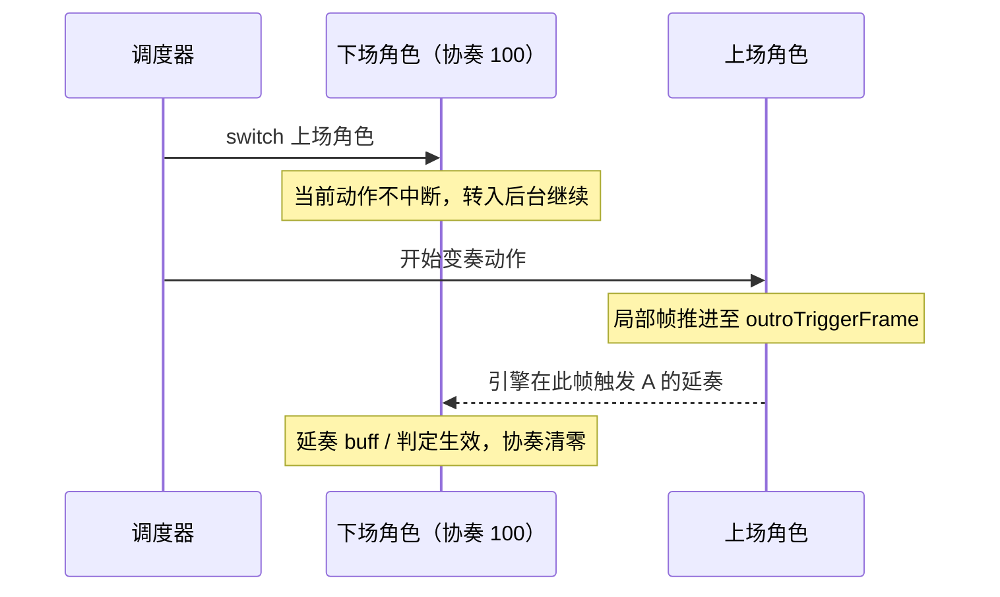

# 鸣潮 DPS 引擎 · 技术总体设计 v0.1.6

> **状态**：v0.1.6（2026-10-04；M0–M3 已完成，声骸已接入，M5 的完成标志已满足。v0.1.6 并回声骸与 M5 的实现决定，见附录 C。v0.1.5 并回 M1–M3 实现时的决定与 TD-05～08。此前：按 TD-01 / TD-02 的全量数据核查、TD-03 的公式核定、TD-04 的内核规格、TD-09 的排轴与调度语义及 M0 的实现更新）
> **上游**：《鸣潮 DPS 计算工具 · 设计文档 v0.2.9》（下称"机制设计"）、已锁定的项目决策、对 xlsx（20260707 版）的数据核查及 TD-01 至 TD-04、TD-09 的反馈
> **下游**：本文是母文档，用来派生第 14 节列出的技术细节文档（TD-xx），细节文档再指导具体编码
> **冲突处理**：机制设计与本文不一致时，以本文附录 A 的勘误为准
> 图用 Mermaid 绘制，Obsidian 可直接渲染

---

## 0. 这份文档讲什么

- **讲**：引擎怎么搭——分几层、数据怎么流、每层吃什么吐什么、关键取舍及理由、先做什么后做什么。
- **不讲**：游戏机制的完整规则（在机制设计里）；完整的类型定义与算法细节（在各 TD 细节文档里）。
- **读者**：Stephen 本人，以及 Claude Code / Codex / Antigravity 等编码代理。因此术语和代码命名在附录 B 固定下来，所有细节文档沿用。

### 0.1 设计原则

1. **实用、清晰、简单优先。** 个人兴趣项目：不做后端、数据库、账号、权限、并发一致性、旧数据兼容。
2. **引擎对外是纯函数。** `simulate(场景) → 结果`，同样输入永远同样输出；不引入随机数，测试和对比都能直接比数字。
3. **引擎内部可以直白。** 仿真循环里直接改状态；需要回放靠事件日志，需要分支靠整体拷贝，不追求不可变数据结构。
4. **数据管 80%，代码管 20%。** 通用的动作、资源、buff 用数据描述；角色独有的怪机制写成小段 TypeScript 钩子，不发明规则语言。
5. **按需长大。** 先让一支队伍从数据到 DPS 全链路跑通、对得上账，再加角色；不追求一次覆盖全部角色和整个 buff 库。
6. **每个数字都能解释。** 任意一段伤害都能追溯到：第几帧、哪个动作的哪个判定、吃了哪些 buff、各乘区系数多少。

---

## 1. 范围

**做（v0–v1）**

- 单目标、三人队、给定输出轴的逐帧仿真：总伤害、战斗时长、期望 DPS、分角色 / 分动作占比。
- 资源全程模拟：大招能量（全队分配）、协奏、角色核心资源、敌人韧性、白条与偏谐量表；轴里"在等能量"的地方显式报出来。
- 配装对比：同一条轴下两套配装的 DPS 差、副词条边际收益、共鸣效率对循环的影响。
- 循环可持续性：轴重复 N 次，看能量与协奏是否收支平衡。

**不做（至少 v1 之前）**

- 自动排轴搜索（v2，架构上预留：状态可拷贝、仿真够快）。
- 多目标 / AoE、敌人位移与攻击、受击判定（极限闪避只作为写在轴里的主动指令）。
- 随机暴击的蒙特卡洛模拟。
- 联机、多语言、多个数据版本并存。
- 通用规则引擎、插件系统、后端服务。

---

## 2. 总体架构

四层，单向依赖：上层只消费下层的产出，不反向调用。

| 层 | 职责 | 形态 | 何时运行 |
|---|---|---|---|
| ① 数据构建 | 把 xlsx（和少量外部文本）转成干净的 JSON，并产出构建报告 | Node 脚本 | xlsx 更新时手动跑 |
| ② 数据注册 | 合并"生成数据"与"手写角色模块"，校验后得到 `GameData` | TS 模块 | 程序启动时 |
| ③ 仿真引擎 | 装配场景 → 逐帧仿真 → 事件日志 | 纯 TS 库，不依赖 DOM / Node API | 每次计算 |
| ④ 分析与展示 | 汇总指标、配装对比、CLI 报表、网页界面 | CLI + 静态网页 | 每次计算后 |



**为什么这样分层**

- **构建与仿真分开**：xlsx 作者更新表格（已见 0526、0707 两版）后只需重跑脚本，引擎代码不动。
- **引擎是纯库**：CLI、测试、网页、将来的搜索器都调同一个 `simulate`，不会出现"网页算的和测试算的不一样"。
- **CLI 先行，网页后置**：机制与公式的正确性全部在命令行和测试里验证完；界面只做展示和编辑，不藏逻辑。

---

## 3. 数据流

一次完整计算经过四段数据流：离线构建 → 装配 → 仿真 → 汇总。本节讲每段的输入、处理和产出；仿真段的内部细节见第 6 节。

### 3.1 离线构建：xlsx → generated JSON

**读取原则：只读主表，不读计算器视图。** `角色技能类型` 和 `伤害计算` 的上半部分是用 INDEX/MATCH 拼出来的"当前所选角色"视图；真正的全量数据在 `base`、`dmg`、`weapon`、`声骸`、`敌对属性列表` 和两张动作表里。计算器视图只用来抽"标准答案"。

| 来源 sheet | 取什么 | 产出 | 注意 |
|---|---|---|---|
| 角色-女 / 角色-男 | 每个动作的帧数据：发生帧、持续帧、顿帧、派生帧 / 派生持续帧、动作结束帧、可弹刀、可脱手、削韧值、偏谐值、大招回收、协奏回收、核心回收 1–3、中断优先级、位置状态、时间膨胀 | `actions/<角色>.json` | 块状结构：角色名只写在块首行，同一 ID 下是"动作行 + 判定行"；块内 A 列的 `技能类型`、`伤害计算`、`输入缓存`、`牵引` 等是跳转链接标签（所在行照常是数据），另有 7 个 `通用-*` 块；46 列含自 / 敌 / 友三套膨胀窗口；资源列要连公式一起读（TD-01 §3.7） |
| dmg | 每个判定的倍率（角色取 `RateLv_10`、声骸取 `RateLv_5`，× 0.0001，TD-01 §4.3）、元素、伤害类型、相关属性（攻 / 血 / 防）、能量 / 削韧 / 偏谐的校验字段、游戏内部 ID | 并入判定定义 | 与动作表按（角色, 名称）连接 |
| base（主表区） | 角色 90 级三维、大招能量、核心资源名与上限、被动 / 共鸣链文本；游戏公式定义（`CalculateHurt` 等）；秒→帧规则 `FunctionalFrame` | `characters.json`、`formula-ref.json` | 公式定义只作规格引用，运行时不解析；角色的武器类型不在 xlsx 里，由 curated 补 |
| weapon | 武器基础属性、被动文本及各谐振阶数值 | `weapons.json` | 被动效果要在 curated 里转成 BuffDef |
| 声骸 | 声骸技能动作帧、冷却、技能说明 | `echoes.json` | 只有鸣钟之龟按体型分行；dmg 只收录约 22 个新声骸的倍率，其余从技能说明录入 curated；声骸 COST 与角色体型见 `索引` 页 |
| 敌对属性列表 | 等级、防御、各元素抗性、白条 / 韧性 / 偏谐阈值及恢复、各类减免 | `enemies.json` | 白条与韧性是两套量表，削韧值只作用于韧性（TD-01 §9.2） |
| 伤害配置 R73–R1790 | buff 库：名称、分类、来源、效果文本（1549 条） | `buff-texts.json` | 只有文本，没有持续时间和触发条件（见 3.2）；R1791 起是计算器的分区网格，只作对拍 |
| 伤害计算 R1027 起 | 异常效应逐层倍率表、谐度破坏表（按敌人 COST / 武器类型） | `effects.json`、`tune-break.json` | 倍率主数据取 dmg 的 `异常伤害` / `通用` 谐度破坏行；这里补说明文本、结算次数与对拍值 |
| 伤害计算（主区缓存值与数组公式） | 当前配置下各技能的未暴击 / 暴击伤害，及每格公式拆出的乘区 | `fixtures/golden-damage.json`、`fixtures/golden-zones.json` | 公式对拍的标准答案（TD-03 §10） |



**核查过的现状**（决定了构建脚本要处理多少"脏活"）：

- 两张动作表共 70 个块（63 个角色块，含漂泊者各属性、机兵形态；7 个通用块）、1598 个动作组、4769 个数据行，其中判定行 3666（156 行由事件生成）。按（角色, 名称）直接连上 dmg 倍率的 2434 行（66%）。连不上的多是召唤物命名（白芷的"优昙A1"在 dmg 叫"A1"）、多段判定共用一个 dmg 行（"暴风雨-1…5"）、功能性判定（聚怪、牵引、顿帧，本就无伤害）和命名差异（动作表的"大招-伤害"在 dmg 里叫"大招"）。→ 由 curated 别名表按需补，构建报告列出全部缺口与候选建议（TD-01 §4.4）。
- dmg 表的 `Energy`、`ToughLv`、`WeaknessLvl` 分别等于动作表的大招回收、削韧值、偏谐值 × 100（如散华 E：1000 / 10000 / 8000 对应 10 / 100 / 80）。已连上且两边都有值的行里，削韧、偏谐 2349 / 2349 全部吻合，能量 2345 / 2349 吻合。构建时用它们做交叉校验，不一致的行进报告（目前是白芷 QTE、灯灯"黄-强化E-1"、卡卡罗"仁慈-1""死告-1"四行）。
- 资源列（大招 / 协奏 / 核心回收）有 434 格是 `=0+20` 这类公式：按数据作者的约定，末项是"进入动作即得"、前面各项是逐段命中所得。缓存值只有总和，所以构建脚本对这几列同时读公式（TD-01 §3.7）。
- 构建脚本幂等，可随 xlsx 更新反复重跑；`generated/` 下的文件永远不手改。

### 3.2 buff 的两条来路

```text
xlsx buff 文本 ──规则解析──▶ 草稿：数值、乘区、层数上限、作用对象
Nanoka / 库街区原文 ──AI 起草 + 人工审核──▶ 补齐：触发条件、持续时间、onSwitchOut
                                           └──▶ data/curated/…（带原文出处注释的最终定义）
```

- 用最简单的整句正则（"冰伤加成+10%,上限3层"这一类，口径见 TD-01 §10.2）能完整匹配的约 62%：声骸技能 96%、声骸套装 95%、角色 87%、武器 85%、角色延奏 83%、深塔 38%、海墟 8%、矩阵 2%。匹配只说明"形状简单"，触发条件与持续时间仍要补；其余带条件（"共鸣效率达到250%时…""对持有【光噪效应】的目标…"）。
- **进入运行时的 buff 只来自 curated。** 解析结果只是草稿，因为 xlsx 文本里本来就没有触发条件和时长。唯一例外：整句解析成功的场景常驻 buff（深塔、海墟等）可直接启用为"常驻、无限时长"。
- 持续时间：原文"持续 N 秒"按 `FunctionalFrame` 规则换算成帧。
- onSwitchOut：原文明写"切换至其他角色则该效果提前结束"才是 `clear`，否则一律 `persist`（已锁定）。

### 3.3 装配：Scenario → ResolvedScenario

装配把"用户写的场景"变成"仿真能直接用的初始状态"，只做一次：

1. **校验场景**：角色、武器、首位声骸、动作名都能在 `GameData` 找到；错了立刻报错并指出哪一行。只有写了角色模块的角色进 `GameData`（武器类型、别名、buff 都在模块里，M2）。首位声骸要放技能，必须在声骸表里；其余几件只计入词条与套装，表里没有也行；"异相·X"取 X（异相只换配色，TD-01 §8）。
2. **静态面板**：90 级三维（另加全员相同的基础暴击 5%、暴伤 150%、共鸣效率 100%，TD-03 §3.2）+ 武器 + 声骸主副词条 + 套装件数效果中的常驻部分 + 常驻被动 / 共鸣链 + 技能树属性节点（角色模块 `treeStats`，与 nanoka 核对）→ 每人一份 `StaticPanel`。面板保留"基础值 / 百分比 / 固定值"分量，不只存最终值，因为战斗中的攻击% buff 要在命中时再叠进去。
3. **buff 登记**：常驻 buff 直接生成实例；有触发条件的 buff 注册为监听器；"回复 N 点能量 / 协奏"这类资源型触发效果同样登记（TD-07 §9）。按共鸣链等级过滤、按武器谐振阶取值。
4. **动作表**：把首位声骸的技能动作（`Q·<组名>`，按角色体型选行）并入角色动作表，别名 `Q`；首位加成与技能附带的 buff / 资源型效果随之登记（TD-01 §13.3）；通用动作（闪避、极限闪避等）按体型并入；按队员的共鸣链数挑判定——同一判定的 C0 / C3 / C5 版本只留一个，高链才有的判定低链时去掉（TD-01 §13.2 的 `chainRange`）。
5. **敌人**：按预设或自定义生成敌人状态，叠加场景 debuff。
6. **初始资源**：按场景设定（例如"满能量开局"）。
7. **编译排轴**：轴的每一行解析成一条或几条指令 `Command`，别名（R / E / Q…）解析成具体动作 ID；能静态查出的错（角色不在队伍、动作不存在、出招的人不在前台、单独写了变奏 / 延奏、循环时第 2 轮前台对不上）一次报全（TD-09 §4）。

产出 `ResolvedScenario`：纯数据，外加对角色模块钩子的引用；仿真过程中只读。

### 3.4 仿真：ResolvedScenario → EventLog

逐帧推进，直到指令执行完、三人都空闲、场上没有存活判定（或达到帧数上限）。每一帧发生的事写成事件追加到 `EventLog`。内部细节见第 6 节。

### 3.5 汇总与分析：EventLog → 报表

- `simulate` 只产出事件日志和少量汇总；所有展示都从日志派生，不在别处重算。
- **汇总指标**：总伤害、窗口时长、DPS、分角色 / 分动作占比、资源曲线、buff 覆盖率、等待与告警。
- **DPS 口径**：
  - 统计窗口 = 第 0 帧到"最后一条指令对应动作的结束帧"；可用 `options.endAt` 覆盖。变奏切人开始的变奏动作、接续动作都带指令出处，按它们结束算（TD-09 §3.9）。
  - 窗口外仍在结算的伤害（如残留的领域、召唤物）单列为"溢出伤害"，不计入 DPS。
  - 窗口时长用战斗时钟计（全局时停期间不走）。
  - 重复 N 次时，报告每一轮的 DPS 和资源首尾差；**稳态取完整的轮**（第 2 轮到倒数第 2 轮：第 1 轮受开局资源影响，最后一轮没有下一轮的边界、偏高；只有 2 轮时取第 2 轮，TD-10 §2）。
- **对比**：`compare(基准场景, 变体补丁[])` 就是把场景改几处、各跑一次 `simulate` 再做差。副词条边际 = 每种副词条各加一档后重跑。口径与命令（`pnpm compare`、`pnpm marginal`）见 TD-10。

### 3.6 走一遍：散华 E 的一次判定，从表格到 DPS

用一段真实数据把四段数据流串起来：

1. **表格里**：`角色-女` 散华块、ID 12 的"E"行：发生帧 19、派生帧 60、动作结束帧 96、大招回收 10、协奏回收 15、核心回收 1、削韧值 100、偏谐值 80、中断优先级"4,2"、只有敌方顿帧。`dmg` 表（散华, E）：`RateLv_10 = 35985` → 倍率 3.5985，伤害类型码 4（共鸣技能）、元素码 1（冷凝）、`Energy = 1000`。同组的"E-引爆冰棱"行没有发生帧——它在重击·爆裂引爆冰棱时才出现，不随 E 自动生成。
2. **构建后**：`ActionDef 'E'`（endFrame 96，取消窗口从派生帧 60 算起、具体语义见 TD-04，优先级 4 → 2）里含一个 `JudgmentDef 'E'`：spawnFrame 19、multiplier 3.5985、tags [共鸣技能]、element 冷凝、gains { energy 10, concerto 15, core [1, 0, 0] }、gauges { toughness 100, tunability 80 }。"E-引爆冰棱"是另一个判定定义，由散华模块的钩子在引爆时生成。
3. **装配后**：轴里的一行"散华 E"编译成 `Command { char: 散华, action: 'E' }`。
4. **仿真中**：
   - 第 f 帧，散华在前台且空闲、CD 就绪 → 开始 E；按 `onCast` 规则发放 E 自身的协奏 15。
   - 散华的局部帧跨过 19 → 生成判定；同一帧结算：收集对"共鸣技能 + 冷凝"生效的 buff → `computeHit` 得到非暴击 / 暴击 / 期望伤害 → 写 `hit` 事件。
   - 结算后发资源：散华大招能量 +10 × 自身共鸣效率，两名队友各 +5 × 各自共鸣效率；敌人韧性削减 100、偏谐 +80 × 散华偏谐效率；再派发 `judgmentSettle` 事件，监听它的 buff 与钩子依次处理。
   - 若在 E 途中切走散华（哪怕还没到第 19 帧），E 仍在后台走完到第 96 帧，判定照常生成、结算、给全队回能——这就是合轴收益在模型里的来源。
5. **汇总时**：这条 `hit` 事件的期望伤害计入窗口总伤害（DPS 分子），并出现在"散华 / 共鸣技能"的占比里。

### 3.7 将来：排轴搜索（v2）

搜索器 = 生成候选指令序列 → 调仿真 → 打分 → 保留前 K 个（beam search）。对引擎只提两点要求：状态是纯数据、能整体拷贝（`structuredClone`）；主循环能从任意中间状态继续跑（这样可以从公共前缀分叉）。v0 除了遵守这两点，不为搜索多写任何代码。

---

## 4. 关键取舍

每条写清：选了什么、放弃了什么、为什么、什么情况下重新考虑。细节文档不得推翻这里的结论；确需推翻时先改本文并记入附录 C。

**T1 时间推进：逐帧固定步长**

- 选：每个 tick 推进 1 个世界帧（60fps）。弃：事件驱动（直接跳到下一个事件时刻）。
- 理由：数据本身按帧给出；一条 30 秒的轴约 1800 帧，三个人加几十个 buff，逐帧计算的开销可以忽略（预计单次仿真在毫秒到十毫秒量级；M3 实测：M0 三人轴约 30 秒战斗、472 条事件，一次仿真中位 16 ms、p95 31 ms，散华单人轴 1.6 ms，2 核 VPS、Node 22、tsx 未打包）；逐帧最直观，调试时能停在任意一帧看状态。
- 重审：v2 搜索要跑十万次级别时，加"空闲帧快进"优化，语义不变。

**T2 时间模型：三种时钟 + 每帧速率表**

- 选：世界帧、战斗时钟、角色局部帧分开；每个 tick 先算一张速率表，决定各自走多快（6.2）。弃：单一时钟，顿帧用"额外加几帧"近似。
- 理由：顿帧（自己变慢）、时停（别人冻结）、全局时停（战斗时钟也停，DPS 分母不走）用一张表统一表达；发现新规则只改表，不改循环。
- 代价：局部帧是小数，"是否跨过某一帧"要用区间判断。

**T3 伤害来源：判定独立于动作**

- 选：动作只负责在发生帧"生成判定"；判定生成后归战场所有，由引擎统一结算伤害与资源。弃：把伤害直接挂在动作时间轴上。
- 理由：一个模型同时解释后台出伤（后台动作照样生成判定）、取消与可脱手（"生成"和"存留"分开处理）、召唤物与持续领域（长寿命、多次结算的判定）。机制设计里的"持续效果池"就是存活判定的集合。

**T4 暴击：期望值、确定性**

- 选：每段判定分别算非暴击值和暴击值，再按暴击率加权；全程无随机数。弃：蒙特卡洛。
- 理由：线性情况下期望值就是精确值；分两支算是因为 xlsx 公式里有只在暴击时生效的乘区行。确定性让测试与对比可以直接比数字。
- 代价："暴击时触发"类效果只能按概率折算；真遇到影响大的，再加可选的随机模式。

**T5 单目标**

- 选：只有一个敌人。弃：多目标。
- 理由：配装择优的主要场景是打单体 boss；多目标会牵出范围、站位、聚怪一整串建模。

**T6 排轴：指令序列 +"最早合法帧"调度**

- 选：轴写成一串指令（出招 / 切人 / 等待），引擎在最早合法的帧执行；需要刻意晚一点时用 `+N` 延迟。弃：让用户在时间轴上逐帧摆放；弃：带条件分支的脚本。
- 理由：贴近玩家的思考方式（"E A1 A2 切长离 R"），写起来短；合法性全由引擎判断，写错能报出来；将来搜索器生成的也是同样的指令序列，网页编辑器产出的也是它。
- 补充：指令写具体动作而不是按键。按一次 E 在不同状态下会出不同动作（如今汐），"按键 → 动作"的自动推断以后作为可选钩子再加。

**T7 不合法的指令：能等就等，并报出来**

- 选：冷却、能量、衔接窗口还没到 → 推进时间直到合法，并记录"等了多少帧、在等什么"；超时或根本不可能 → 报错。弃：一律立即报错。
- 理由："这一步等了多少帧能量"正是用户最想知道的信息之一，也是本工具相对椰果工具箱（不建模能量）的核心价值。

**T8 规则表达：数据 + 少量代码钩子**

- 选：通用效果用 BuffDef（固定字段 + 固定触发事件目录）描述；角色独有机制写成 TS 钩子（只有 4 个钩子点，6.9）。弃：自创规则 DSL；弃：全部硬编码。
- 理由：绝大多数 buff 是"某乘区 + 数值 + 层数 + 触发 + 时长"的套路，写数据最省事；剩下的怪机制（形态切换、韶光、黯核……）用代码写最快、最好测，也是 AI 最擅长写的代码。
- 判断标准：一条 BuffDef 能说清的写数据；需要读写角色资源、改变动作可用性、依赖多条件组合的写钩子。

**T9 数据：生成与手写分离**

- 选：`generated/` 只由脚本写、随 xlsx 重跑；`curated/` 手写（AI 起草、人工审核）。弃：在生成的 JSON 上直接手改。
- 理由：xlsx 在持续更新，手改会被覆盖；分开后重跑无痛。

**T10 覆盖范围：一次一支队伍**

- 选：先挑一支队伍把全链路做通、做准，再逐个扩角色。弃：先把全部角色和整个 buff 库转换完。
- 理由：最快拿到可验证的结果；模型问题能在小范围暴露，避免大规模返工。

**T11 主键：沿用 xlsx 中文名**

- 选：角色名、动作名、声骸名直接做 ID，辅以别名表。弃：自建 ID 体系。
- 理由：数据、界面、使用者都是中文，少一层映射。dmg 表里的游戏内部 ID（`Skill.Id` 等）作为附加字段保留，将来需要时可切换。

**T12 运行形态与语言：TypeScript 单栈、纯静态、无后端**

- 选：引擎、构建脚本、CLI、网页全部 TypeScript；网页是纯静态站，计算在浏览器里做。弃：后端服务；弃：Python 抽取 + TS 引擎双栈。
- 理由：一套工具链、一套类型，AI 协作时上下文最少。构建脚本若在 xlsx 解析上受阻，可单独换成 Python/openpyxl——边界是 JSON，其余部分不受影响。

**T13 状态：循环内可变**

- 选：仿真循环里直接改状态对象；对外保持纯函数；靠事件日志回放，靠 `structuredClone` 分支。弃：全程不可变数据。
- 理由：代码最直白、也最快；"可追溯"已由事件日志提供。

**T14 buff 取值：命中时实时读取**

- 选：判定结算那一刻用当时生效的 buff。弃：施放时快照。
- 理由：符合绝大多数情况；个别需要快照的机制交给钩子。

**T15 数据版本：只维护当前版本**

- 选：数据只有"当前版本"一份；旧场景在新数据下结果变化属于正常。弃：多版本并存、结果可复现。
- 理由：个人工具，不需要历史一致性；构建产物里记录 xlsx 文件名与哈希，够用来排查。

---

## 5. 核心数据模型（概要）

这里只列关键类型与字段，说明"什么东西在哪一层、长什么样"。完整定义、校验规则、默认值放在 TD-02。

### 5.1 静态数据：GameData（只读）

```ts
interface GameData {
  version: string                              // 如 "20260707"
  characters: Record<CharName, CharacterDef>
  weapons: Record<string, WeaponDef>
  echoes: Record<string, EchoDef>              // 声骸：技能动作、COST、首位装配加成
  echoSets: Record<string, EchoSetDef>         // 2 / 3 / 5 件效果 → BuffDef
  enemies: Record<string, EnemyPreset>
  effects: Record<EffectName, EffectDef>       // 异常效应：风蚀 / 电磁 / 霜渐 / 聚爆 / 光噪 / 虚湮…
  tuneBreak: TuneBreakTable                    // 谐度破坏（按敌人 COST / 武器类型）
  envBuffs: Record<string, BuffDef>            // 深塔、海墟等场景 buff
  rules: Rules                                 // 全局常量与规则开关（6.2、6.7）
}

interface CharacterDef {
  name: CharName; element: Element; weaponType: WeaponType /* curated */; bodyType: BodyType | null
  base: { hp: number; atk: number; def: number }       // 90 级
  energyCost: number                                    // 大招所需能量（0 = 不走能量）
  coreResources: { slot: 1 | 2 | 3 | 4 | 5; name: string; cap: number }[]   // 槽位可不连续
  actions: Record<ActionId, ActionDef>
  aliases: Record<string, ActionId>                     // "R" → 具体动作
  buffs: BuffDef[]                                      // 被动 / 共鸣链 / 延奏…（curated）
  hooks?: CharacterHooks                                // 角色特殊机制（curated）
}

interface ActionDef {
  id: ActionId
  kind: 'normal' | 'heavy' | 'skill' | 'liberation' | 'intro' | 'outro' | 'echo' | 'dodge' | 'other'
  endFrame: number                          // 动作结束帧 → 回到空闲
  cancelWindows: CancelWindow[]             // 由派生帧 / 派生持续帧换算，[from, until) 可越过结束帧（TD-04 §6）
  priority: { fromFrame: number; value: number }[]   // 中断优先级随帧变化
  comboFrom?: ActionId[]                    // 连段前置：A2 只能接在 A1 的派生窗口里
  inputLocks: { until: number; kinds: ActionKind[] | 'all' }[]   // "第 nF 前不响应输入 / 不能闪避"
  judgments: JudgmentDef[]
  dilations: DilationDef[]                  // 动作自带的时停 / 全局时停 / 极限闪避时缓
  castGains: { atFrame: number; resource: ResourceKind; amount: number }[]   // 施放类资源（6.7）
  outroTriggerFrame?: number                // 仅变奏动作：前一位角色的延奏在此帧触发（取自 QTE 备注）
  switchLockUntil?: number                  // 此帧前不能切人
}

interface JudgmentDef {                     // 一个"判定"：生成后独立结算
  name: string
  spawnFrame: number | null                 // 发生帧；null = 由事件生成（钩子）
  birthFrame: number | null                 // 出生帧：发生帧公式 P + f(Q) 的 P，取消时决定是否保留（TD-04 §5.4）
  lifeFrames: number                        // 持续帧（-1 = 直到动作结束，必定不可脱手）
  ticks: number; tickInterval: number | null   // 结算次数与间隔（备注"每 nF 判定一次，最多 m 次"）
  persistsOnCancel: boolean                 // 可脱手：动作被取消后，已生成的判定是否继续
  target: 'enemy' | 'ally' | 'none' | 'other'
  calc: 'damage' | 'heal' | 'hpCost'
  multiplier: number                        // 0 = 不造成伤害（纯资源 / 触发用）
  relatedAttr: 'atk' | 'hp' | 'def'
  element: Element
  tags: DamageTag[]                         // 普攻 / 重击 / 共鸣技能 / 共鸣解放 / 变奏 / 延奏 / 声骸技能…
  gains: { energy: number; concerto: number; core: [number, number, number] }
  gauges: { toughness: number; tunability: number }
  hitstop: DilationDef | null               // 命中时登记的顿帧
  chainRange?: { min: number; max: number } // 只在这些共鸣链数下存在（TD-01 §13.2）；缺省 = 任何链数
}

interface BuffDef {
  id: string; source: string                // source 写原文出处，方便核对
  zone: ZoneId                              // 面板类（atkPct、critRate…）或公式类（CalculateHurt 变量名；加深 / 最终伤害的类别写进名字，TD-03 §2）
  value: number | number[]                  // number[] = 按武器谐振阶 R1–R5 取值
  filter?: { elements?: Element[]; tags?: DamageTag[]; judgments?: string[]; enemyEffect?: EffectName; effects?: EffectName[]; critOnly?: boolean }
  target: 'self' | 'team' | 'teamExceptSelf' | 'onField' | 'nextIn' | 'enemy'
  maxStacks: number; stackGain: number; icd?: number
  duration: number | 'inf'                  // 帧
  onSwitchOut: 'persist' | 'clear'
  trigger: 'always' | { on: EventType; where?: EventFilter }
  requires?: { chain?: number }             // 共鸣链门槛
}
```

完整定义（含 `DilationDef`、`CancelWindow`、`EchoDef`、`EnemyPreset`、`Rules` 等）以 TD-02 第 4、5 节为准。

### 5.2 输入：Scenario 与 ResolvedScenario

- `Scenario`：用户写的场景（YAML 或界面产出的 JSON），格式见第 8 节。
- `ResolvedScenario`：装配后的只读数据——三人的 `StaticPanel`、合并后的动作表、已登记的 buff、敌人初始状态、初始资源、编译好的指令队列。

### 5.3 运行时：SimState（仿真循环内可变）

```ts
interface SimState {
  frame: number                  // 世界帧：循环计数，只用于日志与调试定位
  battleFrames: number           // 战斗时钟：DPS 分母；全局时停不走
  onField: 0 | 1 | 2             // 前台角色槽位
  switchCd: number
  chars: CharRuntime[]           // 三人
  judgments: JudgmentRuntime[]   // 场上存活的判定（含后台角色的、召唤物、领域）
  tails: TailRuntime[]           // 尾部：动作取消或结束后仍要发生的事件（TD-04 §4.4）
  buffs: BuffRuntime[]
  enemy: EnemyRuntime
  dilations: DilationRuntime[]   // 正在生效的顿帧 / 时停窗口
  queue: Command[]               // 剩余指令
  log: SimEvent[]
}

interface CharRuntime {
  slot: 0 | 1 | 2; def: CharacterDef; panel: StaticPanel
  action: { id: ActionId; localFrame: number; startedAt: number } | null   // null = 空闲
  last: { id: ActionId; localFrame: number } | null   // 最近一个动作实例，结束后照走，判断连段窗口用
  energy: number; concerto: number; core: number[]       // 核心资源槽 1–5
  cooldowns: Record<string, number>
  flags: Record<string, number | boolean>     // 形态 / 状态标记，只由钩子读写
}

interface EnemyRuntime {
  preset: EnemyPreset
  whiteBar: number; broken: boolean         // 白条：打空即破盾
  poise: number                             // 韧性：削韧值作用于它
  tunability: number; disharmony: boolean; tunabilityLockedUntil: number
  shift?: 'zhenxie' | 'jixie'
  interference?: { kind: 'zhenxie' | 'jixie'; stacks: number; remaining: number }
  effects: Partial<Record<EffectName, { stacks: number; remaining: number; nextTick: number }>>
}
```

### 5.4 输出：SimEvent 与 Summary

- `SimEvent`：带世界帧 `f` 和战斗秒数 `t` 的事件记录，类型见第 9 节。
- `Summary`：由事件日志汇总的指标，见 3.5 与第 9 节。

---

## 6. 仿真内核

### 6.1 模块划分

| 模块 | 职责 |
|---|---|
| `resolve` | 场景 → ResolvedScenario（3.3） |
| `simulate` | 主循环，按 6.3 的相位调用下列模块 |
| `clock` | 计算每帧速率表，维护时间膨胀窗口 |
| `scheduler` | 指令队列、合法性判断、等待与超时 |
| `actions` | 推进动作局部帧；开始、结束、取消；在发生帧生成判定 |
| `judgments` | 存活判定的计时与结算 |
| `damage` | 乘区收集（`collect`）+ 纯函数公式（`formula`）+ 异常公式 + 谐度破坏 |
| `resources` | 能量分配、协奏、核心资源 |
| `enemy` | 削韧、偏谐、失谐、偏移 / 干涉 / 响应、异常效应 |
| `buffs` | 实例增删、叠层刷新、到期、onSwitchOut、触发监听 |
| `events` | 事件队列（同帧连锁）与日志 |
| `hooks` | 角色模块的钩子 API（受控读写） |

### 6.2 时钟与时间膨胀

三种时间：

- **世界帧 `frame`**：主循环计数，每个 tick 加 1。
- **战斗时钟 `battleFrames`**：副本计时，也是 DPS 分母。buff 剩余时间、技能 CD、切人 CD、判定寿命、异常效应都按它走。全局时停时它停。
- **角色局部帧 `localFrame`**：每个角色当前动作的播放进度。顿帧时按系数变慢；处在别人的时停里被冻结；自己释放时停技能时照常走。

每个 tick 先算一张速率表，所有计时器按表推进：

```ts
interface Rates {
  battle: 0 | 1                     // 战斗时钟本帧走不走
  chars: [number, number, number]   // 三人局部帧本帧走多少（通常 0~1；数据里有少数加速窗口 > 1）
  enemy: number                     // 敌人（v0 只记录）
}
```

"时间膨胀类型 → 影响哪些时钟、速率多少"的对照表（攻击顿帧 / 时停 / 全局时停 / 极限闪避顿帧 / 弹反顿帧，速率与窗口取 xlsx 每行自 / 敌 / 友三套"系数、发生、持续"）放在 `rules.dilation` 里作为数据：初版按已知规则填，再用实测校准。TD-04 §2、§3 定下的规则：

- **帧约定**：每 tick 局部帧从 t 走到 t + r，帧号落在 [t, t + r) 的事件本 tick 发生；窗口、优先级等状态用 tick 开头的 t 判断。局部帧与判定年龄每次推进后取整到 1e-4（膨胀系数都是它的整数倍），消除浮点误差。
- **速率**：一个单位的速率 = 作用在它身上的全部窗口取最小（没有窗口为 1）。攻击顿帧在同一单位上只留最新一个（新的替换旧的）；时停、全局时停与之并存。窗口登记后下一 tick 起生效，按世界帧倒数；全局时停期间战斗时钟为 0。
- **登记**：膨胀发生有值的按动作局部帧登记；为空的挂在判定上，每次命中登记一次。极限闪避的自身减速在该动作被取消时撤掉（"可通过按住普攻键取消"）。
- **判定时钟**：判定的间隔与寿命按战斗时钟走；"跟随顿帧"的判定按出伤者的局部速率走。

### 6.3 一个 tick 做什么



动作是否结束放在下一 tick 的 P2 开头判断：结束帧为 E 的动作占满局部区间 [0, E)，结束与下一个动作的开始落在同一 tick。各相位的细则见 TD-04 §1。

**同一帧内的顺序规则**（保证确定性）：

- 同一相位内按角色槽位 0 → 1 → 2 处理；同一角色的判定按生成顺序处理。
- **先算伤害，后触发。** 一段判定结算时，先用当下的 buff 算它的伤害，再处理它触发的效果。所以它触发的 buff 不作用于它自己，但作用于同一帧之后结算的判定。这与"xxx 后"类文案的实际表现一致（社区对散华 6 链的说明：引爆这一下本身不吃"引爆后"的攻击加成）。
- 连锁触发（buff 触发 buff）在同一帧内用队列依次处理，设深度上限（默认 16）防止死循环，超限报错。

### 6.4 引擎不变量

这六条是整个引擎的地基，任何实现都必须满足，每条都要有对应的机制用例（第 11 节）：

1. **伤害和资源只来自判定结算。** 判定生成后归战场所有，与谁在前台无关——这是后台出伤和合轴收益的来源。
2. **每帧推进全部三名角色的动作**，不区分前台后台。
3. **切人不打断动作。** 切人只改变前台归属、启动切人 CD（60 帧）；被切下的角色在后台把当前动作走完；再切回来时从当时的进度继续。两个例外由数据或规则写明（TD-05）：变奏切人时，切入者在后台还没做完的动作被变奏动作取消；备注写了"第nF后切人结束技能"的动作，切出时按取消处理（`endOnSwitchOut`）。
4. **取消只发生在同一角色开始新动作时**（派生、闪避、大招或声骸技能强插等）。旧动作里还没"出现"的判定作废（出现 = 过了出生帧，即发生帧公式 P + f(Q) 的 P；没有出生帧就是发生帧）；已出现而没到发生帧、可脱手的判定照常在发生帧生成；已生成、尚未结算完的判定由 `persistsOnCancel`（可脱手）决定留下还是删除；没走到的延奏触发转为尾部照常发生（延奏是下场角色发出的）。自然结束时，结束帧之后的事件照常发生；角色开始新动作时，此前动作留下的不可脱手判定一并消失（TD-04 §4）。
5. **协奏满时切人**：上场角色执行变奏动作；在该变奏动作的 `outroTriggerFrame`（变奏被打断时按战斗时钟照常在这一帧），下场角色的延奏生效，下场角色的协奏在这一刻清零。带伤害的延奏动作（椿的"缠绕"）以独立时间线执行，不打断下场角色的后台动作（TD-05 §4）。协奏未满就是普通切人，没有变奏和延奏。
6. **全局时停期间**，战斗时钟、buff 计时、技能 CD 全部暂停，只有释放时停技能的角色动画在走。



### 6.5 调度器：指令语义

完整语义见 TD-09；这里是概要。三种指令：

| 指令 | 写法 | 语义 |
|---|---|---|
| 出招 | `散华 E`、`散华 E A1 A2 +3 大招!` | 该角色依次在最早合法帧出这些动作。一行可写同一角色的多个动作；`+N` = 最早合法之后再等 N 帧；`!` = 强制，不等"就绪" |
| 切人 | `switch 长离` 或 `切人 长离` | 在最早合法帧切人；协奏满自动变奏 / 延奏（TD-05） |
| 等待 | `wait 20` 或 `等待 20` | 空等 20 帧；期间所有动作、判定照常推进 |

`+N` 与 `wait` 的帧数都是战斗帧（与 DPS 分母同一口径，全局时停期间不走）。空格后的 `#` 起是注释；全角的标点与数字按半角处理。

**最早合法帧**：每个 tick 的 P2 从队首开始，能执行就执行（一个 tick 可执行多条），不能执行就等，等不来就报错。出招依次检查：

- 出招的角色在前台（后台角色不能主动出招；召唤物、领域是判定，不受此限）。前台只由 switch 改变，所以这一条在编译期就查了。
- 连段约束：例如 A2 必须落在 A1 的派生窗口里（`comboFrom`；窗口可越过 A1 的结束帧），错过即不合法。
- 当前动作允许：已结束；或新动作的中断优先级高于当前动作此刻的优先级；或两者相等且处在派生窗口内。优先级直接用 xlsx「中断优先级」列的数值，并随"优先级改变"帧变化（例如散华：普攻 2、E 起手 4 后降为 2、大招 10、变奏 11；声骸表里的召唤类技能为 5）。机制设计里"大招 > 声骸技能 > 特殊变奏 > 常规"是它的通俗说法，以数值为准。当前动作的输入锁（"第 nF 前不响应输入 / 不能闪避"）未过时不行。
- 冷却就绪（按战斗时钟走；角色技能的冷却 xlsx 没有，写在角色模块里）、资源足够（大招能量由引擎判断，核心资源条件由角色钩子判断）。
- 默认还要等当前动作**就绪**：此时打断不会丢掉判定或资源（没走到的延奏触发转尾部照常发生，不用等；例如"散华 A1 E"，E 等 A1 第 13 帧出手后才打断）。需要抢帧时在动作名后写 `!`（TD-09 §3.4）。全量 119 条普攻连段里，默认策略没有把任何一条等断。
- 同一角色一个 tick 最多开始一个动作；`+N` 从以上全部满足的那个 tick 起算。
- 切人：切人冷却为 0，前台角色上一个动作的"第 nF 前不能切人"已过（按局部帧算，可以越过结束帧）。切人不打断任何动作。

**不合法时**：

- 能等来的（冷却、能量、窗口还没到）：继续推进时间直到合法，按原因分段记录"等了多少帧、在等什么"（`wait` 事件）。不合法的等待累计超过 `options.maxWait`（默认 600 世界帧）则报错终止；`+N` 与 `wait` 是有意的等待，不计入。
- 等不来的（动作名不存在、连段已断、角色不在队中）：编译期能查的一次报全；运行期立即报错，指出第几轮第几条、第几帧，日志保留到出错为止。

**循环**：`options.repeat = N` 让整条轴执行 N 轮，第 2 轮接着第 1 轮结束时的状态跑；每轮第一次出招或切人时记一条 `loop` 事件。

### 6.6 伤害计算

**公式**以 xlsx `base` 页的游戏公式 `CalculateHurt` 为骨架，按「伤害计算」页的数组公式补全（TD-03 §1）；变量名直接作为代码里的乘区 ID：

```text
基础 = Rate × (1 + RateBonus) × RelatedAttr + ExtraEffect9 + Formula1      倍率 × 攻/血/防/共鸣效率，外加固定附加
伤害 = CEILING( 基础
     × CritDamage                                                       只在暴击分支
     × min(2, 1 / (TargetDef × (1 + TargetDefRate) × (1 − RoleIgnoreDefRate) / (800 + Lv × 8) + 1))   防御，2 倍封顶
     × (1 + DamageChange + DamageChangeElement + DamageChangeType)     加成：通用 + 元素 + 类型，加算
     × Res(TargetElementResistant − RoleIgnoreResistance)               抗性三分支：≤0 收益减半 / <80% 线性 / ≥80% 衰减
     × (1 − min(TargetDamageReduce, 1)) × (1 − min(TargetElementDamageReduce, 1))   减伤
     × (1 + SpecialDamageChange)
     × Π(1 + DamageAmplify_k)                                             加深：0–9 类与霜冻 1002 类，类内加算、类间连乘
     × Π(1 + FinalDamage_k) )                                             最终伤害：0–7 类与 1001 类，同上
```

- 乘区 ID 全表、各项细则（取整、钳位、面板合成）、xlsx 分区与乘区的对应见 TD-03。「伤害计算」页 3190 个伤害 / 治疗格已按它逐位复算。
- **暴击**：每个判定分别算非暴击值和暴击值（各自 CEILING）；期望 = (1 − 暴击率) × 非暴击 + 暴击率 × 暴击；暴击率封顶 100%。只在暴击时生效的 buff 带 `critOnly`，只进暴击分支。
- **乘区 ID 分两类**：面板类（`atkPct`、`atkFlat`、`critRate`、`critDamage`、`energyRegen` 等 12 个，先与 `StaticPanel` 合成属性和暴击参数）与公式类（上面公式里的变量名，33 个；加深与最终伤害的类别写进名字，如 `DamageAmplify3`）。
- **流程**：判定结算 → 生成草稿 `HitDraft`（倍率、元素、标签）→ 角色钩子 `modifyHit` 可以换倍率、算 Formula1、改元素与标签，或直接补乘区值 → 遍历存活 buff：作用对象包含出伤者（或挂在敌人身上）且过滤条件匹配的，按 `zone` 累加"值 × 层数" → 交给纯函数 `computeHit`。`computeHit` 不读任何全局状态，单测最好写。
- **另外三条公式**：异常效应伤害（`CalculateAbnormal`：异常基础值 × 层数倍率，不暴击、不吃伤害加成）、谐度破坏与震谐 / 骇破响应（基础值按等级与敌人 COST）、治疗（`CalculateHeal`）。它们与直接伤害走同一个收集流程（按各自的标签过滤），只是公式不同（TD-03 §5–§7）。

### 6.7 资源与敌人量表

| 资源 | 归属 | 何时变化 | 规则 |
|---|---|---|---|
| 大招能量 | 每人 | 判定结算时；开始大招时扣除 | 出伤者得"大招回收" × 100% × 自身共鸣效率（钩子可放大或清零出伤者这一份，如椿）；其余两人各得 × 50% × 各自共鸣效率（互不影响）；上限 = 大招所需能量，溢出作废；别名 R 的动作要有并扣掉大招所需能量，不够就等（TD-06 §2）；定值回复（"回复 10 点共鸣能量"）不乘共鸣效率；破盾时全队 +3（仅有白条的 COST 3 / 4 敌人，M4） |
| 协奏 | 每人，上限 100 | 两部分："进入即得"（资源公式末项、大招-前置这类资源行）在动作开始时给；逐段所得随判定逐段给（`rules.concertoTiming = 'onHit'`，2026-10-03 实测）。事件生成的附属判定（"E-引爆冰棱"）在它结算时给。可切换为 `'onCast'`（动作开始时一次性发全部） | 只给施放者，不乘共鸣效率；大招 +20、极限闪避 +10 等以数据为准；负数即消耗（一日花 −70）；延奏触发时清零（设为 0）（TD-06 §3） |
| 核心资源 1–3 | 每人 | 判定结算时按"核心回收"；施放类在动作开始时 | 截在 [0, 上限]，负数即消耗；合并区每个动作实例只在首段结算时发；消耗的后果由角色钩子处理（TD-06 §4） |
| 韧性 | 敌人 | 判定结算时按削韧值削减 | 打空即破韧（打断敌人动作） |
| 白条 | 敌人 | 削减来源待 TD-06 核定（不是削韧值，TD-01 §9.2） | 打空即破盾，全队 +3 能量（见上） |
| 偏谐值 | 敌人 | 判定结算时 × 出伤者偏谐效率 | 满则失谐；谐度破坏后清零并在一段时间内不再累积 |
| 偏移 / 干涉 | 敌人 | 特定角色的判定附加偏移；谐度破坏把偏移升级为干涉 | 响应只有两种模板：震谐 = 额外判定 + 每目标独立冷却；集谐 = 对该目标的最终伤害（谐破增幅 × 0.12% × 层数，乘区 `FinalDamage1001`，TD-03 §6） |
| 异常效应 | 敌人 | 判定附加层数 | 持续时间、层数上限、跳伤周期、附带 debuff（如虚湮减防）来自效应表 |

协奏发放时机做成了规则开关，引擎两种都支持，切换不改代码；2026-10-03 实测为按命中给，默认 `onHit`。动作开始时的顺序：扣大招能量 → `actionStart` 的触发与钩子 → 施放资源（TD-06 §7）。

### 6.8 Buff 与触发

完整规格见 TD-07。

- **实例规则**：同一个 BuffDef 对同一持有者、同一目标只有一个实例；再次触发时加 `stackGain` 层（不超过上限），按 `refresh` 刷新或保留持续时间；持续时间按战斗帧走。与此不同的刷新方式交给钩子。
- **作用对象**：`self` / `team` / `teamExceptSelf` / `onField` / `nextIn`（下一位登场角色：由延奏触发时给这次变奏的角色，其余时候挂起到下一次切入）/ `enemy`。
- **触发事件目录**（不够再加）：`actionStart`（按技能归类过滤：椿的 E 是共鸣技能、伤害却是普攻）、`judgmentSettle`（可按伤害标签、元素、判定名过滤）、`intro`、`outro`、`switchIn`、`switchOut`、`enemyState`（破盾 / 失谐 / 谐度破坏 / 干涉变化 / 效应附加，M4）、`resourceFull`、`heal`（提供了一次治疗：标了 `heals` 的判定结算、钩子记的持续回复每一跳，v0.1.6）。`trigger` 可写成数组（任一事件触发）；`where.by` 选发出者（自己 / 任何人 / 前台）；`where.ownerHas` 要求持有者身上有某个 buff（v0.1.6）；`icd` 是内置冷却。
- **四种写法**：常驻（`always`）；触发型；**消耗型**（"下次 X…"，`consume`，消耗它的那次结算吃得到）；**标记型**（不写乘区，只表示状态与计时，给钩子用；只由钩子施加的写 `trigger: 'hook'`）。"回复 N 点能量 / 协奏"不是 buff，写成**资源型效果**（`ResourceEffect`），与 buff 共用触发机制。
- **事件队列**：引擎记下的每条事件依次处理：消耗 → buff 触发 → 资源型效果 → 角色钩子 `onEvent`；处理中产生的新事件排到队尾，同一 tick 内处理完；一条事件引出的链超过 `rules.maxChainDepth`（16）报错。先算伤害，后触发：引起触发的那次结算不吃它带来的 buff。
- **onSwitchOut = clear**：挂在被切下的角色身上的实例在切出时移除（只在原文明写"切换至其他角色则提前结束"时用）。
- **共鸣链与武器谐振**：`requires.chain` 和按阶取值在装配时处理，不进仿真循环。

### 6.9 角色模块与钩子

每个角色 = 生成的帧数据 + 一个手写的 TS 模块。示意（字段以 TD-02 为准）：

```ts
// data/curated/characters/散华.ts
export default defineCharacter('散华', {
  aliases: { E: 'E', R: '大招', QTE: 'QTE' },
  buffs: [
    {
      id: '散华.共鸣链6', source: '共鸣链6：引爆【冰棱】或【冰川】后，队伍中的角色攻击提升10%，持续20秒，可叠加2层',
      zone: 'atkPct', value: 0.10, target: 'team', maxStacks: 2, duration: 1200,
      onSwitchOut: 'persist', requires: { chain: 6 },
      trigger: { on: 'judgmentSettle', where: { judgments: ['E-引爆冰棱', '大招-引爆冰川'] } },
    },
    {
      id: '散华.延奏', source: '下一位登场角色普攻伤害加深38%，效果持续14秒，若切换至其他角色则该效果提前结束',
      zone: 'DamageAmplify0', value: 0.38,                 // 不带类别的"伤害加深" = 0 类（TD-03 §2）
      filter: { tags: ['普攻'] }, target: 'nextIn', maxStacks: 1, duration: 840,
      onSwitchOut: 'clear', trigger: { on: 'outro' },
    },
  ],
  hooks: {
    // 例：某动作需要资源才能放、某资源叠满时强化倍率——只在数据表达不了时才写
  },
})
```

**钩子只有四个**：

| 钩子 | 何时调用 | 典型用途 |
|---|---|---|
| `onResolve(ctx)` | 装配时 | 初始化角色标记（初始形态等） |
| `canStart(ctx, actionId)` | 调度器判断合法性时 | 形态限制、核心资源门槛 |
| `onEvent(ctx, event)` | 每个事件（含队友的；在事件队列每条的最后一步） | 资源增减、形态切换、生成额外判定、挑延奏动作的版本 |
| `modifyHit(ctx, hit)` | 结算时、收集 buff 之前 | 按状态换倍率、算 Formula1、改伤害类型，或直接补乘区值（TD-03 §4） |

`ctx` 只开放受控操作：`addBuff` / `removeBuff` / `addResource` / `spawnJudgment` / `skipJudgments`（某个动作实例里不生成某些判定）/ `setFlag` / `warn`，以及只读查询（`state`、`chain`、`buffStacks`、`getFlag`）；`modifyHit` 还能改这次结算出伤者自己那份能量的倍率（`selfEnergyScale`）。钩子不直接改 `SimState` 的其他部分，出问题时好定位。写法模式与 M0 三人的实现见 TD-08。

---

## 7. 数据目录与约定

```text
data/
  raw/            xlsx 放这里（不进 git，构建产物里记录文件名与哈希）
  generated/      构建脚本产出，禁止手改；按角色拆文件，网页按需加载
    characters.json   actions/<块键>.json   weapons.json   echoes.json   echo-stats.json
    enemies.json   effects.json   tune-break.json   buff-texts.json
    formula-ref.json   nanoka.json   meta.json   build-report.md
  curated/        手写（或 AI 起草、人工审核），进 git
    characters/<角色>.ts   echoes.ts   echo-sets.ts   weapons.ts   env-buffs.ts
    dmg-join.json   nanoka-names.json   rules.ts
  fixtures/
    golden-damage.json    从「伤害计算」缓存值抽出的对拍答案
    golden-zones.json     每个标准答案格拆成的乘区输入（TD-03 §10），M1 公式测试用
```

- **主键**：沿用 xlsx 中文名；对不上的用 `dmg-join.json` 兜底（TD-01 §13.4），构建报告列出全部缺口。
- **技能冷却与文本**：xlsx 没有角色技能的冷却，文本也不全，另取 nanoka.cc 的解包数据（构建时抓取并缓存，产出 `nanoka.json`，用来核对手填的冷却与技能树属性，TD-01 §12.5）。声骸倍率 dmg 没有的从 nanoka 声骸数据连，两边不同以 nanoka 为准（TD-01 §8）。xlsx 固定在 20260707 版，nanoka 用线上版本。
- **时间**：一律用帧（60fps）。秒 → 帧按 `base` 页 `FunctionalFrame` 规则：四舍五入到整帧，不足半帧按 1 帧计。
- **比例**：一律存小数（12% 存 0.12），只在界面上显示成百分号。
- **等级**：角色 90、技能 10（倍率取 `RateLv_10`）、武器 90，永久锁定。共鸣链 0–6、武器谐振 R1–R5 是场景输入。
- **版本**：只维护当前数据版本（T15）。

---

## 8. 输入：场景文件

```yaml
# scenarios/demo.yaml（示意，名称与数值仅作格式演示）
data: "20260707"
team:
  - char: 散华
    chain: 6
    weapon: { name: 千古洑流, rank: 1 }
    echoes:                        # 至多 5 个，第一个是首位声骸；主属性写全（含固定的攻击 150），比例用小数
      - { name: 某4C声骸, set: 某套装, main: { 暴击率: 0.22, 攻击: 150 }, subs: { 暴击率: 0.087, 暴击伤害: 0.174, 攻击%: 0.071 } }
      # …
  - char: 长离
    # …
  - char: 维里奈
    # …
enemy: { preset: "…" }             # 或 custom: { level: 90, def: …, res: { 冷凝: 0.1 }, … }
environment: []                    # 场景 buff 开关，引用 envBuffs 的 id
initial: { energy: full, concerto: 0 }
rotation:
  - 散华 E A1 A2 +3                # 一行可写同一角色的几个动作；+3 = 最早合法帧之后再等 3 帧
  - switch 长离                    # 协奏满 → 自动变奏 / 延奏
  - 长离 R!                        # ! = 强制：不等上一个动作"就绪"
  - wait 20                        # 战斗帧
options: { repeat: 1, maxFrames: 3600, maxWait: 600 }
```

网页编辑器产出的也是这份结构（JSON 形式），CLI 和网页共用同一套校验（schema 见 TD-02 第 6 节）。

---

## 9. 输出：事件日志与汇总

**事件类型**：`actionStart`、`actionEnd`、`actionCancel`、`judgmentSpawn`、`hit`、`switch`、`intro`、`outro`、`buffApply`、`buffExpire`、`resource`、`enemyState`、`effectTick`、`wait`、`loop`、`warning`。

一条 `hit` 事件的样子（数值为示意，`factors` 的键名以 TD-10 为准）：

```jsonc
{
  "f": 412, "t": 6.87, "type": "hit",
  "char": "散华", "action": "E", "judgment": "E",
  "dmg": { "nonCrit": 8701, "crit": 21753, "expected": 16532.2 },
  "factors": {                       // 公式每一项的系数，便于解释"为什么是这个数"
    "base": 8316.1,                  // Rate 3.5985 × RelatedAttr 2311
    "def": 0.52, "change": 1.62, "res": 0.90, "reduce": 1, "special": 1,
    "amplifyClasses": 1.38, "amplifyHit": 1,
    "critRate": 0.6, "critDamage": 2.5
  },
  "buffs": ["维里奈.延奏", "散华.共鸣链6×2"],
  "gains": {                         // 已乘各自共鸣效率
    "energy": { "散华": 12.0, "长离": 5.5, "维里奈": 6.0 },
    "concerto": 0                    // onCast 模式下协奏在施放时已发放
  }
}
```

**汇总 `Summary`**：`totalDamage`、`windowFrames`、`dps`、`overflowDamage`、`byChar`、`byAction`、`resourceTimeline`（按固定间隔采样）、`buffUptime`、`waits`、`warnings`、`perLoop`（重复 N 次时）。

**CLI**：`pnpm sim scenarios/x.yaml` 在终端打印汇总表，同时写出 `out/x.json`（完整事件日志），供网页时间轴和调试使用。

---

## 10. 工程结构与技术选型

| 部分 | 选择 | 理由 |
|---|---|---|
| 语言 | TypeScript（严格模式） | 引擎、构建、CLI、网页一套语言；类型约束对 AI 协作最友好 |
| 运行时 / 包管理 | Node 20+、pnpm | 常规 |
| 测试 | Vitest | 快，原生 TS |
| 校验 | zod 4 | 生成数据、curated buff 和场景文件在边界处校验，报错清楚（自带中文信息） |
| xlsx 读取 | Python + openpyxl（v0.1.4） | 缓存值、公式、合并区都能读；按 T12 的退路，构建脚本单独用 Python（写代码的云端环境装不了 npm 包，没法验证 TS 读表），边界仍是 JSON |
| 场景文件 | YAML（`yaml` 包） | 人写起来顺手，可加注释 |
| 网页（M6 再定） | 倾向 Vite + Svelte 5 静态站 | 无后端；椰果工具箱已证明这套栈适合此类工具，可借鉴其时间轴与拉表交互 |

单次仿真预计毫秒级，网页直接在主线程调用；只有批量对比和将来的搜索才放进 Web Worker。

```text
wuwa-dps/
  AGENTS.md              给编码代理的约定
  docs/                  设计与细节文档（建议与 Obsidian 库同步或软链，代理和 Obsidian 读同一份）
  data/                  见第 7 节
  tools/build/           ① 数据构建脚本（Python，v0.1.4）
  src/
    data/                ② 加载、schema 与装配
    engine/              ③ 仿真引擎（禁止依赖 DOM / fs / 网络）
      resolve.ts  simulate.ts  clock.ts  scheduler.ts  actions.ts  judgments.ts
      resources.ts  enemy.ts  buffs.ts  events.ts  hooks.ts
      damage/  collect.ts  formula.ts  abnormal.ts  tuneBreak.ts
    analysis/            ④ 汇总、对比、边际
    cli/
    web/                 M6 之后
  scenarios/             场景 + 汇总快照（回归用）
  tests/
```

常用命令：`pnpm build:data -- --strict <队伍>`、`pnpm check:data`、`pnpm sim <场景>`、`pnpm test`、`pnpm test:py`、`pnpm check`。

**AGENTS.md 的种子条款**（正式版另写）：

- `src/engine/` 是纯库：不许引入 DOM、fs、网络。
- 时间一律帧、比例一律小数；新增字段先改 schema。
- `data/generated/` 只能由构建脚本写。
- 改机制必须同时新增或修改一个场景用例；改公式必须跑通 golden。
- 在代码注释或提交说明里引用对应的机制设计 / TD 章节号。
- 每次任务结束运行 `pnpm check && pnpm test`。

---

## 11. 测试与校准

按从底到顶的顺序建，下面一层没过不往上做：

1. **公式对拍（golden）**：从 `伤害计算` 页的数组公式拆出每个标准答案格的乘区输入（`golden-zones.json`，TD-03 §10），`computeHit` 等四个公式必须与缓存值逐位一致。xlsx 只缓存了保存时所选的那一套配置；要更多样本，就在 Excel 里切换角色或配置、重算后另存一份再抽取。
2. **构建检查**：schema 全过；连接率和解析失败数写进构建报告；对已启用角色设硬门槛——它用到的每个判定都必须连上倍率。
3. **机制用例**：小场景 + 手算期望，断言事件日志片段。首批（已全部通过，`tests/m3-cases.test.ts`，取消与可脱手在 `tests/td04.test.ts`）：
   - 半程切人：后台判定照常结算、全队回能、切人 CD 门控（机制设计案例 A）
   - 攒协奏 → 变奏 / 延奏 → 大招：延奏触发帧、协奏清零（案例 B）
   - 取消与可脱手：已生成判定的去留
   - 全局时停：战斗时钟、buff、CD 暂停
   - 同帧顺序："xxx 后"类触发，触发者自身不吃
4. **不变量断言**（开发模式常开）：能量 ≤ 上限、协奏在 0–100、计时器不为负、战斗时钟单调不减、每段伤害 ≥ 0。已实现（`src/engine/invariants.ts`），不成立时 `SimResult.error.code = 'invariant'`。
5. **回归快照**：每个场景存一份汇总快照；数据或引擎改动导致的数值变化，人工确认后再更新快照。已建（`tests/scenarios.test.ts`，`pnpm test -- -u` 更新）。
6. **游戏内校准**：实测伤害数字、轴时长、半程切人拿到的能量和协奏，记到 `docs/calibration/`；发现偏差优先改 `rules` 里的规则表，而不是改引擎。

---

## 12. 里程碑

| 里程碑 | 内容 | 完成标志 |
|---|---|---|
| M0 骨架 | 仓库、AGENTS.md、构建脚本读 xlsx、抽出一支队伍的动作与倍率、构建报告 | `pnpm build:data --strict <该队>` 通过：判定全部连上 dmg 或明确标为无伤害（TD-01 §12.4） |
| M1 公式 | 乘区收集 + `computeHit` | golden 全部通过 |
| M2 单人仿真 | 时钟、动作推进、判定结算、调度器（出招 / 等待）、常驻 buff | 单人轴的 DPS 与手算一致 |
| M3 三人队 | 切人与后台推进、能量 / 协奏分配、变奏 / 延奏、触发型 buff、onSwitchOut、取消与可脱手、时间膨胀 | 第 11 节首批机制用例全部通过 |
| M4 敌人侧 | 削韧破盾、偏谐 / 谐度破坏、偏移 / 干涉 / 响应、异常效应 | 相关用例通过，谐度破坏与表对得上 |
| M5 分析 | 汇总与 DPS 口径、重复循环、配装对比、副词条边际、CLI 报表 | 能回答"这两套声骸哪套好、好多少、差在哪" |
| M6 网页 | 场景编辑、排轴、时间轴可视化（直接画事件日志） | 浏览器里能完成 M5 的全部操作 |
| M7+ | 扩角色、按键推断、轴搜索（v2） | — |

M0–M3 对应机制设计 Roadmap 的 v0，M4–M5 对应 v1，M7 的搜索对应 v2。

**进度**（2026-10-04）：M0–M3 已完成（M3：§11 首批机制用例全部通过、不变量检查与场景快照已建）。声骸已接入（`echoes.json`、首位声骸技能 Q、首位加成与技能效果、套装；M0 三人按用户的配装）。M5 的完成标志已满足：`pnpm compare` 能比两套配装的稳态 DPS 并按角色 / 动作 / buff 拆差在哪，另有分轮与稳态、副词条边际（TD-10）；对比的结论依赖排轴，M0 代表轴还不是实战打法。M4（敌人侧）未开始，先写 TD-06 v0.2。

---

## 13. 已知简化、风险与待定项

| 事项 | 当前做法 | 如何关闭 |
|---|---|---|
| 协奏发放时机（施放时 vs 随判定） | **已关闭**（2026-10-03 实测）：逐段所得按命中给，默认 `onHit`；"进入即得"仍在出手时；开关保留 | —— |
| 各类时间膨胀的精确作用范围 | 规则写在 `rules.dilation`（TD-04 §3.3）：攻击顿帧同单位替换、时停并存、全局时停停战斗时钟、极限闪避减速随取消解除 | 录屏数帧校准（TD-04 Q1–Q6） |
| 取消相关列（派生帧 / 派生持续帧 / 动作结束帧 / 优先级改变）的精确含义 | **已由 TD-04 定稿**（§6）；剩下 97 组优先级变化帧凑不齐（多为三段），截断 + flag | 逐角色 curated（TD-04 Q7） |
| 多段判定的次数与间隔 | 优先取备注"每 nF 判定一次，最多 m 次"（344 行有）；只有间隔的按 ceil(持续帧 / 间隔)；都没有的在寿命内均分 | 对照录屏 |
| 伤害按判定结算时刻计，不模拟弹道飞行与距离 | 单目标、贴身假设 | 接受 |
| 减防后的目标防御是否取整、异常伤害的防御例外（TD-03 Q1、Q2） | 按 xlsx 多数写法；差异为 1 或 ≤ 0.05% | 实测一次减防角色 |
| 输入缓存（预输入）对最早合法帧的影响（xlsx 只有同名跳转标签，没有结构化数据） | v0 忽略，窗口一开就执行 | 若实测轴时长系统性偏长再引入 |
| 切人对动作的影响写在备注里：切人会结束 / 消失 / 不离场的动作 33 组（含椿 A4），没有帧数的"不能切人" 118 组（多为谐度破坏） | **部分关闭**："第nF后切人结束技能 / 消失"与"切人立即结束 / 消失"由 `endOnSwitchOut` 实现（13 组，TD-05 §5）；"第nF前切人不消失 / 不离场"与没有帧数的"不能切人"仍按"切人不打断、没有锁" | 做到相关角色时（TD-05 Q6） |
| 默认"等就绪"是否贴近玩家的实际操作（椿 A4 → A5 默认比强制慢 96 帧） | 默认等，`!` 抢帧 | 用户手感、M2 对轴时长（TD-09 Q2） |
| 白条的削减机制：削韧值只作用于韧性，白条（游戏字段 Rage）由什么削减未知 | 两套量表分开存；破盾回能的触发条件暂按 `rules` 处理 | TD-06 |
| 骇破响应（Damage.Type 14，露西 / 丽贝卡）何时触发；分区代码 W13 的含义 | 公式已在 TD-03 定稿，触发时机待定 | TD-06 |
| 资源公式"末项 = 进入动作即得"的约定（434 格） | 按数据作者说明执行，"进入即得"在出手时给（与协奏时机一起定，2026-10-03） | —— |
| 声骸倍率：dmg 只覆盖约 22 个新声骸 | **已关闭**（v0.1.6）：其余从 nanoka 声骸数据连（削韧 / 能量对得上才自动连，对不上的写 `dmg-join.json`），两边不同以 nanoka 为准；剩下的缺口多是无伤害的功能行，见构建报告 | 用到哪个补哪个 |
| 召唤物是否被队友的时停冻住 | 召唤类（脱手）声骸走独立时间线、按战斗时钟走，不被队友变奏的时停冻住（同延奏动作） | 实测 |
| 治疗量 | 不建模，只记治疗事件（触发"提供治疗时"的效果） | 有治疗相关的机制再说 |
| 代表轴不是实战打法 | M0 代表轴按机制排，Q 的位置按 DPS 试过；对比与边际的结论依赖轴 | 用户提供实战轴 |
| buff 触发条件的覆盖面 | 只为启用的队伍补全 | 按需 |
| Nanoka 可用性 | 只在构建阶段取文本和图标并缓存到本地，运行时不依赖外网 | — |

---

## 14. 后续细节文档清单

| 编号 | 文档 | 回答的问题 | 主要输入 | 需要于 |
|---|---|---|---|---|
| TD-01 | 数据字典与抽取规格（v0.1.5，已实现） | 每个 sheet、每一列是什么意思；块结构怎么切；连接与别名规则；构建报告格式 | xlsx、本文 3.1 | M0 |
| TD-02 | 类型与 Schema（v0.1.5，已实现） | GameData、Scenario、ResolvedScenario、SimState、SimEvent 的完整定义与 zod 校验 | 本文第 5 节 | M0 |
| TD-03 | 伤害公式规格（v0.1.1，已实现） | 乘区 ID 全表、xlsx 分区映射、暴击两支、取整、异常公式、谐度破坏、golden 抽取方法 | base 公式、伤害计算页、本文 6.6 | M1 |
| TD-04 | 仿真内核规格（v0.1.3，已实现） | tick 相位细则、帧边界约定、时钟与膨胀表、动作推进 / 取消 / 判定生命周期 | 本文 6.2–6.4 | M2 |
| TD-05 | 切人与协奏（v0.1.1，已实现） | 切人 CD、变奏 / 延奏时机、outroTriggerFrame 的数据来源、协奏规则开关 | 机制设计 5.4、本文 6.4 | M3 |
| TD-06 | 资源与敌人量表（v0.1 角色资源部分，已实现；敌人量表 v0.2 在 M4） | 能量分配、核心资源、破盾、偏谐 / 失谐 / 谐度破坏、偏移 / 干涉 / 响应模板、异常效应 | 机制设计 4–4D、本文 6.7 | M3–M4 |
| TD-07 | Buff 系统规格（v0.1.1，已实现） | BuffDef 字段、触发事件目录、叠层与刷新、作用对象、文本 → BuffDef 的 AI 起草与审核流程 | 机制设计 6、本文 3.2、6.8 | M3 |
| TD-08 | 角色模块编写指南（v0.1.1，M0 三人已实现） | 新增一个角色的步骤、模板、钩子写法、必须附带的测试 | 本文 6.9 | M3 |
| TD-09 | 排轴脚本与调度语义（v0.1.2，已实现） | 指令语法、最早合法帧判定、等待与超时、重复循环 | 本文 6.5、第 8 节 | M2 |
| TD-10 | 输出与报告（v0.1，已实现） | 汇总指标与 DPS 口径、分轮与稳态、对比与副词条边际、CLI 输出 | 本文 3.5、第 9 节 | M5 |
| TD-11 | 测试与校准手册 | 各层测试怎么写、golden 怎么更新、实测怎么记录 | 本文第 11 节 | M1 起持续 |
| TD-12 | 网页界面设计 | 页面结构、排轴编辑器、时间轴可视化 | 本文第 9 节、椰果交互参考 | M6 前 |
| — | AGENTS.md | 编码约定 | 本文第 10 节 | M0 |

**写细节文档时的要求**（生成时把本文、机制设计 v0.2.9 和相关 xlsx 片段或构建报告一起交给 AI）：

- 开头注明依据本文与机制设计的哪几节。
- 必须包含：类型或接口定义、处理规则（含边界情况）、至少 3 个可执行的测试用例（输入 + 期望输出）、待定问题清单。
- 不推翻第 4 节的取舍；确需推翻时先改本文并记入附录 C。

---

## 附录 A：相对机制设计 v0.2.9 的勘误与补充

1. **「可脱手」的含义**：是"动作被取消后，已生成的判定是否继续存在"，不是"能否被切人取消"。机制设计 5.1 的 `canSwitchOut` 字段作废，改为 `JudgmentDef.persistsOnCancel`。切人本身永远不取消动作。
2. **延奏触发时机**：不在切人那一帧，而在上场角色变奏动作中的角色专属帧（`ActionDef.outroTriggerFrame`）；下场角色的协奏在这一刻清零。修正机制设计 5.4。
3. **全局时停**：暂停战斗时钟（DPS 分母）、buff 计时与技能 CD。补充机制设计第 2 节。
4. **加深乘区**：10 个独立类别（0–9），类内加算、类间连乘（`CalculateHurt` 中的 `Class"0~9"DamageAmplifyOnHit`）。机制设计 3.1 中标为"最终伤害乘区"的 2115 行，xlsx 标签是 `dmgampl0`，属于加深类别 0；它的 B、N 两列在数组公式里是两个独立因子，与公式末项 `(1 + DamageAmplifyOnHit + DamageAmplifyOnBeHit)` 如何对应，在 TD-03 核定。**TD-03 结论**：B 列是 0 类加深（`DamageAmplify0`），公式末项的 OnHit / OnBeHit 就是它的攻击方 / 目标方两部分，同类相加；N 列是 1001 类最终伤害（`FinalDamage1001`，集谐响应落在这里）。xlsx 另有 0–7 类最终伤害（属性 127 / 128）与霜冻 1002 类加深，见 TD-03 §2。
5. **高抗分支阈值是 80%**：两版 xlsx 的数组公式与 `base` 页 `CalculateHurt` 均为 `< 0.8`。项目笔记里出现过的"75%"以此为准更正。
6. **公式权威的层级**：`base` 页公式定义（游戏变量名）＞ `伤害计算` 页数组公式（其实现）＞ `伤害计算` 页缓存值（golden 答案）。开源计算器与椰果工具箱只作旁证。
7. **xlsx 读取原则**：`角色技能类型` 和 `伤害计算` 上半部分是公式视图；全量数据在 `base` / `dmg` / `weapon` / `声骸` / `敌对属性列表` 与两张动作表。
8. **新增场景输入**：共鸣链 0–6、武器谐振 R1–R5（机制设计早期版本未纳入）。
9. **判定模型**：机制设计里"动作的 hits"统一改称"判定"（JudgmentDef），生成后独立于动作结算；"持续效果池"即存活判定集合。
10. **削韧值作用于韧性，不是白条**：机制设计 4.3"敌人白条被削韧打破"不成立。xlsx 的白条对应游戏字段 Rage、韧性对应 Tough，削韧值按 `CalculateTough` 只削韧性；白条的削减与破盾回能时机由 TD-06 重新核定（TD-01 §9.2）。
11. **资源列的公式约定**：数据作者说明，大招 / 协奏 / 核心回收单元格若是公式 `f(mn)+N`，前面各项是逐段命中所得，末项 N 是进入动作即得。机制设计 4.2"协奏是施放时还是命中时"的冲突，一部分由此解释：同一个单元格里两种都有。
12. **延奏触发帧有数据**：60 个变奏（QTE）动作组里 55 个在备注写明"第 nF 触发上一角色延奏"，`outroTriggerFrame` 直接取这个值（TD-01 §3.8）。

## 附录 B：术语与代码命名

| 中文 | 代码名 | 说明 |
|---|---|---|
| 世界帧 / 战斗时钟 / 局部帧 | `frame` / `battleFrames` / `localFrame` | 6.2 |
| 动作 | `ActionDef`、`action` | |
| 判定 | `JudgmentDef`、`judgment` | 原机制设计中的 hit |
| 发生帧 / 持续帧 / 结算次数 | `spawnFrame` / `lifeFrames` / `ticks` | |
| 出生帧 | `birthFrame` | 发生帧公式 P + f(Q) 的 P（TD-04 §5.4） |
| 时间线 / 尾部 | `timelineOf(def)` / `TailRuntime` | 动作里按帧发生的事件；脱离动作后仍要发生的事件（TD-04 §4） |
| 就绪 / 强制 | `settled` / `force`（排轴写 `!`） | 此刻打断当前动作不会丢东西（TD-04 §6.4）；强制 = 不等就绪（TD-09 §3.4） |
| 轮 | `loop` | `options.repeat` 的一轮（TD-09 §3.7） |
| 共鸣链版本 | `chainRange` | 判定只在哪些链数下存在（TD-01 §13.2） |
| 独立时间线 | `TailRuntime.detached` | 延奏动作脱离下场角色的动作单独执行（TD-05 §4.3） |
| 消耗型 / 标记型 buff | `consume` / 不写 `zone` | "下次…"；只表示状态与计时（TD-07 §6、§7） |
| 资源型效果 | `ResourceEffect` | "回复 N 点能量 / 协奏"，与 buff 共用触发（TD-07 §9） |
| 事件队列 | `drain` | 事件依次过消耗 → 触发 → 资源效果 → 钩子（TD-07 §5） |
| 连段前置 / 输入锁 | `comboFrom` / `inputLocks` | TD-04 §6.2、§6.3 |
| 可脱手 | `persistsOnCancel` | 附录 A-1 |
| 派生帧 / 派生持续帧 | 换算为 `cancelWindows` | TD-04 |
| 动作结束帧 / 中断优先级 | `endFrame` / `priority` | |
| 顿帧 / 时停 / 全局时停 / 自膨胀系数 | `hitstop` / `timestop` / `globalTimestop` / `selfRate` | |
| 变奏 / 延奏 / 协奏 | `intro` / `outro` / `concerto` | |
| 共鸣能量（大招能量）/ 共鸣效率 | `energy` / `energyRegen` | 机制设计中的 resonanceEnergy / resonanceEfficiency |
| 核心资源 | `core` | |
| 削韧值 | `toughness` | 判定对敌人韧性的削减量 |
| 韧性 / 白条 | `poise` / `whiteBar` | 两套敌人量表（TD-01 §9.2）；打空白条 = 破盾 |
| 偏谐值 / 偏谐效率 / 失谐 | `tunability` / `tunabilityRate` / `disharmony` | |
| 谐度破坏 / 谐破增幅 | `harmonyBreak` / `harmonyBreakBoost` | |
| 偏移 / 干涉 / 响应 | `shift` / `interference` / `response` | |
| 震谐 / 集谐 | `zhenxie` / `jixie` | 沿用拼音，不猜官方英文名 |
| 异常效应 | `effect` | 效应名本身用中文做键 |
| 乘区 | `zone`；具体 ID 用 `CalculateHurt` 变量名，加深 / 最终伤害带类别号（`DamageAmplify3`） | 6.6、TD-03 §2 |
| 场景 / 装配后场景 / 指令 / 事件 | `Scenario` / `ResolvedScenario` / `Command` / `SimEvent` | |

## 附录 C：变更历史

- **v0.1（2026-09-26）**：初版。确立四层架构、四段数据流（含散华 E 的端到端走查）、15 条关键取舍、判定模型与六条引擎不变量、数据目录与约定、测试分层、里程碑 M0–M7、细节文档清单 TD-01–TD-12；附对机制设计 v0.2.9 的勘误。数据事实（连接率、buff 文本解析率、能量单位关系、公式定义）均于当日对 xlsx 20260707 版实测。
- **v0.1.1（2026-09-26）**：按 TD-01 / TD-02 的全量数据核查更正，第 4 节的取舍没有变化。① 3.1：`输入缓存` / `牵引` / `偏谐机制` 等是跳转链接标签而非机制块；块、组、行、判定行与连接率改为实测值（70 块、3666 个判定行、直接连上 66%），交叉校验扩到能量 / 削韧 / 偏谐三项，能量不符为 4 行；新增资源列要读公式；buff 库范围改为 R73–R1790、1549 条；声骸表只有鸣钟之龟按体型分行，多数声骸倍率不在 dmg。② 3.2：buff 文本整句解析率按 TD-01 的正则口径改为 62%。③ 3.6：散华 E 的伤害类型码是 4（共鸣技能），补核心回收；"削韧"改为"韧性削减"。④ 5.1 / 5.3：类型概要与 TD-02 对齐（核心资源带槽号、`castGains` 覆盖全部资源、判定新增次数间隔 / 目标 / 计算类型、敌人拆出白条与韧性）。⑤ 6.2、6.7：膨胀窗口分自 / 敌 / 友三套；韧性与白条分行。⑥ 第 7、8、10、12 节：补 `echo-stats.json`、`golden-zones.json`、`echoes.ts`；场景示例补 `set` 与固定副主属性；zod 4；M0 完成标志改为 `--strict` 检查。⑦ 第 13 节：新增白条机制、骇破、资源公式约定、声骸倍率四项风险，更新取消列、多段判定、输入缓存三项。⑧ 第 14 节标出 TD-01、TD-02 已完成。⑨ 附录 A 新增 10–12，附录 B 拆分韧性 / 白条。
- **v0.1.2（2026-09-26）**：按 TD-03 的公式核定更新，第 4 节的取舍没有变化（T8 仍是四个钩子）。① 3.1：`伤害计算` 页同时读数组公式，产出 `golden-zones.json`。② 5.1：BuffDef 去掉 `ampClass`，过滤条件加 `effects`。③ 6.6：公式块按数组公式补全（目标防御 ±%、减免钳位、0–9 类与霜冻 1002 类加深、0–7 类与 1001 类最终伤害）；流程改为"草稿 → `modifyHit` → 收集 → 计算"；异常效应、谐度破坏与响应、治疗也走同一收集流程。④ 6.7：集谐落在 `FinalDamage1001`。⑤ 6.9：`modifyHit(ctx, hit)` 改在收集 buff 之前调用；示例改用 `DamageAmplify0`、`judgments`。⑥ 第 7、11 节：`golden-zones.json` 成为 M1 公式测试的主夹具，对拍标准改为逐位一致。⑦ 第 13 节：关闭"乘区映射与暴击专属行"一项，骇破一项只剩触发时机，新增防御取整一项。⑧ 第 14 节标出 TD-03 已完成。⑨ 附录 A-4 补结论，附录 B 更新乘区一行。
- **v0.1.3（2026-09-27）**：按 TD-04 的内核规格更新，第 4 节的取舍没有变化（T6 / T7 的"最早合法帧"不变，只是"合法"细化）。① §5.1 / §5.3：概要补 `comboFrom`、`inputLocks`、`birthFrame`、尾部、`CharRuntime.last`。② §6.2：`Rates` 补 `enemy`；补帧约定（左闭右开、1e-4 网格）与膨胀规则（取最小、攻击顿帧替换、时停并存、下一 tick 生效、按世界帧倒数、按锚点登记、判定时钟）。③ §6.3：动作结束改在下一 tick 的 P2 开头判断；P3 列出四类时间线事件与尾部；流程图同步。④ §6.4 不变量 4：取消按"出现"（出生帧）区分作废与保留，补自然结束与变更动作。⑤ §6.5：合法性按作者说明改写（优先级高于当前值随时可打断、相等须在派生窗口内），补输入锁、连段前置与默认"就绪"要求。⑥ §13：取消相关列一项由 TD-04 定稿，时间膨胀一项指向 `rules.dilation`。⑦ §14 标出 TD-04 已完成；附录 B 新增出生帧、时间线 / 尾部、就绪、连段前置 / 输入锁。
- **v0.1.4（2026-09-27）**：按 TD-09 的排轴与调度语义、M0 的实现更新，第 4 节的取舍没有变化（T6 / T7 不变；T12 的 Python 退路已启用，属于 T12 预留的范围）。① §3.3：第 4 步加"按共鸣链数挑判定"，第 7 步加"静态检查、一次报全"。② §5.1：`JudgmentDef` 加 `chainRange`。③ §6.5 按 TD-09 重写：一行多个动作、`!` 强制、`切人` / `等待`、帧数按战斗帧、检查顺序、按原因分段的等待记录与超时、循环。④ 第 8 节示例、第 9 节事件类型加 `loop`。⑤ 第 10 节：构建脚本改为 Python + openpyxl（`tools/build/`），命令补 `check:data`、`test:py`。⑥ 第 13 节：新增切人类备注、默认等就绪两项。⑦ 第 14 节标出 TD-09 已完成；附录 B 新增就绪 / 强制、轮、共鸣链版本。
- **v0.1.5（2026-10-03）**：并回 M1–M3 实现时的决定与 TD-05～08（AGENTS.md 差异 1、4、6、7、8、11），第 4 节的取舍没有变化（T1 补实测耗时）。① §3.3：只有写了角色模块的角色进 `GameData`；静态面板补全员相同的基础暴击 / 暴伤 / 共鸣效率与技能树属性；登记资源型效果；声骸 Q 注明待声骸数据。② §3.5：变奏动作、接续动作带指令出处，统计窗口按它们结束算。③ §4 T1：M3 实测一次仿真中位 16 ms（三人轴约 30 秒）。④ §6.4：不变量 3 补两个例外（变奏取消切入者的后台动作、切人结束技能），不变量 4 补"延奏触发转尾部照常发生"，不变量 5 补变奏被打断时的触发时刻与延奏动作的独立时间线。⑤ §6.5：就绪不再等延奏触发。⑥ §6.7：大招门槛与扣除、定值回复不乘效率、出伤者能量倍率；协奏分"进入即得"与逐段所得，默认 `onHit`（实测）；负数即消耗；动作开始时的顺序。⑦ §6.8 按 TD-07 改写（叠层与刷新、nextIn 挂起、`where.by`、内置冷却、消耗型 / 标记型 / 资源型效果、事件队列与连锁上限；`clear` 的对象是被切下的角色身上的实例，原文"持有者"不准确）。⑧ §6.9：`onEvent` 收到全部事件，`ctx` 补 `skipJudgments`、`chain`、`selfEnergyScale`。⑨ 第 7 节：`nanoka.json`、`dmg-join.json`、`nanoka-names.json`。⑩ 第 11 节：首批用例、不变量检查、回归快照已落地；第 12 节记进度（M0–M3 完成，声骸数据后移）；第 13 节关闭协奏时机与"进入即得"两项，切人对动作的影响部分关闭；第 14 节更新各 TD 的版本；附录 B 新增独立时间线、消耗型 / 标记型、资源型效果、事件队列。
- **v0.1.6（2026-10-04）**：并回声骸与 M5 的实现决定（AGENTS.md 差异 1–4），第 4 节的取舍没有变化。① §3.3：首位声骸必须在声骸表里，其余几件只计入词条与套装；异相取本体；首位声骸的动作 `Q·<组名>` 并入动作表、别名 `Q`，首位加成与技能效果随之登记。② §3.5：稳态改为取完整的轮（第 2 轮到倒数第 2 轮），原"以最后一轮为准"会偏高；对比与边际的口径交给 TD-10。③ §6.8：触发事件目录新增 `heal`，触发条件新增 `where.ownerHas`。④ 第 7 节：声骸倍率的 nanoka 来源。⑤ 第 12 节记进度（声骸接入、M5 完成标志满足、M4 未开始）。⑥ 第 13 节关闭声骸倍率一项，新增召唤物与队友时停、治疗量、代表轴三项。⑦ 第 14 节：TD-10 已写（v0.1），各 TD 版本号更新。
