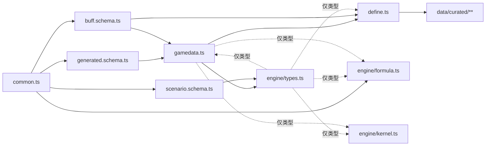

# 鸣潮 DPS 引擎 · TD-02 类型与 Schema v0.1.2

> **状态**：草案 v0.1.2（2026-09-27）
> **依据**：《技术总体设计 v0.1.1》（下称"总设计"）§2、§3.3、§5、§6.2–6.9、§8、§9、§10；《TD-01 数据字典与抽取规格 v0.1》（下称"TD-01"）§12、§13；《设计文档 v0.2.9》（下称"机制设计"）§4、4B、6.1；v0.1.1 按《TD-03 伤害公式规格 v0.1》（下称"TD-03"）§12.1 修订；v0.1.2 按《TD-04 仿真内核规格 v0.1》（下称"TD-04"）§12.2 修订
> **下游**：全部模块的代码；TD-03（伤害公式，已据其定稿乘区清单）、TD-04（仿真内核，已据其定稿运行时字段）、TD-07 定 BuffDef 语义、TD-09 定排轴语义、TD-10 定事件与汇总字段
> **验证**：本文代码以文件形式放在一起，用 TypeScript 6.0 严格模式编译通过；第 9 节 22 个用例全部通过（同一工程里 TD-03 的 23 个、TD-04 的 35 个用例也全部通过）；TD-01 原型在 20260707 全量数据上产出的生成文件（含 v0.1.2 新增的 `birthFrame`），逐一用本文的 schema 校验通过（9.2）

---

## 0. 原则

### 0.1 边界用 zod，内部用 interface

| 数据 | 来自 | 校验时机 | 类型从哪来 |
|---|---|---|---|
| `data/generated/*.json` | 构建脚本 | 写出前、读入后各一次 | `z.output<typeof GenXxxSchema>` |
| curated 里的 buff | 手写 TS | 注册层装载时（同时补默认值） | `BuffDefInput` / `BuffDef` 由 schema 推导 |
| 场景（YAML / 网页 JSON） | 用户 | 装配前 | `ScenarioInput` / `Scenario` 由 schema 推导 |
| GameData、ActionDef、SimState、SimEvent… | 代码构造 | 不做运行时校验，由 tsc 保证 | 手写 interface |

- 有 schema 的数据，类型一律由 schema 推导，不再手写一份同构的 interface——两份迟早会不一致。
- 一律用严格对象（`z.strictObject`）：拼错的字段名直接报错，而不是被悄悄丢掉。
- zod 4（`import { z } from 'zod'`）；默认报错切成中文，自定义规则的报错也写中文。

### 0.2 其他约定

- 全是纯数据：不用 class，不放函数（角色钩子除外）；运行时状态都能 `structuredClone`（总设计 §3.7）。
- 帧一律整数，只有角色局部帧 `localFrame` 可以是小数（总设计 T2）；比例一律小数。
- 元素、伤害标签、属性、效应、体型直接用中文字面量类型（总设计 T11），界面不再翻译。
- 字段名以本文为准。总设计 §5 是概要，与本文不同的地方见第 10 节，已同步进总设计 v0.1.1。

### 0.3 统一校验入口

所有边界校验都走这一个函数，报错格式因此统一：文件名 + 每条问题的中文说明 + 路径。

```ts
// src/data/validate.ts —— 边界校验的统一入口（TD-02 §0.3）
import { z } from 'zod'

z.config(z.locales.zhCN())   // zod 自带中文报错；自定义规则的报错本来就是中文

/** 校验并返回补齐默认值后的数据；失败时抛出带位置的错误（CLI 直接打印，网页显示在编辑器旁） */
export function parseOrThrow<S extends z.ZodType>(schema: S, data: unknown, where: string): z.output<S> {
  const r = schema.safeParse(data)
  if (r.success) return r.data
  throw new Error(`${where} 校验失败：\n${z.prettifyError(r.error)}`)
}
```

---

## 1. 文件布局与依赖

| 文件 | 内容 | 层（总设计第 2 节） |
|---|---|---|
| `src/data/common.ts` | 基础类型、枚举、代码表、属性键、乘区 ID | ② |
| `src/data/generated.schema.ts` | 生成文件的 schema（构建脚本也用） | ① / ② |
| `src/data/buff.schema.ts` | BuffDef 的 schema | ② |
| `src/data/gamedata.ts` | GameData 与其中的静态定义、`DEFAULT_RULES` | ② |
| `src/data/define.ts` | curated 模块的类型与 `define*` | ② |
| `src/data/scenario.schema.ts` | 场景 schema、排轴行语法、`Command` | ② / ③ 的边界 |
| `src/data/validate.ts` | `parseOrThrow` | ② |
| `src/engine/types.ts` | ResolvedScenario、SimState、SimEvent、Summary、钩子 | ③ |
| `src/engine/formula.ts` | 伤害公式与 buff 收集（代码在 TD-03 §8） | ③ |
| `src/engine/kernel.ts` | 仿真内核：时钟与膨胀、动作、判定、动作层合法性（代码在 TD-04 §9） | ③ |
| `data/curated/**/*.ts` | 手写数据（示例：散华） | ② 的输入 |



箭头从被引用方指向引用方（A → B 表示 B 引用 A）。`gamedata.ts` 与 `engine/types.ts` 互相引用对方的类型（`CharacterDef.hooks` 用到钩子类型，钩子又要看 SimState），全部用 `import type`，编译后不存在，不构成运行时循环依赖。

---

## 2. 基础类型与代码表 `common.ts`

- 代码表（`ELEMENT_BY_CODE`、`DAMAGE_TAG_BY_TYPE`、`WEAPON_TYPE_BY_CODE`、`STAT_BY_PROP_ID`）与 TD-01 §4.2 一一对应，构建与装配只从这里取，不在别处写魔法数字。
- 属性键 `StatKey` 就是场景文件里写的中文键（"暴击率""攻击%"）；`STAT_TO_ZONE` 把它落到乘区上，带隐含的过滤条件（"冷凝伤害加成"只对冷凝伤害生效）。
- 乘区 ID 分两类（总设计 §6.6），清单已由 TD-03 §2 定稿：面板类 12 个，先合成攻 / 血 / 防与暴击参数；公式类 33 个，沿用 `CalculateHurt` 的变量名，加深与最终伤害的类别直接写进名字（`DamageAmplify3` = 3 类加深，`FinalDamage6` = 6 类最终伤害）。新增一个乘区 = 在这里加一个字面量 + 在公式里用上它。

```ts
// src/data/common.ts —— 全项目共用的基础类型、枚举与代码表（TD-02 §2）

/** 帧：60fps 下的整数帧。只有角色局部帧 localFrame 允许是小数（TD-04）。 */
export type Frame = number
/** 比例一律存小数：12% 存 0.12。 */
export type Ratio = number
/** 角色键：动作表块名，漂泊者带性别后缀（'散华'、'雷主·女'）。 */
export type CharName = string
/** 动作块键：角色键或通用块（'通用-中@女'）。 */
export type BlockKey = string
/** 动作 ID：动作组名（TD-01 §3.5）。 */
export type ActionId = string
export type Slot = 0 | 1 | 2
export type Chain = 0 | 1 | 2 | 3 | 4 | 5 | 6
export type Rank = 1 | 2 | 3 | 4 | 5

export const ELEMENTS = ['物理', '冷凝', '热熔', '导电', '气动', '衍射', '湮灭'] as const
export type Element = (typeof ELEMENTS)[number]
/** dmg 表 Damage.Element、base 表 ElementPropertyType 的代码 */
export const ELEMENT_BY_CODE: Readonly<Record<number, Element>> = {
  0: '物理', 1: '冷凝', 2: '热熔', 3: '导电', 4: '气动', 5: '衍射', 6: '湮灭',
}

export const DAMAGE_TAGS = [
  '普攻', '重击', '共鸣技能', '共鸣解放', '变奏', '延奏', '声骸技能', '其他',
  '异常效应', '谐度破坏', '震谐响应', '骇破响应',
] as const
export type DamageTag = (typeof DAMAGE_TAGS)[number]
/** dmg 表 Damage.Type 的代码（13 暂无数据，TD-01 Q14） */
export const DAMAGE_TAG_BY_TYPE: Readonly<Record<number, DamageTag>> = {
  0: '普攻', 1: '重击', 2: '共鸣解放', 3: '变奏', 4: '共鸣技能', 5: '声骸技能', 6: '其他',
  7: '延奏', 10: '异常效应', 11: '谐度破坏', 12: '震谐响应', 14: '骇破响应',
}

export const WEAPON_TYPES = ['长刃', '迅刀', '佩枪', '臂铠', '音感仪'] as const
export type WeaponType = (typeof WEAPON_TYPES)[number]
export const WEAPON_TYPE_BY_CODE: Readonly<Record<number, WeaponType>> = {
  1: '长刃', 2: '迅刀', 3: '佩枪', 4: '臂铠', 5: '音感仪',
}

/** `索引` 页体型分类，去掉空格（TD-01 §6） */
export const BODY_TYPES = ['女-大', '女-中', '女-中小', '女-小', '女-特殊', '男-大', '男-中', '男-小'] as const
export type BodyType = (typeof BODY_TYPES)[number]

export const DILATION_TYPES = ['攻击顿帧', '时停', '全局时停', '极限闪避顿帧', '弹反顿帧'] as const
export type DilationType = (typeof DILATION_TYPES)[number]
export type DilationSide = 'self' | 'enemy' | 'ally'

export const EFFECT_NAMES = [
  '风蚀效应', '电磁效应', '霜渐效应', '聚爆效应', '光噪效应', '虚湮效应', '霜冻效应', '烈阳余烬',
] as const
export type EffectName = (typeof EFFECT_NAMES)[number]

export const ACTION_KINDS = [
  'normal', 'heavy', 'skill', 'liberation', 'intro', 'outro', 'echo', 'dodge', 'other',
] as const
export type ActionKind = (typeof ACTION_KINDS)[number]

export type RowKind = 'hit' | 'gain' | 'dilation' | 'marker'
/** 角色资源：大招能量、协奏、核心资源槽 1–5（槽号与 base 主表 SpecialEnergy1…5 一致） */
export const RESOURCE_KINDS = ['energy', 'concerto', 'core1', 'core2', 'core3', 'core4', 'core5'] as const
export type ResourceKind = (typeof RESOURCE_KINDS)[number]

// ---------------------------------------------------------------------------
// 属性：场景里写声骸词条、武器属性都用这组中文键（TD-02 §2）
export const STAT_KEYS = [
  '生命', '生命%', '攻击', '攻击%', '防御', '防御%',
  '暴击率', '暴击伤害', '共鸣效率', '治疗效果加成',
  '冷凝伤害加成', '热熔伤害加成', '导电伤害加成', '气动伤害加成', '衍射伤害加成', '湮灭伤害加成',
  '普攻伤害加成', '重击伤害加成', '共鸣技能伤害加成', '共鸣解放伤害加成', '全属性伤害加成',
] as const
export type StatKey = (typeof STAT_KEYS)[number]
/** 固定值属性；其余 StatKey 都是比例（场景里写小数） */
export const FLAT_STATS: readonly StatKey[] = ['生命', '攻击', '防御']

/** weapon / base 表里的属性 ID → StatKey（8 位以上的专属效果 ID 不在此表，TD-01 §4.2） */
export const STAT_BY_PROP_ID: Readonly<Record<number, StatKey>> = {
  2: '生命', 7: '攻击', 10: '防御', 8: '暴击率', 9: '暴击伤害', 11: '共鸣效率',
  14: '共鸣技能伤害加成', 17: '普攻伤害加成', 18: '重击伤害加成', 19: '共鸣解放伤害加成',
  22: '冷凝伤害加成', 23: '热熔伤害加成', 24: '导电伤害加成', 25: '气动伤害加成', 26: '衍射伤害加成',
  27: '湮灭伤害加成', 35: '治疗效果加成', 10002: '生命%', 10007: '攻击%', 10010: '防御%',
  220027: '全属性伤害加成',
}

// ---------------------------------------------------------------------------
// 乘区 ID（TD-03 §2 全表）：面板类先合成 RelatedAttr 与暴击参数；公式类沿用 CalculateHurt 的变量名，
// 加深 / 最终伤害的类别直接写进名字（DamageAmplify3 = "3 类加深"）。新增一个乘区 = 在这里加一个字面量 + 在 formula 里用上它。
export const PANEL_ZONES = [
  'hpPct', 'hpFlat', 'atkPct', 'atkFlat', 'defPct', 'defFlat',
  'critRate', 'critDamage', 'energyRegen', 'healBonus',
  'tunabilityRate',              // 偏谐效率（TD-06）
  'harmonyBreakBoost',           // 谐度破坏增幅，单位是"点"（面板上的 20 就写 20），公式里 × 0.01
] as const
export type PanelZone = (typeof PANEL_ZONES)[number]

export const AMPLIFY_ZONES = [
  'DamageAmplify0',              // 0 类加深 = 不带类别的"X 伤害加深"（xlsx dmgampl0）
  'DamageAmplify1', 'DamageAmplify2', 'DamageAmplify3', 'DamageAmplify4', 'DamageAmplify5',
  'DamageAmplify6', 'DamageAmplify7', 'DamageAmplify8', 'DamageAmplify9',
  'DamageAmplify1002',           // 霜冻专用的一类（xlsx dmgamplxxxx "1002类"）
] as const
export const FINAL_ZONES = [
  'FinalDamage0', 'FinalDamage1', 'FinalDamage2', 'FinalDamage3', 'FinalDamage4', 'FinalDamage5', 'FinalDamage6',
  'FinalDamage7',                // xlsx 只在骇破响应的公式里用到（"C[0]7"）
  'FinalDamage1001',             // 集谐响应等（xlsx dmgpost(1001)）
] as const

export const FORMULA_ZONES = [
  'RateBonus',                   // 倍率提升：Rate × (1 + Σ)
  'ExtraEffect9',                // 固定附加伤害，加在基础项上
  'DamageChange',                // 通用伤害加成
  'DamageChangeElement',         // 元素伤害加成（配合 filter.elements）
  'DamageChangeType',            // 类型伤害加成（配合 filter.tags）
  'RoleIgnoreDefRate',           // 无视防御（xlsx 防御无视99）
  'TargetDefRate',               // 目标防御 ±%（减防写负数；xlsx 防御无视10 + 目标防御提升）
  'RoleIgnoreResistance',        // 无视抗性
  'TargetElementResistant',      // 目标抗性 ±（减抗写负数）
  'TargetDamageReduce',          // 目标伤害减免（负数 = 目标受到伤害提高）
  'TargetElementDamageReduce',   // 目标伤害减免的第二个独立因子（xlsx DRE）
  'SpecialDamageChange',         // 特殊伤害加成（独立乘区）
  ...AMPLIFY_ZONES,
  ...FINAL_ZONES,
  'TargetHealedChange',          // 目标受治疗加成（只用于治疗）
] as const
export type FormulaZone = (typeof FORMULA_ZONES)[number]
export const ZONE_IDS = [...PANEL_ZONES, ...FORMULA_ZONES] as const
export type ZoneId = (typeof ZONE_IDS)[number]

/** 场景 StatKey → 乘区（带隐含过滤条件）；resolve 用它把声骸 / 武器属性落到面板或常驻加成上 */
export const STAT_TO_ZONE: Readonly<Record<StatKey, { zone: ZoneId; elements?: Element[]; tags?: DamageTag[] }>> = {
  '生命': { zone: 'hpFlat' }, '生命%': { zone: 'hpPct' },
  '攻击': { zone: 'atkFlat' }, '攻击%': { zone: 'atkPct' },
  '防御': { zone: 'defFlat' }, '防御%': { zone: 'defPct' },
  '暴击率': { zone: 'critRate' }, '暴击伤害': { zone: 'critDamage' },
  '共鸣效率': { zone: 'energyRegen' }, '治疗效果加成': { zone: 'healBonus' },
  '冷凝伤害加成': { zone: 'DamageChangeElement', elements: ['冷凝'] },
  '热熔伤害加成': { zone: 'DamageChangeElement', elements: ['热熔'] },
  '导电伤害加成': { zone: 'DamageChangeElement', elements: ['导电'] },
  '气动伤害加成': { zone: 'DamageChangeElement', elements: ['气动'] },
  '衍射伤害加成': { zone: 'DamageChangeElement', elements: ['衍射'] },
  '湮灭伤害加成': { zone: 'DamageChangeElement', elements: ['湮灭'] },
  '普攻伤害加成': { zone: 'DamageChangeType', tags: ['普攻'] },
  '重击伤害加成': { zone: 'DamageChangeType', tags: ['重击'] },
  '共鸣技能伤害加成': { zone: 'DamageChangeType', tags: ['共鸣技能'] },
  '共鸣解放伤害加成': { zone: 'DamageChangeType', tags: ['共鸣解放'] },
  '全属性伤害加成': { zone: 'DamageChangeElement', elements: ['冷凝', '热熔', '导电', '气动', '衍射', '湮灭'] },
}
```

---

## 3. 生成数据 schema `generated.schema.ts`

与 TD-01 第 12 节的产出文件一一对应。两条约定：

- **表里可能为空的列 → `nullable`**（键总在，值为 `null`）；**只有部分行才有的派生信息 → `optional`**（`hints` / `nameTags` 里的各键、连上才有的 `dmg`）。这样 JSON 里"表格没填"和"不适用"一眼能分开。
- 能在 schema 里查的一致性就在 schema 里查：组名块内唯一、`rates` 恰好 20 个、设置区必须是期望值（TD-01 §1.8 的阻断条件）。

```ts
// src/data/generated.schema.ts —— data/generated/*.json 的 zod schema（TD-02 §3）
// 构建脚本写文件前、注册层读文件后各校验一次；类型一律由 schema 推导（z.infer），不另写 interface。
import { z } from 'zod'
import { BODY_TYPES, DILATION_TYPES, EFFECT_NAMES, ELEMENTS, WEAPON_TYPES } from './common'

const int = () => z.number().int()
/** 帧列：整数，允许 -1（持续帧 / 派生持续帧的"直到动作结束"） */
const FrameCol = int().min(-1)
const nullable = <T extends z.ZodType>(s: T) => s.nullable()

// ---------------------------------------------------------------------------
// 动作表的一行（TD-01 §3、§12.2）

/** 资源单元格（TD-01 §3.7） */
export const GainCellSchema = z.strictObject({
  total: z.number(),
  perHit: z.array(z.number()).min(1).optional(),
  onAction: z.number().optional(),
  formula: z.string().optional(),
  ref: z.string().optional(),
  complex: z.literal(true).optional(),
  sharedRows: z.tuple([int(), int()]).optional(),
})

export const DilationWindowSchema = z.strictObject({
  rate: nullable(z.number().min(0)),
  start: nullable(FrameCol),
  duration: nullable(FrameCol),
})

export const HintsSchema = z.strictObject({
  tickInterval: int().positive().optional(),
  maxTicks: int().positive().optional(),
  outroTriggerFrame: int().min(0).optional(),
  priorityChangeFrames: z.array(int().min(0)).optional(),
  noDodgeBefore: int().min(0).optional(),
  noInputBefore: int().min(0).optional(),
  noSwitchBefore: int().min(0).optional(),
  noDamage: z.literal(true).optional(),
  delayedProjectile: z.literal(true).optional(),
  existsFrames: int().positive().optional(),
  reuses: z.enum(['地面出场技', '空中出场技']).optional(),
})

export const NameTagsSchema = z.strictObject({
  chain: int().min(0).max(6).optional(),
  passive: int().min(0).optional(),
  dodgeCounter: z.literal(true).optional(),
  dir: z.enum(['前', '后']).optional(),
})

/** 判定行连上的 dmg 行（TD-01 §4） */
export const GenDmgSchema = z.strictObject({
  via: z.enum(['direct', 'alias']),
  charaId: z.string(),
  skillName: z.string(),
  dmgCalc: nullable(z.string()),
  skillId: nullable(int()),
  skillType: nullable(int()),
  calcType: z.union([z.literal(0), z.literal(1), z.literal(2)]),
  element: int().min(0).max(6),
  damageType: int().min(0),
  subType: nullable(int()),
  relatedProperty: int(),
  multiplier: z.number().min(0),
  rates: z.array(z.number()).length(20),
  energy: nullable(z.number()),
  toughLv: nullable(z.number()),
  weaknessLvl: nullable(z.number()),
  hardnessLv: nullable(z.number()),
  formulaType: int().min(0),
  formulaRate: z.number().optional(),     // FormulaType ≠ 0 时：FormulaParam5 按同一技能等级取值 × 0.0001（TD-03 §3.2）
  cureBase: z.number().optional(),        // CalculateType = 1 时：CureBaseValue 按同一技能等级取值（TD-03 §7）
})

export const GenRowSchema = z.strictObject({
  row: int().positive(),
  name: z.string().min(1),
  kind: z.enum(['hit', 'gain', 'dilation', 'marker']),
  eventSpawned: z.boolean(),
  spawnFrame: nullable(int().min(0)),
  birthFrame: nullable(int().min(0)),       // 发生帧公式 N = P + f(Q) 的 P 换算成帧；只在 < spawnFrame 时有值（TD-01 §3.1、TD-04 §5.4）
  lifeFrames: nullable(FrameCol),
  hitstop: z.strictObject({ self: nullable(int().min(0)), enemy: nullable(int().min(0)) }),
  deriveFrame: nullable(int().min(0)),
  deriveDuration: nullable(FrameCol),
  endFrame: nullable(int().min(0)),
  priority: nullable(z.array(int().min(0).max(12)).min(1)),
  priorityChange: nullable(z.array(int().min(0)).min(1)),
  parry: nullable(z.boolean()),
  persists: nullable(z.boolean()),
  followHitstop: nullable(z.boolean()),
  toughness: nullable(z.number()),
  tunability: nullable(z.number()),
  gains: z.strictObject({
    energy: nullable(GainCellSchema),
    concerto: nullable(GainCellSchema),
    core: z.tuple([nullable(GainCellSchema), nullable(GainCellSchema), nullable(GainCellSchema)]),
  }),
  position: nullable(z.string()),
  positionChange: nullable(z.array(int().min(0))),
  dilation: nullable(z.strictObject({
    type: nullable(z.enum(DILATION_TYPES)),
    self: DilationWindowSchema.optional(),
    enemy: DilationWindowSchema.optional(),
    ally: DilationWindowSchema.optional(),
  })),
  hitTarget: nullable(z.string()),
  note: nullable(z.string()),
  noteMerged: z.boolean(),
  hints: HintsSchema,
  nameTags: NameTagsSchema,
  dmg: GenDmgSchema.optional(),
  flags: z.array(z.string()),
})

export const GenGroupSchema = z.strictObject({
  id: z.string().min(1),
  rawId: z.string().min(1),
  idNum: nullable(int()),
  idSuffix: z.string(),
  rows: z.array(GenRowSchema).min(1),
})

export const GenActionFileSchema = z.strictObject({
  key: z.string().min(1),
  sheet: z.enum(['角色-女', '角色-男']),
  sheetName: z.string().min(1),
  startRow: int().positive(),
  ignoredRows: int().min(0),
  groups: z.array(GenGroupSchema),
}).superRefine((f, ctx) => {
  // 组名块内唯一（TD-01 §3.5）
  const seen = new Set<string>()
  f.groups.forEach((g, i) => {
    if (seen.has(g.id)) ctx.addIssue({ code: 'custom', path: ['groups', i, 'id'], message: `组名重复：${g.id}` })
    seen.add(g.id)
  })
})

// ---------------------------------------------------------------------------
// 角色（TD-01 §5.2、§12.3）

const Stat3 = z.strictObject({ hp: z.number().positive(), atk: z.number().positive(), def: z.number().positive() })

export const GenCharacterSchema = z.strictObject({
  key: z.string().min(1),
  sheet: z.enum(['角色-女', '角色-男']),
  sheetName: z.string().min(1),
  dmgCharaId: z.string().min(1),
  element: z.enum(ELEMENTS),
  bodyType: nullable(z.enum(BODY_TYPES)),
  commonBlock: nullable(z.string()),
  baseL1: Stat3,
  base90: Stat3,
  energyCost: z.number().min(0),                    // 0 = 大招不走能量（洛瑟菈、弗洛洛），由钩子 canStart 判定
  coreResources: z.array(z.strictObject({ slot: int().min(1).max(5), name: z.string(), cap: z.number().positive() })),   // 上限为 0 的槽不产出
  tunabilityRate: z.number().min(0),
  harmonyBreakBoost: z.number().min(0),
  texts: z.strictObject({
    chain: z.record(z.string(), z.string()),
    passive: z.record(z.string(), z.string()),
  }),
  actionsFile: z.string(),
})
export const GenCharactersSchema = z.record(z.string(), GenCharacterSchema)

// ---------------------------------------------------------------------------
// 武器、声骸、敌人、效应、谐度破坏、buff 文本（TD-01 §7–§11）

export const GenWeaponSchema = z.strictObject({
  key: z.string().min(1),
  id: int(),
  rarity: int().min(1).max(5),
  owner: nullable(z.string()),
  type: z.enum(WEAPON_TYPES),
  main: z.strictObject({ propId: int(), value90: z.number() }),
  sub: z.strictObject({ propId: int(), value90: z.number() }),
  effects: z.array(z.strictObject({
    text: z.string(),
    stackLimit: nullable(int().min(0)),
    propId: nullable(int()),
    policy: nullable(int()),
    values: nullable(z.array(z.number()).length(5)),
  })),
  row: int().positive(),
})

export const GenEchoSchema = z.strictObject({
  key: z.string().min(1),
  cost: nullable(z.union([z.literal(1), z.literal(3), z.literal(4)])),   // 来自 `索引` 页，缺失时 curated 补
  kind: nullable(z.enum(['召唤', '变身'])),
  cooldown: nullable(int().min(0)),
  stageCooldown: nullable(int().min(0)),
  stageWindow: nullable(int().min(0)),
  description: nullable(z.string()),
  rows: z.array(GenRowSchema).min(1),
  startRow: int().positive(),
})

const Bar = z.strictObject({ max: z.number().min(0), recover: z.number().min(0), reduce: z.number() })
export const GenEnemySchema = z.strictObject({
  id: z.string().min(1),
  name: z.string().min(1),
  count: nullable(int().positive()),
  tag: z.string(),
  cost: z.union([z.literal(1), z.literal(3), z.literal(4)]),
  level: int().positive(),
  hp: z.number().positive(),
  atk: z.number().min(0),
  def: z.number().min(0),
  res: z.strictObject(Object.fromEntries(ELEMENTS.map(e => [e, z.number()])) as Record<(typeof ELEMENTS)[number], z.ZodNumber>),
  whiteBar: Bar,
  poise: Bar,
  tunabilityMax: z.number().min(0),
  vulnerableSec: nullable(z.number()),
  paralysisSec: nullable(z.number()),
  row: int().positive(),
})

export const GenEffectSchema = z.strictObject({
  name: z.enum(EFFECT_NAMES),
  element: z.enum(ELEMENTS),
  subType: int(),
  multipliers: z.array(z.number().min(0)).min(1),   // 第 k 项 = k 层
  maxStacks: int().positive(),
  desc: nullable(z.string()),
  golden: z.array(z.strictObject({ stacks: int().positive(), value: z.number() })).optional(),
})
/** effects.json：各效应 + 按等级的异常伤害基础值（TD-01 §11.2） */
export const GenEffectsFileSchema = z.strictObject({
  effects: z.array(GenEffectSchema),
  abnormalBaseByLevel: z.array(z.number()),
})

// 其余文件的顶层结构：characters.json 见 GenCharactersSchema；enemies / weapons / echoes / buff-texts
// 都是对应条目 schema 的数组（z.array(GenEnemySchema) 等）；tune-break.json 就是下面的 GenTuneBreakSchema。
export const GenTuneBreakSchema = z.strictObject({
  variants: z.array(z.strictObject({
    key: z.string(),                 // '谐度破坏-长刃1'
    weaponType: nullable(z.enum(WEAPON_TYPES)),
    seq: nullable(int().positive()),
    multiplier: z.number().min(0),
    ticks: nullable(int().positive()),
    golden: nullable(z.strictObject({ vsDisharmony: z.number(), vsNormal: z.number() })),
  })),
  costRows: z.array(z.strictObject({ label: z.string(), multiplier: z.number(), vsDisharmony: z.number(), vsNormal: z.number(), ticks: int() })),
  baseByLevel: z.array(z.number()),       // base AO 列 WeaknessDamageBaseValue，下标 = 等级 − 1
  costFactors: z.array(z.strictObject({ cost: z.union([z.literal(1), z.literal(3), z.literal(4)]), factor: z.number().positive() })),   // base R–U 列（TD-03 §6）
})

export const GenBuffTextSchema = z.strictObject({
  row: int().positive(),
  name: z.string().min(1),
  category: z.string(),
  categoryCode: nullable(int()),
  source: nullable(z.string()),
  activeStacks: nullable(z.number()),
  text: z.string(),
  draftable: z.boolean(),
})

export const GenMetaSchema = z.strictObject({
  xlsxFile: z.string(),
  xlsxSha256: z.string().length(64),
  resourceVersion: nullable(z.string()),
  builtAt: z.string(),
  settings: z.strictObject({
    framerate: z.literal(60),
    halfFrameThreshold: z.literal(0.5),
    coop: z.literal(false),
    limitDodgeBulletTimeCanceling: z.literal(false),
    weakPointHitting: z.literal(false),
  }),
  counts: z.record(z.string(), z.number()),
})

export const GoldenDamageSchema = z.strictObject({
  context: z.strictObject({ char: z.string(), panel: z.record(z.string(), z.number()), target: z.record(z.string(), z.union([z.number(), z.string()])) }),
  entries: z.array(z.strictObject({
    char: z.string(), section: nullable(z.string()), label: z.string(),
    nonCrit: z.number(), crit: nullable(z.number()), ticks: nullable(z.number()),
    row: int().positive(), col: z.string(),
    dmgKey: z.tuple([z.string(), z.string()]).optional(),
  })),
})

/** fixtures/golden-zones.json：每个标准答案单元格拆成的乘区输入，M1 用它对拍公式（TD-03 §10） */
const Num = z.number().finite()
export const GoldenZoneSchema = z.strictObject({
  cell: z.string(),                                     // '伤害计算' 页单元格，如 'D5'
  name: z.string(),
  branch: z.enum(['nc', 'cr']),                         // 非暴击 / 暴击
  formula: z.enum(['hurt', 'abnormal', 'tune', 'heal']),
  expected: z.number(),                                 // 缓存值
  key: z.string().optional(),                           // 倍率 MATCH 用的键（charaId & DmgCalc），用于回连 dmg
  rate: z.number().optional(),                          // dmg RateLv 原值（× 10000）
  table: z.string().optional(),                         // 倍率所在表列：'dmg!AH'、'base!AN'…
  defRef: z.string().optional(), resRef: z.string().optional(),   // 引用了预先算好的防御 / 抗性系数格
  z: z.strictObject({
    base: Num, crit: Num.optional(),
    def: z.strictObject({ targetDef: Num, defRate: Num, ignore: Num, level: Num }).optional(),
    bonus: Num.optional(), res: Num.optional(), dr: Num.optional(), dre: Num.optional(), special: Num.optional(),
    amp0: Num.optional(), amp: z.array(Num).length(9).optional(), amp1002: Num.optional(),
    fin: z.array(Num).length(8).optional(), fin1001: Num.optional(),
    heal: Num.optional(), breakBoost: Num.optional(), vsNormal: z.literal(true).optional(),
    other: Num.optional(),                              // 未归类因子之积；出现即说明公式有新形状，构建报告会列出
  }),
})
export const GoldenZonesSchema = z.array(GoldenZoneSchema)

export type GainCell = z.infer<typeof GainCellSchema>
export type GenRow = z.infer<typeof GenRowSchema>
export type GenGroup = z.infer<typeof GenGroupSchema>
export type GenActionFile = z.infer<typeof GenActionFileSchema>
export type GenCharacter = z.infer<typeof GenCharacterSchema>
export type GenWeapon = z.infer<typeof GenWeaponSchema>
export type GenEcho = z.infer<typeof GenEchoSchema>
export type GenEnemy = z.infer<typeof GenEnemySchema>
export type GenEffect = z.infer<typeof GenEffectSchema>
export type GenEffectsFile = z.infer<typeof GenEffectsFileSchema>
export type GenTuneBreak = z.infer<typeof GenTuneBreakSchema>
export type GenBuffText = z.infer<typeof GenBuffTextSchema>
export type GenMeta = z.infer<typeof GenMetaSchema>
export type GoldenDamage = z.infer<typeof GoldenDamageSchema>
export type GoldenZone = z.infer<typeof GoldenZoneSchema>
```

---

## 4. 静态数据 `GameData`

注册层把生成数据、curated 模块按 TD-01 第 13 节的默认映射装配成下面这些只读结构。

```ts
// src/data/gamedata.ts —— 注册层产出的只读静态数据 GameData（TD-02 §4）
// 这些类型是内部类型（由装配函数构造，不直接来自文件），不用 zod；来源追溯靠 source / row 字段。
import type {
  ActionId, ActionKind, BlockKey, BodyType, CharName, DamageTag, DilationSide, DilationType, EffectName, Element,
  Frame, ResourceKind, StatKey, WeaponType,
} from './common'
import type { BuffDef } from './buff.schema'
import type { GenMeta, GenWeapon } from './generated.schema'
import type { CharacterHooks } from '../engine/types'

export interface GameData {
  version: string                                   // xlsx 文件名里的日期，如 "20260707"
  meta: GenMeta
  characters: Record<CharName, CharacterDef>
  commonActions: Record<BlockKey, Record<ActionId, ActionDef>>   // 通用块：闪避、极限闪避、召唤声骸…
  weapons: Record<string, WeaponDef>
  echoes: Record<string, EchoDef>
  echoSets: Record<string, EchoSetDef>
  enemies: Record<string, EnemyPreset>
  effects: Partial<Record<EffectName, EffectDef>>
  abnormalBaseByLevel: number[]                     // 异常伤害基础值 AbnomalDamage，下标 = 等级 − 1（TD-03 §5）
  tuneBreak: TuneBreakTable
  envBuffs: Record<string, BuffDef>
  rules: Rules
}

export interface CharacterDef {
  name: CharName
  element: Element
  weaponType: WeaponType                            // curated（xlsx 没有，TD-01 §5.2）
  bodyType: BodyType | null
  commonBlock: BlockKey | null                      // 体型对应的通用动作块
  base: { hp: number; atk: number; def: number }    // 90 级
  energyCost: number
  coreResources: CoreResourceDef[]                  // 按槽号，可不连续
  tunabilityRate: number                            // 偏谐效率基础值（推定，TD-01 Q17）
  harmonyBreakBoost: number                         // 谐破增幅基础值（推定）
  actions: Record<ActionId, ActionDef>
  aliases: Record<string, ActionId>                 // "R" → "大招"
  buffs: BuffDef[]                                  // 被动 / 共鸣链 / 延奏 / 回路（curated）
  hooks?: CharacterHooks
  flags: string[]                                   // 装配时未处理的数据问题汇总
}

export interface CoreResourceDef { slot: 1 | 2 | 3 | 4 | 5; name: string; cap: number }

// ---------------------------------------------------------------------------
// 动作与判定（总设计 §5.1；默认映射见 TD-01 §13）

export interface ActionDef {
  id: ActionId
  owner: BlockKey                                   // 角色键、通用块键或 '声骸:<名>'
  kind: ActionKind
  endFrame: Frame                                   // 动作结束帧：局部帧到达它时回到空闲（TD-04 §4.3）
  cancelWindows: CancelWindow[]                     // 派生窗口 [from, until)，可越过 endFrame（TD-04 §6.1）
  priority: PriorityStep[]                          // 按 fromFrame 升序，第一项 fromFrame = 0
  comboFrom?: ActionId[]                            // 连段前置：只能在这些动作的派生窗口内开始（A2 ← A1，TD-04 §6.2）
  inputLocks: InputLock[]                           // "第 nF 前不响应输入 / 不能闪避…"（TD-04 §6.3）
  judgments: JudgmentDef[]                          // 按 spawnFrame 升序；事件生成的（spawnFrame = null）排在最后
  dilations: DilationDef[]                          // 按动作局部帧登记的膨胀（anchor = 'action'：时停、全局时停、极限闪避…）
  castGains: CastGain[]                             // 施放类资源（"大招-前置"协奏 +20 等）
  outroTriggerFrame?: Frame                         // 变奏动作：上一角色的延奏在此帧触发
  switchLockUntil?: Frame                           // 此帧前不能切人
  cooldown?: Frame                                  // 声骸技能冷却
  source: { file: string; rows: number[] }          // 追溯到 xlsx 行
  flags: string[]
}

export interface CancelWindow { from: Frame; until: Frame; row: number }
export interface PriorityStep { fromFrame: Frame; value: number }
export interface CastGain { atFrame: Frame; resource: ResourceKind; amount: number }   // atFrame 0 = 进入动作即得
/** 当前动作局部帧 < until 时，kinds 里的新动作（'all' = 一切输入）不能开始 */
export interface InputLock { until: Frame; kinds: ActionKind[] | 'all' }

export interface DilationWindow { rate: number; duration: Frame }
export interface DilationDef {
  type: DilationType
  /** action：动作局部帧到 start 时登记；hit：判定每次命中时登记（start 恒为 0）。同一行的各侧按锚点拆开（TD-04 §3.2） */
  anchor: 'action' | 'hit'
  start: Frame
  self?: DilationWindow
  enemy?: DilationWindow
  ally?: DilationWindow
}

export interface JudgmentDef {
  name: string                                      // 行名；组内重名加 #n
  row: number
  spawnFrame: Frame | null                          // null = 事件生成（钩子 spawnJudgment）
  birthFrame: Frame | null                          // 出现帧：发生帧公式 N = P + f(Q) 的 P（TD-04 §5.4）；null = 同 spawnFrame
  lifeFrames: Frame                                 // -1 = 直到动作结束（必定不可脱手）
  ticks: number                                     // 结算次数，≥1
  tickInterval: Frame | null                        // null 且 ticks > 1 时在寿命内均分（TD-04 §5.2）
  persistsOnCancel: boolean                         // 可脱手
  followHitstop: boolean                            // 跟随顿帧
  target: 'enemy' | 'ally' | 'none' | 'other'
  calc: 'damage' | 'heal' | 'hpCost'                // dmg Damage.CalculateType 0 / 1 / 2
  multiplier: number                                // 0 = 不造成伤害
  relatedAttr: 'atk' | 'hp' | 'def' | 'energyRegen'  // RelatedProperty 7 / 2 / 10 / 11（TD-03 §3.2）
  element: Element
  tags: DamageTag[]
  gains: { energy: number; concerto: number; core: [number, number, number] }   // 每次结算
  coreOncePerAction?: [boolean, boolean, boolean]   // 核心回收合并区：每个动作实例只发一次（TD-01 §1.5）
  gauges: { toughness: number; tunability: number }
  hitstop: DilationDef | null                       // 每次命中时登记的膨胀（anchor = 'hit'；膨胀发生为空的各侧，任何类型）
  formula?: { type: number; rate: number }          // dmg FormulaType ≠ 0：rate = FormulaParam5（已 × 0.0001），钩子据此算 Formula1
  cureBase?: number                                 // 治疗 / 护盾的固定值 CureBaseValue（calc = 'heal'）
  flags: string[]
}

// ---------------------------------------------------------------------------
// 武器、声骸、套装

export interface WeaponDef {
  key: string
  rarity: number
  type: WeaponType
  main: { stat: StatKey; value: number }            // 90 级（攻击）
  sub: { stat: StatKey; value: number }             // 90 级
  effects: GenWeapon['effects']                     // 原始被动数据（文本 + R1–R5 数值）
  passives: BuffDef[]                               // curated 写成的 buff
}

export interface EchoDef {
  key: string
  cost: 1 | 3 | 4
  kind: '召唤' | '变身' | null
  actions: Record<ActionId, ActionDef>              // 按体型选好行之前的全部动作
  description: string | null                        // 技能说明原文
  mainSlotBuffs: BuffDef[]                          // "在首位装配该声骸技能时…"（curated）
}

export interface EchoSetDef {
  name: string
  pieces: Partial<Record<2 | 3 | 5, BuffDef[]>>
}

// ---------------------------------------------------------------------------
// 敌人、异常效应、谐度破坏

export interface EnemyPreset {
  id: string                                        // '全息6/朔雷之鳞'
  name: string
  tag: string
  cost: 1 | 3 | 4
  level: number
  hp: number
  def: number
  res: Record<Element, number>
  whiteBar: { max: number; recover: number; reduce: number }   // 白条（游戏字段 Rage）
  poise: { max: number; recover: number; reduce: number }      // 韧性（Tough），削韧值作用于它
  tunabilityMax: number
}

export interface EffectDef {
  name: EffectName
  element: Element
  multipliers: number[]                             // 第 k 项 = k 层
  maxStacks: number
  duration: Frame | null                            // 每层持续（由说明文本 curated，TD-06）
  tickInterval: Frame | null
  debuff?: BuffDef                                  // 如虚湮减防
}

export interface TuneBreakTable {
  variants: { key: string; weaponType: WeaponType | null; seq: number | null; multiplier: number; ticks: number | null }[]
  baseByLevel: number[]                             // WeaknessDamageBaseValue，下标 = 等级 − 1
  costFactor: Record<1 | 3 | 4, number>             // 按敌人 COST：base 表 WeaknessDamageMinus × WeaknessDamageMinusRatio（TD-03 §6）
}

// ---------------------------------------------------------------------------
// 全局规则常量（可在场景 options.rules 里覆盖，TD-02 §4.2）

export interface Rules {
  fps: 60
  charLevel: number                                 // 角色等级，防御公式里的 Lv（TD-03 §3.2）
  switchCooldown: Frame
  concertoMax: number
  concertoTiming: 'onCast' | 'onHit'
  energyShare: { dealer: number; others: number }
  breakEnergy: number
  critRateCap: number
  defFactorCap: number
  highResThreshold: number
  maxWait: Frame
  maxChainDepth: number
  sampleInterval: Frame
  dilation: Record<DilationType, DilationRule>
}

/** 一种时间膨胀怎么作用（TD-04 §3.3） */
export interface DilationRule {
  stopsBattleClock: boolean                         // 生效期间战斗时钟停走
  hitstopSides: DilationSide[]                      // 在这些侧按"攻击顿帧"处理：同一单位上新的替换旧的；其余侧与别的窗口并存
  clearSelfOnCancel: boolean                        // 登记它的动作被取消时撤掉自身侧（极限闪避减速可被普攻取消）
}

export const DEFAULT_RULES: Rules = {
  fps: 60,
  charLevel: 90,
  switchCooldown: 60,                               // 机制设计 5.4
  concertoMax: 100,
  concertoTiming: 'onCast',                         // 待实测（总设计 §13）
  energyShare: { dealer: 1, others: 0.5 },          // 机制设计 4.1
  breakEnergy: 3,                                   // 破白条全队 +3；触发条件待 TD-06（TD-01 Q16）
  critRateCap: 1,
  defFactorCap: 2,                                  // min(2, …)（TD-03 §3.2）
  highResThreshold: 0.8,                            // 总设计附录 A-5
  maxWait: 600,
  maxChainDepth: 16,
  sampleInterval: 30,                               // 资源曲线每 0.5 秒采样一次
  dilation: {                                       // 附页1"时间膨胀类型"的说明（TD-04 §3.3）
    攻击顿帧: { stopsBattleClock: false, hitstopSides: ['self', 'enemy', 'ally'], clearSelfOnCancel: false },
    时停: { stopsBattleClock: false, hitstopSides: [], clearSelfOnCancel: false },        // buff 时停：与攻击顿帧并存
    全局时停: { stopsBattleClock: true, hitstopSides: [], clearSelfOnCancel: false },
    极限闪避顿帧: { stopsBattleClock: false, hitstopSides: ['enemy'], clearSelfOnCancel: true },
    弹反顿帧: { stopsBattleClock: false, hitstopSides: ['self', 'enemy', 'ally'], clearSelfOnCancel: false },
  },
}
```

### 4.1 要点

- `ActionDef.judgments` 按 `spawnFrame` 升序排好，事件生成的（`spawnFrame = null`）放最后。仿真时内核把判定生成、施放资源、按动作登记的膨胀、延奏触发排成一条时间线，用游标推进（`ActionRuntime.cursor`，TD-04 §4.1），不必每帧扫描。
- `priority` 第一项的 `fromFrame` 一定是 0；`cancelWindows` 是左闭右开的 [from, until)，`until` 可以超过 `endFrame`（回到空闲后仍能接连段，TD-04 §6.2）。
- `comboFrom` 只出现在连段动作上（A2 ← A1 …）：上一个动作必须是其中之一且派生窗口开着；`inputLocks` 来自"第 nF 前不响应输入 / 不能闪避"等备注（TD-04 §6.2、§6.3）。
- `DilationDef.anchor`：`action` 表示动作局部帧到 `start` 时登记（时停、全局时停、极限闪避）；`hit` 表示判定每次命中时登记。xlsx 同一行各侧的"膨胀发生"有的有值、有的为空时拆成两条：为空的一侧（任何类型）放进 `JudgmentDef.hitstop`，有值的放进 `ActionDef.dilations`（TD-04 §3.2）。
- `JudgmentDef.birthFrame` 来自发生帧公式 P + f(Q) 的 P：动作在出生帧之后被取消，可脱手的判定仍在发生帧生成（TD-04 §5.4）。
- `CastGain.atFrame` 为 0 表示"进入动作即得"：动作开始的那个 tick 发放。
- `JudgmentDef.calc` 来自 dmg 的 `CalculateType`：治疗、扣血判定照常结算（发资源、触发 buff），只是不产生伤害。
- `coreOncePerAction` 来自核心回收的合并单元格（TD-01 §1.5）：同一个动作实例里，该槽只在第一次结算时发放。
- `relatedAttr` 的 `energyRegen` 对应 RelatedProperty 11（布兰特的治疗）；`formula`、`cureBase` 只在 dmg 有对应参数时出现，用法见 TD-03 §3.2、§7。
- `abnormalBaseByLevel`、`TuneBreakTable.baseByLevel` 的下标 = 等级 − 1；`costFactor` 按敌人 COST 取（TD-03 §5、§6）。

### 4.2 Rules 默认值

| 字段 | 默认 | 出处 | 谁可能改 |
|---|---|---|---|
| `charLevel` | 90 | 总设计第 7 节（等级永久锁定）；防御公式里的 Lv（TD-03 §3.2） | — |
| `switchCooldown` | 60 | 机制设计 5.4 | 实测 |
| `concertoMax` | 100 | 机制设计 4.2 | — |
| `concertoTiming` | `'onCast'` | 总设计 §6.7 | 半程切人实测（总设计 §13） |
| `energyShare` | 出伤者 1、其余 0.5 | 机制设计 4.1 | — |
| `breakEnergy` | 3 | 机制设计 4.3 | TD-06（白条与韧性分开后重新核定触发条件） |
| `critRateCap` | 1 | 总设计 §6.6 | — |
| `defFactorCap` | 2 | `CalculateHurt` 的 `min(2, …)` | — |
| `highResThreshold` | 0.8 | 总设计附录 A-5 | — |
| `maxWait` | 600 | 总设计 §6.5 | 场景 `options.maxWait` |
| `maxChainDepth` | 16 | 总设计 §6.3 | — |
| `sampleInterval` | 30 | 本文新增：资源曲线每 0.5 秒采样一次 | TD-10 |
| `dilation[类型]` | `stopsBattleClock`：只有全局时停为 `true`；`hitstopSides`（按攻击顿帧处理、同一单位上新的替换旧的）：攻击顿帧与弹反顿帧为三侧、极限闪避顿帧为敌侧、时停类为空；`clearSelfOnCancel`：只有极限闪避顿帧为 `true` | 总设计 §6.4 不变量 6；xlsx「附页1」（TD-04 §3.3） | 实测（TD-04 Q1–Q6） |

场景可以用 `options.rules` 覆盖任意一项，装配时逐项校验。

---

## 5. 手写数据

### 5.1 BuffDef `buff.schema.ts`

```ts
// src/data/buff.schema.ts —— BuffDef：curated 手写的 buff 定义（TD-02 §5）
// buff 是纯数据，装载时用 zod 校验一遍（查出拼错的乘区、不合法的组合等）；类型由 schema 推导。
import { z } from 'zod'
import { ACTION_KINDS, DAMAGE_TAGS, EFFECT_NAMES, ELEMENTS, RESOURCE_KINDS, ZONE_IDS } from './common'

export const BUFF_TARGETS = ['self', 'team', 'teamExceptSelf', 'onField', 'nextIn', 'enemy'] as const
export type BuffTarget = (typeof BUFF_TARGETS)[number]

/** 触发事件目录（总设计 §6.8），v0 固定这一组 */
export const TRIGGER_EVENTS = [
  'actionStart', 'judgmentSettle', 'intro', 'outro', 'switchIn', 'switchOut', 'enemyState', 'resourceFull',
] as const
export type TriggerEvent = (typeof TRIGGER_EVENTS)[number]

export const ENEMY_STATE_CHANGES = [
  'break', 'poiseBreak', 'disharmony', 'harmonyBreak', 'shift', 'interference', 'effectApplied',
] as const
export type EnemyStateChange = (typeof ENEMY_STATE_CHANGES)[number]

const nonEmpty = <T extends z.ZodType>(s: T) => z.array(s).min(1)
const Ratio = z.number().finite()

/** 作用条件：命中时判断这段伤害吃不吃这个 buff */
export const BuffFilterSchema = z.strictObject({
  elements: nonEmpty(z.enum(ELEMENTS)).optional(),
  tags: nonEmpty(z.enum(DAMAGE_TAGS)).optional(),
  actions: nonEmpty(z.string()).optional(),       // 只对这些动作产生的判定
  judgments: nonEmpty(z.string()).optional(),     // 只对这些判定（行名）
  enemyEffect: z.enum(EFFECT_NAMES).optional(),   // 目标身上有该效应时才生效
  effects: nonEmpty(z.enum(EFFECT_NAMES)).optional(),   // 只对这些异常效应自身的伤害（TD-03 §4）
  critOnly: z.literal(true).optional(),           // 只进暴击分支（总设计 T4，TD-03 §3.3）
})
export type BuffFilter = z.output<typeof BuffFilterSchema>

/** 触发条件：哪个事件、满足什么过滤时给 buff 加层 / 刷新 */
export const TriggerFilterSchema = z.strictObject({
  by: z.enum(['self', 'team', 'onField']).default('self'),   // 谁产生的事件；默认 buff 持有者本人
  actionKinds: nonEmpty(z.enum(ACTION_KINDS)).optional(),
  actions: nonEmpty(z.string()).optional(),
  judgments: nonEmpty(z.string()).optional(),
  tags: nonEmpty(z.enum(DAMAGE_TAGS)).optional(),
  elements: nonEmpty(z.enum(ELEMENTS)).optional(),
  enemyState: z.enum(ENEMY_STATE_CHANGES).optional(),
  effect: z.enum(EFFECT_NAMES).optional(),
  resource: z.enum(RESOURCE_KINDS).optional(),
})
export type TriggerFilter = z.output<typeof TriggerFilterSchema>

export const BuffDefSchema = z.strictObject({
  id: z.string().min(1),                                  // 全局唯一：'散华.共鸣链6'
  source: z.string().min(1),                              // 原文出处（整句），方便核对
  zone: z.enum(ZONE_IDS),                                 // 加深 / 最终伤害的类别写在名字里（TD-03 §2）
  value: z.union([Ratio, z.tuple([Ratio, Ratio, Ratio, Ratio, Ratio])]),   // 数组 = 武器 R1–R5
  filter: BuffFilterSchema.optional(),
  target: z.enum(BUFF_TARGETS),
  maxStacks: z.number().int().min(1).default(1),
  stackGain: z.number().int().min(1).default(1),         // 每次触发加几层
  duration: z.union([z.number().int().min(1), z.literal('inf')]),   // 帧
  onSwitchOut: z.enum(['persist', 'clear']).default('persist'),      // 原文明写才 clear（机制设计 6.1）
  refresh: z.enum(['refresh', 'keep']).default('refresh'),           // 再触发时是否刷新持续时间
  icd: z.number().int().min(1).optional(),                           // 触发内置冷却（"每秒可获得一层"= 60）
  trigger: z.union([
    z.literal('always'),
    z.strictObject({ on: z.enum(TRIGGER_EVENTS), where: TriggerFilterSchema.optional() }),
  ]),
  requires: z.strictObject({ chain: z.number().int().min(1).max(6) }).optional(),   // 共鸣链门槛
}).superRefine((b, ctx) => {
  if (b.filter?.critOnly && (b.zone === 'critRate' || b.zone === 'critDamage'))
    ctx.addIssue({ code: 'custom', path: ['filter', 'critOnly'], message: '暴击率 / 暴伤本来就只影响暴击，不需要 critOnly' })
  if (b.trigger === 'always' && b.duration !== 'inf')
    ctx.addIssue({ code: 'custom', path: ['duration'], message: "常驻 buff（trigger: 'always'）的 duration 必须是 'inf'" })
  if (b.stackGain > b.maxStacks)
    ctx.addIssue({ code: 'custom', path: ['stackGain'], message: 'stackGain 不能大于 maxStacks' })
})

/** 装载后的 buff（默认值已补齐） */
export type BuffDef = z.output<typeof BuffDefSchema>
/** 手写时的形状（可省略有默认值的字段） */
export type BuffDefInput = z.input<typeof BuffDefSchema>
```

- `value` 写数组表示武器 R1–R5；装配时按场景的谐振阶取出一个数（`RegisteredBuff.value`）。
- 默认值：`maxStacks` 1、`stackGain` 1、`onSwitchOut` `'persist'`（机制设计 6.1 的永久规则：原文明写才 `clear`）、`refresh` `'refresh'`（总设计 §6.8）。
- `superRefine` 里的三条交叉规则就是最常见的手写错误：常驻 buff 写了有限时长、一次加的层数超过上限、给暴击率 / 暴伤配了 `critOnly`。加深与最终伤害的类别写在乘区名里，拼错直接是类型错误。
- `filter.enemyEffect`（目标身上有该效应）与 `filter.effects`（这次伤害就是该效应自身的伤害）是两回事，见 TD-03 §4。
- 数值随状态变化的效果（"每层集谐·干涉 × 谐破增幅 × 0.12%"）不塞进 BuffDef，写在钩子 `modifyHit` 里、往 `hit.zones` 补值（总设计 T8 的判断标准，TD-03 §4）。

### 5.2 curated 模块 `define.ts`

```ts
// src/data/define.ts —— 手写数据模块的类型与 define* 辅助函数（TD-02 §5）
// define* 只做类型约束、原样返回；buff 在注册层装载时再用 BuffDefSchema 校验并补默认值。
import type { ActionId, ActionKind, BodyType, CharName, Frame, WeaponType } from './common'
import type { BuffDefInput } from './buff.schema'
import type { CancelWindow, JudgmentDef, PriorityStep } from './gamedata'
import type { CharacterHooks } from '../engine/types'

/** 对单个动作的装配结果做覆盖（TD-01 §13.4）；只改装配结果，不回写生成数据 */
export interface ActionOverride {
  kind?: ActionKind
  endFrame?: Frame
  priority?: PriorityStep[]
  cancelWindows?: Omit<CancelWindow, 'row'>[]
  outroTriggerFrame?: Frame
  switchLockUntil?: Frame
  judgments?: Record<string, JudgmentOverride>
  accept?: string[]                         // 明确接受、不再提示的 flag
}

export type JudgmentOverride = Partial<Pick<JudgmentDef,
  'spawnFrame' | 'lifeFrames' | 'ticks' | 'tickInterval' | 'persistsOnCancel' | 'multiplier' | 'tags' | 'target'>>

export interface CharacterModule {
  weaponType: WeaponType                    // xlsx 没有，必填（TD-01 Q18）
  bodyType?: BodyType                       // 覆盖 `索引` 的分类（女-特殊 等）
  mergeBlocks?: string[]                    // 并入其他动作块（TD-01 Q2）
  coreCaps?: Partial<Record<1 | 2 | 3 | 4 | 5, number>>   // 修正核心资源上限（TD-01 Q22）
  aliases?: Record<string, ActionId>
  buffs?: BuffDefInput[]
  hooks?: CharacterHooks
  actionOverrides?: Record<ActionId, ActionOverride>
}

export interface CharacterModuleDef extends CharacterModule { name: CharName }

export function defineCharacter(name: CharName, mod: CharacterModule): CharacterModuleDef {
  return { name, ...mod }
}

export interface EchoSetModule { name: string; pieces: Partial<Record<2 | 3 | 5, BuffDefInput[]>> }
export const defineEchoSet = (m: EchoSetModule): EchoSetModule => m

export interface WeaponModule { name: string; passives: BuffDefInput[] }
export const defineWeapon = (m: WeaponModule): WeaponModule => m

export interface EchoModule {
  name: string
  cost?: 1 | 3 | 4                          // `索引` 页缺的声骸在这里补
  mainSlotBuffs?: BuffDefInput[]            // 首位装配加成
  multipliers?: Record<string, number>      // 行名 → 倍率；dmg 缺失时从技能说明录入（TD-01 Q15）
}
export const defineEcho = (m: EchoModule): EchoModule => m

/** data/curated/aliases.ts：dmg 角色名 → { 动作表行名: dmg 行名 | '角色::行名' | null } */
export type DmgJoinMap = Record<string, Record<string, string | null>>
```

`define*` 只做类型约束、原样返回；真正的校验（buff 用 zod、`actionOverrides` 的键必须是存在的动作）在注册层装载时做，报错指到模块文件与字段。

### 5.3 示例：散华

```ts
// data/curated/characters/散华.ts —— 角色模块示例（格式以 TD-08 为准）
import { defineCharacter } from '../../../src/data/define'

export default defineCharacter('散华', {
  weaponType: '迅刀',
  aliases: { E: 'E', R: '大招', QTE: 'QTE', A1: 'A1', A2: 'A2', A3: 'A3', A4: 'A4', A5: 'A5' },
  buffs: [
    {
      id: '散华.固有1',
      source: '固有技能1：变奏后，获得持续时间为8秒的20%共鸣技能伤害提升buff',
      zone: 'DamageChangeType', value: 0.2, filter: { tags: ['共鸣技能'] },
      target: 'self', duration: 480, trigger: { on: 'intro' },
    },
    {
      id: '散华.共鸣链6',
      source: '共鸣链6：引爆【冰棱】或【冰川】后，队伍中的角色攻击提升10%，持续20秒，可叠加2层',
      zone: 'atkPct', value: 0.1, target: 'team', maxStacks: 2, duration: 1200,
      requires: { chain: 6 },
      trigger: { on: 'judgmentSettle', where: { judgments: ['E-引爆冰棱', 'QTE-引爆冰棘', '大招-引爆冰川'] } },
    },
    {
      id: '散华.延奏',
      source: '延奏：下一位登场角色普攻伤害加深38%，效果持续14秒，若切换至其他角色则该效果提前结束',
      zone: 'DamageAmplify0', value: 0.38,                 // 不带类别的"伤害加深"= 0 类（TD-03 §2）
      filter: { tags: ['普攻'] }, target: 'nextIn', duration: 840, onSwitchOut: 'clear',
      trigger: { on: 'outro' },
    },
  ],
  actionOverrides: {
    谐度破坏: { accept: ['multiEnd'] },     // 两个结束帧是谐度破坏的两段，取第一个即可
  },
})
```

---

## 6. 场景 `scenario.schema.ts`

```ts
// src/data/scenario.schema.ts —— 场景文件（YAML / 网页 JSON）的 schema（TD-02 §6）
// CLI 先用 `yaml` 包把文本解析成对象，再交给 ScenarioSchema；网页直接交对象。两边同一套校验。
import { z } from 'zod'
import { ELEMENTS, FLAT_STATS, STAT_KEYS, type ActionId, type Frame, type Slot, type StatKey } from './common'

/** 属性表：中文键 → 数值。比例属性写小数，写成 22 这种"百分数"直接报错 */
const StatValues = z.partialRecord(z.enum(STAT_KEYS), z.number()).superRefine((rec, ctx) => {
  for (const [k, v] of Object.entries(rec)) {
    if (typeof v === 'number' && !FLAT_STATS.includes(k as StatKey) && Math.abs(v) >= 3)
      ctx.addIssue({ code: 'custom', path: [k], message: `${k} 是比例，请写小数（22% 写 0.22），收到 ${v}` })
  }
})

const EchoPieceSchema = z.strictObject({
  name: z.string().min(1),                  // 声骸名（GameData.echoes 的键）
  set: z.string().min(1),                   // 计入哪个套装（同一声骸可属多个套装）
  main: StatValues,                         // 全部主属性，含固定副主属性（如 4C 的 攻击 150）
  subs: StatValues.default({}),
})

const MemberSchema = z.strictObject({
  char: z.string().min(1),
  chain: z.number().int().min(0).max(6).default(0),
  weapon: z.strictObject({ name: z.string().min(1), rank: z.number().int().min(1).max(5).default(1) }),
  echoes: z.array(EchoPieceSchema).max(5).default([]),   // 第一个是首位声骸（技能 Q）
})

const EnemyCustomSchema = z.strictObject({
  level: z.number().int().min(1).max(120),
  def: z.number().min(0).optional(),                      // 缺省按等级推算（TD-03）
  res: z.partialRecord(z.enum(ELEMENTS), z.number().min(-1).max(1)).default({}),
  cost: z.union([z.literal(1), z.literal(3), z.literal(4)]).default(4),
  hp: z.number().positive().optional(),
  whiteBar: z.number().min(0).optional(),
  tunabilityMax: z.number().min(0).optional(),
})

const Trio = z.tuple([z.number().min(0), z.number().min(0), z.number().min(0)])

export const ScenarioSchema = z.strictObject({
  data: z.string().optional(),                            // 期望的数据版本；与当前数据不符只警告（总设计 T15）
  team: z.array(MemberSchema).length(3),
  enemy: z.union([
    z.strictObject({ preset: z.string().min(1) }),
    z.strictObject({ custom: EnemyCustomSchema }),
  ]),
  environment: z.array(z.string().min(1)).default([]),    // GameData.envBuffs 的 id
  initial: z.strictObject({
    energy: z.union([z.enum(['full', 'empty']), Trio]).default('full'),
    concerto: z.union([z.number().min(0).max(100), Trio]).default(0),
    onField: z.number().int().min(0).max(2).default(0),
  }).default({ energy: 'full', concerto: 0, onField: 0 }),
  rotation: z.array(z.string().min(1)).min(1),
  options: z.strictObject({
    repeat: z.number().int().min(1).default(1),
    maxFrames: z.number().int().min(1).default(3600),
    maxWait: z.number().int().min(1).default(600),
    endAt: z.number().int().min(1).optional(),            // 覆盖 DPS 统计窗口终点（总设计 §3.5）
    rules: z.record(z.string(), z.unknown()).optional(),  // Partial<Rules>，resolve 时逐项校验
  }).default({ repeat: 1, maxFrames: 3600, maxWait: 600 }),
}).superRefine((s, ctx) => {
  const names = s.team.map(m => m.char)
  names.forEach((n, i) => {
    if (names.indexOf(n) !== i) ctx.addIssue({ code: 'custom', path: ['team', i, 'char'], message: `角色重复：${n}` })
  })
  s.rotation.forEach((line, i) => {
    const p = parseRotationLine(line)
    if ('error' in p) ctx.addIssue({ code: 'custom', path: ['rotation', i], message: `第 ${i + 1} 条：${p.error}` })
    else if (p.kind !== 'wait' && !names.includes(p.char))
      ctx.addIssue({ code: 'custom', path: ['rotation', i], message: `第 ${i + 1} 条：${p.char} 不在队伍里` })
  })
})

export type Scenario = z.output<typeof ScenarioSchema>
export type ScenarioInput = z.input<typeof ScenarioSchema>

// ---------------------------------------------------------------------------
// 排轴行语法（完整语义见 TD-09）：
//   <角色> <动作或别名> [+N]   在最早合法帧之后再等 N 帧出招
//   switch <角色>               切人
//   wait <N>                   前台空等 N 帧

export type RotationLine =
  | { kind: 'act'; char: string; action: string; delay: number }
  | { kind: 'switch'; char: string }
  | { kind: 'wait'; frames: number }

export function parseRotationLine(text: string): RotationLine | { error: string } {
  const s = text.trim()
  let m = /^switch\s+(\S+)$/.exec(s)
  if (m) return { kind: 'switch', char: m[1]! }
  m = /^wait\s+(\d+)$/.exec(s)
  if (m) return { kind: 'wait', frames: Number(m[1]) }
  if (/^(switch|wait)(\s|$)/.test(s)) return { error: `"${s}" 格式不对：应为 switch <角色> 或 wait <帧数>` }
  m = /^(\S+)\s+(\S+)(?:\s+\+(\d+))?$/.exec(s)
  if (m) return { kind: 'act', char: m[1]!, action: m[2]!, delay: m[3] ? Number(m[3]) : 0 }
  return { error: `无法识别"${s}"：格式为 <角色> <动作> [+N]、switch <角色> 或 wait <帧数>` }
}

/** 编译后的指令：角色名解析成槽位，别名解析成动作 ID（resolve 阶段，总设计 §3.3 第 7 步） */
export type Command =
  | { kind: 'act'; line: number; slot: Slot; action: ActionId; delay: Frame }
  | { kind: 'switch'; line: number; to: Slot }
  | { kind: 'wait'; line: number; frames: Frame }
```

- CLI 先用 `yaml` 包把文本解析成对象，再交给 `ScenarioSchema`；网页编辑器直接交对象，两边同一套校验（总设计第 8 节）。
- **声骸主属性写全**：4C 的"攻击 150"、3C 的"攻击 100"这类固定副主属性也写进 `main`，装配不自动补（等 M5 有了 `echo-stats.json` 再考虑）。每件还要写 `set`：同一个声骸可能属于多个套装。
- **排轴行在 schema 阶段就检查语法和角色名**，报错指到第几条；动作名要等装配时对照 GameData 才能检查。
- `initial.onField` 是新增字段：开局前台角色的槽位。

与总设计第 8 节示例对应的最小场景（名称仅作格式演示）：

```yaml
data: "20260707"
team:
  - char: 散华
    chain: 6
    weapon: { name: 千古洑流 }
    echoes:
      - { name: 角, set: 凝夜白霜, main: { 暴击率: 0.22, 攻击: 150 }, subs: { 暴击伤害: 0.174, 攻击%: 0.071 } }
  - char: 长离
    weapon: { name: 赤霄 }
  - char: 维里奈
    weapon: { name: 奇幻变奏, rank: 5 }
enemy: { preset: 全息6/朔雷之鳞 }
rotation:
  - 散华 E
  - 散华 A1
  - 散华 A2 +3        # 最早合法帧之后再等 3 帧
  - switch 长离       # 协奏满 → 自动变奏 / 延奏
  - 长离 R
  - wait 20
# 省略的 initial / options / environment 取默认值（第 8 节）
```

---

## 7. 引擎类型 `engine/types.ts`

```ts
// src/engine/types.ts —— 仿真引擎的输入、运行时状态、事件与汇总（TD-02 §7）
// 纯内部类型：不跨进程边界，不用 zod。所有状态都是可 structuredClone 的纯数据（总设计 §3.7）。
import type {
  ActionId, Chain, CharName, DamageTag, DilationSide, DilationType, EffectName, Element, Frame, Rank, ResourceKind, Slot,
  StatKey, ZoneId,
} from '../data/common'
import type { BuffDef, EnemyStateChange } from '../data/buff.schema'
import type { ActionDef, CharacterDef, EchoDef, EnemyPreset, GameData, JudgmentDef, Rules, WeaponDef } from '../data/gamedata'
import type { Command } from '../data/scenario.schema'

// ---------------------------------------------------------------------------
// 装配结果 ResolvedScenario（总设计 §3.3）：仿真过程中只读

export interface ResolvedScenario {
  data: GameData
  team: [ResolvedMember, ResolvedMember, ResolvedMember]
  enemy: EnemyPreset
  buffs: RegisteredBuff[]                   // 常驻实例 + 触发监听器，已按共鸣链过滤、按谐振阶取值
  commands: Command[]
  initial: { energy: [number, number, number]; concerto: [number, number, number]; onField: Slot }
  rules: Rules
  options: { repeat: number; maxFrames: Frame; maxWait: Frame; endAt?: Frame }
  warnings: string[]                        // 装配期警告（数据版本不符、未处理的 flag…）
}

export interface ResolvedMember {
  slot: Slot
  def: CharacterDef
  chain: Chain
  weapon: { def: WeaponDef; rank: Rank }
  echoes: { def: EchoDef; set: string; main: StatValues; subs: StatValues }[]
  panel: StaticPanel
  actions: Record<ActionId, ActionDef>      // 角色动作 + 体型通用动作 + 首位声骸动作
  aliases: Record<string, ActionId>         // 角色别名 + 'Q'（首位声骸技能）
}

export type StatValues = Partial<Record<StatKey, number>>

/** 静态面板只放"面板类"乘区；带过滤条件的加成（元素 / 类型伤害加成等）一律转成常驻 buff 实例 */
export interface StaticPanel {
  hp: StatParts
  atk: StatParts
  def: StatParts
  critRate: number
  critDamage: number
  energyRegen: number
  healBonus: number
  tunabilityRate: number
  harmonyBreakBoost: number
}
/** 最终值 = base × (1 + pct) + flat；战斗中的 atkPct 等 buff 在命中时再叠加 */
export interface StatParts { base: number; pct: number; flat: number }

export interface RegisteredBuff {
  def: BuffDef
  value: number                             // 已按武器谐振阶选定
  owner: Slot | 'env'                       // 'env' = 场景 buff
}

// ---------------------------------------------------------------------------
// 运行时状态 SimState（总设计 §5.3）：循环内直接修改

export interface SimState {
  frame: number                             // 世界帧
  battleFrames: number                      // 战斗时钟（DPS 分母）
  onField: Slot
  switchCd: Frame
  chars: [CharRuntime, CharRuntime, CharRuntime]
  judgments: JudgmentRuntime[]              // 场上存活的判定
  tails: TailRuntime[]                      // 脱离动作、按战斗时钟继续的时间线事件（TD-04 §4.4）
  buffs: BuffRuntime[]
  enemy: EnemyRuntime
  dilations: DilationRuntime[]
  queue: { commands: Command[]; next: number; waitingSince: number | null; loop: number }
  log: SimEvent[]
  nextId: number                            // 判定 / buff / 动作实例的递增编号
}

export interface CharRuntime {
  slot: Slot
  name: CharName
  action: ActionRuntime | null              // null = 空闲
  last: ActionRuntime | null                // 最近一个动作实例（进行中的就是 action）；结束后局部帧照走，供连段窗口判断（TD-04 §6.2）
  startedThisTick: boolean                  // 同一 tick 同一角色最多开始一个动作（TD-04 §1、§6.5）
  energy: number
  concerto: number
  core: [number, number, number, number, number]
  cooldowns: Record<string, Frame>          // 键：动作 ID 或 'echo'
  flags: Record<string, number | boolean | string>   // 只由钩子读写
}

export interface ActionRuntime {
  id: ActionId
  def: ActionDef
  instance: number                          // 动作实例号，"每个实例只发一次"的依据
  localFrame: number                        // 局部帧，可为小数（总设计 T2）；每次推进后取整到 1e-4
  startedAt: number                         // 世界帧
  cursor: number                            // 时间线（timelineOf(def)）上下一个待发生事件的下标
  ended: boolean                            // 已结束或被取消（此后只作为 CharRuntime.last 保留）
  coreGranted: [boolean, boolean, boolean]
}

/** 动作时间线上的一个事件（TD-04 §4.1）：按帧升序，同帧按 gain → dilation → spawn → outro */
export type TimelineEvent =
  | { frame: Frame; kind: 'gain'; index: number }       // def.castGains 下标
  | { frame: Frame; kind: 'dilation'; index: number }   // def.dilations 下标（anchor = 'action'）
  | { frame: Frame; kind: 'spawn'; index: number }      // def.judgments 下标
  | { frame: Frame; kind: 'outro' }

/** 尾部：动作自然结束或被取消后，仍要发生的时间线事件（TD-04 §4.4） */
export interface TailRuntime {
  owner: Slot
  action: ActionId
  def: ActionDef
  instance: number
  localFrame: number                        // 沿用动作的局部坐标，改按战斗时钟推进
  events: TimelineEvent[]
}

export interface JudgmentRuntime {
  id: number
  owner: Slot                               // 出伤者
  action: ActionId
  actionInstance: number
  def: JudgmentDef
  spawnedAt: number                         // 世界帧
  age: number                               // 判定时钟上的年龄（帧，可为小数）：生成时 0，每 tick 结算后推进（TD-04 §5.2）
  ticksDone: number
}

export interface BuffRuntime {
  id: number
  defId: string
  owner: Slot | 'env'
  target: Slot | 'enemy'
  stacks: number
  remaining: number | 'inf'                 // 战斗帧
  lastTriggerAt: number                     // 战斗帧，用于 icd
}

export interface EnemyRuntime {
  preset: EnemyPreset
  whiteBar: number
  broken: boolean
  poise: number
  tunability: number
  disharmony: boolean
  tunabilityLockedUntil: number
  shift?: 'zhenxie' | 'jixie'
  interference?: { kind: 'zhenxie' | 'jixie'; stacks: number; remaining: number }
  effects: Partial<Record<EffectName, { stacks: number; remaining: number; nextTick: number; source: Slot }>>
  responseCd: Partial<Record<CharName, number>>
}

/** 一个作用在具体单位上的膨胀窗口（登记时按侧展开：self → 来源角色，ally → 另外两人，enemy → 敌人） */
export interface DilationRuntime {
  type: DilationType
  source: Slot
  side: DilationSide
  target: Slot | 'enemy'
  rate: number
  remaining: number                         // 世界帧；登记后下一 tick 起生效
  hitstop: boolean                          // 按攻击顿帧处理（rules.dilation[type].hitstopSides 含 side）
  instance: number                          // 登记它的动作实例
}

/** 每个 tick 开头算出的速率表（总设计 §6.2、TD-04 §3.1） */
export interface Rates {
  battle: 0 | 1
  chars: [number, number, number]
  enemy: number                             // v0 只记录，不驱动任何计时（TD-06 需要时再用）
}

// ---------------------------------------------------------------------------
// 事件日志（总设计第 9 节）：所有展示都从这里派生

interface EventBase { f: number; t: number }   // 世界帧；战斗秒数

export interface HitEvent extends EventBase {
  type: 'hit'
  char: CharName
  action: ActionId
  judgment: string
  id: number
  tick: number
  dmg: { nonCrit: number; crit: number; expected: number } | null   // 非伤害判定为 null
  factors?: HitFactors
  buffs: string[]                           // 生效的 buff，"id×层数"
  gains: { energy: Partial<Record<CharName, number>>; concerto: number; core: number[] }
}

/** 公式各项系数（TD-03 §8：非暴击分支的各项；critDamage 是暴击分支的暴伤） */
export interface HitFactors {
  base: number; def: number; bonus: number; res: number; reduce: number; special: number
  amplify: number; final: number; critRate: number; critDamage: number
}

export type SimEvent =
  | (EventBase & { type: 'actionStart'; char: CharName; action: ActionId; instance: number; line?: number; dropped?: string[] })
  | (EventBase & { type: 'actionEnd'; char: CharName; action: ActionId; instance: number })
  | (EventBase & { type: 'actionCancel'; char: CharName; action: ActionId; instance: number; by: ActionId; dropped: string[] })
  | (EventBase & { type: 'judgmentSpawn'; char: CharName; action: ActionId; judgment: string; id: number })
  | HitEvent
  | (EventBase & { type: 'switch'; from: CharName; to: CharName; intro: boolean })
  | (EventBase & { type: 'intro'; char: CharName; action: ActionId })
  | (EventBase & { type: 'outro'; char: CharName })
  | (EventBase & { type: 'buffApply'; buff: string; target: CharName | 'enemy'; stacks: number; remaining: number | 'inf' })
  | (EventBase & { type: 'buffExpire'; buff: string; target: CharName | 'enemy'; reason: 'timeout' | 'switchOut' | 'removed' })
  | (EventBase & { type: 'resource'; char: CharName; resource: ResourceKind; delta: number; value: number; cause: string })
  | (EventBase & { type: 'enemyState'; change: EnemyStateChange; detail?: string })
  | (EventBase & { type: 'effectTick'; effect: EffectName; stacks: number; damage: number; source: CharName })
  | (EventBase & { type: 'wait'; line: number; frames: number; reason: string })
  | (EventBase & { type: 'warning'; code: string; message: string; line?: number })

export type SimEventType = SimEvent['type']

export interface Summary {
  totalDamage: number
  windowFrames: number
  dps: number
  overflowDamage: number
  byChar: Record<CharName, { damage: number; share: number }>
  byAction: { char: CharName; action: ActionId; damage: number; hits: number; share: number }[]
  resourceTimeline: { f: number; energy: [number, number, number]; concerto: [number, number, number] }[]
  buffUptime: Record<string, number>        // 0–1，按战斗时钟
  waits: { line: number; frames: number; reason: string }[]
  warnings: { code: string; message: string; line?: number }[]
  perLoop?: { loop: number; dps: number; energyDelta: [number, number, number]; concertoDelta: [number, number, number] }[]
}

export interface SimResult { log: SimEvent[]; summary: Summary }

// ---------------------------------------------------------------------------
// 角色钩子（总设计 §6.9）：只有四个，ctx 只开放受控操作

export interface CharacterHooks {
  onResolve?(ctx: HookContext): void
  /** 返回 true 表示允许；返回字符串表示不允许及原因（会写进等待日志） */
  canStart?(ctx: HookContext, action: ActionId): true | string
  onEvent?(ctx: HookContext, ev: SimEvent): void
  /** 在收集 buff 之前调用（TD-03 §4）：可改倍率、附加值、元素 / 标签，或直接补乘区值 */
  modifyHit?(ctx: HookContext, hit: HitDraft): void
}

export interface HookContext {
  readonly self: Slot
  readonly state: Readonly<SimState>        // 只读查询；改状态只能走下面的方法
  buffStacks(id: string, target?: Slot | 'enemy'): number   // 0 = 没有
  addBuff(id: string, opts?: { target?: Slot | 'enemy'; stacks?: number }): void   // id 指本角色 buffs 里的定义
  removeBuff(id: string, target?: Slot | 'enemy'): void
  addResource(resource: ResourceKind, amount: number, slot?: Slot): void
  spawnJudgment(judgment: string, opts?: { action?: ActionId }): void
  setFlag(key: string, value: number | boolean | string): void
  getFlag(key: string): number | boolean | string | undefined
  warn(message: string): void
}

/** 一次结算的草稿：由判定生成，modifyHit 可改，随后按它的元素 / 标签收集 buff（TD-03 §4） */
export interface HitDraft {
  readonly judgment: JudgmentDef
  readonly char: CharName
  multiplier: number                        // 初值 = judgment.multiplier
  extraFlat: number                         // Formula1：钩子算好的附加基础伤害，初值 0
  element: Element                          // 初值 = judgment.element
  tags: DamageTag[]                         // 初值 = judgment.tags
  effect?: EffectName                       // 异常效应自身的伤害才有
  zones: Partial<Record<ZoneId, number>>    // 钩子直接补的乘区值（与 buff 同样累加）
  critOnly: Partial<Record<ZoneId, number>>
}

/** 乘区累加器：键就是乘区 ID，值是已乘层数的合计；critOnly 只进暴击分支（TD-03 §3.3） */
export interface ZoneAccumulator {
  zones: Record<ZoneId, number>
  critOnly: Record<ZoneId, number>
}
```

### 7.1 ResolvedScenario

- **静态面板只放面板类乘区**（攻 / 血 / 防三分量、暴击、暴伤、共鸣效率、治疗、偏谐效率、谐破增幅）。声骸与武器上"带过滤条件"的加成（冷凝伤害加成、普攻伤害加成…）一律在装配时转成常驻 buff 实例（`trigger: 'always'`、`duration: 'inf'`），与战斗中触发的 buff 走同一条收集路径——伤害计算只有一个入口，不会出现"面板里算了一遍、buff 里又算一遍"。
- `StatParts` 保留基础值 / 百分比 / 固定值三分量，最终值 = base × (1 + pct) + flat；战斗中的攻击% buff 在命中时再叠进 pct（总设计 §3.3）。
- `actions` 已把体型通用动作（闪避、极限闪避…）和首位声骸技能并进来，别名 `Q` 指向声骸技能。

### 7.2 SimState

- `nextId` 统一发号：判定、buff 实例、动作实例的编号都从这里来，事件日志里能互相引用。
- `ActionRuntime.instance` 是"每个动作实例只发一次"（核心回收合并区、`castGains`）的依据；`cursor` 指向时间线上下一个没发生的事件。
- `CharRuntime.last` 是最近一个动作实例（进行中的就是 `action`），结束后局部帧照走，用于判断连段窗口；`startedThisTick` 保证同一角色一个 tick 只开始一个动作（TD-04 §6）。
- `SimState.tails` 是尾部：动作被取消或自然结束后仍要发生的时间线事件，按战斗时钟推进（TD-04 §4.4）。
- `JudgmentRuntime.age` 是判定时钟上的年龄，结算次数与寿命都按它算（TD-04 §5.2）；持续帧 -1 的判定在所属动作结束或被取消时移除。
- `DilationRuntime` 登记时已按侧展开到具体单位（`target`），`hitstop` 标记是否按攻击顿帧处理（TD-04 §3.2）。
- `CharRuntime.flags` 只由钩子读写，引擎本身不看。

### 7.3 事件与汇总

- 事件是可辨识联合，按 `type` 收窄（9.1 的 T02-6 在编译期保证每种都处理到）。
- 非伤害判定（治疗、友方、倍率为 0）也发 `hit` 事件，`dmg: null`——触发类 buff 与资源发放统一挂在这一个事件上。
- `hit.buffs` 记"id×层数"；`factors` 是非暴击分支的各项系数，键名按 TD-03 §8，默认写不写由 TD-10 定。

### 7.4 钩子

- 只有四个钩子（总设计 §6.9）。`canStart` 返回字符串表示不允许及原因，原因会写进等待日志（"等待 36 帧：离火不足"）。
- `ctx.state` 只读；改状态只能通过 `ctx` 上的方法，出问题好定位。`addBuff` 的 id 指本角色 `buffs` 里的定义，钩子不能凭空造 buff。
- `modifyHit` 在收集 buff 之前调用（TD-03 §4）：可以改 `HitDraft` 的倍率、`extraFlat`（Formula1）、元素、标签，或往 `zones` / `critOnly` 直接补值；不能改面板，也看不到 buff 合计（TD-03 Q5）。

---

## 8. 默认值总表

| 位置 | 字段 | 默认 |
|---|---|---|
| 场景 · 成员 | `chain` / `weapon.rank` / `echoes` | 0 / 1 / `[]` |
| 场景 · 声骸 | `subs` | `{}` |
| 场景 | `environment` | `[]` |
| 场景 · initial | `energy` / `concerto` / `onField` | `'full'` / 0 / 0 |
| 场景 · options | `repeat` / `maxFrames` / `maxWait` | 1 / 3600 / 600 |
| BuffDef | `maxStacks` / `stackGain` / `onSwitchOut` / `refresh` | 1 / 1 / `'persist'` / `'refresh'` |
| BuffDef · trigger.where | `by` | `'self'` |
| Rules | 见 4.2 | |
| 生成数据 → ActionDef / JudgmentDef | 见 TD-01 第 13 节 | |

---

## 9. 测试用例

### 9.1 代码

Vitest 写法，`pnpm test` 运行。

```ts
// tests/td02.test.ts —— TD-02 §9 的测试用例（Vitest 写法）
import { describe, expect, test } from 'vitest'
import { ScenarioSchema, parseRotationLine, type ScenarioInput } from '../src/data/scenario.schema'
import { GenActionFileSchema, GenRowSchema } from '../src/data/generated.schema'
import { BuffDefSchema, type BuffDefInput } from '../src/data/buff.schema'
import { defineCharacter } from '../src/data/define'
import type { SimEvent } from '../src/engine/types'
import 散华 from '../data/curated/characters/散华'
import { parseOrThrow } from '../src/data/validate'

/** 取第一条错误的路径与信息，断言用 */
function firstIssue(r: { success: boolean; error?: { issues: { path: PropertyKey[]; message: string; code: string }[] } }) {
  const i = r.error?.issues[0]
  return { path: i?.path.map(String).join('.'), message: i?.message ?? '', code: i?.code }
}

const demo: ScenarioInput = {
  team: [
    { char: '散华', chain: 6, weapon: { name: '千古洑流' },
      echoes: [{ name: '角', set: '凝夜白霜', main: { 暴击率: 0.22, 攻击: 150 }, subs: { 暴击伤害: 0.174, '攻击%': 0.071 } }] },
    { char: '长离', weapon: { name: '赤霄' } },
    { char: '维里奈', weapon: { name: '奇幻变奏', rank: 5 } },
  ],
  enemy: { preset: '全息6/朔雷之鳞' },
  rotation: ['散华 E', '散华 A1', '散华 A2 +3', 'switch 长离', '长离 R', 'wait 20'],
}

describe('T02-1 场景：合法输入与默认值', () => {
  test('解析成功并补齐默认值', () => {
    const r = ScenarioSchema.safeParse(demo)
    expect(r.success).toBe(true)
    if (!r.success) return
    expect(r.data.team[1]!.chain).toBe(0)
    expect(r.data.team[1]!.weapon.rank).toBe(1)
    expect(r.data.team[1]!.echoes).toEqual([])
    expect(r.data.team[0]!.echoes[0]!.subs).toEqual({ 暴击伤害: 0.174, '攻击%': 0.071 })
    expect(r.data.initial).toEqual({ energy: 'full', concerto: 0, onField: 0 })
    expect(r.data.options).toEqual({ repeat: 1, maxFrames: 3600, maxWait: 600 })
    expect(r.data.environment).toEqual([])
  })
})

describe('T02-2 场景：错误要指出位置', () => {
  const bad = (patch: (s: ScenarioInput) => void) => {
    const s = structuredClone(demo); patch(s); return firstIssue(ScenarioSchema.safeParse(s))
  }
  test('队伍不是 3 人', () => {
    expect(bad(s => { s.team.pop() }).path).toBe('team')
  })
  test('比例写成百分数', () => {
    const i = bad(s => { s.team[0]!.echoes![0]!.main = { 暴击率: 22 } })
    expect(i.path).toBe('team.0.echoes.0.main.暴击率')
    expect(i.message).toContain('请写小数')
  })
  test('谐振阶越界', () => {
    expect(bad(s => { s.team[2]!.weapon.rank = 6 }).path).toBe('team.2.weapon.rank')
  })
  test('拼错字段名（strict）', () => {
    const i = bad(s => { (s.team[0] as Record<string, unknown>)['chains'] = 6 })
    expect(i.code).toBe('unrecognized_keys')
    expect(i.path).toBe('team.0')
  })
  test('排轴语法错误', () => {
    const i = bad(s => { s.rotation.push('wait abc') })
    expect(i.path).toBe('rotation.6')
    expect(i.message).toContain('格式不对')
  })
  test('排轴引用队伍外角色', () => {
    const i = bad(s => { s.rotation.push('今汐 E') })
    expect(i.message).toContain('今汐 不在队伍里')
  })
})

describe('T02-3 排轴行解析', () => {
  test('三种指令', () => {
    expect(parseRotationLine('散华 A2 +3')).toEqual({ kind: 'act', char: '散华', action: 'A2', delay: 3 })
    expect(parseRotationLine('  雷主·女 大招 ')).toEqual({ kind: 'act', char: '雷主·女', action: '大招', delay: 0 })
    expect(parseRotationLine('switch 长离')).toEqual({ kind: 'switch', char: '长离' })
    expect(parseRotationLine('wait 20')).toEqual({ kind: 'wait', frames: 20 })
  })
  test('错误', () => {
    expect('error' in parseRotationLine('散华')).toBe(true)
    expect('error' in parseRotationLine('散华 A2 3')).toBe(true)      // 延迟必须写 +N
    expect('error' in parseRotationLine('switch')).toBe(true)
  })
})

// TD-01 §12.2 的散华 E 行（完整字段）
const eRow = {
  row: 1322, name: 'E', kind: 'hit', eventSpawned: false,
  spawnFrame: 19, birthFrame: null, lifeFrames: 12, hitstop: { self: null, enemy: 5 },
  deriveFrame: 60, deriveDuration: null, endFrame: 96,
  priority: [4, 2], priorityChange: null,
  parry: true, persists: true, followHitstop: null,
  toughness: 100, tunability: 80,
  gains: { energy: { total: 10 }, concerto: { total: 15 }, core: [{ total: 1 }, null, null] },
  position: '地面', positionChange: null,
  dilation: { type: '攻击顿帧', enemy: { rate: 0.05, start: null, duration: 6 } },
  hitTarget: '目标', note: null, noteMerged: false, hints: {}, nameTags: {},
  dmg: {
    via: 'direct', charaId: '散华', skillName: 'E', dmgCalc: '朔雪永冻', skillId: 1102020, skillType: 2,
    calcType: 0, element: 1, damageType: 4, subType: null, relatedProperty: 7, multiplier: 3.5985,
    rates: [18100, 19585, 21069, 23147, 24631, 26338, 28713, 31087, 33462, 35985,
      38954, 41922, 44890, 47859, 50827, 53796, 56764, 59732, 62701, 65669],   // dmg RateLv_1…20 原值
    energy: 1000, toughLv: 10000, weaknessLvl: 8000, hardnessLv: 10000, formulaType: 0,
  },
  flags: [],
}

describe('T02-4 生成数据 schema', () => {
  test('散华 E 行通过', () => {
    expect(GenRowSchema.safeParse(eRow).success).toBe(true)
  })
  test('持续帧只允许 ≥ -1', () => {
    expect(firstIssue(GenRowSchema.safeParse({ ...eRow, lifeFrames: -2 })).path).toBe('lifeFrames')
  })
  test('行类别只能是四种之一', () => {
    expect(firstIssue(GenRowSchema.safeParse({ ...eRow, kind: 'foo' })).path).toBe('kind')
  })
  test('核心回收必须是三槽', () => {
    const r = GenRowSchema.safeParse({ ...eRow, gains: { ...eRow.gains, core: [{ total: 1 }, null] } })
    expect(firstIssue(r).path).toBe('gains.core.2')                  // 指到缺的那一槽
  })
  test('组名块内唯一', () => {
    const g = { id: 'E', rawId: '12', idNum: 12, idSuffix: '', rows: [eRow] }
    const f = { key: '散华', sheet: '角色-女', sheetName: '散华', startRow: 1304, ignoredRows: 0, groups: [g, g] }
    const i = firstIssue(GenActionFileSchema.safeParse(f))
    expect(i.path).toBe('groups.1.id')
    expect(i.message).toContain('组名重复')
  })
})

describe('T02-5 BuffDef', () => {
  const outro: BuffDefInput = 散华.buffs![2]!
  test('合法定义补齐默认值', () => {
    const r = BuffDefSchema.safeParse(outro)
    expect(r.success).toBe(true)
    if (r.success) expect(r.data).toMatchObject({ maxStacks: 1, stackGain: 1, refresh: 'refresh', onSwitchOut: 'clear' })
  })
  test('加深类别写在乘区名里', () => {
    expect(BuffDefSchema.safeParse({ ...outro, zone: 'DamageAmplify3' }).success).toBe(true)
    expect(firstIssue(BuffDefSchema.safeParse({ ...outro, zone: 'DamageAmplify10' })).path).toBe('zone')
  })
  test('谐振阶数值必须 5 个', () => {
    expect(firstIssue(BuffDefSchema.safeParse({ ...outro, value: [0.1, 0.2, 0.3, 0.4] })).path).toBe('value')
  })
  test('常驻 buff 必须无限时长', () => {
    const i = firstIssue(BuffDefSchema.safeParse({ ...outro, trigger: 'always', duration: 600 }))
    expect(i.path).toBe('duration')
  })
  test('散华模块的全部 buff 都通过校验', () => {
    for (const b of 散华.buffs ?? []) expect(BuffDefSchema.safeParse(b).success).toBe(true)
  })
})

describe('T02-6 编译期约束（tsc 通过即成立）', () => {
  test('拼错的乘区、武器类型、事件类型都是类型错误', () => {
    defineCharacter('测试', {
      // @ts-expect-error 武器类型只能是五种之一
      weaponType: '大剑',
      buffs: [{
        id: 'x', source: 'x', value: 0.1, target: 'self', duration: 60, trigger: { on: 'intro' },
        // @ts-expect-error 乘区 ID 拼错
        zone: 'atkPercent',
      }],
    })
    expect(true).toBe(true)
  })
  test('SimEvent 按 type 收窄且穷尽', () => {
    const label = (ev: SimEvent): string => {
      switch (ev.type) {
        case 'hit': return `${ev.char}/${ev.judgment}: ${ev.dmg?.expected ?? 0}`
        case 'actionStart': case 'actionEnd': case 'actionCancel': return `${ev.char} ${ev.action}`
        case 'judgmentSpawn': return ev.judgment
        case 'switch': return `${ev.from}→${ev.to}`
        case 'intro': case 'outro': return ev.char
        case 'buffApply': case 'buffExpire': return ev.buff
        case 'resource': return `${ev.char} ${ev.resource} ${ev.delta}`
        case 'enemyState': return ev.change
        case 'effectTick': return ev.effect
        case 'wait': return `等待 ${ev.frames}`
        case 'warning': return ev.message
        default: { const never: never = ev; return never }
      }
    }
    expect(label({ f: 1, t: 0, type: 'wait', line: 3, frames: 12, reason: '能量' })).toBe('等待 12')
  })
})

describe('T02-7 报错格式', () => {
  test('parseOrThrow 给出文件名、中文信息与路径', () => {
    const s = structuredClone(demo)
    s.team[0]!.echoes![0]!.main = { 暴击率: 22 }
    let msg = ''
    try { parseOrThrow(ScenarioSchema, s, 'scenarios/demo.yaml') } catch (e) { msg = (e as Error).message }
    expect(msg).toContain('scenarios/demo.yaml 校验失败')
    expect(msg).toContain('暴击率 是比例，请写小数')
    expect(msg).toContain('team[0].echoes[0].main["暴击率"]')
  })
})
```

### 9.2 结果与全量数据校验

- `tsc --strict`（TypeScript 6.0）编译通过，包括 T02-6 的两处 `@ts-expect-error`——它们要求"拼错的武器类型、乘区 ID 必须是类型错误"，若哪天类型放宽了，编译反而会失败。
- 22 个用例全部通过（本地用 tsx 运行，`vitest` 以只含 `describe` / `test` / `expect` 子集的替身代替）。v0.1.1 把 T02-5 的"加深类缺 ampClass"换成"加深类别写在乘区名里"；v0.1.2 给 T02 的散华 E 行夹具补 `birthFrame: null`。
- **全量数据**：按 TD-01 规则在 20260707 版上产出的生成文件，逐一用本文 schema 校验：

| 文件 | 记录数 | 结果 |
|---|---|---|
| `actions/*.json` | 70 个文件、4769 行 | 全部通过 |
| `characters.json` | 61 个角色 | 通过 |
| `enemies.json` | 1402 | 通过 |
| `buff-texts.json` | 1549 | 通过 |
| `weapons.json` | 121 | 通过 |
| `fixtures/golden-damage.json` | 1643 | 通过 |

校验过程中发现并已改进 TD-01 / 本文的三处：dmg 里有 26 行只有 `Skill.*` 没有伤害配置（连到它们的 28 个判定行改记 `dmgNoConfig`）；洛瑟菈、弗洛洛的大招能量为 0（`energyCost` 允许 0）；核心资源上限为 0 的槽不产出（`cap` 必须 > 0）。声骸、异常效应、谐度破坏三个文件原型尚未产出，只做了类型检查。

---

## 10. 对总设计 §5 的调整

以下都是细化，不推翻第 4 节的取舍；已同步进总设计 v0.1.1（§5 与附录 C）。

1. **CharacterDef**：新增 `weaponType`（curated 必填，xlsx 没有）、`bodyType`、`commonBlock`、`tunabilityRate`、`harmonyBreakBoost`、`flags`；`coreResources` 改为带槽号 `{ slot, name, cap }`，槽位可以不连续。
2. **ActionDef**：新增 `owner`、`switchLockUntil`、`cooldown`、`source`、`flags`；`castGains` 从"只有协奏"改为 `{ atFrame, resource, amount }[]`，覆盖能量、协奏、核心资源。
3. **JudgmentDef**：新增 `row`、`tickInterval`、`followHitstop`、`target`、`calc`、`coreOncePerAction`、`flags`；`spawnFrame` 可为 `null`（事件生成）；`hitstop` 改用 `DilationDef`（`anchor: 'hit'`）；`lifeFrames = -1` 的含义按作者说明改为"直到动作结束"。
4. **BuffDef**：新增 `stackGain`、`refresh`、`icd`；`trigger.where` 定型为 `TriggerFilter`；`requires` 只保留 `chain`（套装件数由 `EchoSetDef.pieces` 表达）。
5. **敌人**：`toughness / broken` 拆成白条 `whiteBar` 与韧性 `poise` 两套（TD-01 §9.2）。
6. **SimState**：`queue` 定型、新增 `nextId`；`CharRuntime.core` 扩为 5 槽；`ActionRuntime` 增加实例号与推进下标；`Rates` 增加 `enemy`。
7. **SimEvent**：非伤害判定也发 `hit`，`dmg: null`。
8. **Scenario**：声骸件必须写 `set`，`main` 写全固定副主属性；新增 `initial.onField`、`options.endAt`、`options.rules`。
9. **GameData**：新增 `meta`、`commonActions`。

v0.1.1 按 TD-03 做的修订（乘区清单、BuffDef、`HitDraft` / `ZoneAccumulator` / `modifyHit`、`JudgmentDef`、`Rules` 等）、v0.1.2 按 TD-04 做的修订（运行时字段、`comboFrom` / `inputLocks` / `birthFrame`、`Rules.dilation`）都不涉及总设计第 4 节，逐条见 TD-03 §12.1、TD-04 §12.2 与本文附录。

---

## 11. 待定问题

| # | 问题 | 当前做法 | 由谁关闭 |
|---|---|---|---|
| Q1 | 公式类乘区清单：`RateBonus` 是否单列；"防御降低 x%"记 `RoleIgnoreDefRate` 还是另设乘区 | **已关闭**：`RateBonus` 保留；减防记 `TargetDefRate`（写负数），无视防御记 `RoleIgnoreDefRate` | TD-03 §2 |
| Q2 | 文本里的"8 类加深""6 类最终伤害"对应 `ampClass` 几号 | **已关闭**：取消 `ampClass`，写成 `DamageAmplify8` / `FinalDamage6`；不带类别的加深是 0 类 | TD-03 §2 |
| Q3 | 各类时间膨胀除战斗时钟外还影响谁（时停冻结队友？） | **已关闭**：`Rules.dilation` 改为 `DilationRule`，作用对象由 xlsx 的自 / 敌 / 友三侧决定；实测项转为 TD-04 Q1–Q6 | TD-04 §3 |
| Q4 | 声骸固定副主属性是否由装配自动补 | 场景里写全 | M5 有 `echo-stats.json` 后再定 |
| Q5 | `HookContext` 是否需要更多能力（读敌人状态之外的写操作、延迟生成判定） | 按需加，加一项记一次附录 | TD-08 |
| Q6 | `全属性伤害加成` 是否也作用于物理伤害 | **已关闭**：不作用（xlsx 的全属伤只并入六个元素） | TD-03 §3.2 |
| Q7 | `EffectDef.duration` / `tickInterval` 的来源（说明文本 curated） | 可为 `null` | TD-06 |

---

## 附录：变更历史

- **v0.1（2026-09-26）**：初版。确立"边界用 zod、内部用 interface、类型由 schema 推导"；给出 `common.ts`、生成数据 schema、BuffDef schema、GameData、curated 模块、场景 schema 与排轴行语法、引擎运行时 / 事件 / 汇总 / 钩子类型的完整代码；Rules 默认值；22 个测试用例；用全量数据校验了生成文件 schema；列出对总设计 §5 的 9 处细化与 7 个待定问题。
- **v0.1.1（2026-09-26）**：按 TD-03 §12.1 修订。乘区清单定稿（删 `ClassDamageAmplifyOnHit` / `DamageAmplifyOnHit` / `DamageAmplifyOnBeHit` / `AmpClass`，`TargetDefFlat` 改为 `TargetDefRate`，新增 `DamageAmplify0–9`、`DamageAmplify1002`、`FinalDamage0–7`、`FinalDamage1001`、`TargetHealedChange` 与分组常量）；BuffDef 去掉 `ampClass`、过滤条件新增 `effects`；`HitDraft` 可改元素与标签并可直接补乘区值，`ZoneAccumulator` 改为 `{ zones, critOnly }`，`modifyHit` 改在收集之前调用；`JudgmentDef` 新增 `energyRegen` 属性与 `formula` / `cureBase`；`GameData.abnormalBaseByLevel`、`TuneBreakTable.costFactor`、`Rules.charLevel`；生成 schema 新增 `formulaRate` / `cureBase` / `costFactors` 与 `GoldenZoneSchema`；新文件 `engine/formula.ts`。待定问题 Q1、Q2、Q6 关闭。
- **v0.1.2（2026-09-27）**：按 TD-04 §12.2 修订。生成 schema 的行新增 `birthFrame`；`ActionDef` 新增 `comboFrom`、`inputLocks`（新类型 `InputLock`），`JudgmentDef` 新增 `birthFrame`，`hitstop` 不再限定攻击顿帧类；`Rules.dilation` 改为 `DilationRule`（`stopsBattleClock`、`hitstopSides`、`clearSelfOnCancel`）；运行时 `SimState.tails`、`CharRuntime.last` / `startedThisTick`、`ActionRuntime` 改为时间线游标（`def`、`cursor`、`ended`）、新增 `TimelineEvent` / `TailRuntime`、`JudgmentRuntime` 改用 `spawnedAt` / `age`、`DilationRuntime` 展开到 `target` 并带 `hitstop` / `instance`；`actionStart` 事件新增可选 `dropped`；新文件 `engine/kernel.ts`（代码在 TD-04 §9）。待定问题 Q3 关闭。
