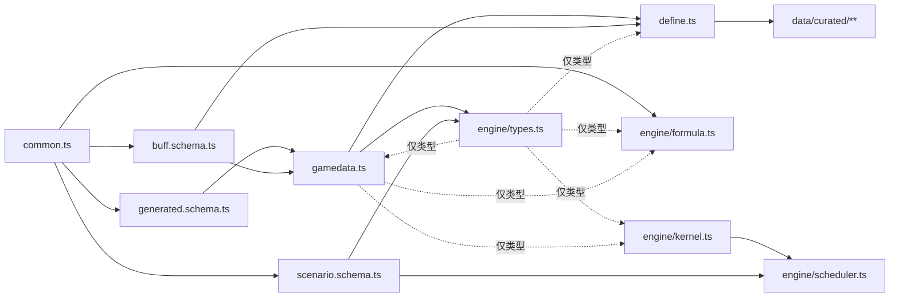

# 鸣潮 DPS 引擎 · TD-02 类型与 Schema v0.1.6

> **状态**：v0.1.6（2026-10-04），已实现。v0.1.6 并回 M4 敌人量表新增的类型与字段（以"v0.1.6"标出）；v0.1.5 并回声骸与 M5 新增的类型与字段（以"v0.1.5"标出），见附录；v0.1.4 并回 M1–M3 新增的类型与字段，代码块改为类型一览（代码以仓库为准）
> **依据**：《技术总体设计 v0.1.1》（下称"总设计"）§2、§3.3、§5、§6.2–6.9、§8、§9、§10；《TD-01 数据字典与抽取规格 v0.1》（下称"TD-01"）§12、§13；《设计文档 v0.2.9》（下称"机制设计"）§4、4B、6.1；v0.1.1 按《TD-03 伤害公式规格 v0.1》（下称"TD-03"）§12.1 修订；v0.1.2 按《TD-04 仿真内核规格 v0.1》（下称"TD-04"）§12.2 修订；v0.1.3 按《TD-09 排轴脚本与调度语义 v0.1》（下称"TD-09"）§9.2 与 M0 确认（`docs/m0-confirm.md`）修订
> **下游**：全部模块的代码；TD-03（伤害公式，已据其定稿乘区清单）、TD-04（仿真内核，已据其定稿运行时字段）、TD-07 定 BuffDef 语义、TD-09 定排轴语义、TD-10 定事件与汇总字段
> **验证**：本文代码以文件形式放在一起，用 TypeScript 6.0 严格模式编译通过；第 9 节 22 个用例全部通过（同一工程里 TD-01 的 14 个、TD-03 的 20 个、TD-04 的 35 个、TD-09 的 33 个用例也全部通过）；构建脚本在 20260707 全量数据上产出的生成文件，逐一用本文的 schema 校验通过（9.2）

---

## 0. 原则

### 0.1 边界用 zod，内部用 interface

| 数据 | 来自 | 校验时机 | 类型从哪来 |
|---|---|---|---|
| `data/generated/*.json` | 构建脚本 | 写出前、读入后各一次 | `z.output<typeof GenXxxSchema>` |
| curated 里的 buff | 手写 TS | 注册层装载时（同时补默认值） | `BuffDefInput` / `BuffDef` 由 schema 推导 |
| 场景（YAML / 网页 JSON） | 用户 | 装配前 | `ScenarioInput` / `Scenario` 由 schema 推导 |
| GameData、ActionDef、SimState、SimEvent… | 代码构造 | 不做运行时校验，由 tsc 保证 | 手写 interface |

- 有 schema 的数据，类型一律由 schema 推导，不再手写一份同构的 interface——两份迟早会不一致。
- 一律用严格对象（`z.strictObject`）：拼错的字段名直接报错，而不是被悄悄丢掉。
- zod 4（`import { z } from 'zod'`）；默认报错切成中文，自定义规则的报错也写中文。

### 0.2 其他约定

- 全是纯数据：不用 class，不放函数（角色钩子除外）；运行时状态都能 `structuredClone`（总设计 §3.7）。
- 帧一律整数，只有角色局部帧 `localFrame` 可以是小数（总设计 T2）；比例一律小数。
- 元素、伤害标签、属性、效应、体型直接用中文字面量类型（总设计 T11），界面不再翻译。
- 字段名以本文为准。总设计 §5 是概要，与本文不同的地方见第 10 节，已同步进总设计 v0.1.1。

### 0.3 统一校验入口

所有边界校验都走这一个函数，报错格式因此统一：文件名 + 每条问题的中文说明 + 路径。

```ts
// src/data/validate.ts —— 边界校验的统一入口（TD-02 §0.3）
import { z } from 'zod'

z.config(z.locales.zhCN())   // zod 自带中文报错；自定义规则的报错本来就是中文

/** 校验并返回补齐默认值后的数据；失败时抛出带位置的错误（CLI 直接打印，网页显示在编辑器旁） */
export function parseOrThrow<S extends z.ZodType>(schema: S, data: unknown, where: string): z.output<S> {
  const r = schema.safeParse(data)
  if (r.success) return r.data
  throw new Error(`${where} 校验失败：\n${z.prettifyError(r.error)}`)
}
```

---

## 1. 文件布局与依赖

| 文件 | 内容 | 层（总设计第 2 节） |
|---|---|---|
| `src/data/common.ts` | 基础类型、枚举、代码表、属性键、乘区 ID | ② |
| `src/data/generated.schema.ts` | 生成文件的 schema（构建脚本也用） | ① / ② |
| `src/data/buff.schema.ts` | BuffDef 的 schema | ② |
| `src/data/gamedata.ts` | GameData 与其中的静态定义、`DEFAULT_RULES` | ② |
| `src/data/define.ts` | curated 模块的类型与 `define*` | ② |
| `src/data/scenario.schema.ts` | 场景 schema、排轴行语法、`Command` | ② / ③ 的边界 |
| `src/data/validate.ts` | `parseOrThrow` | ② |
| `src/engine/types.ts` | ResolvedScenario、SimState、SimEvent、Summary、钩子 | ③ |
| `src/data/assemble-action.ts`、`registry.ts`、`load.ts` | 动作装配（TD-01 §13）；注册层：生成数据 + 手写模块 → GameData（纯函数）；Node 侧读盘 | ② |
| `src/data/nanoka-check.ts`、`check-generated.ts` | `check:data` 的 schema 校验、flag 与 nanoka 核对 | ② |
| `src/engine/formula.ts` | 伤害公式与 buff 收集（TD-03） | ③ |
| `src/engine/kernel.ts` | 仿真内核：时钟与膨胀、动作、判定、动作层合法性（TD-04） | ③ |
| `src/engine/scheduler.ts` | 排轴的编译与调度器（TD-09） | ③ |
| `src/engine/resolve.ts`、`simulate.ts`、`summary.ts` | 场景装配、仿真主流程与结算、汇总（总设计 §3.3–§3.5） | ③ |
| `src/engine/switch.ts`、`resources.ts`、`buffs.ts`、`triggers.ts` | 切人与变奏 / 延奏（TD-05）、角色资源（TD-06）、buff 实例与事件队列 / 触发（TD-07） | ③ |
| `src/engine/context.ts`、`invariants.ts` | 一次仿真的运行环境；不变量检查（总设计 §11 第 4 条） | ③ |
| `src/cli/sim.ts` | `pnpm sim` | CLI |
| `data/curated/**/*.ts` | 手写数据：角色模块、武器 | ② 的输入 |



箭头从被引用方指向引用方（A → B 表示 B 引用 A）。`gamedata.ts` 与 `engine/types.ts` 互相引用对方的类型（`CharacterDef.hooks` 用到钩子类型，钩子又要看 SimState），全部用 `import type`，编译后不存在，不构成运行时循环依赖。

---

## 2. 基础类型与代码表 `common.ts`

- 代码表（`ELEMENT_BY_CODE`、`DAMAGE_TAG_BY_TYPE`、`WEAPON_TYPE_BY_CODE`、`STAT_BY_PROP_ID`）与 TD-01 §4.2 一一对应，构建与装配只从这里取，不在别处写魔法数字。
- 属性键 `StatKey` 就是场景文件里写的中文键（"暴击率""攻击%"）；`STAT_TO_ZONE` 把它落到乘区上，带隐含的过滤条件（"冷凝伤害加成"只对冷凝伤害生效）。
- 乘区 ID 分两类（总设计 §6.6），清单已由 TD-03 §2 定稿：面板类 12 个，先合成攻 / 血 / 防与暴击参数；公式类 33 个，沿用 `CalculateHurt` 的变量名，加深与最终伤害的类别直接写进名字（`DamageAmplify3` = 3 类加深，`FinalDamage6` = 6 类最终伤害）。新增一个乘区 = 在这里加一个字面量 + 在公式里用上它。

代码以仓库为准（`src/data/common.ts`）。v0.1.4 起本文只列类型与字段，**加粗**的是 M2 / M3 新增的。

| 名字 | 内容 |
|---|---|
| `Frame`、`Ratio`、`CharName`、`BlockKey`、`ActionId`、`Slot`、`Chain`、`Rank` | 基本别名 |
| `ELEMENTS` / `ELEMENT_BY_CODE` | 七种元素与 dmg 代码 |
| `DAMAGE_TAGS` / `DAMAGE_TAG_BY_TYPE` | 伤害标签与 Damage.Type 代码（13 暂无数据） |
| `WEAPON_TYPES` / `WEAPON_TYPE_BY_CODE`、`BODY_TYPES` | 武器类型、体型 |
| `DILATION_TYPES`、`DilationSide` | 时间膨胀类型、作用侧 |
| `EFFECT_NAMES` | 异常效应 |
| `ACTION_KINDS` | 动作类别（v0.1.4 起按 dmg 的技能归类定，TD-01 §13.1）；v0.1.6 新增 `tuneBreak`（谐度破坏） |
| `RowKind` | 行类别 hit / gain / dilation / marker |
| `RESOURCE_KINDS` | energy / concerto / core1–core5 |
| `STAT_KEYS`、`FLAT_STATS`、`STAT_BY_PROP_ID`、`STAT_TO_ZONE` | 属性键、属性代码、属性到乘区（带隐含过滤） |
| `PANEL_ZONES`、`AMPLIFY_ZONES`、`FINAL_ZONES`、`FORMULA_ZONES`、`ZONE_IDS` | 乘区 ID（TD-03 §2） |

---

## 3. 生成数据 schema `generated.schema.ts`

与 TD-01 第 12 节的产出文件一一对应。两条约定：

- **表里可能为空的列 → `nullable`**（键总在，值为 `null`）；**只有部分行才有的派生信息 → `optional`**（`hints` / `nameTags` 里的各键、连上才有的 `dmg`）。这样 JSON 里"表格没填"和"不适用"一眼能分开。
- 能在 schema 里查的一致性就在 schema 里查：组名块内唯一、`rates` 恰好 20 个、设置区必须是期望值（TD-01 §1.8 的阻断条件）。

代码以仓库为准（`src/data/generated.schema.ts`）。v0.1.4 起本文只列类型与字段，**加粗**的是 M2 / M3 新增的。

| schema | 文件 | 要点 |
|---|---|---|
| `GenActionFileSchema`（组 `GenGroupSchema` → 行 `GenRowSchema`） | `actions/<块键>.json` | 行：row、name、kind、eventSpawned、spawnFrame、birthFrame、lifeFrames、hitstop、派生帧与持续、endFrame、priority / priorityChange、parry、persists、followHitstop、toughness、tunability、gains（`GainCellSchema`：total / perHit / onAction / sharedRows）、position、dilation（`DilationWindowSchema`）、hitTarget、note / noteMerged、hints（`HintsSchema`；**`outroRange`、`endOnSwitchAfter`**，TD-01 §3.8）、nameTags、flags、dmg（`GenDmgSchema`：via、skillType、damageType、multiplier、rates、energy、formulaType / formulaRate、cureBase…；multiplier 的取级见 TD-01 §4.3） |
| `GenCharactersSchema` | `characters.json` | 主表、90 级三维、体型、通用块、大招所需能量、核心资源槽、文本 |
| `GenWeaponSchema` | `weapons.json` | 主副属性、被动文本与 R1–R5 数值 |
| `GenEchoSchema`（组 `GenEchoGroupSchema` → 行 `GenRowSchema`） | `echoes.json` | v0.1.5：key、startRow、cost、description、descCooldown、textKind、ignoredRows、groups（id、variant、stage、body、kind、cooldown、next、rows）、flags（TD-01 §8） |
| `GenEchoStatsSchema` | `echo-stats.json` | v0.1.5：mains、fixedSubs（`{ cost, stat, value }`）、subTiers（属性 → 各档，从低到高）（TD-01 §12.6） |
| `GenEnemySchema` | `enemies.json` | 防御、抗性、白条、韧性、偏谐上限；v0.1.6：`whiteBarTough`（白条按削韧值，可为 null，TD-01 §9） |
| `GenTuneBreakSchema` | `tune-break.json` | v0.1.6 已产出：variants（key、weaponType、seq、multiplier、ticks、golden）、costRows、baseByLevel、costFactors（TD-01 §11.3） |
| `GenEffectsFileSchema` | `effects.json` | 异常效应，未产出 |
| `GenBuffTextSchema` | `buff-texts.json` | 按需 |
| `GenMetaSchema` | `meta.json` | xlsx 文件、sha256、资源版本、设置区、计数 |
| **`NanokaFileSchema`** | `nanoka.json` | 技能冷却、技能文本、共鸣链、技能树属性（TD-01 §12.5）；v0.1.5 新增 `echoes`（`NanokaEchoSchema`：id、name、desc、cooldown、damage（id、element、relatedProperty、type、rateLv、energy、toughLv、weaknessLvl、hardnessLv）、sets）与 `echoSets` |
| `GoldenDamageSchema`、`GoldenZonesSchema` | `fixtures/` | TD-01 §11.1、TD-03 §10 |

---

## 4. 静态数据 `GameData`

注册层把生成数据、curated 模块按 TD-01 第 13 节的默认映射装配成下面这些只读结构。

代码以仓库为准（`src/data/gamedata.ts`）。v0.1.4 起本文只列类型与字段，**加粗**的是 M2 / M3 新增的。

| 类型 | 主要字段 |
|---|---|
| `GameData` | version、meta、characters、commonActions、weapons、echoes、echoSets、echoStats（v0.1.5，可为 null）、enemies、effects / abnormalBaseByLevel（异常效应，未接）、tuneBreak（v0.1.6：由 `tune-break.json` 装配，没有文件时全 0）、envBuffs、rules |
| `CharacterDef` | name、element、weaponType、bodyType、commonBlock、base、energyCost、coreResources、tunabilityRate、harmonyBreakBoost、**treeStats**、actions、aliases、buffs、**resourceEffects**、hooks?、flags |
| `ActionDef` | id、owner、kind、endFrame、cancelWindows、priority、comboFrom?、inputLocks、judgments、dilations、castGains、outroTriggerFrame?、switchLockUntil?、cooldown?、**cooldownGroup?**、charges?（v0.1.5）、**energyCost?**、**endOnSwitchOut?**、**followUp?**、summon?（v0.1.5）、source、flags |
| `CastGain` | atFrame、resource、amount、**chainRange?** |
| `JudgmentDef` | name、row、spawnFrame、birthFrame、lifeFrames、ticks、tickInterval、persistsOnCancel、followHitstop、target、calc、multiplier、relatedAttr、element、tags、gains、coreOncePerAction?、gauges、hitstop、formula?、cureBase?、chainRange?、heals?（v0.1.5）、flags |
| `WeaponDef` | key、rarity、type、main、sub、effects（原始被动文本）、passives（BuffDef[]）、**resourceEffects** |
| `EchoDef` | v0.1.5：key、cost（可为 null）、actions（`Q·<组名>`，按体型分组的带 `@体型`）、q（别名 Q 指向的动作）、description、mainSlotBuffs、resourceEffects、curated、flags |
| `EnemyPreset` | 同 v0.1.3；v0.1.6 新增 `whiteBarTough`（白条按削韧值，0 = 没有白条）、`paralysisFrames`（白条打空后瘫痪几帧） |
| `EchoSetDef`、`EffectDef`、`TuneBreakTable`、`InputLock`、`DilationDef`、`DilationRule`、`ChainRange` | 同 v0.1.3 |
| `Rules` / `DEFAULT_RULES` | 见 4.2 |

### 4.1 要点

- `ActionDef.judgments` 按 `spawnFrame` 升序排好，事件生成的（`spawnFrame = null`）放最后。仿真时内核把判定生成、施放资源、按动作登记的膨胀、延奏触发排成一条时间线，用游标推进（`ActionRuntime.cursor`，TD-04 §4.1），不必每帧扫描。
- `priority` 第一项的 `fromFrame` 一定是 0；`cancelWindows` 是左闭右开的 [from, until)，`until` 可以超过 `endFrame`（回到空闲后仍能接连段，TD-04 §6.2）。
- `comboFrom` 只出现在连段动作上（A2 ← A1 …）：上一个动作必须是其中之一且派生窗口开着；`inputLocks` 来自"第 nF 前不响应输入 / 不能闪避"等备注（TD-04 §6.2、§6.3）。
- `DilationDef.anchor`：`action` 表示动作局部帧到 `start` 时登记（时停、全局时停、极限闪避）；`hit` 表示判定每次命中时登记。xlsx 同一行各侧的"膨胀发生"有的有值、有的为空时拆成两条：为空的一侧（任何类型）放进 `JudgmentDef.hitstop`，有值的放进 `ActionDef.dilations`（TD-04 §3.2）。
- `JudgmentDef.birthFrame` 来自发生帧公式 P + f(Q) 的 P：动作在出生帧之后被取消，可脱手的判定仍在发生帧生成（TD-04 §5.4）。
- `CastGain.atFrame` 为 0 表示"进入动作即得"：开始动作的那一刻由资源模块发放（TD-06 §7）；由判定行汇总来的项带 `chainRange`，与判定一起按共鸣链筛（v0.1.4）。
- v0.1.4 新增：`ActionDef.energyCost`（大招门槛与扣除，TD-06 §2.3）、`endOnSwitchOut`（切人结束技能，TD-05 §5）、`followUp`（接续动作，TD-08 P10）、`cooldownGroup`（共用冷却）；`CharacterDef.treeStats`（技能树属性，进静态面板）、`resourceEffects`（资源型效果，TD-07 §9）；`WeaponDef.resourceEffects`。
- `JudgmentDef.calc` 来自 dmg 的 `CalculateType`：治疗、扣血判定照常结算（发资源、触发 buff），只是不产生伤害。
- `coreOncePerAction` 来自核心回收的合并单元格（TD-01 §1.5）：同一个动作实例里，该槽只在第一次结算时发放。
- `relatedAttr` 的 `energyRegen` 对应 RelatedProperty 11（布兰特的治疗）；`formula`、`cureBase` 只在 dmg 有对应参数时出现，用法见 TD-03 §3.2、§7。
- `abnormalBaseByLevel`、`TuneBreakTable.baseByLevel` 的下标 = 等级 − 1；`costFactor` 按敌人 COST 取（TD-03 §5、§6）。
- `JudgmentDef.chainRange`（v0.1.3）：这个判定只在哪些共鸣链数下存在，两端都含。装配时由行名的 `C\d` 推出（TD-01 §13.2：椿 大招-C0 / C3 / C5 伤害 → [0, 2]、[3, 4]、[5, 6]）；场景装配按队员的链数用 `forChain` 挑掉不在范围里的判定（总设计 §3.3 第 4 步）。动作的时间字段不按链数变。
- `ActionDef.cooldown`：声骸技能来自 xlsx；角色技能的冷却 xlsx 没有，由角色模块覆盖（v0.1.3）。计时在内核（TD-04 §6.5），判断在调度器（TD-09 §3.2）。
- v0.1.5 新增：`ActionDef.charges`（按次数充能：最多存几次，每 `cooldown` 帧回复 1 次）、`summon`（召唤类声骸：判定走独立时间线，TD-04 §4）；`JudgmentDef.heals`（这段同时治疗，结算后记 `heal` 事件；治疗量不建模）；`EchoDef` 按声骸接入重写（TD-01 §13.3）；`GameData.echoStats`。

### 4.2 Rules 默认值

| 字段 | 默认 | 出处 | 谁可能改 |
|---|---|---|---|
| `charLevel` | 90 | 总设计第 7 节（等级永久锁定）；防御公式里的 Lv（TD-03 §3.2） | — |
| `switchCooldown` | 60 | 机制设计 5.4 | 实测 |
| `concertoMax` | 100 | 机制设计 4.2 | — |
| `concertoTiming` | `'onHit'`（v0.1.4，2026-10-03 实测：协奏按命中给；"进入即得"仍在出手时） | TD-06 §3.2 | —— |
| `energyShare` | 出伤者 1、其余 0.5 | 机制设计 4.1 | — |
| `breakEnergy` | 3：白条打空时全队每人 +3 × 各自共鸣效率（v0.1.6） | 机制设计 4.3、TD-06 §13.2 | —— |
| `tuneBreakLock` | 300：谐度破坏命中后不累积偏谐值的战斗帧（真空期 5 秒，v0.1.6） | TD-06 §13.1 | 带震谐·干涉时 8 秒（以后） |
| `critRateCap` | 1 | 总设计 §6.6 | — |
| `defFactorCap` | 2 | `CalculateHurt` 的 `min(2, …)` | — |
| `highResThreshold` | 0.8 | 总设计附录 A-5 | — |
| `maxWait` | 600 | 总设计 §6.5 | 场景 `options.maxWait` |
| `maxChainDepth` | 16 | 总设计 §6.3 | — |
| `sampleInterval` | 30 | 本文新增：资源曲线每 0.5 秒采样一次 | TD-10 |
| `dilation[类型]` | `stopsBattleClock`：只有全局时停为 `true`；`hitstopSides`（按攻击顿帧处理、同一单位上新的替换旧的）：攻击顿帧与弹反顿帧为三侧、极限闪避顿帧为敌侧、时停类为空；`clearSelfOnCancel`：只有极限闪避顿帧为 `true` | 总设计 §6.4 不变量 6；xlsx「附页1」（TD-04 §3.3） | 实测（TD-04 Q1–Q6） |

场景可以用 `options.rules` 覆盖任意一项，装配时逐项校验。

---

## 5. 手写数据

### 5.1 BuffDef `buff.schema.ts`

代码以仓库为准（`src/data/buff.schema.ts`）。v0.1.4 起本文只列类型与字段，**加粗**的是 M2 / M3 新增的。

| 字段 | 说明 |
|---|---|
| id、source | 全局唯一 id；原文整句 |
| zone?、value? | 乘区与每层数值（数组 = 武器 R1–R5）；**两者都不写 = 标记型**，只表示状态与计时（TD-07 §7） |
| filter? | `BuffFilterSchema`：元素、标签、动作、判定、目标身上的效应、效应自身伤害、只进暴击分支 |
| target | self / team / teamExceptSelf / onField / nextIn / enemy |
| maxStacks、stackGain、duration、onSwitchOut、refresh、icd? | 层数、时长（帧或 'inf'）、切人清除、刷新、内置冷却 |
| trigger | `'always'`（常驻）/ **`'hook'`（只由钩子施加）** / `{ on, where? }`（`TriggerSpecSchema`）/ **它的数组（任一事件）**。v0.1.5：事件目录新增 `heal`，`where` 新增 `ownerHas`（持有者身上有这个 buff 时才触发，TD-07 §4） |
| **consume?** | "下次…"：`{ on, where?, stacks }`（TD-07 §6） |
| requires? | `{ chain }` 共鸣链门槛 |

**`ResourceEffectSchema`**（TD-07 §9）：id、source、resource、amount（数组 = R1–R5）、target（self / team / teamExceptSelf / onField）、trigger（同上，不含 'always' / 'hook'）、icd?、scaledByRegen?、requires?。

`superRefine` 的交叉规则：**乘区与数值要么都写、要么都不写**；常驻 buff 必须无限时长；`stackGain` 不超过 `maxStacks`；暴击率 / 暴伤不配 `critOnly`。


- `value` 写数组表示武器 R1–R5；装配时按场景的谐振阶取出一个数（`RegisteredBuff.value`）。
- 默认值：`maxStacks` 1、`stackGain` 1、`onSwitchOut` `'persist'`（机制设计 6.1 的永久规则：原文明写才 `clear`）、`refresh` `'refresh'`（总设计 §6.8）。
- `superRefine` 里的三条交叉规则就是最常见的手写错误：常驻 buff 写了有限时长、一次加的层数超过上限、给暴击率 / 暴伤配了 `critOnly`。加深与最终伤害的类别写在乘区名里，拼错直接是类型错误。
- `filter.enemyEffect`（目标身上有该效应）与 `filter.effects`（这次伤害就是该效应自身的伤害）是两回事，见 TD-03 §4。
- 数值随状态变化的效果（"每层集谐·干涉 × 谐破增幅 × 0.12%"）不塞进 BuffDef，写在钩子 `modifyHit` 里、往 `hit.zones` 补值（总设计 T8 的判断标准，TD-03 §4）。

### 5.2 curated 模块 `define.ts`

代码以仓库为准（`src/data/define.ts`）。v0.1.4 起本文只列类型与字段，**加粗**的是 M2 / M3 新增的。

| 类型 | 字段 |
|---|---|
| `ActionOverride` | dropRows、kind、endFrame、priority、cancelWindows、outroTriggerFrame、switchLockUntil、comboFrom、cooldown、**cooldownGroup**、charges（v0.1.5）、**energyCost**、**endOnSwitchOut**、**followUp**、summon（v0.1.5）、judgments（`JudgmentOverride`）、accept |
| `JudgmentOverride` | spawnFrame、lifeFrames、ticks、tickInterval、persistsOnCancel、multiplier、tags、target、chainRange；v0.1.5 新增 element、relatedAttr、heals |
| `CharacterModule` | weaponType、bodyType?、mergeBlocks?、coreCaps?、**treeStats?**、aliases?、buffs?、**resourceEffects?**、hooks?、actionOverrides? |
| `WeaponModule` | name、passives、**resourceEffects?** |
| `EchoModule` | v0.1.5：name、cost?、mainSlotBuffs?、resourceEffects?、actionOverrides?（键是声骸动作 ID；去掉了 v0.1.3 的 `multipliers`，倍率改在 `judgments` 里写或连 nanoka，TD-01 §13.3） |
| `EchoSetModule`、`DmgJoinMap` | 同 v0.1.3 |


`define*` 只做类型约束、原样返回；真正的校验（buff 用 zod、`actionOverrides` 的键必须是存在的动作）在注册层装载时做，报错指到模块文件与字段。

`ActionOverride`（v0.1.3 补全，TD-01 §13.4）：

- `dropRows` 在装配**之前**去掉行，用于互斥的"情形"版本只留一个（维里奈 A3 只留"目标3m内"）；其余字段在装配之后覆盖结果。
- `comboFrom` 补自动推断之外的连段前置（TD-04 Q8）；`cooldown` 写角色技能冷却（帧）。
- 覆盖了带 flag 的字段，该 flag 视为已处理（改 `priority` 消掉 `priorityChangeGuess` 等）；`accept` 列出明确接受的 flag。
- 写了不存在的动作、行或判定，装配时直接报错，不做模糊匹配。

### 5.3 示例：散华

见 `data/curated/characters/散华.ts`（v0.1.4：含三种冰的标记型 buff、引爆计时与钩子，TD-08 §5.1）。

---

## 6. 场景 `scenario.schema.ts`

代码以仓库为准（`src/data/scenario.schema.ts`）。v0.1.4 起本文只列类型与字段，**加粗**的是 M2 / M3 新增的。

| 字段 | 说明 |
|---|---|
| data? | 期望的数据版本（不符只警告） |
| team（3 人） | char、chain、weapon `{ name, rank }`、echoes（≤ 5 件：name、set、main、subs） |
| enemy | `{ preset }` 或 `{ custom: { level, def?, res, cost, hp?, whiteBar?, paralysisSec?, tunabilityMax? } }`；v0.1.6：自定义敌人的 `whiteBar` 按削韧值计，新增 `paralysisSec` |
| environment | 场景 buff 的 id |
| initial | energy（'full' / 'empty' / 三人各值）、concerto、onField |
| rotation | 排轴行（语法见 TD-09 §2）；空行与 null 不产生指令 |
| options | repeat、maxFrames、maxWait、endAt?、rules?、tuneBreak（v0.1.6：`auto` / `manual` / `off`，缺省 `auto`，TD-06 §13.4） |

`RotationItem` / `parseRotationLine`：一行解析成多条指令；`Command`：编译后的指令（act / switch / wait，测试台另有 at）。v0.1.6：act 新增 `optional?: true`（排轴里的可选后缀 `?`，TD-09 §2）。


- CLI 先用 `yaml` 包把文本解析成对象，再交给 `ScenarioSchema`；网页编辑器直接交对象，两边同一套校验（总设计第 8 节）。
- **声骸主属性写全**：4C 的"攻击 150"、3C 的"攻击 100"这类固定副主属性也写进 `main`，装配不自动补（等 M5 有了 `echo-stats.json` 再考虑）。每件还要写 `set`：同一个声骸可能属于多个套装。
- **排轴行在 schema 阶段就检查语法和角色名**，报错指到第几条；动作名要等装配时对照 GameData 才能检查。语法（v0.1.3）见 TD-09 §2：一行可以写同一角色的多个动作，`!` 强制，`+N` 延后，`切人` / `等待` 与 `switch` / `wait` 同义，空格后的 `#` 起是注释；`parseRotationLine` 因此返回数组。空行与 YAML 里只有注释的项（读出来是 null）当空行，不产生指令。
- `Command` 是编译后的指令（TD-09 §4）：`line` 是第几条、`item` 是行内第几个；`at` 只给测试台用，排轴语法写不出来。
- `initial.onField` 是新增字段：开局前台角色的槽位。

与总设计第 8 节示例对应的最小场景（名称仅作格式演示）：

```yaml
data: "20260707"
team:
  - char: 散华
    chain: 6
    weapon: { name: 千古洑流 }
    echoes:
      - { name: 角, set: 凝夜白霜, main: { 暴击率: 0.22, 攻击: 150 }, subs: { 暴击伤害: 0.174, 攻击%: 0.071 } }
  - char: 长离
    weapon: { name: 赤霄 }
  - char: 维里奈
    weapon: { name: 奇幻变奏, rank: 5 }
enemy: { preset: 全息6/朔雷之鳞 }
rotation:
  - 散华 E
  - 散华 A1
  - 散华 A2 +3        # 最早合法帧之后再等 3 帧
  - switch 长离       # 协奏满 → 自动变奏 / 延奏
  - 长离 R
  - wait 20
# 省略的 initial / options / environment 取默认值（第 8 节）
```

---

## 7. 引擎类型 `engine/types.ts`

代码以仓库为准（`src/engine/types.ts`）。v0.1.4 起本文只列类型与字段，**加粗**的是 M2 / M3 新增的。

| 类型 | 主要字段 |
|---|---|
| `ResolvedScenario` | data、team、enemy、buffs、**effects**、commands、initial、rules、options、warnings |
| `ResolvedMember`、`StaticPanel`、`StatParts` | 队员：def、chain、weapon、echoes（v0.1.5：`def` 可为 null——不在声骸表里的非首位声骸，只计入词条与套装）、静态面板、动作表（含首位声骸的 `Q·…`）、别名（含 `Q`） |
| `RegisteredBuff` / **`RegisteredEffect`** | def、value / amount（已按谐振阶取值）、owner |
| `SimState` | frame、battleFrames、onField、switchCd、chars、judgments、tails、buffs、enemy、dilations、queue、log、nextId、**outroLinks**、**pendingNextIn**、**lastTrigger** |
| `CharRuntime` | slot、name、action、last、startedThisTick、energy、concerto、core、cooldowns、charges（v0.1.5：按次数充能的冷却键 → 已用几次、每次回复多久）、flags |
| `ActionRuntime` | id、def、instance、localFrame、startedAt、cursor、ended、coreGranted、**cmd?**、**skip?** |
| `TailRuntime` | owner、action、def、instance、localFrame、events、**detached?**、**skip?** |
| `JudgmentRuntime` | id、owner、action、actionInstance、def、spawnedAt、age、ticksDone、**detached?** |
| `EnemyRuntime` | preset、whiteBar（v0.1.6 起按削韧值）、broken、paralyzedUntil（v0.1.6）、poise、tunability、disharmony、tunabilityLockedUntil、tuneBreakBy?（v0.1.6：消耗这次失谐的谐度破坏动作实例）、shift?、interference?、effects、responseCd |
| `BuffRuntime`、`DilationRuntime`、`Rates`、`QueueState`、`WaitSegment`、`WaitCode`、`CommandRef`、`TimelineEvent` | 同 v0.1.3 |
| `SimEvent` | actionStart / actionEnd / actionCancel / judgmentSpawn / hit（**element、tags**）/ switch / intro / outro（**to、instance?**）/ buffApply / buffExpire / resource / **resourceFull** / heal（v0.1.5：char、source）/ enemyState（v0.1.6：change 新增 `breakEnd`，`ENEMY_STATE_CHANGES`）/ effectTick / wait / skip（v0.1.6：cmd、code、reason，可选指令被跳过）/ loop / warning |
| `Summary` | totalDamage、windowFrames、dps、overflowDamage、byChar、byAction、resourceTimeline、buffUptime、waits、warnings、perLoop?（v0.1.5：loop、start、frames、damage、dps、energyDelta、concertoDelta）、steady?（v0.1.5：from、to、frames、damage、dps）、enemy（v0.1.6：disharmony、tuneBreaks、tuneBreakDamage、breaks）、skipped（v0.1.6：line、item、loop、reason）（TD-10） |
| `SimResult` | log、summary、error?（code：comboBroken / timeout / maxFrames / notOnField / switchSelf / **chainDepth** / **invariant**） |
| `CharacterHooks` | onResolve?、canStart?、onEvent?、modifyHit? |
| `HookContext` | self、**chain**、state、buffStacks、addBuff、removeBuff、addResource、spawnJudgment、**skipJudgments**、setFlag、getFlag、heal（v0.1.5：记一次本角色提供的治疗）、warn |
| `HitDraft` | judgment、char、multiplier、extraFlat、element、tags、effect?、**selfEnergyScale**、zones、critOnly |
| `ZoneAccumulator` | zones、critOnly |


### 7.1 ResolvedScenario

- **静态面板只放面板类乘区**（攻 / 血 / 防三分量、暴击、暴伤、共鸣效率、治疗、偏谐效率、谐破增幅）。声骸与武器上"带过滤条件"的加成（冷凝伤害加成、普攻伤害加成…）一律在装配时转成常驻 buff 实例（`trigger: 'always'`、`duration: 'inf'`），与战斗中触发的 buff 走同一条收集路径——伤害计算只有一个入口，不会出现"面板里算了一遍、buff 里又算一遍"。
- `StatParts` 保留基础值 / 百分比 / 固定值三分量，最终值 = base × (1 + pct) + flat；战斗中的攻击% buff 在命中时再叠进 pct（总设计 §3.3）。
- `actions` 已把体型通用动作（闪避、极限闪避…）并进来；首位声骸技能（别名 `Q`）等声骸数据接入后再并。
- `effects`（v0.1.4）：资源型触发效果的登记表，与 `buffs` 一样按共鸣链过滤、按谐振阶取值（TD-07 §9）。

### 7.2 SimState

- `nextId` 统一发号：判定、buff 实例、动作实例的编号都从这里来，事件日志里能互相引用。
- `ActionRuntime.instance` 是"每个动作实例只发一次"（核心回收合并区、`castGains`）的依据；`cursor` 指向时间线上下一个没发生的事件。
- `CharRuntime.last` 是最近一个动作实例（进行中的就是 `action`），结束后局部帧照走，用于判断连段窗口；`startedThisTick` 保证同一角色一个 tick 只开始一个动作（TD-04 §6）。
- `SimState.tails` 是尾部：动作被取消或自然结束后仍要发生的时间线事件，按战斗时钟推进（TD-04 §4.4）。
- `JudgmentRuntime.age` 是判定时钟上的年龄，结算次数与寿命都按它算（TD-04 §5.2）；持续帧 -1 的判定在所属动作结束或被取消时移除。
- `DilationRuntime` 登记时已按侧展开到具体单位（`target`），`hitstop` 标记是否按攻击顿帧处理（TD-04 §3.2）。
- `CharRuntime.flags` 只由钩子读写，引擎本身不看。
- `SimState.queue` 是调度器的状态（v0.1.3，TD-09 §5）：指令表与轮数、队首下标、当前轮次、累计的不合法等待、`+N` 的起算点、`wait` 的结束点、正在累计的等待段。放在 `SimState` 里，随状态一起 `structuredClone`。
- `CharRuntime.cooldowns` 的键是 `cooldownKey`：写了 `cooldownGroup` 的按组名（v0.1.5 起先看它：多段声骸的后续段写自己的 ID，不受声骸冷却限制），否则声骸技能共用 `echo`，其余按动作 ID（TD-04 §6.5）。按次数充能的键另在 `charges` 里记用掉几次，`cooldowns` 是下一次回复还要多久。
- v0.1.4：`outroLinks` 记"哪次变奏 → 由谁发延奏"（TD-05 §3）；`pendingNextIn` 是挂起到下一次切入的 nextIn buff（TD-07 §3）；`lastTrigger` 记触发型 buff 与资源型效果的内置冷却（键"持有者|定义 id"，TD-07 §4.4）；`ActionRuntime.cmd` 是指令出处（接续动作继承），`skip` 是钩子跳过的判定；`TailRuntime.detached` / `JudgmentRuntime.detached` 标记延奏动作的独立时间线（TD-05 §4.3）。

### 7.3 事件与汇总

- 事件是可辨识联合，按 `type` 收窄（9.1 的 T02-6 在编译期保证每种都处理到）。
- 非伤害判定（治疗、友方、倍率为 0）也发 `hit` 事件，`dmg: null`——触发类 buff 与资源发放统一挂在这一个事件上。
- `hit.buffs` 记"id×层数"；`factors` 是非暴击分支的各项系数，键名按 TD-03 §8，默认写不写由 TD-10 定。
- v0.1.4：`hit` 带这次结算最终的 `element`、`tags`（`modifyHit` 之后，TD-07 §4.1）；`outro` 带 `to`（这次变奏的角色）与延奏动作独立时间线的 `instance`；新增 `resourceFull`（TD-06 §6）；`Summary.resourceTimeline`、`buffUptime` 已从日志算出（TD-06 §6.1、TD-07 §10.1）；`SimResult.error.code` 新增 `chainDepth`（TD-07 §5）、`invariant`（总设计 §11 第 4 条）。
- `wait`（v0.1.3）按原因分段：`code` 是原因代码（`WaitCode`），`from` 是开始帧，`frames` / `battleFrames` 分别是世界帧数与战斗帧数，`cmd` 指出第几轮第几条第几个（TD-09 §3.3）。`loop` 标出每轮的开始（TD-09 §3.7）。`actionStart`、`switch` 由指令触发时带 `cmd`。

### 7.4 钩子

- 只有四个钩子（总设计 §6.9）。`canStart` 返回字符串表示不允许及原因，原因会写进等待日志（"等待 36 帧：离火不足"）。
- `ctx.state` 只读；改状态只能通过 `ctx` 上的方法，出问题好定位。`addBuff` 的 id 指本角色 `buffs` 里的定义，钩子不能凭空造 buff。
- `modifyHit` 在收集 buff 之前调用（TD-03 §4）：可以改 `HitDraft` 的倍率、`extraFlat`（Formula1）、元素、标签，或往 `zones` / `critOnly` 直接补值；不能改面板，也看不到 buff 合计（TD-03 Q5）。
- v0.1.4（TD-08 §3）：`onEvent` 收到全部事件（含队友的）；`ctx.chain` 是本角色的共鸣链数；`ctx.skipJudgments(instance, names)` 让某个动作实例（或延奏的独立时间线）不生成某些判定；`HitDraft.selfEnergyScale` 是这次结算出伤者自己那份能量的倍率，队友那 50% 不变（TD-06 §2.1）；只由钩子施加的 buff 写 `trigger: 'hook'`。

---

## 8. 默认值总表

| 位置 | 字段 | 默认 |
|---|---|---|
| 场景 · 成员 | `chain` / `weapon.rank` / `echoes` | 0 / 1 / `[]` |
| 场景 · 声骸 | `subs` | `{}` |
| 场景 | `environment` | `[]` |
| 场景 · initial | `energy` / `concerto` / `onField` | `'full'` / 0 / 0 |
| 场景 · options | `repeat` / `maxFrames` / `maxWait` | 1 / 3600 / 600 |
| BuffDef | `maxStacks` / `stackGain` / `onSwitchOut` / `refresh` | 1 / 1 / `'persist'` / `'refresh'` |
| BuffDef · trigger.where | `by` | `'self'` |
| BuffDef · consume | `stacks` | `'all'` |
| ResourceEffect | `target` | `'self'` |
| Rules | 见 4.2 | |
| 生成数据 → ActionDef / JudgmentDef | 见 TD-01 第 13 节 | |

---

## 9. 测试用例

### 9.1 代码

见 `tests/td02.test.ts`（22 个用例，`pnpm test`）。

### 9.2 结果与全量数据校验

- `tsc --strict`（TypeScript 6.0）编译通过，包括 T02-6 的两处 `@ts-expect-error`——它们要求"拼错的武器类型、乘区 ID 必须是类型错误"，若哪天类型放宽了，编译反而会失败。
- 22 个用例全部通过（本地用 tsx 运行，`vitest` 以只含 `describe` / `test` / `expect` 子集的替身代替；仓库的 CI 用真 vitest）。v0.1.1 把 T02-5 的"加深类缺 ampClass"换成"加深类别写在乘区名里"；v0.1.2 给 T02 的散华 E 行夹具补 `birthFrame: null`；v0.1.3 按新语法改写 T02-3（`parseRotationLine` 返回数组），T02-6 的事件穷举加上 `loop`、`wait` 改用新字段。
- **全量数据**：按 TD-01 规则在 20260707 版上产出的生成文件，逐一用本文 schema 校验：

| 文件 | 记录数 | 结果 |
|---|---|---|
| `actions/*.json` | 70 个文件、4769 行 | 全部通过 |
| `characters.json` | 61 个角色 | 通过 |
| `enemies.json` | 1402 | 通过 |
| `buff-texts.json` | 1549 | 通过 |
| `weapons.json` | 121 | 通过 |
| `fixtures/golden-damage.json` | 1643 | 通过 |

校验过程中发现并已改进 TD-01 / 本文的三处：dmg 里有 26 行只有 `Skill.*` 没有伤害配置（连到它们的 28 个判定行改记 `dmgNoConfig`）；洛瑟菈、弗洛洛的大招能量为 0（`energyCost` 允许 0）；核心资源上限为 0 的槽不产出（`cap` 必须 > 0）。声骸、异常效应、谐度破坏三个文件原型尚未产出，只做了类型检查。

---

## 10. 对总设计 §5 的调整

以下都是细化，不推翻第 4 节的取舍；已同步进总设计 v0.1.1（§5 与附录 C）。

1. **CharacterDef**：新增 `weaponType`（curated 必填，xlsx 没有）、`bodyType`、`commonBlock`、`tunabilityRate`、`harmonyBreakBoost`、`flags`；`coreResources` 改为带槽号 `{ slot, name, cap }`，槽位可以不连续。
2. **ActionDef**：新增 `owner`、`switchLockUntil`、`cooldown`、`source`、`flags`；`castGains` 从"只有协奏"改为 `{ atFrame, resource, amount }[]`，覆盖能量、协奏、核心资源。
3. **JudgmentDef**：新增 `row`、`tickInterval`、`followHitstop`、`target`、`calc`、`coreOncePerAction`、`flags`；`spawnFrame` 可为 `null`（事件生成）；`hitstop` 改用 `DilationDef`（`anchor: 'hit'`）；`lifeFrames = -1` 的含义按作者说明改为"直到动作结束"。
4. **BuffDef**：新增 `stackGain`、`refresh`、`icd`；`trigger.where` 定型为 `TriggerFilter`；`requires` 只保留 `chain`（套装件数由 `EchoSetDef.pieces` 表达）。
5. **敌人**：`toughness / broken` 拆成白条 `whiteBar` 与韧性 `poise` 两套（TD-01 §9.2）。
6. **SimState**：`queue` 定型、新增 `nextId`；`CharRuntime.core` 扩为 5 槽；`ActionRuntime` 增加实例号与推进下标；`Rates` 增加 `enemy`。
7. **SimEvent**：非伤害判定也发 `hit`，`dmg: null`。
8. **Scenario**：声骸件必须写 `set`，`main` 写全固定副主属性；新增 `initial.onField`、`options.endAt`、`options.rules`。
9. **GameData**：新增 `meta`、`commonActions`。

v0.1.1 按 TD-03 做的修订（乘区清单、BuffDef、`HitDraft` / `ZoneAccumulator` / `modifyHit`、`JudgmentDef`、`Rules` 等）、v0.1.2 按 TD-04 做的修订（运行时字段、`comboFrom` / `inputLocks` / `birthFrame`、`Rules.dilation`）、v0.1.3 按 TD-09 与 M0 确认做的修订（排轴语法、`Command`、`QueueState`、等待事件、`chainRange`、`ActionOverride`）都不涉及总设计第 4 节，逐条见 TD-03 §12.1、TD-04 §12.2、TD-09 §9.2 与本文附录。

---

## 11. 待定问题

| # | 问题 | 当前做法 | 由谁关闭 |
|---|---|---|---|
| Q1 | 公式类乘区清单：`RateBonus` 是否单列；"防御降低 x%"记 `RoleIgnoreDefRate` 还是另设乘区 | **已关闭**：`RateBonus` 保留；减防记 `TargetDefRate`（写负数），无视防御记 `RoleIgnoreDefRate` | TD-03 §2 |
| Q2 | 文本里的"8 类加深""6 类最终伤害"对应 `ampClass` 几号 | **已关闭**：取消 `ampClass`，写成 `DamageAmplify8` / `FinalDamage6`；不带类别的加深是 0 类 | TD-03 §2 |
| Q3 | 各类时间膨胀除战斗时钟外还影响谁（时停冻结队友？） | **已关闭**：`Rules.dilation` 改为 `DilationRule`，作用对象由 xlsx 的自 / 敌 / 友三侧决定；实测项转为 TD-04 Q1–Q6 | TD-04 §3 |
| Q4 | 声骸固定副主属性是否由装配自动补 | 场景里写全；`echo-stats.json` 已有（v0.1.5，TD-01 §12.6），自动补要先知道每件声骸的 COST（非首位的 1C 小怪多半不在声骸表里） | 有需要时 |
| Q5 | `HookContext` 是否需要更多能力 | **已关闭**（v0.1.4）：按 TD-08 §3.2 的清单扩充（`skipJudgments`、`chain`、`HitDraft.selfEnergyScale`），以后再加一项记一次附录 | TD-08 |
| Q6 | `全属性伤害加成` 是否也作用于物理伤害 | **已关闭**：不作用（xlsx 的全属伤只并入六个元素） | TD-03 §3.2 |
| Q7 | `EffectDef.duration` / `tickInterval` 的来源（说明文本 curated） | 可为 `null` | TD-06 |

---

## 附录：变更历史

- **v0.1（2026-09-26）**：初版。确立"边界用 zod、内部用 interface、类型由 schema 推导"；给出 `common.ts`、生成数据 schema、BuffDef schema、GameData、curated 模块、场景 schema 与排轴行语法、引擎运行时 / 事件 / 汇总 / 钩子类型的完整代码；Rules 默认值；22 个测试用例；用全量数据校验了生成文件 schema；列出对总设计 §5 的 9 处细化与 7 个待定问题。
- **v0.1.1（2026-09-26）**：按 TD-03 §12.1 修订。乘区清单定稿（删 `ClassDamageAmplifyOnHit` / `DamageAmplifyOnHit` / `DamageAmplifyOnBeHit` / `AmpClass`，`TargetDefFlat` 改为 `TargetDefRate`，新增 `DamageAmplify0–9`、`DamageAmplify1002`、`FinalDamage0–7`、`FinalDamage1001`、`TargetHealedChange` 与分组常量）；BuffDef 去掉 `ampClass`、过滤条件新增 `effects`；`HitDraft` 可改元素与标签并可直接补乘区值，`ZoneAccumulator` 改为 `{ zones, critOnly }`，`modifyHit` 改在收集之前调用；`JudgmentDef` 新增 `energyRegen` 属性与 `formula` / `cureBase`；`GameData.abnormalBaseByLevel`、`TuneBreakTable.costFactor`、`Rules.charLevel`；生成 schema 新增 `formulaRate` / `cureBase` / `costFactors` 与 `GoldenZoneSchema`；新文件 `engine/formula.ts`。待定问题 Q1、Q2、Q6 关闭。
- **v0.1.2（2026-09-27）**：按 TD-04 §12.2 修订。生成 schema 的行新增 `birthFrame`；`ActionDef` 新增 `comboFrom`、`inputLocks`（新类型 `InputLock`），`JudgmentDef` 新增 `birthFrame`，`hitstop` 不再限定攻击顿帧类；`Rules.dilation` 改为 `DilationRule`（`stopsBattleClock`、`hitstopSides`、`clearSelfOnCancel`）；运行时 `SimState.tails`、`CharRuntime.last` / `startedThisTick`、`ActionRuntime` 改为时间线游标（`def`、`cursor`、`ended`）、新增 `TimelineEvent` / `TailRuntime`、`JudgmentRuntime` 改用 `spawnedAt` / `age`、`DilationRuntime` 展开到 `target` 并带 `hitstop` / `instance`；`actionStart` 事件新增可选 `dropped`；新文件 `engine/kernel.ts`（代码在 TD-04 §9）。待定问题 Q3 关闭。
- **v0.1.3（2026-09-27）**：按 TD-09 §9.2 与 M0 确认修订。排轴行语法（一行多个动作、`!`、`+N`、中文关键词、注释与全角），`parseRotationLine` 返回 `RotationItem[]`，场景的 `rotation` 接受空行与 null；`Command` 加 `item`、`force` 与测试专用的 `at`；`SimState.queue` 定型为 `QueueState`，新增 `WaitSegment`、`WaitCode`、`CommandRef`；`wait` 事件改为分段记录（`cmd`、`code`、`from`、`frames`、`battleFrames`），新增 `loop` 事件，`actionStart` / `switch` 带 `cmd`，`Summary.waits` 带轮次与原因代码。`JudgmentDef.chainRange` 与 `ChainRange`；`ActionOverride` 新增 `dropRows`、`comboFrom`、`cooldown`，`JudgmentOverride` 可改 `chainRange`。新文件 `engine/scheduler.ts`（代码在 TD-09 §6）。
- **v0.1.4（2026-10-03）**：并回 M1–M3 新增的类型与字段（AGENTS.md 差异 2、4、6、7、10）。生成 schema：`HintsSchema` 新增 `outroRange`、`endOnSwitchAfter`，新增 `NanokaFileSchema`；`ActionDef` 新增 `cooldownGroup`、`energyCost`、`endOnSwitchOut`、`followUp`，`CastGain` 新增 `chainRange`；`CharacterDef` 新增 `treeStats`、`resourceEffects`，`WeaponDef` 新增 `resourceEffects`；BuffDef 的 `zone` / `value` 可省（标记型）、`trigger` 可为数组或 `'hook'`、新增 `consume`，新增 `ResourceEffectSchema`；`ActionOverride` / `CharacterModule` / `WeaponModule` 同步；引擎类型新增 `ResolvedScenario.effects`、`RegisteredEffect`、`SimState.outroLinks` / `pendingNextIn` / `lastTrigger`、`ActionRuntime.cmd` / `skip`、`TailRuntime.detached` / `skip`、`JudgmentRuntime.detached`、`hit` 的 `element` / `tags`、`outro` 的 `to` / `instance`、`resourceFull` 事件、`HookContext.chain` / `skipJudgments`、`HitDraft.selfEnergyScale`、报错代码 `chainDepth` / `invariant`；`Rules.concertoTiming` 默认改为 `'onHit'`。各节的代码块改为类型一览（代码以仓库为准）；§1 文件表补齐；Q5 关闭。
- **v0.1.5（2026-10-04）**：并回声骸与 M5 新增的类型与字段（AGENTS.md 差异 1–4）。生成 schema：`GenEchoSchema` / `GenEchoGroupSchema` 按实现定型（技能版本、多段、体型、`textKind`、flags），新增 `GenEchoStatsSchema`；`GenDmgSchema.via` 新增 `'nanoka'`；`NanokaFileSchema` 新增 `echoes` / `echoSets`；`common.ts` 新增 `ECHO_BODIES`、`ECHO_BODY_BY_TYPE`。静态数据：`EchoDef` 重写、`GameData.echoStats`、`ActionDef.charges` / `summon`、`JudgmentDef.heals`。手写数据：`EchoModule` 新增 `resourceEffects`、`actionOverrides`，去掉 `multipliers`；`ActionOverride` 新增 `charges`、`summon`；`JudgmentOverride` 新增 `element`、`relatedAttr`、`heals`；BuffDef 的触发事件新增 `heal`、`where.ownerHas`。引擎：`ResolvedMember.echoes[].def` 可为 null、`CharRuntime.charges`、`SimEvent` 新增 `heal`、`HookContext.heal`、`Summary.perLoop` 定型与 `steady`。Q4 更新。
- **v0.1.6（2026-10-04）**：并回 M4 敌人量表新增的类型与字段（TD-06 v0.2 §17、AGENTS.md 差异 1）。`ACTION_KINDS` 加 `tuneBreak`；生成 schema：`GenEnemySchema.whiteBarTough`，`GenTuneBreakSchema` 已产出；`EnemyPreset` 加 `whiteBarTough`、`paralysisFrames`；`Rules` 加 `tuneBreakLock`，`breakEnergy` 写明含义；场景 `options.tuneBreak`，自定义敌人 `whiteBar` 按削韧值、加 `paralysisSec`；`Command` / `RotationItem` 加 `optional`；`EnemyRuntime` 加 `paralyzedUntil`、`tuneBreakBy`；`SimEvent` 加 `skip`，`enemyState` 的 change 加 `breakEnd`；`Summary` 加 `enemy`、`skipped`。
