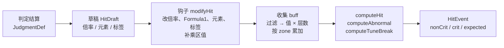

# 鸣潮 DPS 引擎 · TD-03 伤害公式规格 v0.1.3

> **状态**：v0.1.3（2026-10-04），已实现（`src/engine/formula.ts`）。v0.1.3 并回 golden 抽取按标记行与段名定位、20261003 版的对拍结果；v0.1.2 并回 M4：谐度破坏在仿真里按 §6 计算；v0.1.1 并回 M1 golden 抽取的实现与 M2 的面板常数，见附录
> **依据**：《技术总体设计 v0.1.1》（下称"总设计"）§4 T4 / T8 / T14、§6.6、§6.7、§6.9、附录 A-4 至 A-6；《设计文档 v0.2.9》（下称"机制设计"）§3、§3.1、4B；《TD-01 数据字典与抽取规格 v0.1》（下称"TD-01"）§4、§5、§11；《TD-02 类型与 Schema v0.1》（下称"TD-02"）§2、§5.1、§7
> **下游**：TD-04（结算放在 tick 的哪一步）、TD-06（异常叠层、谐度破坏何时触发、集谐层数）、TD-07（buff 库导入按 §9 落乘区）、TD-08（`modifyHit` 怎么写）、TD-10（`HitFactors` 怎么展示）
> **验证**：xlsx「伤害计算」页 3317 个公式格全部读懂；其中 3190 个伤害 / 治疗格按本文公式重算，Python 原型与 TypeScript 实现都与缓存值逐位一致；把全部分区格随机改写 20 轮（约 6.4 万次重算），除一处已知的取整位置差异外也全部一致（§1.2）

---

## 0. 范围与约定

**本文定**：直接伤害、异常效应伤害、谐度破坏与响应、治疗四个公式；乘区 ID 全表；一次结算怎么收集 buff、钩子在哪一步介入；xlsx 分区与乘区的对应；golden 的抽取方法与对拍标准。

**本文不定**：异常效应何时叠层、何时跳伤（TD-06）；谐度破坏何时触发、集谐的层数（TD-06）；buff 何时生效、怎么叠层（TD-07）；护盾与白条削减（TD-06）。

**约定**：

- 比例一律存小数；"乘区"指公式里一个独立相乘的因子，"乘区 ID"指代码里的键 `ZoneId`。
- 权威层级（总设计附录 A-6）：`base` 页公式文本（变量名）＞「伤害计算」页数组公式（实现）＞缓存值（golden）。文本与数组公式不一致时按数组公式，差异列在 §1.3。
- 乘法顺序照数组公式从左到右写。数学上顺序无关，但 CEILING 对最后一位很敏感，同样的顺序才能与缓存值逐位一致。

---

## 1. 来源与验证

### 1.1 游戏公式文本（`base` 页 E5–E7）

```text
CalculateHurt     = (Rate*RelatedAttr+ExtraEffect9+Formula1) * CritDamage
                    * min(2, 1/(TargetDef*(1-RoleIgnoreDefRate)/(800+Lv*8)+1))
                    * (1+DamageChange+DamageChangeElement+DamageChangeType)
                    * Res(TargetElementResistant-RoleIgnoreResistance)
                    * (1-TargetDamageReduce) * (1-TargetElementDamageReduce) * (1+SpecialDamageChange)
                    * (1+Class"0~9"DamageAmplifyOnHit) * (1+DamageAmplifyOnHit+DamageAmplifyOnBeHit)
CalculateHeal     = (Rate*RelatedAttr+Base) * (TargetHealedChange+RoleHealChange+1)
CalculateAbnormal = AbnormalDamage*AbnormalDamageRate * min(2, 1/(TargetDef*(1-RoleIgnoreDefRate)/(800+WorldBonusLv*8)+1))
                    * Res(…) * (1-min(TargetDamageReduce,1)) * (1-min(TargetElementDamageReduce,1))
                    * (1+max(SpecialDamageChange,-1)) * if(IsRole,1,0.3134)

Res(r) = r<=0 ? 1-r/2 : r<0.8 ? 1-r : 1/(1+r*5)
```

「伤害计算」页每个伤害格都是一条数组公式，把上面的变量展开成对「伤害配置」R1791 起分区网格的引用（§9）。例如 D5（散华普攻第一段，未暴击）：

```text
=CEILING(((INDEX(dmg!AH515:BA535, MATCH(散华&普攻第一段, …), MATCH(技能等级, …))*0.0001)*C3 +0 +0)
  *1 * MIN(2, 1/(FLOOR(U3,1)/(1+B2456)*(1-B1818)*(1+B2456-N1818)/(800+LEFT(C3,2)*8)+1))
  *(1+B1868) * IF(N1843<=0, 1-N1843/2, IF(N1843<0.8, 1-N1843, 1/(1+N1843*5)))
  *(1-MIN(B1893,1)) * (1-MIN(N1893,1)) * (1+I2150)
  *MAX((1+B1918)*…*(1+J1918), 0) * MAX((1+B2026)*…*(1+H2026), 0) * MAX((1+N2115), 0) * MAX(1+B2115, 0), 1)
```

（省略了表名；B1818 等都在「伤害配置」页。）

### 1.2 验证结果

| 检查 | 对象 | 结果 |
|---|---|---|
| 公式能否原样重算 | 「伤害计算」全部 3317 个公式格（R4–R1026 各列组的未暴击 / 暴击格 3216 个，R1039–R1106 异常表与谐度破坏表 101 个），用一个最小的公式解析器按缓存值重算 | 3315 格与缓存值全等；另 2 格是导航链接 |
| 本文公式（Python 原型） | 其中 3190 个伤害 / 治疗格：按 §10 拆出乘区，再按 §3–§7 重算 | 全等：直接伤害 2940、异常效应 173、谐度破坏与响应 30、治疗 47（M1 的正式抽取记为直接伤害 2939、治疗 48：鉴心"护盾回复生命值"J558 有治疗加成因子、dmg 里 CalculateType 为 1，按治疗算；总数不变） |
| 本文公式（TypeScript） | 同上 3190 格（§11 T03-9） | 全等 |
| 扰动对拍 | 随机改写被引用的分区格与汇总格共 2329 个、目标防御与各抗性，20 轮，每轮 3190 格；期望值由解析器按原数组公式重算 | 63800 次中 63637 次全等；其余 163 次都出在"减防后先取整"的公式变体上（§3.2 防御）：86 次只差 1（CEILING 进位不同），其余相对差不超过 0.05%。M1 的正式实现范围更大、全等更多，见 §10.3 |
| 未纳入 | 127 格 | 倍率显示格 94、引用别处的复制格 14、护盾 14、白条削减 3、导航 2 |
| 20261003 版（v0.1.3） | 3418 格：直接伤害 3163、异常效应 173、谐度破坏与响应 30、治疗 52（计算器换成清宵、100 级全息 6、谐破增幅 10） | 按本文公式重算全等；扰动对拍 3 轮 10254 次，全等 10252，其余 2 次是已知的"防御分母 ≤ 0" |

**为什么要扰动对拍**：缓存值只用了一套配置（秧秧·玄翎面板、全息 6 目标，TD-01 §11.1）。在这套配置里只有加成（0.12 / 0.2 / 0.32 / 0.72 / 0.92）、抗性 0.2、无视防御 0.12、0 类加深 0.36、暴伤 2.3 取了非零值，减防、减免、特殊加成、1–9 类加深、最终伤害都是 0——缓存值只证明了它们的中性值。扰动对拍把每个乘区和减免、防御的钳位分支都走到了。加深与最终伤害的"≥ 0"钳位不在扰动范围内（xlsx 对单独一类加深的写法与本文分组不同，只在出现低于 −100% 的加深时才有区别），由 §11 T03-3 单独覆盖。

### 1.3 与游戏公式文本的差异（按 xlsx）

| 项 | `base` 文本 | 数组公式 | 本文 |
|---|---|---|---|
| 减免 | `1 − x` | `1 − MIN(x, 1)` | 钳位，与异常公式一致 |
| 加深 | 0–9 类一个因子 + `(1 + OnHit + OnBeHit)` | 0 类单独一个因子；1–9 类连乘后 `MAX(…, 0)`；霜冻另有 1002 类 | 按数组公式；OnHit / OnBeHit 同类相加（§2.2） |
| 最终伤害 | 没有 | 0–6 类（骇破多一个 7 类）连乘后 `MAX(…, 0)`；1001 类单独一个因子 | 按数组公式，0–7 类一起连乘 |
| 异常：加深、最终伤害 | 没有 | 有 | 按数组公式 |
| 异常：防御里的等级 | `WorldBonusLv` | 角色等级 | 用 `rules.charLevel`（Q3） |
| 特殊伤害加成下限 | 只有异常有 `max(…, −1)` | 直接伤害没有 | 都取 `max(…, −1)`，只在 < −100% 时有区别 |
| 防御分母 ≤ 0 | —— | 会算出负数 | 取上限 2（只在减防超过约 195% 时出现） |

---

## 2. 乘区 ID 全表

乘区 ID 定义在 `src/data/common.ts`（TD-02 §2，本文改版见 §12.1）。加深与最终伤害的类别直接写进名字：`DamageAmplify3` = "3 类加深"，`FinalDamage6` = "6 类最终伤害"。buff 只写 `zone`，不再另带类别字段。

### 2.1 面板类（12 个）

面板类先与静态面板 `StaticPanel` 相加，得到属性值和暴击参数。buff 里的面板类值在每次结算时实时相加（总设计 T14），不需要重算面板。

| ID | 含义 | 用在 | 说明 |
|---|---|---|---|
| `hpPct` / `hpFlat` | 生命% / 生命 | 属性合成 | `floor(基础 × (1 + Σ%)) + Σ固定` |
| `atkPct` / `atkFlat` | 攻击% / 攻击 | 同上 | |
| `defPct` / `defFlat` | 防御% / 防御 | 同上 | |
| `critRate` | 暴击率 | 期望加权 | 钳到 [0, `critRateCap`] |
| `critDamage` | 暴击伤害 | 暴击分支 | 角色基础 1.5；可带过滤（"普攻暴击伤害提升"） |
| `energyRegen` | 共鸣效率 | 能量（TD-06）；RelatedProperty 11 | |
| `healBonus` | 治疗效果加成 | 治疗 | |
| `tunabilityRate` | 偏谐效率 | 偏谐值（TD-06） | |
| `harmonyBreakBoost` | 谐度破坏增幅 | 谐度破坏、集谐（TD-06） | 单位是"点"：面板上的 20 就写 20，公式里 × 0.01 |

### 2.2 公式类（33 个）

| ID | 进公式的方式 | 取值约定 | xlsx 汇总来源（§9） | 游戏属性号 |
|---|---|---|---|---|
| `RateBonus` | Rate × (1 + Σ) | 倍率按比例提升 | 无（xlsx 换用另一条 dmg 行，见 §3.2） | |
| `ExtraEffect9` | 基础项 + Σ | 固定附加伤害 | 附加伤害 E9 | |
| `DamageChange` | 加成：1 + 三者之和 | 通用伤害加成 | 基础伤害加成、造成伤害 15、EE1 | 15 |
| `DamageChangeElement` | 同上 | 配 `filter.elements` | 各元素加成、全属伤、物理加成 | |
| `DamageChangeType` | 同上 | 配 `filter.tags` | 普攻 / 重击 / 技伤 / 大招 / 变奏 / 延奏 / 声骸加成 | |
| `RoleIgnoreDefRate` | 有效防御 × (1 − Σ) | 无视防御，正数 | 目标防御 99、防御无视 99 | 99 |
| `TargetDefRate` | 有效防御 × (1 + Σ) | 目标防御 ±%，减防写负数 | 目标防御 10、防御无视 10（取负）、目标防御提升 | 10 |
| `RoleIgnoreResistance` | 抗性 r − Σ | 无视抗性 | 目标抗性无视、各元素抗无视 | |
| `TargetElementResistant` | 抗性 r + Σ | 减抗写负数 | 目标抗性 | |
| `TargetDamageReduce` | × (1 − min(Σ, 1)) | 负数 = 目标受到的伤害提高 | 目标伤害减免 16、各元素 / 类型减免、谐破 / 震谐 / 骇破减免 | 16 |
| `TargetElementDamageReduce` | × (1 − min(Σ, 1))，另一个独立因子 | 同上 | 目标伤害减免 DRE | |
| `SpecialDamageChange` | × (1 + max(Σ, −1)) | 独立乘区 | 特殊伤害加成 | |
| `DamageAmplify0` | × max(1 + Σ, 0) | 不带类别的"X 伤害加深" | 加深（延奏…）、目标加深 38、X 效应加深 | 37 / 38 |
| `DamageAmplify1` … `DamageAmplify9` | × max(Π(1 + Σₖ), 0) | "N 类加深" | k 类加深、k 类加深暴击 | 37 / 38 |
| `DamageAmplify1002` | × max(1 + Σ, 0) | 霜冻专用一类 | 霜冻 1002 类 | |
| `FinalDamage0` … `FinalDamage7` | × max(Π(1 + Σₖ), 0) | "N 类最终伤害" | 最终伤害 127 / 128（`C[0]k`） | 127 / 128 |
| `FinalDamage1001` | × max(1 + Σ, 0) | 集谐响应等 | 最终伤害 105（`…集谐响应1001`）、最终伤害 1001 | 105 |
| `TargetHealedChange` | 治疗 × (1 + … + Σ) | 目标受治疗加成 | 目标受治疗 36 | 36 |

"游戏属性号"是 xlsx 分节标题里的数字（`造成伤害15`、`目标防御10`、`目标加深38`…），对应游戏内的属性 ID，只作核对用。

### 2.3 写 buff 时怎么选乘区（给 TD-07）

- "X 伤害加成"：`DamageChange` / `DamageChangeElement` / `DamageChangeType` 三者相加，选哪个只影响报表分类；有元素限定就选 Element，有类型限定就选 Type。
- "X 伤害加深"：原文不带"N 类"的是 `DamageAmplify0`，带"N 类加深"的是 `DamageAmplifyN`。延奏 buff 大多是 0 类（散华延奏"普攻伤害加深 38%"）。
- "N 类最终伤害"：`FinalDamageN`。
- "无视 X% 防御"：`RoleIgnoreDefRate`；"目标防御降低 X%"：`TargetDefRate` 写 −X，挂在目标上（`target: 'enemy'`）。
- "无视 X% 某抗性"：`RoleIgnoreResistance`；"降低目标某抗性 X%"：`TargetElementResistant` 写 −X。
- 攻击方加深（OnHit，属性 37）与目标方加深（OnBeHit，38）不分乘区：挂在目标身上的加深 buff 就是 OnBeHit，同类相加。
- 只在暴击时生效的效果：`filter.critOnly`（§3.3）。

---

## 3. 直接伤害 `computeHit`

### 3.1 公式

```text
属性  = floor(基础 × (1 + 面板% + buff%)) + 面板固定 + buff 固定                  RelatedProperty 选攻 / 血 / 防 / 共鸣效率
基础  = Rate × (1 + RateBonus) × 属性 + ExtraEffect9 + Formula1

伤害 = CEILING(
    基础
  × 暴击系数                                   非暴击 1；暴击 = critDamage（面板 + buff）
  × 防御系数                                   min(2, 1 / (有效防御 / (800 + 8·Lv) + 1))
                                               有效防御 = 目标防御 × (1 + TargetDefRate) × (1 − RoleIgnoreDefRate)
  × (1 + DamageChange + DamageChangeElement + DamageChangeType)
  × 抗性系数                                   Res(目标抗性 + TargetElementResistant − RoleIgnoreResistance)
  × (1 − min(TargetDamageReduce, 1)) × (1 − min(TargetElementDamageReduce, 1))
  × (1 + max(SpecialDamageChange, −1))
  × max(Π_{k=1..9} (1 + DamageAmplify_k), 0)
  × max(Π_{k=0..7} (1 + FinalDamage_k), 0) × max(1 + FinalDamage1001, 0)
  × max(1 + DamageAmplify0, 0) × max(1 + DamageAmplify1002, 0) )
```

### 3.2 各项细则

**属性**

- RelatedProperty（dmg `Damage.RelatedProperty`）：7 → `atk`，2 → `hp`，10 → `def`，11 → `energyRegen`（布兰特的治疗，关闭 TD-01 Q13）。
- 合成照 xlsx「伤害配置」R2147：`floor((角色基础 + 武器基础) × (1 + Σ%)) + Σ固定`。静态面板存 `{ base, pct, flat }`（TD-02 §7），结算时再加 buff 的 `atkPct` / `atkFlat`。
- 共鸣效率按游戏内单位参与：属性值 = 共鸣效率 × 10000。倍率 × 它 = dmg 原始倍率 × 共鸣效率。例：布兰特"直到世界尽头"RateLv_10 = 332、CureBaseValue_10 = 950、共鸣效率 120%：332 × 1.2 + 950 = 1348.4 → 1349（伤害计算 J204）。

**Rate、RateBonus 与 Formula1**

- Rate = `JudgmentDef.multiplier`（TD-01 §4.3 选好的倍率列），钩子可改 `HitDraft.multiplier`。
- 游戏里的"倍率提升"多数是换一条 dmg 行：绯雪"归刃"按层数取"3 层 / 2 层 / 1 层"行、嘉贝莉娜"强化"、千咲"电锯强化"、达妮娅"虚质粒子"都在 dmg 里有单独的行，xlsx 用 `IF(状态, "强化", "")` 拼 MATCH 键来切换。所以优先在钩子里换倍率；`RateBonus` 只留给文本写明"按比例提升倍率"、又没有单独 dmg 行的效果（Q6）。
- `Formula1`：dmg `FormulaType = 1` 的 112 行（椿等）。xlsx 的写法是 `FormulaParam5 × N × 属性`，N 是角色状态（椿的"含苞"层数），或 0 / 1 的开关。由钩子算好写进 `HitDraft.extraFlat`；`JudgmentDef.formula.rate` 给出 FormulaParam5（已按技能等级取值并 × 0.0001）。`FormulaType = 9` 是异常效应行（走 §5）。3 / 6 / 7 共 21 行，多数是按生命百分比的治疗与扣血；其中 11 行是倍率为 0 的伤害行（洛可可延奏、嘉贝莉娜"地狱穿行"、陆·赫斯飞刃、千咲 C1 固定伤害、天气落雷等），参数含义未解，按倍率 0 处理、由角色钩子补（Q13）。TD-01 Q21 据此关闭。
- `ExtraEffect9`：固定附加伤害，xlsx"附加伤害 E9"分节（渊武雷柱等）。

**防御**

- 目标防御 = `EnemyPreset.def`（已取整；全息 6 · 90 级为 1593）。
- Lv = `rules.charLevel`（90），即出伤者等级；xlsx 为 `LEFT(伤害配置!C3, 2)`。
- 无减防时 90 级打 1593 防：1520 / (1520 + 1593) = 0.48827；无视 12% 防御：1520 / (1520 + 1593 × 0.88) = 0.52022。
- 系数只有在减防超过 100%（有效防御为负）时才大于 1，到上限 2 要减防约 148%；分母 ≤ 0 时（减防超过约 195%）xlsx 会算出负数，本文取上限。
- **取整位置**：xlsx 多数公式是 `FLOOR(U3) / (1 + B2456) × (1 − 无视) × (1 + B2456 − 减防)`（U3 是已含目标防御提升的防御），不对减防后的防御取整；物理伤害（旧椿）、谐度破坏与响应的公式是 `FLOOR(U3 × (1 + B2456 − 减防) / (1 + B2456)) × (1 − 无视)`，先取整。本文统一不取整（多数写法）。只有减防不为 0 时才有区别：扰动对拍中这类差异一半只差 1，其余相对差不超过 0.05%（Q1）。

**加成、抗性、减免、特殊**

- 加成：三个乘区相加后 + 1。全属性伤害加成只加到六个元素，不含物理（TD-02 `STAT_TO_ZONE`）。
- 抗性：r = 目标该元素抗性 + `TargetElementResistant` − `RoleIgnoreResistance`；r ≤ 0 收益减半，0.8 本身属于高抗段（1 / (1 + 5 × 0.8) = 0.2，与 1 − 0.8 恰好相等，分段连续）。物理伤害用物理抗性。
- 减免：两个独立因子，各自钳到 ≤ 1（减免超过 100% 时伤害为 0）；负数表示目标受到的伤害提高。
- 特殊伤害加成：独立一项。xlsx 对这一槽的备注是"非 0 类 37 加深冗余"：个别本该是加深的 buff 借用了这一槽，导入 buff 库时按原文判断（Q12）。

**加深与最终伤害**

- 同一类内相加，类与类之间相乘。0 类、1002 类、1001 类各自单独一个因子；1–9 类加深、0–7 类最终伤害各自先连乘再钳到 ≥ 0，与数组公式的分组一致。
- 1002 类只在霜冻相关的伤害上出现（xlsx"霜冻 1002 类"）；7 类最终伤害目前只在骇破响应的公式里出现（xlsx `C[0]7`）。其他伤害上这两类为 0，一起算不影响结果。

**取整**

- 非暴击、暴击两个分支各自 CEILING 到整数（与缓存值一致）；期望值不取整，只用于累计。

- **角色的基础暴击、暴伤、共鸣效率**（v0.1.1）：全员相同，是 xlsx 的常数——暴击 5%（伤害配置 B2196 = 500 × 0.0001）、暴伤 150%（B2204）、共鸣效率 100%（B2218）。实现写在 `src/engine/resolve.ts` 的 `CHAR_BASE`，静态面板从它起算（总设计 §3.3 第 2 步）。

### 3.3 暴击两支

- 非暴击分支：暴击系数 1，只用 `acc.zones`。
- 暴击分支：暴击系数 = 面板暴伤 + `zones.critDamage` + `critOnly.critDamage`；其余乘区用 `zones + critOnly`。
- 暴击率 p = clamp(面板暴击率 + `zones.critRate`, 0, `critRateCap`)；期望 = (1 − p) × 非暴击 + p × 暴击（总设计 T4）。
- xlsx 的"暴击专属平行行"与非暴击行逐格比对后只差两处：1–9 类加深各多一项"k 类加深暴击"，目标伤害减免多一项"C暴伤"。这两类就是 `filter.critOnly: true` 的 buff。按类型、元素区分的暴伤（xlsx"C普攻暴伤""C冰暴伤"）用 `critDamage` 加 `filter` 表达，不需要 critOnly。

### 3.4 元素与伤害标签

- 判定的元素与标签来自 dmg（`Damage.Element`、`Damage.Type`，TD-01 §4.2），存在 `JudgmentDef.element` / `tags`。
- 有的角色会按状态改变伤害类型：洛瑟菈"共鸣模态"下伤害按声骸技能计，椿的固有技能让重击按普攻计。xlsx 用 `IF(状态, 一组分区, 另一组分区)` 切换整组乘区；本文由钩子在收集 buff 之前改 `HitDraft.tags` / `element`（§4）。
- 物理伤害（旧椿等）：元素为物理，吃物理加成与物理抗性。

---

## 4. 一次结算：收集 buff 与钩子



1. **草稿**：`HitDraft` = { 倍率 = `judgment.multiplier`，`extraFlat` = 0，元素、标签取自判定，异常效应自身的伤害带 `effect`，`zones` / `critOnly` 为空 }（TD-02 §7，本文改版）。
2. **钩子**：`modifyHit(ctx, draft)` 在收集之前调用。可以改倍率、`extraFlat`（Formula1）、元素、标签，也可以直接往 `draft.zones` / `draft.critOnly` 里补值——需要"读累加结果再改"的写法都改成"算好增量直接补"。
3. **收集**：引擎给出对本次结算有效的 buff 实例（挂在出伤者身上的，或挂在目标身上的；按作用对象筛选归 TD-07），逐个判断过滤条件，按 `zone` 累加 `value × stacks`；`critOnly` 的进暴击专属桶；最后并入钩子补的值。
4. **计算**：按伤害种类调 `computeHit` / `computeAbnormal` / `computeTuneBreak` / `computeHeal`。四个都是纯函数（§8）。
5. **记录**：`HitEvent.dmg = { nonCrit, crit, expected }`，`factors` 可选写入（TD-10 决定默认开不开）。

**过滤规则**（`BuffFilter`，TD-02 §5.1，本文新增 `effects`）：字段之间是"且"，同一字段的多个值是"或"，没写的字段不限制。

| 字段 | 含义 |
|---|---|
| `elements` | 伤害元素 |
| `tags` | 伤害标签（普攻、重击、异常效应、谐度破坏…） |
| `actions` / `judgments` | 只对某些动作 / 判定 |
| `enemyEffect` | 目标身上当前有该效应（"对处于光噪效应的目标造成的伤害"） |
| `effects` | 这次伤害就是该效应自身的伤害（"光噪效应伤害加深"） |
| `critOnly` | 只进暴击分支 |

**异常效应伤害的防御例外**：xlsx 在异常的防御系数里用两格"对异常补偿"把出伤者身上的"防御无视 10 / 99"全部抵消，只留深塔（场景）减防和挂在目标身上的减防（虚湮每层 −2%、露西骇入 −10%，在"目标防御提升"格里）。所以结算异常效应伤害时，`RoleIgnoreDefRate` / `TargetDefRate` 两个乘区只收：挂在目标身上的 buff（`target: 'enemy'`）、场景 buff、`filter.tags` 显式包含"异常效应"的 buff（Q2）。

**为什么钩子放在收集之前**：钩子改的元素、标签决定吃哪些 buff，放在后面就改不了。代价是钩子看不到 buff 合计；目前只发现丽贝卡 C6 需要"把已有加成再放大"（xlsx `(加成) × (1 + x) + x`），做到丽贝卡时再议（Q5）。钩子仍是四个（总设计 T8），只是 `modifyHit` 的时机与签名变了（§12.3）。

---

## 5. 异常效应伤害 `computeAbnormal`

```text
异常伤害 = CEILING(
    异常基础值[Lv] × 层数倍率
  × 防御系数 × 抗性系数(效应元素)
  × (1 − min(TargetDamageReduce, 1)) × (1 − min(TargetElementDamageReduce, 1))
  × (1 + max(SpecialDamageChange, −1))
  × max(Π 1–9 类加深, 0) × max(Π 0–7 类最终伤害, 0) × max(1 + FinalDamage1001, 0)
  × max(1 + DamageAmplify0, 0) × max(1 + DamageAmplify1002, 0) )
```

- 不暴击；不吃伤害加成（三个 `DamageChange*`）；不吃 `RateBonus`。
- 异常基础值：`base` 页 AN 列 `AbnomalDamage`，按 AM 列等级（按表头名找，20261003 版右移一列，TD-01 §1.9），90 级 3674；存为 `GameData.abnormalBaseByLevel`，下标 = 等级 − 1。
- 层数倍率：dmg"异常伤害"行 `RateLv_k` = k 层（TD-01 §4.3），即 `EffectDef.multipliers[k − 1]`。
- 元素：效应所属元素（光噪 → 衍射、风蚀 → 气动、霜渐 / 霜冻 → 冷凝、聚爆 → 热熔、电磁 → 导电、虚湮 → 湮灭），抗性用该元素。
- 加深与最终伤害：xlsx 为异常效应另设了"SS 光噪""SS 霜渐"等分区行，"光噪效应伤害加深"一类 buff 进 0 类加深。本文用 `filter.effects` 表达，不另设乘区。
- 防御例外见 §4。
- 游戏公式里"对角色的异常伤害 × 0.3134"不建模（只算打敌人）。
- 例（伤害计算 E1040，光噪 1 层）：3674 × 0.3 = 1102.2；× 0.48827 × 0.8 = 430.5 → 431。

---

## 6. 谐度破坏与响应 `computeTuneBreak`

```text
基础值     = ROUND(WeaknessDamageBaseValue[Lv] × Minus[COST] × MinusRatio[COST], 2)
谐度破坏   = CEILING(
    基础值 × Rate
  × 防御系数 × 抗性系数
  × (1 − min(TargetDamageReduce, 1)) × (1 − min(TargetElementDamageReduce, 1))
  × (1 + 谐破增幅 × 0.01)
  × max(Π 0–7 类最终伤害, 0)
  × [目标未失谐时 × (1 − 0.9999)] )
```

- **基础值**：`base` 页 AO 列 `WeaknessDamageBaseValue`（按表头名找，20261003 版在 AP；按 AM 列等级取**角色**等级——xlsx 公式用「伤害配置」C3 的角色等级，v0.1.2 写明；90 级 3865000）× T 列 × U 列（按敌人 COST 取 R56–R58 行）。COST 1 / 3 / 4 的系数为 0.000185300 / 0.000555921 / 0.002594308，90 级基础值为 716.19 / 2148.64 / 10027。存为 `TuneBreakTable.baseByLevel`（下标 = 等级 − 1）与 `costFactor`。
- **Rate**：谐度破坏取 dmg `通用`"谐度破坏-<武器>"行的 `RateLv_1`（TD-01 §4.3；长刃三段 1.7334 / 2.2666 / 12，迅刀两段 1 × 4 次 / 12，佩枪、臂铠、音感仪 16）；震谐响应、骇破响应取角色自己的响应行（按技能等级列）。
- **元素**：谐度破坏行的 `Damage.Element` = 0，按物理抗性算；响应按行上的元素。
- 不暴击；不吃伤害加成、特殊加成与加深——数组公式里就没有这些项。
- **谐破增幅**：xlsx"破弱增幅"格已 × 0.01；本文 `harmonyBreakBoost` 存点数，公式里 × 0.01。
- **目标未失谐**：只有谐度破坏有这一项（`base!B7` = 0.9999），响应没有。TD-06 §13.3 定：消耗这次失谐的谐度破坏（开始时目标失谐）各段都按对失谐算，否则 × 0.0001。
- **仿真里**（v0.1.2）：结算带"谐度破坏"标签的判定时按 `computeTuneBreak` 算（不再记 0）：基础值 `tuneBase(GameData.tuneBreak, rules.charLevel, 敌人 COST)`，倍率取判定的 `multiplier`（通用块变体，TD-01 §11.3），抗性取物理，谐破增幅 = 面板 + buff，不暴击（两支相同）。迅刀第一段的 4 次结算由判定的 `ticks` 表达（TD-01 §13.2）。震谐 / 骇破响应、异常效应仍记 0 并提示。
- **集谐响应**（总设计 §6.7"谐破增幅 × 0.12% × 层数"）落在 `FinalDamage1001`（xlsx"C琳奈集谐响应1001"等四格加在 1001 类最终伤害上）。层数与数值由 TD-06 定。
- 例（伤害计算 E1098 / F1098，对 COST 4 通用）：10027 × 16 = 160432；× 0.48827 × 0.8 = 62668（对常态 × 0.0001 → 7）。

---

## 7. 治疗 `computeHeal`

```text
治疗 = CEILING((Rate × 属性 + CureBase) × (1 + healBonus + TargetHealedChange))
```

- `CureBase`：dmg `CureBaseValue_k`（M–AF 列），按同一技能等级取值，存为 `JudgmentDef.cureBase`。
- 不暴击。47 个治疗格全等。
- 治疗不影响 DPS：M1 只实现函数，等有 buff 依赖治疗量时再接进结算。护盾（14 格）不做。

---

## 8. 代码 `src/engine/formula.ts`

v0.1.1 起本文不再内嵌代码，以仓库为准。全部是纯函数，不读任何全局状态；乘法顺序照 xlsx 数组公式从左到右写。导出：

| 名字 | 作用 |
|---|---|
| `computeHit(ctx, acc, rules)` | 直接伤害：非暴击 / 暴击两支与期望（§3） |
| `computeAbnormal`、`computeTuneBreak`、`computeHeal` | 异常效应（§5）、谐度破坏与响应（§6）、治疗（§7） |
| `accumulate(view, active, draft)`、`hitView`、`matchesFilter` | 一次结算收集 buff（§4）；标记型 buff（没有乘区）跳过（TD-07 §7） |
| `composeStat`、`relatedAttrValue`、`defFactor`、`resFactor` | 各因子（§3.2） |
| `emptyZones`、`emptyAccumulator` | 乘区累加器 |

## 9. xlsx 映射

本节的行号、列字母是 20260707 版的位置。构建与 golden 按标记行、段名与表头定位（v0.1.3，TD-01 §1.9）：20261003 版「伤害计算」第 1027 行起下移 88 行，「伤害配置」计算区 `def` 到 `面板` 下移 117 行、`F自定义面板` 起下移 119 行。

### 9.1 「伤害计算」页

- **R3 上下文**：B–O 是出伤者面板（生命、攻击、防御、暴击、暴伤、共鸣效率、普攻 / 重击 / 技伤 / 大招加成、元素加成、伤害加成、偏谐效率、谐破增幅），P–AD 是目标（类型、名称、等级、生命、攻击、防御、冰 / 火 / 雷 / 风 / 光 / 暗 / 物七项抗性、共振度、偏谐值）。本版为秧秧·玄翎面板（攻击 1928、暴伤 2.3）打全息 6 · 90 级（防御 1593、各抗 20%）。
- **R4–R1026**：各角色的 golden 条目，列组起点 B / H / N / T / Z，未暴击、暴击值在起点 +2 / +3 列（TD-01 §11.1）。
- **R1039–R1090**：异常效应逐层表（倍率、伤害）；**R1095–R1106**：谐度破坏表（对失谐、对常态）。

### 9.2 「伤害配置」分区网格（R1791–R2142）

每个分区是"代码行 + 数值行"成对排列。代码 = 元素字（冰 火 雷 风 光 暗 物）+ 类型字母（A 普攻、H 重击、E 共鸣技能、U 共鸣解放、I 变奏、O 延奏、P 声骸技能）+ 类别数字 + 暴击 `C`，如 `冰AC3` = 冷凝普攻暴击分支的 3 类加深。`W12` = 震谐响应（Damage.Type 12）、`W14` = 骇破响应、`W13` 推定为 Damage.Type 13（dmg 无数据，Q8）。"SS X" = X 效应自身的伤害，"ADD X非SS" = 按 X 效应相关规则取乘区的技能伤害（Q11）。

| 行段 | xlsx 标签 | 左半（B–L 列） | 右半（M / N–X 列） | 行的组织 |
|---|---|---|---|---|
| R1791–R1815 | Calc | 防御系数（已算好） | 抗性系数（已算好） | 6 元素 × 2 组；第二组原为暴击行，多被借作物理、谐破、震谐、骇破、SS 异常 |
| R1816–R1840 | def99 / def10 | `RoleIgnoreDefRate` 合计 | 防御无视 10 合计（= −`TargetDefRate`） | 6 元素 × 非暴击 / 暴击 |
| R1841–R1865 | res_u | —— | 净抗性 r | 同上 |
| R1866–R1890 | dmgchg / dmgcrit | 加成合计 | 暴伤合计 | 同上 |
| R1891–R1915 | dmgrd / dmgrd_e | `TargetDamageReduce` 合计 | `TargetElementDamageReduce` 合计 | 同上；暴击行多一项"C暴伤" |
| R1916–R2023 | dmgampl1-9 | 1–9 类加深（每元素 9 列） | | 元素 × 类型，各有暴击行；另有 ADD / SS 异常行 |
| R2024–R2112 | dmgpost0_6 | 0–6 类最终伤害（每元素 7 列） | | 同上，另有 W12 / W13 / W14、物理、ADD / SS 异常行 |
| R2113–R2137 | dmgampl0 / dmgpost(1001) | 0 类加深 | 1001 类最终伤害 | 6 元素 × 非暴击 / 暴击 |
| R2138–R2142 | dmgamplxxxx | 霜冻 1002 类（ADD霜冻非SS、SS霜冻） | | |

标签里的"(37&38)""(127&128)"是游戏属性号：加深 = 攻击方 37 + 目标方 38，最终伤害 = 127 + 128，两方同类相加。

### 9.3 汇总格 → 乘区

网格里每一格都是下面这些汇总格的和（再加个别角色专属格，见 9.4）。

| 汇总格 | xlsx 标签 | 乘区 |
|---|---|---|
| B–D 2148 | 生命 / 攻击 / 防御 | 面板合成：`floor(基础 × (1 + %)) + 固定` |
| E / F / G 2148 | 暴击 / 暴伤 / 共鸣效率 | `critRate` / `critDamage` / `energyRegen` |
| H–K、T–V 2148 | 普攻 / 重击 / 技伤 / 大招 / 变奏 / 延奏 / 声骸加成 | `DamageChangeType` |
| L–R 2148 | 物理 / 冷凝 … 湮灭加成（全属伤已并入六元素） | `DamageChangeElement` |
| W 2148、B–H 2168 | 基础伤害加成、EE1（通用 / 各元素） | `DamageChange`（EE1 的元素列 → `DamageChangeElement`） |
| S 2148 | 治疗加成 | `healBonus` |
| B–H、S–Y 2150；D–F、H 2162 | 目标伤害减免：通用、各元素、各类型、物伤、谐破、震谐、骇破 | `TargetDamageReduce` |
| B–H 2166 | DRE 目标 X 伤减免 | `TargetElementDamageReduce` |
| I 2150 | 特殊伤害加成 | `SpecialDamageChange` |
| J 2150、2152 行 | 防御无视 10（通用 / 各类型 / 各元素） | `TargetDefRate`（取负） |
| B 2456 | 目标防御提升（含虚湮 −2% / 层、露西骇入 −10%、深塔、自定义） | `TargetDefRate` |
| R 2150、2154 行 | 防御无视 99（通用 / 各类型 / 各元素） | `RoleIgnoreDefRate` |
| K–P 2150、G 2162 | 各元素抗无视、物抗无视 | `RoleIgnoreResistance` |
| 「伤害计算」V3–AB3 | 目标七项抗性（已含"目标抗性"分节的增减） | `EnemyPreset.res` + `TargetElementResistant` |
| Q 2150 | 目标受治疗加成 | `TargetHealedChange` |
| 2156 行、B 2158 | X 效应加深、目标受 X 加深、对异常加深 | `DamageAmplify0`（配 `effects` 或 `enemyEffect`） |
| H / I 2160 | 对异常补偿 | 异常防御例外（§4） |
| B / C 2162 | 破弱效率 / 破弱增幅 | `tunabilityRate` / `harmonyBreakBoost`（xlsx 已 × 0.01） |
| B 2164 | 最终伤害 1001 | `FinalDamage1001` |

### 9.4 buff 分节（R2170–R2664）→ 乘区

A 列是分节标题，行里每格是一个来源（角色基础、武器、声骸、深塔、自定义、角色专属"C…"格）。TD-07 导入 buff 库时按这张表落乘区。

| 分节 | 乘区 |
|---|---|
| 生命、攻击、防御、暴击、暴伤、共鸣效率、治疗 35 | 面板类 |
| 普攻、重击、E、大招、变奏、延奏、声骸 | `DamageChangeType` |
| 全属伤、冰 … 暗、物理 | `DamageChangeElement` |
| 附加伤害 E9 | `ExtraEffect9` |
| 造成伤害 15 | `DamageChange` |
| 伤害减免 16 | 不参与（这是角色自己受到伤害的减免） |
| 加深 | `DamageAmplify0`（延奏 X、X 效应加深、对 X 效应加深…）；"k 类加深"一行 → `DamageAmplifyk`；"k 类加深暴击" → 同上 + `critOnly` |
| 目标抗性 / 目标抗性无视 | `TargetElementResistant` / `RoleIgnoreResistance` |
| 目标防御 10 / 目标防御 99 | `TargetDefRate`（取负）/ `RoleIgnoreDefRate` |
| 目标伤害减免 16 / 目标伤害减免 DRE | `TargetDamageReduce`（"C暴伤" → `critOnly`）/ `TargetElementDamageReduce` |
| 目标受治疗 36 | `TargetHealedChange` |
| 目标加深 38 | `DamageAmplify0`，挂在目标上 |
| 破弱效率 / 破弱增幅 | `tunabilityRate` / `harmonyBreakBoost` |
| 最终伤害 105 | `FinalDamage1001` |
| 最终伤害 127 / 128（`C[0]k`、`C冰伤[0]k`…） | `FinalDamagek`（127 攻击方、128 目标方） |
| 韧性 88 / 44、护盾、聚爆效应 121 | 不参与伤害公式（TD-06） |

---

## 10. golden 抽取（M1 构建脚本）

产出 `data/fixtures/golden-zones.json`：每个标准答案格拆成的乘区输入与缓存值。M1 的公式测试逐条喂给 §8 的函数，要求逐位一致。它与 TD-01 的 `golden-damage.json` 互补：后者按 (角色, 条目名) 回连动作表，给 M2 起的整链路测试用。

### 10.1 流程

1. 读「伤害计算」角色块（到 A 列"其他"的上一行；20260707 版 R4–R1026）各列组的未暴击 / 暴击格，以及两张表（从 B 列"光噪效应（对目标）"起到谐度破坏表末行；20260707 版 R1039–R1106）里以 `CEILING` 开头的格；同时读这些公式引用到的「伤害配置」「伤害计算」「dmg」「base」「prop」各格的缓存值。
2. 解析公式。只需支持这些：数字、字符串、单元格与区域引用（可带表名）、`+ - * / & = < > <= >= <>`、括号，函数 `CEILING FLOOR ROUND MIN MAX SUM IF AND OR INDEX MATCH LEFT REGEXEXTRACT`；`MATCH` 的第二参数可能是两个区域的逐项拼接（`A:A&C:C`），要按数组算。
3. 取 `CEILING` 的第一个参数，按乘号拆成因子（含倍率 `INDEX` 的括号整体算基础项，不再拆）；按 10.2 归类。遇到非抗性的 `IF(条件, A, B)`（洛瑟菈、椿按状态切换整组分区）先算条件，再拆选中的分支。
4. 每个因子用解析器算出数值，记进 `z`；基础项另记倍率 `MATCH` 的键与 RateLv 原值，便于回连 dmg。
5. 用 §3–§7 的公式重算：与缓存值不等、或出现未归类因子（`other`）的格写进构建报告。
6. 用 `GoldenZonesSchema` 校验后写出。

### 10.2 因子归类

表里写的「伤害配置」行号是 20260707 版的；归类时按所在段的段名（A 列 `def`、`dmgchg`、`dmgampl1-9(37&38)`、`dmgpost0_6(127&128)`、`dmgampl0(37&38)`、`dmgamplxxxx(37&38)`、`面板`、`聚爆效应121`）平移到这份 xlsx 的行（v0.1.3）。基础项按引用的 `base` 列的表头名分谐度破坏（`WeaknessDamageBaseValue`）与异常效应（`AbnomalDamage`），不按列字母——20261003 版插列后 AO 变成了异常效应基础值，按字母会把两类判反。

| 因子形状 | 记为 |
|---|---|
| 第一个含 `dmg!` / `base!` 表 `INDEX` 的因子 | `base` |
| 紧跟基础项的数字 1 | `crit = 1`（非暴击） |
| 引用暴伤格（网格 R1867–R1890 右半，或面板暴伤 F2148）的和 | `crit` |
| `MIN(2, 1/(…))` | `def`：`targetDef` = FLOOR(U3) / (1 + B2456)；`defRate` = 形如 `(1 + B2456 − …)` 的括号 − 1；`ignore` = 1 − 形如 `(1 − …)` 的括号；`level` = `LEFT(C3, 2)` |
| 引用 R1792–R1815 左半的格 | `def`（解析那一格自己的公式） |
| `IF(r <= 0, …)`，或引用 R1792–R1815 右半的格 | `res = r` |
| `(1 − MIN(x, 1))` | 第一个 `dr`，第二个 `dre` |
| `MAX(9 项连乘, 0)` / `MAX(7 或 8 项连乘, 0)` | `amp[1–9]` / `fin[0–7]` |
| `MAX(1 + x, 0)` | x 在 R1917–R2023 → 对应类别加深；R2025–R2112 → 对应类别最终伤害；R2114–R2137 右半或 B2164 → `fin1001`；其他 → `amp0` |
| 引用 R2139–R2142 | `amp1002` |
| `(1 + …)` | 含 I2150 → `special`；含 C2162 → `breakBoost`；含 S2148 / Q2150 → `heal`；含 B2164 → `fin1001`；其他 → `bonus` |
| `(1 − base!B7)` | `vsNormal` |

`golden-zones.json` 的 schema（加在 `generated.schema.ts`）：

```ts
const Num = z.number().finite()
export const GoldenZoneSchema = z.strictObject({
  cell: z.string(),                                     // '伤害计算' 页单元格，如 'D5'
  name: z.string(),
  branch: z.enum(['nc', 'cr']),                         // 非暴击 / 暴击
  formula: z.enum(['hurt', 'abnormal', 'tune', 'heal']),
  expected: z.number(),                                 // 缓存值
  key: z.string().optional(),                           // 倍率 MATCH 用的键（charaId & DmgCalc），用于回连 dmg
  rate: z.number().optional(),                          // dmg RateLv 原值（× 10000）
  table: z.string().optional(),                         // 倍率所在表列：'dmg!AH'、'base!AN'…
  defRef: z.string().optional(), resRef: z.string().optional(),   // 引用了预先算好的防御 / 抗性系数格
  z: z.strictObject({
    base: Num, crit: Num.optional(),
    def: z.strictObject({ targetDef: Num, defRate: Num, ignore: Num, level: Num }).optional(),
    bonus: Num.optional(), res: Num.optional(), dr: Num.optional(), dre: Num.optional(), special: Num.optional(),
    amp0: Num.optional(), amp: z.array(Num).length(9).optional(), amp1002: Num.optional(),
    fin: z.array(Num).length(8).optional(), fin1001: Num.optional(),
    heal: Num.optional(), breakBoost: Num.optional(), vsNormal: z.literal(true).optional(),
    other: Num.optional(),                              // 未归类因子之积；出现即说明公式有新形状，构建报告会列出
  }),
})
export const GoldenZonesSchema = z.array(GoldenZoneSchema)
```

例（D5）：

```json
{ "cell": "D5", "name": "普攻第一段", "branch": "nc", "formula": "hurt", "expected": 485,
  "key": "散华普攻第一段", "rate": 4871, "table": "dmg!AH",
  "z": { "base": 939.1288, "crit": 1, "def": { "targetDef": 1593, "defRate": 0, "ignore": 0, "level": 90 },
         "bonus": 0.32, "res": 0.2, "dr": 0, "dre": 0, "special": 0,
         "amp": [0, 0, 0, 0, 0, 0, 0, 0, 0], "fin": [0, 0, 0, 0, 0, 0, 0, 0], "fin1001": 0, "amp0": 0 } }
```

### 10.3 局限与扰动对拍

- golden 只覆盖保存时的那一套配置（§1.2）。要更多真实样本，在 Excel 里换角色或配置、重算后另存一份再抽（TD-01 §11.1）。
- 扰动对拍是开发期工具，不进 CI：把被引用的分区格、汇总格和目标防御 / 抗性随机改写，用同一个解析器按原数组公式算出"期望值"，再按 10.2 拆乘区、按本文公式重算，逐格比较。改公式、换 xlsx 版本后跑一次即可。
- **M1 的实现**（v0.1.1）：构建已改用 Python（TD-01 §0.2），三个脚本放进 `tools/build/`，没有另开 `scripts/golden/`：`xlformula.py`（公式解析与求值）、`golden.py`（随 `pnpm build:data` 写出 `golden-damage.json` 与 `golden-zones.json`，构建报告有"golden"一节）、`golden_perturb.py`（`pnpm golden:perturb -- --rounds 20`）。与原型的出入：
  - **计数**：直接伤害 2939、治疗 48（§1.2）。
  - **减防后先取整**的写法（物理、谐度破坏与响应，§3.2）：拆分时把 `FLOOR(…)` 整体记为目标防御（`defRate` 记 0），夹具逐位复现 xlsx；本文公式不取整这一差异照旧（Q1）。
  - **「聚爆效应121」**（伤害配置 B2622，爱弥斯"聚爆轨迹强化E"）其实是乘在聚爆效应伤害上的独立因子（伤害计算 Q1040–Q1055），§9.4 记成了"不参与伤害公式"。夹具里并入 0 类加深，构建报告有提示；它该落哪个乘区留给 TD-06 v0.2（M4）。
  - **扰动范围更大**：改写全部被引用的「伤害配置」计算区（A 列第一个 `Calc` 起，20260707 版 R1791）的数值格（含角色专属格）与目标防御、七项抗性，共 2340 格；R1792–R1815、R2139–R2142 预先算好的因子格按公式现算。20 轮 63800 次比较，全等 63772；其余 28 次都是"防御分母 ≤ 0"（§1.3：xlsx 算出负系数，本文取上限 2）。

---

## 11. 测试用例

### 11.1 代码

v0.1.1 起不再内嵌，见 `tests/td03.test.ts`（23 个用例，分组同 11.2）。

### 11.2 结果

TypeScript 6.0 严格模式编译通过，23 个用例全部通过：

| 组 | 内容 | 结果 |
|---|---|---|
| T03-1 | 标准形：散华普攻第一段 485 / 1114、期望 1059.277、各因子 | 通过 |
| T03-2 | 无视防御 12% + 0 类加深 36%：散华重击·爆裂 2277 / 5237 | 通过 |
| T03-3 | 抗性三段、防御上限与分母 ≤ 0、减免钳位、1–9 类加深先连乘再钳位 | 通过 |
| T03-4 | critOnly 只进暴击分支、暴击率封顶 | 通过 |
| T03-5 | 面板合成取整；共鸣效率类治疗（布兰特 1349） | 通过 |
| T03-6 | 光噪 1 层 431 | 通过 |
| T03-7 | 谐度破坏基础值 10027 / 716.19；对失谐 62668、对常态 7 | 通过 |
| T03-8 | 收集：过滤、层数、暴击专属、异常防御例外、钩子补值 | 通过 |
| T03-9 | golden-zones.json 全量 3190 条逐位一致，无未归类因子 | 通过 |

TD-02 的 22 个用例在本文改动后同样全部通过（T02-5 的"加深类缺 ampClass"改为"加深类别写在乘区名里"）；TD-01 原型的全部生成文件仍通过 schema 校验。

---

## 12. 对其他文档的调整

### 12.1 TD-02 → v0.1.1

1. `common.ts`：乘区清单按 §2 重排。删去 `ClassDamageAmplifyOnHit`、`DamageAmplifyOnHit`、`DamageAmplifyOnBeHit` 与 `AmpClass`；`TargetDefFlat` 改名 `TargetDefRate`（xlsx 里减防都是百分比）；新增 `DamageAmplify0–9`、`DamageAmplify1002`、`FinalDamage0–7`、`FinalDamage1001`、`TargetHealedChange`，以及两个分组常量 `AMPLIFY_ZONES`、`FINAL_ZONES`。
2. `buff.schema.ts`：删去 `ampClass` 及其校验；`BuffFilter` 新增 `effects`；`critOnly` 不能配在 `critRate` / `critDamage` 上。
3. `engine/types.ts`：`HitDraft` 改为可改元素、标签，并带 `effect`、`zones`、`critOnly`；`ZoneAccumulator` 改为 `{ zones, critOnly }`；`modifyHit(ctx, hit)` 去掉累加器参数、改在收集之前调用；`HitFactors` 键名按 §8。
4. `gamedata.ts`：`JudgmentDef.relatedAttr` 增加 `energyRegen`，新增可选的 `formula`、`cureBase`；`GameData` 新增 `abnormalBaseByLevel`；`TuneBreakTable` 新增 `costFactor`；`Rules` 新增 `charLevel`（默认 90）。
5. `generated.schema.ts`：`GenDmgSchema` 新增可选的 `formulaRate`、`cureBase`；`GenTuneBreakSchema` 新增 `costFactors`；新增 `GoldenZoneSchema`。
6. 新文件 `src/engine/formula.ts`（§8）；散华模块的延奏 buff 改写为 `zone: 'DamageAmplify0'`。

### 12.2 TD-01 → v0.1.1

1. §4.1 dmg 列：`FormulaType` 1 = Formula1、9 = 异常效应、3 / 6 / 7 = 治疗、扣血与少数特殊伤害（本文 Q13）；FormulaParam5（BQ–CJ）按同一技能等级取值 × 0.0001 → `formulaRate`；CureBaseValue（M–AF）按同一技能等级取值 → `cureBase`；Percent0（CZ）是白条削减比例，留给 TD-06。
2. §4.2 代码表与 §13.2：RelatedProperty 11 = 共鸣效率 → `energyRegen`。
3. §5.4：`AbnomalDamage`、`WeaknessDamageBaseValue` 按等级存数组，下标 = 等级 − 1；R–U 列（`WeaknessDamageMonsterCost`、`WeaknessDamageMinus`、`WeaknessDamageMinusRatio`）→ `tune-break.json` 的 `costFactors`。
4. §5.5：分区代码的含义见本文 §9.2。
5. §11.3：`tune-break.json` 增加 `costFactors`。
6. §10.3、§12.1：`golden-zones.json` 的内容改为本文 §10 的逐格乘区拆分（原定义是分区网格的值列表），分区网格不再单独抽取。
7. 待定问题：Q13（RelatedProperty 11）、Q19（golden 全部用当前配置）、Q21（FormulaType）关闭；Q14 部分关闭（W12 震谐、W14 骇破；W13 仍待定，见本文 Q8）。

### 12.3 总设计 → v0.1.2

1. §6.6：公式块换成本文 §3.1；分区映射的说明指向本文 §9；流程改为"草稿 → `modifyHit` → 收集 → 计算"；异常效应与谐度破坏也走同一收集流程（按各自标签过滤），只是公式不同。
2. §6.7：集谐响应的乘区定为 `FinalDamage1001`。
3. §6.9：钩子表中 `modifyHit` 的时机与签名；散华示例改用 `DamageAmplify0`。
4. §7 / §11：`golden-zones.json` 从"可选的中间值"改为 M1 公式测试的主夹具；对拍标准从"误差 ≤ 1"改为逐位一致。
5. §13：删去"乘区分区与公式变量的精确映射"一项；骇破一项改为只剩触发时机（TD-06）；新增"减防后是否取整、异常防御例外"一项（本文 Q1、Q2）。
6. §3.1、§5.1：`伤害计算` 页同时读数组公式、产出 `golden-zones.json`；BuffDef 概要去掉 `ampClass`、加 `effects`。
7. 附录 A-4 补结论；附录 B"乘区"一行指向本文 §2；附录 C 记 v0.1.2。第 4 节的取舍不变（T8 仍是四个钩子）。

---

## 13. 待定问题

| # | 问题 | 当前做法 | 由谁 / 如何关闭 |
|---|---|---|---|
| Q1 | 减防后的目标防御是否取整：多数数组公式不取整，物理、谐度破坏的公式先取整 | 不取整；差异为 1 或相对差 ≤ 0.05% | 实测一次减防角色的伤害 |
| Q2 | 异常效应伤害的防御例外是否完整：xlsx 只补偿了"防御无视 10 / 99"分节里的角色、武器、自定义项 | 出伤者身上的减防 / 无视防御不生效，目标身上的与场景的生效 | 遇到新的减防来源时对照 xlsx |
| Q3 | 异常防御公式里的等级：游戏为 `WorldBonusLv`，xlsx 用角色等级 | 用 `rules.charLevel` | 实测或找到世界等级加成表的用法 |
| Q4 | 骇破响应：7 类最终伤害只在骇破公式里出现；三格（J852、J858、J859）的第 6 个因子引用 I 列而非 U 列，疑似 xlsx 笔误（目前都是 0） | 0–7 类一起连乘 | TD-06 实现骇破时核对 |
| Q5 | 钩子在收集之前，看不到 buff 合计；丽贝卡 C6 的"(加成) × (1 + x) + x"需要合计 | 暂不支持 | 做丽贝卡时再议（可给 `ctx` 加一个"按当前草稿试算合计"的只读方法） |
| Q6 | `RateBonus` 是否需要：xlsx 没有用到，倍率提升都是换 dmg 行 | 保留，默认不用 | TD-08 写到第一个需要它的角色时确认 |
| Q7 | 暴击率超过 100% 的部分：个别角色把溢出暴击率转成暴伤 | 公式只钳位；转化由钩子补 `critDamage` | TD-08 |
| Q8 | 分区代码 W13 的含义（Damage.Type 13 无数据） | 照录，不参与计算 | 新版本数据出现时 |
| Q9 | 期望值是否取整 | 不取整：两支各自取整，期望只用于累计 | —— |
| Q10 | "目标伤害减免 · C暴伤"对应的游戏效果 | 按 `critOnly` 支持 | 遇到时对照原文 |
| Q11 | "ADD X非SS"分区行与霜冻 1002 类的准确含义 | 按 §9.2 理解；只影响取哪一组汇总格 | 做霜冻角色时核对 |
| Q12 | "特殊伤害加成"一槽被借作"非 0 类加深冗余" | 按原文判断乘区 | TD-07 导入 buff 库时 |
| Q13 | dmg `FormulaType` 3 / 6 / 7 中 11 条倍率为 0 的伤害行（参数 FormulaParam1–4 的含义未解） | 倍率 0，不出伤害 | 用到这些角色时由钩子补（TD-08） |

---

## 附录：变更历史

- **v0.1（2026-09-26）**：初版。解码 `base` 页三条游戏公式与「伤害计算」页全部 3317 个数组公式，定出乘区全表（面板类 12、公式类 33；加深与最终伤害的类别写进名字）、四个计算函数、收集规则与钩子时机、xlsx 分区与汇总格映射、golden 抽取方法。Python 原型与 TypeScript 实现在 3190 个伤害 / 治疗格上与缓存值逐位一致，扰动对拍约 6.4 万次除取整位置差异外全部一致。同时提出对 TD-01、TD-02、总设计的调整（§12）。
- **v0.1.1（2026-10-03）**：并回 M1 / M2 实现时的决定（AGENTS.md 差异 5、6）。§1.2 记 M1 的正式计数（直接伤害 2939、治疗 48）；§3.2 补角色基础暴击 / 暴伤 / 共鸣效率常数；§10.3 golden 抽取放在 `tools/build/`（Python），与原型的四处出入（计数、减防先取整按目标防御记、聚爆效应121 并入 0 类加深、扰动范围与结果）；§8、§11.1 不再内嵌代码，改为接口一览与测试文件指引。
- **v0.1.2（2026-10-04）**：并回 M4（TD-06 v0.2 §17、AGENTS.md 差异 1）。§6 写明基础值按角色等级取；"目标未失谐"按 TD-06 §13.3 判断；谐度破坏在仿真里按 `computeTuneBreak` 计算。
- **v0.1.3（2026-10-04）**：并回 golden 抽取的定位方式与 20261003 版的结果（AGENTS.md 差异 6、7）。§1.2 记 20261003 版 3418 格全等与扰动对拍；§5、§6 的 base 列按表头名找；§9 注明行号是 20260707 版的、新版的位移；§10.1 按标记行找角色块与两张表；§10.2「伤害配置」的行按段名平移，谐度破坏 / 异常效应按 base 表头认；§10.3 扰动对拍的计算区按 `Calc` 段名找、xlsx 按版本清单取。
