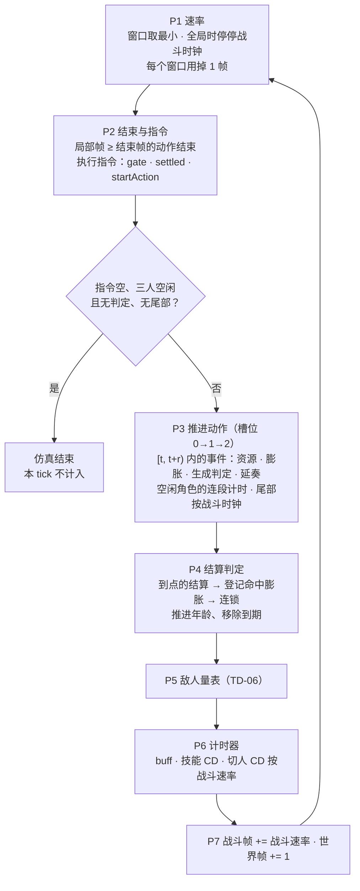
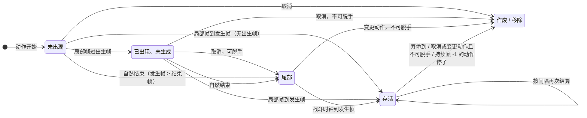

# 鸣潮 DPS 引擎 · TD-04 仿真内核规格 v0.1.2

> **状态**：v0.1.2（2026-10-03），已实现（`src/engine/kernel.ts`）。v0.1.2 并回 M2 / M3 实现时的决定（延奏触发转尾部、施放资源的时机、`actionStarted` 钩子、延奏动作的独立时间线、钩子跳过的判定），见附录
> **依据**：《技术总体设计 v0.1.2》（下称"总设计"）§4 T1 / T2 / T3 / T6 / T7 / T13 / T14、§5.3、§6.1–§6.5、附录 A-1 至 A-3；《TD-01 数据字典与抽取规格 v0.1.1》（下称"TD-01"）§3.1、§3.8、§13、Q4–Q6、Q10、Q11；《TD-02 类型与 Schema v0.1.1》（下称"TD-02"）§4、§7；xlsx「附页1」里数据作者对各列的说明（下称"作者说明"）
> **下游**：TD-05（切人、变奏 / 延奏接在本文的 `startAction` 与 `outroTrigger` 上）、TD-06（资源与敌人量表接在 P4 / P5）、TD-07（buff 计时按战斗时钟，触发在结算之后）、TD-09（指令语义：调用本文的 `gate` / `settled`，定"强制取消"的写法、等待与超时）
> **验证**：v0.1 时 TypeScript 原型内核（约 340 行，v0.1.2 起代码以仓库为准，§9）跑通 14 组 35 个用例（§10）；70 个块的 1598 个动作组各"单独出招""连按两次"跑一遍，3196 次仿真全部正常结束（平均每次 0.25 ms），单独出招时判定生成数、结算次数与数据相符；另请一个未参与编写的审阅者对照代码逐条核对了本文的规则与例子（§10.4）。v0.1.1：测试台改用 TD-09 的正式调度器后，35 个用例照旧通过

---

## 0. 范围与约定

**本文定**：一个 tick 里各相位做什么、按什么顺序；帧边界约定；三种时钟与时间膨胀的算法；动作的开始、推进、取消、自然结束；判定从出现、生成、逐次结算到移除的生命周期；动作层面的合法性（中断优先级、派生窗口、连段前置、输入锁）与"取消会不会丢东西"的判断。

**本文不定**：结算时算什么（伤害 TD-03、资源 TD-06、buff 触发 TD-07）；切人与变奏 / 延奏的细则（TD-05）；指令的语法、等待、超时与报错（TD-09）；敌人量表（TD-06）。这些模块通过 §9 的 `KernelHooks` 以及 `gate` / `settled` / `startAction` 与内核对接。

**约定**：

- 帧一律是 60fps 下的帧。**局部帧**是动作自己的进度（`localFrame`），**世界帧**是主循环计数（`frame`），**战斗帧**是战斗时钟（`battleFrames`）。
- 例子里的 f 都是世界帧。"动作在 f = s 开始"时，没有膨胀的情况下，局部帧 F 的事件发生在 f = s + F。
- 引用作者说明时加引号。作者说明没有写到、靠推断定下的规则，都在 §13 留了待定问题。

### 0.1 要点

1. 每个 tick 固定 7 个相位（§1）。动作是否结束放在 P2 开头判断，所以（没有膨胀时）结束帧为 E 的动作恰好占 E 个 tick，下一个动作在同一个 tick 接上。
2. 局部时间按左闭右开推进：本 tick 走过 [t, t + r)，落在里面的帧节点本 tick 发生；"窗口开没开""优先级是多少"用 tick 开头的 t 判断（§2）。
3. 速率 = 作用在该单位上的全部膨胀窗口取最小值。同一单位上攻击顿帧只留最新的一个，时停类与之并存；窗口登记后下一 tick 起生效，按世界帧倒数；全局时停让战斗时钟停走（§3）。
4. 判定生成后归战场所有：第一次结算就在生成的那个 tick，之后按间隔在判定时钟上结算。判定时钟一般是战斗时钟，"跟随顿帧"的判定随出伤者的局部速率（§5）。
5. 取消 = 同一角色在结束帧之前开始新动作。已生成的判定按"可脱手"去留；还没生成的，若已经**出现**（发生帧公式 P + f(Q) 的 P 已过）且可脱手，转为**尾部**照常生成，其余作废；没走到的延奏触发也转为尾部照常发生（延奏是下场角色发出的）（§4.2、§5.4）。
6. 自然结束时，结束帧及以后的时间线事件一律转为尾部，按战斗时钟照常发生（持续帧 -1 的判定除外）。角色再开始新动作时，此前动作留下的不可脱手判定一并消失（§4.3）。
7. 合法性：新动作优先级高于当前值可以随时打断；等于当前值须在派生窗口内；连段动作（A2）还要求前一段的派生窗口开着——窗口可以越过结束帧，错过即连段中断（§6）。
8. 默认调度等到"取消不丢东西"（打断后不会丢掉判定或资源；延奏触发转尾部照常发生，不用等）再打断；想抢帧用强制写法（语法归 TD-09，§6.4）。
9. 开始动作时内核调 `hooks.actionStarted`：资源模块在这里扣大招能量、处理 `actionStart` 的触发、发"进入即得"的施放资源（TD-06 §7）；时间线上只留 `atFrame > 0` 的施放资源（§4.1）。
10. 尾部有三种来源：取消、自然结束、延奏动作的独立时间线（TD-05 §4.3，不受持有者之后的动作影响）（§4.4）。

---

## 1. 一个 tick



| 相位 | 做什么 | 细则 |
|---|---|---|
| P1 速率 | 由现有膨胀窗口算速率表 `Rates`；每个窗口用掉 1 帧，用完的移除 | §3.1 |
| P2 结束与指令 | ① 局部帧 ≥ 结束帧的动作自然结束；② 执行指令（TD-09）：一个 tick 可以连续执行多条，但同一角色一个 tick 最多开始一个动作；开始动作时调 `hooks.actionStarted`（TD-06 §7）；切人调 TD-05 的 `onSwitch`；③ 若指令已空、三人空闲、没有存活判定也没有尾部，仿真结束，本 tick 不计入 | §4.2、§4.3、§6 |
| P3 推进动作 | 按槽位 0 → 1 → 2：推进当前动作的局部帧，发生区间内的时间线事件；空闲角色推进"上一个动作"的计时（判断连段窗口用）；推进该角色的尾部。本 tick P3 里才出现的尾部（延奏动作的独立时间线）排在最后推进 | §4.1、§4.4 |
| P4 结算 | 按槽位、生成顺序结算到点的判定（TD-03 → TD-06 → TD-07）；每次结算后登记该判定的命中膨胀；结算中生成的连锁判定在同一 tick 接着结算；最后推进全部判定的年龄，移除到期的 | §5 |
| P5 敌人量表 | 破盾、失谐、谐度破坏、异常效应跳伤 | TD-06 |
| P6 计时器 | buff、技能 CD、切人 CD、效应时长按战斗速率递减（`hooks.timers`）；随后处理本 tick 剩下的事件队列，并检查不变量（总设计 §11 第 4 条） | §3.4、TD-06 / TD-07 |
| P7 收尾 | `battleFrames += rates.battle`，`frame += 1`；资源曲线由日志派生（TD-06 §6.1） | —— |

- **为什么结束放在 P2 开头**：结束帧 96 的动作，P3 在 f = 95 把局部帧推到 96，下一 tick 开头才结束。这样动作的局部区间 [0, 96) 每一帧都在"进行中"状态下走过（持续帧 -1 的判定在最后一帧仍能结算），结束与下一个动作的开始落在同一 tick，日志首尾相接（结束帧 96 的动作占 0 → 96，下一个动作从 96 开始）。
- **P1 在 P2 之前**：P2 里新开始的动作，本 tick 就按 P1 算好的该角色速率推进。
- **同帧顺序**沿用总设计 §6.3：同一相位按槽位 0 → 1 → 2，同一角色的判定按生成顺序；先算伤害后触发。

---

## 2. 帧约定

### 2.1 局部区间左闭右开

每个 tick，动作的局部帧从 t 走到 t + r（r 是该角色本 tick 的速率）。**帧号 F 满足 t ≤ F < t + r 的事件在本 tick 发生**，按帧序依次处理：

- r = 0（被时停冻结）：区间为空，什么都不发生。
- r > 1（加速窗口，数据里有 9 个）：一个 tick 可以跨过多个帧节点，按帧序依次发生（T04-2）。
- 等价的说法：没有膨胀时，局部帧 F 的事件发生在动作开始后的第 F 个 tick（开始那个 tick 算第 0 个）。

事件有四类：施放资源、按动作登记的膨胀、判定生成、延奏触发（§4.1）。

### 2.2 状态看 tick 开头

优先级、派生窗口、输入锁、是否到结束帧，都用 P2 时（tick 开头）的局部帧 t 判断；窗口 [from, until) 也是左闭右开：t ≥ from 且 t < until 时开着。

"事件在 [t, t + r) 发生"和"状态看 t"是同一套约定的两面：tick 开头 t = F，说明 F 之前的事件都已发生、F 本身还没有。

### 2.3 取整网格

局部帧与判定年龄每次推进后取整到 1e-4 帧（`snap`）。数据里的膨胀系数共 32 种取值（0 到 9，最细 0.0001），都是 1e-4 的整数倍，所以取整不改变结果，只消除浮点累加误差：0.6 倍速走 20 帧，不取整得到 21.999999999999996，派生窗口 [22, …) 会晚开一帧（T04-13）。

### 2.4 例：散华 A1 的顿帧把 A2 推后 5 帧

A1 在 f = 0 开始，判定发生帧 13，命中登记自身 0.05 倍速 × 5 帧（敌侧 0.1 × 6）；派生窗口 [21, 50)。

| 世界帧 f | 本 tick 速率 | tick 开头的局部帧 t | 发生的事 |
|---|---|---|---|
| 13 | 1 | 13 | 区间 [13, 14) 含 13：A1 判定生成并在 P4 结算，登记顿帧（下一 tick 起生效） |
| 14–18 | 0.05 | 14、14.05 … 14.2 | 每 tick 只走 0.05 |
| 19 | 1 | 14.25 | 恢复原速 |
| 25 | 1 | 20.25 | 区间 [20.25, 21.25) 走过帧节点 21 |
| 26 | 1 | 21.25 | P2：t ≥ 21，派生窗口打开，A2 开始（T04-3） |

顿帧让 A1 少走了 5 × (1 − 0.05) = 4.75 帧：帧节点 21 上的事件晚 4 帧（f = 25），"到没到 21"的判断晚 5 帧（f = 26）。去掉这个顿帧，A2 在 f = 21 开始（T04-3 的对照）。

### 2.5 与 xlsx 顿帧列对照

作者说明："准确的顿帧一般是 顿帧=(1-膨胀系数)*膨胀曲线*膨胀持续……故该条目只取膨胀持续为顿帧"。实测顿帧列 = ceil(L) − 1，其中 L = 持续 × (1 − 系数)（TD-01 Q10）。按本文约定，命中登记的窗口使其后的事件推迟 floor(L) 帧（L 非整数时）或 L 帧（L 为整数时）：

| 攻击顿帧窗口（系数 < 1，自 / 敌侧） | 个数 | 本约定的推迟 = 顿帧列 |
|---|---|---|
| L 非整数（如 5 × 0.95 = 4.75） | 3250 | 3250，全部一致 |
| L 为整数（多为系数 0） | 731 | 5 个一致；726 个比顿帧列多 1 帧 |

整数情况的 1 帧差可能来自膨胀曲线或作者的换算习惯，列为 Q1。引擎只用膨胀窗口，顿帧列只作参考（关闭 TD-01 Q10）。

---

## 3. 时钟与时间膨胀

### 3.1 速率表

```ts
interface Rates {
  battle: 0 | 1                     // 战斗时钟：有 stopsBattleClock 类型（全局时停）的窗口时为 0
  chars: [number, number, number]   // 各角色：作用于他的窗口取最小；没有窗口为 1
  enemy: number                     // 同上；v0 只记录，不驱动任何计时
}
```

- 取最小值时加速窗口（rate > 1）也参与：只有它一个时生效，与减速窗口同在时减速优先。
- P1 算完速率后，每个窗口的 `remaining` 减 1，到 0 的移除。

### 3.2 登记

**两种锚点**（本文 §7 同步修订 TD-01 的装配规则）：

| 数据 | 锚点 | 何时登记 | 例 |
|---|---|---|---|
| 膨胀发生有值 | 动作（`ActionDef.dilations`，`anchor: 'action'`） | 动作局部帧到该值时（时间线事件） | 时停（敌 278、友 231）、全局时停（敌 / 友各 147）、极限闪避（敌 26、自 17） |
| 膨胀发生为空，且在判定行上 | 命中（`JudgmentDef.hitstop`，`anchor: 'hit'`） | 该判定**每次**结算后 | 攻击顿帧（自 1832、敌 2226、友 3）；命中时停 16 |
| 膨胀发生为空，不在判定行上 | 动作，局部帧 1 | 同第一行；flag `dilationStartGuess`（61 组、94 个窗口） | — |

作者说明："若该单元格留空，则情况多为膨胀类型是攻击顿帧，即需要命中才能触发的时间膨胀……可确定发生时间的动作，参考地面极限闪避、角色QTE、角色大招"（关闭 TD-01 Q11）。同一行各侧锚点不同时拆成两条；系数或持续为空的窗口不登记（flag `dilationIncomplete`，11 组、20 个窗口），没有膨胀类型的不登记（9 个窗口）。

**展开到单位**：self → 来源角色；ally → 另外两名角色；enemy → 敌人。每个单位一条 `DilationRuntime`。

**命中登记的自身侧**只在"该判定所属的动作仍是出伤者正在做的动作"时登记：已脱手的判定（尾部、被取消的动作留下的）命中时，不再让角色卡肉。

**生效与倒数**：登记发生在 P3 / P4，下一 tick 的 P1 才用到；按世界帧倒数，持续 D 就作用 D 个 tick。持续 ≤ 0 的不登记。

**取消不撤窗口**：已登记的窗口照常走完。例外是 `clearSelfOnCancel` 类型的自身侧——作者说明，极限闪避顿帧"对角色是buff时停，实际表现为减速，该效果可通过按住普攻键取消"，所以登记它的动作被取消时撤掉自身侧（T04-13）。

### 3.3 膨胀类型（`rules.dilation`）

| 类型 | 战斗时钟 | 按攻击顿帧处理的侧 | 取消时撤自身侧 | 作者说明（摘） |
|---|---|---|---|---|
| 攻击顿帧 | 走 | 自、敌、友 | 否 | "存在优先级，高级可覆盖低级"；被作用方"在上一次顿帧期间被造成了相同或更高优先级的顿帧，则立即结算该顿帧" |
| 时停 | 走 | — | 否 | buff 时停"期间如果接收同级或更高级的攻击顿帧，buff时停保持执行，同时结算攻击顿帧" |
| 全局时停 | 停 | — | 否 | "可暂停副本时间、角色及怪物战斗机制，包括各种大招状态计时" |
| 极限闪避顿帧 | 走 | 敌 | 是 | "对角色是buff时停……对被命中方则是攻击顿帧" |
| 弹反顿帧 | 走 | 自、敌、友 | 否 | 数据只有 1 行，按攻击顿帧处理 |

- **按攻击顿帧处理**：同一单位上最多留一个，新登记的替换旧的。数据里没有顿帧优先级，一律视为同级（Q2）。其余窗口彼此并存、与之并存，取最小（T04-12）。
- 作者说的"攻击顿帧类时停"（"低优先、小系数、长持续，会被下一次攻击顿帧覆盖"，如散华重击居合敌侧 0.01 × 45）在数据里类型就是攻击顿帧，自然按替换处理。
- 这张表是数据（`DEFAULT_RULES.dilation`），实测不符时改表，不改循环（总设计 T2）。

### 3.4 谁按哪个时钟走

| 对象 | 时钟 | 说明 |
|---|---|---|
| 动作局部帧 | 角色速率 | 顿帧时变慢；处在别人的时停里冻结；自己放的时停不影响自己 |
| 空闲角色"上一个动作"的计时 | 角色速率 | 只用于判断连段窗口（§6.2） |
| 尾部 | 战斗时钟 | 已经脱离动作（§4.4） |
| 判定年龄（间隔、寿命） | 战斗时钟；"跟随顿帧"的随出伤者速率 | §5.2 |
| 膨胀窗口 | 世界帧 | 全局时停中也照常倒数，否则时停永远结束不了 |
| buff、技能 CD、切人 CD、异常效应 | 战斗时钟 | 全局时停期间暂停（总设计不变量 6） |

时停只冻结角色的动作（和敌人速率）；已经生成的判定照常按战斗时钟结算，被冻结的后台角色的判定也一样（Q3）。例外是跟随顿帧的判定：它随出伤者的速率走——出伤者被冻结它也停；出伤者自己放全局时停时，它照走（战斗时钟停了也一样，Q4）。

---

## 4. 动作

### 4.1 时间线

`timelineOf(def)` 把动作里所有"到某局部帧发生"的事排成一条，按 `ActionDef` 缓存：

| 事件 | 来源 | 发生时 |
|---|---|---|
| `gain` | `castGains[i]` 中 `atFrame > 0` 的项（目前只可能来自角色模块覆盖）；`atFrame` = 0 的"进入动作即得"不在时间线上，开始动作的那一刻由资源模块发（TD-06 §7） | `hooks.castGain`（TD-06） |
| `dilation` | `dilations[i]`（`anchor: 'action'`） | 登记膨胀（§3.2） |
| `spawn` | `judgments[i]`（有发生帧的）；钩子 `skipJudgments` 列出的判定不生成（TD-08 §3.2） | 生成判定（§5.1） |
| `outro` | `outroTriggerFrame` | `hooks.outroTrigger`（TD-05：上一角色的延奏） |

同帧按 gain → dilation → spawn → outro 排；这个顺序不影响结果，因为结算都在 P4。`ActionRuntime.cursor` 指向下一个没发生的事件（取代 TD-02 的 `nextJudgment` / `castGainsDone`）。发生帧为空的判定（156 行）不在时间线上，由角色钩子通过 `ctx.spawnJudgment`（内部调用内核的 `spawnJudgment`）生成。

### 4.2 开始与取消

**开始**（`startAction`）：局部帧 0；`c.action = c.last = 新实例`，带指令出处 `cmd`（接续动作继承，TD-08 P10）；记 `actionStart`；随后调 `hooks.actionStarted`（TD-06 §7）。一般在 P2 调用；变奏动作由切人开始（TD-05 §2），接续动作在触发它的结算之后开始（P4，下一 tick 起推进）。

**取消**：同一角色在当前动作结束帧之前开始新动作（总设计不变量 4）。切人、被时停都不是取消。旧动作在局部帧 t（tick 开头）被打断：

| 对象 | 处理 |
|---|---|
| 已生成、可脱手 | 留下，照常结算到寿命结束 |
| 已生成、不可脱手（含持续帧 -1） | 立即移除 |
| 未生成、已出现（出生帧 < t）且可脱手 | 转为尾部，在原发生帧照常生成（§4.4） |
| 其余未生成的判定 | 作废 |
| 未发生的延奏触发 | 转为尾部，照常发生：延奏是下场角色发出的，变奏被打断不影响它（2026-09-27 确认，TD-05 §4.1） |
| 未发生的施放资源、膨胀 | 作废 |
| 已登记的膨胀窗口 | 照常走完（极限闪避的自身减速除外，§3.2） |

`actionCancel.dropped` 记下被移除和作废的判定名（T04-5、T04-6、T04-7）；钩子跳过的判定不算作废，尾部继承跳过列表。取消还用于"第nF后切人结束技能"（TD-05 §5，`by: '切人'`），所以 `cancelAction` 导出。

**变更动作**：作者说明"不能脱手的判定在变更技能后立即消失"。所以新动作开始时（不论旧动作是被取消，还是早已自然结束），该角色此前动作留下的不可脱手判定——还活着的、在尾部里等着生成的——一并移除，记在 `actionStart.dropped`（T04-7 第三例）。延奏动作的独立时间线与它生成的判定（`detached`）除外（TD-05 §4.3）。

### 4.3 自然结束

- P2 开头，局部帧 ≥ `endFrame` 的动作结束，记 `actionEnd`；角色回到空闲，`c.last` 仍指向这个实例，其局部帧照走，供连段窗口使用（§6.2）。
- 持续帧 -1 的判定随之移除（作者说明："只要不停下来，判定就会一直持续"）。
- 时间线上还没发生的事件转为尾部，照常发生。数据里有 98 个判定的发生帧 ≥ 结束帧（如仇远 强化A3-3…6，T04-8）。例外是其中持续帧 -1 的 22 个：动作已经停了，它不可能存在，不生成。这 22 组除白芷重击外都是把"下落"与"落地"两段写进同一组的空中攻击，装配时 flag `minusOneAfterEnd`，由 curated 拆组。
- P3 推进时，帧号 ≥ 结束帧的事件不在动作里发生，即使最后一个 tick 的区间越过了结束帧，也统一留给尾部——否则同一个事件发不发生会取决于局部帧的小数相位。
- 自然结束不移除不可脱手的判定，它们一直活到寿命结束或该角色开始下一个动作（§4.2"变更动作"）。数据里 357 个判定跨过结束帧，其中不可脱手 61 个；结束帧后还有多段要结算的只有风主（男 / 女）A3 与 A3-1D 的 4 个判定（各 11 段）。
- 作者说明里"结束帧前切人……直到结束帧+0.32秒后才完全离场"只影响画面，不影响任何判定，不建模。

### 4.4 尾部

尾部（`TailRuntime`）是脱离了动作、仍要发生的时间线事件：沿用动作的局部坐标，改按战斗时钟推进，事件同样在 [x, x + r) 内发生。有三种来源：取消时已出现且可脱手的判定与没走到的延奏触发，自然结束时剩下的全部事件，以及延奏动作的独立时间线（`detached`，TD-05 §4.3：局部帧从 0 起，持续帧 -1 的判定不生成）。它生成的判定仍记在原动作实例名下。

- 延奏动作的独立时间线不受持有者之后的动作影响："变更动作"不清它，它生成的判定带 `detached`，也不清。它在本 tick 的 P3 里出现，排在 P3 最后推进，所以局部第 0 帧就是触发的那个 tick。

- 尾部不再跟着动作走：出伤者之后的顿帧、时停都不影响它。唯一的例外是"变更动作"：出伤者开始新动作时，尾部里不可脱手的判定被清掉（§4.2）。
- 尾部登记的膨胀不作用于出伤者自身（与命中登记的自身侧同一条规则，§3.2）。
- 推进时先补发坐标之前还没发生的事件（最后一个 tick 越过结束帧的那一小段，§4.3；战斗时钟停着也照发），之后按 [x, x + r) 发生。

尾部的局部坐标接着原动作走，所以取消或结束前积累的延迟（顿帧、时停）保留，之后不再有新的延迟（T04-8：单独出招时尾部四段因前面的顿帧晚 1 帧；第 21 帧取消后则准点）。

### 4.5 切人与后台

切人只改前台归属、启动切人 CD，不碰任何动作（总设计不变量 3）。三名角色每 tick 都在 P3 推进（不变量 2），后台动作照常生成判定、登记膨胀、走完结束（T04-9、T04-10）。切人的完整语义（变奏、延奏、协奏）在 TD-05；两个例外也在那里：变奏切人时切入者在后台的动作被变奏动作取消，带"第nF后切人结束技能"的动作在切出时按取消处理。

---

## 5. 判定

### 5.1 生成

- 来源：时间线 `spawn` 事件（P3）、尾部（P3）、角色钩子的 `ctx.spawnJudgment`（任意时刻；P4 中生成的连锁判定在同一 tick 接着结算，P5 / P6 中生成的在下一 tick 的 P4 第一次结算）。
- `JudgmentRuntime`：`spawnedAt`（世界帧）、`age`（判定时钟上的年龄，生成时 0）、`ticksDone`，并记下所属的出伤者与动作实例。
- 记 `judgmentSpawn`。

### 5.2 结算次数、间隔与寿命

- 第 n 次结算（n 从 0 起）在年龄 aₙ = n × 间隔；没有间隔时在寿命内均分（间隔 = 寿命 / 次数）。
- **第 0 次**在生成的那个 tick 结算，不看速率——全局时停中生成的判定也当场结算（散华大招第 72 帧，T04-9；Q4）。
- **第 n ≥ 1 次**在 aₙ 落进本 tick 的年龄区间 [age, age + r) 时结算，且 aₙ < 寿命（寿命 -1 除外）。r 为判定速率：`followHitstop ? rates.chars[owner] : rates.battle`。
- P4 结束前所有判定 `age += r`，年龄 ≥ 寿命的移除（寿命 -1 的只随动作结束 / 取消 / 变更动作移除）。
- 寿命内放不下全部次数的（如千咲 E2-5：寿命 18、间隔 6、最多 8 次，只能结算 3 次）照寿命截断，装配时 flag `ticksCapped`（40 个判定）。
- **跟随顿帧**：作者说明"该判定的生效时长能否被角色受到的攻击顿帧影响"。这里用出伤者的整体局部速率（包括被队友时停冻结，Q5）：出伤者冻结 10 帧，跟随的多段判定其后各段顺延 10 帧，不跟随的准点结算（T04-11）。

### 5.3 结算顺序与命中膨胀

P4 把存活判定按（槽位，生成序号）排好逐个处理；每次结算先调 `hooks.settle`（TD-03 算伤害 → TD-06 发资源 → TD-07 触发），再登记该判定的 `hitstop`（§3.2），然后看同一判定是否还有到点的下一次。结算中新生成的判定追加到队尾，同一 tick 内处理。

### 5.4 出生帧：P + f(Q)

作者说明："若N=P+f(Q)……该攻击在第P秒出现，经过f(Q)秒后开始判定，并根据'可脱手'条目判断是否能在第P秒脱手"；"延迟生成飞行道具"是"在特定动作发生后，会在一定时间之后自动生成的判定，不会因切换动作而导致后续判定消失"。

- 构建脚本读发生帧单元格的公式：形如 `转换(P + f(Q))` 时，用同一个秒 → 帧转换函数算出 P 对应的帧，作为 `birthFrame`（只在小于发生帧时产出）。20260707 版有 468 个这样的公式，445 个 P 早于发生帧，其余 23 个两者相等（记为 null）。
- "出现"的判断：出生帧 < t（没有出生帧时用发生帧）。
- 35 个"延迟生成飞行道具"行全都可脱手：32 个是 P + f(Q) 形式；其余 3 个是同组飞行道具的第一段，发生帧本身就是 P（如折枝 A2-前置 第 24 帧，备注"在A2-前置（24F）后取消动作不会打断后续飞道判定"，后续 A2-1…5 的出生帧都是 24）。所以"出现且可脱手"一条规则覆盖了全部 35 个，不另设字段。
- 例：散华重击-2…4 的发生帧是 `ROUNDUP((0.16666667+0.067k)*60)`，出生帧 11。第 12 帧取消，它们仍在 15、19、23 帧命中；第 10 帧取消则全部作废（T04-6）。

### 5.5 生命周期总览



---

## 6. 动作层合法性

### 6.1 中断优先级与派生窗口

作者说明：派生"可通过常规操作衔接到下一技能"，"派生的条件为：下一技能的中断优先级=当前中断优先级，若大于，则无所谓优不优先级。该值会被顿帧延后"；中断优先级"值越大，能取消的技能越多"。据此：

| 条件（t 为当前动作 tick 开头的局部帧） | 结果 |
|---|---|
| 角色空闲 | 可以开始 |
| 新动作的优先级 P > 当前优先级 p(t) | 可以，打断当前动作 |
| P = p(t)，且 t 在当前动作某个派生窗口内 | 可以（派生） |
| 其余 | 等待 |

- P 取新动作第 0 帧的优先级；p(t) 取 `fromFrame ≤ t` 的最后一段。变化帧的来源按 TD-01 §13.1 的回退链；凑不齐的（97 组，多为三段如散华 A5 [2, 4, 2]）截断成已知的前几段并 flag，由 curated 补（Q7）。
- 派生窗口 [派生帧, 派生帧 + 派生持续帧)；派生持续帧为空或 -1 时到结束帧为止（关闭 TD-01 Q6）。窗口用局部帧表示，所以自然"会被顿帧延后"（§2.4）。
- 例：散华 E 的优先级 [4, 2] 没有变化帧，按回退链取派生帧 60。E → A1（2）要等到 E 局部帧 60；E → 闪避（6）随时可以（T04-5）。

### 6.2 连段前置与越过结束帧的窗口

A2 不是"任何时候按普攻都能出"的动作，它只能接在 A1 后面。`ActionDef.comboFrom` 列出前置动作；有它时另加一条：角色的上一个动作（`c.last`，进行中或已结束）必须是其中之一，且它的某个派生窗口正开着。

- 窗口可以越过结束帧（散华 A1：派生 21 + 29 = [21, 50)，结束 41）。动作结束后 `c.last` 的局部帧照走（按角色速率），所以 A1 结束后到局部帧 50 之前仍能接 A2（T04-4）。
- 窗口还没开 → 等待；已经关了、或上一个动作不是前置 → **等不来**，TD-09 立即报错"连段中断"。
- 默认推断（装配时，§7）：`A{n}` ← `A{n−1}`（同前缀，块内存在，296 组）；`闪避反击` ← `极限闪避`（14 组）。其余（A3-1D、电锯A2#2、E1 → E2 …）按需 curated（Q8）。

### 6.3 输入锁

`ActionDef.inputLocks`：当前动作局部帧 < `until` 时，`kinds` 里的新动作不能开始（等待）。

| 备注 | 输入锁 | 组数 |
|---|---|---|
| 第 nF 前不响应输入 | `{ until: n, kinds: 'all' }` | 65 |
| 第 nF 前不能闪避 | `{ until: n, kinds: ['dodge'] }` | 106 |
| 第 nF 前不能切人 | 不是输入锁，是 `switchLockUntil`（TD-05） | — |
| 第 nF 前不能施放E技能 / 蓄力 / 派生 等 | curated 按需加（Q14） | 约 60 条 |

输入锁只看当前动作；角色空闲时没有锁。

### 6.4 就绪：取消会不会丢东西

按中断优先级，E 可以在 A1 的第 1 帧就打断它——但那样 A1 什么都没打出来，这不是"A1 E"这条轴想表达的意思。所以内核另给一个判断 `settled(slot)`：**现在打断当前动作，会不会丢掉判定、资源或延奏**。满足以下全部条件为就绪：

- 时间线上剩下的事件都是判定，而且每个都已出现且可脱手（打断后会转为尾部）；延奏触发不算（打断后转尾部照常发生），钩子跳过的判定也不算；
- 本动作已生成的不可脱手判定都已结算完寿命内能结算的全部次数（`ticksWithinLife`：放不下的按寿命截断，§5.2）。

没有动作或已到结束帧时恒为就绪。角色空闲时，此前动作留下的不可脱手判定会在下一个动作开始时按"变更动作"消失（§4.2）——这是游戏规则，默认调度不为它等待（如风主 A3 结束后接闪避，A3-2 结束帧之后的 11 段不再结算，Q13）。

**默认调度**（TD-09 §3.4 定稿）：同一角色的下一条出招指令，除了 `gate` 通过，还要等到当前动作就绪（或自然结束）；动作名后写 `!`（如 `散华 A1 E!`）时跳过就绪判断，按游戏规则的最早时刻打断。于是：

| 轴 | 默认 | 强制 |
|---|---|---|
| 散华 A1 E | E 在 f = 14 开始（A1 第 13 帧出手之后） | E 在 f = 1 开始，A1 作废 |
| 散华 A3 A4 | A4 在 A3 四段打完后（f = 98） | A4 在派生窗口刚开时（f = 97，A3 局部 36）开始，A3 第四段作废 |
| 仇远 强化A3 闪避 | 闪避在 f = 21（出生帧 20 已过，后四段转尾部） | 可以更早，但尚未出现的判定全部作废 |

"最早合法帧"的定义没变（总设计 T6 / T7），只是"合法"多了一条默认要求；需要抢帧的轴写强制形式。

### 6.5 `gate` 的返回

```ts
type GateResult =
  | { ok: true; via: 'idle' | 'priority' | 'derive' }
  | { ok: false; wait: true; code: WaitCode; reason: string }
  | { ok: false; wait: false; code: 'comboBroken'; reason: string }   // 等不来：连段已断
```

按下表的顺序检查，报第一个不满足的（v0.1.1 起带原因代码 `code`，TD-09 按它分段记录等待）：

| 原因 | wait | code | 例 |
|---|---|---|---|
| 等前置动作的派生窗口 | true | `combo` | A1 刚开始就写 A2 |
| 前置动作的派生窗口已过 / 上一个动作不是前置 | **false** | `comboBroken` | "A1 的派生窗口已过，连段中断" |
| 输入锁 | true | `inputLock` | "闪避反击 第 23 帧前不响应 dodge" |
| 优先级不够 | true | `priority` | "优先级 2 低于 E 当前的 4" |
| 优先级相等、不在派生窗口 | true | `derive` | "等 E 的派生窗口" |
| 本 tick 已开始过动作 | true | `started` | 同一角色一 tick 只开始一个动作 |

"本 tick 已开始过动作"放在最后（v0.1.1 调整）：只有其余都满足时才报它，否则刚出招的那一帧会先报一帧它、掩盖真正的原因（TD-09 §3.2）。

冷却、能量、角色是否在前台、核心资源条件不在 `gate` 里，由 TD-09（调度器）、TD-06（资源）、角色钩子 `canStart` 判断。技能冷却在 v0.1.1 由内核计时：`startAction` 从动作开始时起算（声骸技能共用键 `echo`，见 `cooldownKey`），P6 按战斗速率递减；判断在 TD-09。

---

## 7. 数据装配的修订（交给 TD-01 §13）

内核用到的字段由注册层从生成数据装配（TD-01 §13）。本文对装配规则做了如下修订。①–⑥、⑧ 已在原型 `src/data/assemble-action.ts`（本节末）实现，并用于 §10 的全部真实数据用例；⑦ 属于资源装配、⑨ 属于构建脚本的备注提示，原型没有做（原型读的生成数据仍是 v0.1.1 的提示）：

| # | 修订 | 计数（20260707） |
|---|---|---|
| ① | 生成数据每行新增 `birthFrame`（§5.4），装配时原样带入 `JudgmentDef.birthFrame` | 445 行 |
| ② | 膨胀按侧拆锚点：膨胀发生有值 → `ActionDef.dilations`（`anchor: 'action'`）；为空且在判定行上 → `JudgmentDef.hitstop`（`anchor: 'hit'`，不再限定攻击顿帧类）；为空且不在判定行上 → 局部帧 1 + `dilationStartGuess`；系数或持续为空的侧跳过 + `dilationIncomplete` | 2300 个判定有命中膨胀；动作级 475 条；61 组（94 个窗口）/ 11 组（20 个窗口） |
| ③ | 新增 `comboFrom`：`A{n}` ← `A{n−1}`（同前缀、块内存在）；`闪避反击` ← `极限闪避`。v0.1.1：前置动作一个派生窗口都没有时不设，flag `comboNoWindow`（TD-09 §8） | 296 组 / 14 组；不设的 7 组 |
| ④ | 新增 `inputLocks`：备注"第 nF 前不响应输入"→ 全部；"第 nF 前不能闪避"→ `dodge` | 65 组 / 106 组 |
| ⑤ | 方向变体：组内同时有 -前 / -后 行时只取 -前，flag `dirVariant` | 47 组 |
| ⑥ | 优先级变化帧凑不齐时截断成已知的前几段，flag `priorityChangeMissing`；没有优先级的给 `[{ fromFrame: 0, value: 0 }]`，flag `noPriority` | 97 组 / 61 组 |
| ⑦ | `castGains` 的默认发放帧改为局部帧 0（原文"第 1 帧"即动作的第一帧） | — |
| ⑧ | 新 flag：`minusOneAfterEnd`（持续帧 -1 的判定在结束帧之后才生成，§4.3）、`ticksCapped`（寿命内放不下全部次数，§5.2） | 22 组 / 40 个 |
| ⑨ | 备注提示（TD-01 §3.8）的并列写法拆开逐项匹配："第nF前不响应输入、不能切人"目前只抽到前一项，漏掉 23 个切人限制；"第nF前不能切人、不响应输入"漏掉 5 个输入限制 | 28 行 |

其余规则（结束帧、派生窗口、优先级回退链、次数与间隔、可脱手默认值）不变。装配后的 flag 分布（组数）：`priorityChangeGuess` 238、`multiEnd` 188、`noEnd` 167、`priorityChangeMissing` 97、`noPriority` 61、`dilationStartGuess` 61、`dirVariant` 47、`minusOneAfterEnd` 22、`dilationIncomplete` 11；判定级 `persistsGuess` 76、`ticksGuess` 61、`ticksCapped` 40、`noLife` 28。

v0.1.1 注：`multiEnd` 后来改为只在几行的结束帧取值不同时才标（188 → 156 组，TD-01 v0.1.3）。

原型（只装配内核用到的字段，倍率、元素、资源给占位值；正式实现按 TD-01 §13 补齐）。v0.1.1 的文件里另有角色模块覆盖、按共鸣链数挑判定（TD-01 v0.1.3 §13.2、§13.4）与 `comboNoWindow`，与本文无关的部分可以略过：

```ts
// src/data/assemble-action.ts —— 生成数据的动作组 → ActionDef（TD-01 §13.1 / §13.2，按 TD-04 §7 修订）
// 原型只装配内核用到的时间字段；倍率、元素、资源、castGains 在正式实现里按 TD-01 §13 补齐（这里给占位值）。
// 另有两步：角色模块的 actionOverrides（TD-01 §13.4），按共鸣链数挑判定 forChain（总设计 §3.3 第 4 步）。
import type { ActionId, ActionKind, DilationSide } from './common'
import type { ActionOverride } from './define'
import type { GenActionFile, GenGroup, GenRow } from './generated.schema'
import type { ActionDef, CancelWindow, ChainRange, DilationDef, DilationWindow, InputLock, JudgmentDef, PriorityStep } from './gamedata'

const SIDES: DilationSide[] = ['self', 'enemy', 'ally']

/** 装配一个块。overrides = 角色模块的 actionOverrides；写了块里不存在的动作 / 行 / 判定直接报错 */
export function assembleBlock(file: GenActionFile, overrides: Record<ActionId, ActionOverride> = {}): Record<string, ActionDef> {
  const ids = new Set(file.groups.map(g => g.id))
  for (const id of Object.keys(overrides))
    if (!ids.has(id)) throw new Error(`${file.key} 的 actionOverrides 写了不存在的动作"${id}"`)
  const out: Record<string, ActionDef> = {}
  for (const g of file.groups) {
    const ov = overrides[g.id]
    const def = assembleGroup(file, g, ids, ov?.dropRows)
    out[g.id] = ov ? applyOverride(def, ov) : def
  }
  // 前置动作一个派生窗口都没有时，连段永远接不上：不设连段前置，打 flag 交给 curated（TD-09 §8 全量检查发现 7 组）
  for (const def of Object.values(out)) {
    if (overrides[def.id]?.comboFrom) continue                        // 手写的连段前置照用
    const pre = def.comboFrom?.map(id => out[id]).filter(d => d !== undefined) ?? []
    if (pre.length > 0 && pre.every(p => p.cancelWindows.length === 0)) {
      delete def.comboFrom
      def.flags = [...def.flags, 'comboNoWindow']
    }
  }
  return out
}

/** 按共鸣链数挑判定（总设计 §3.3 第 4 步）：chainRange 不含该链数的判定去掉；动作的时间字段不受影响 */
export function forChain(actions: Record<ActionId, ActionDef>, chain: number): Record<ActionId, ActionDef> {
  const out: Record<ActionId, ActionDef> = {}
  for (const [id, a] of Object.entries(actions)) {
    const keep = a.judgments.filter(j => !j.chainRange || (chain >= j.chainRange.min && chain <= j.chainRange.max))
    out[id] = keep.length === a.judgments.length ? a : { ...a, judgments: keep }
  }
  return out
}

function assembleGroup(file: GenActionFile, g: GenGroup, ids: Set<string>, dropRows: string[] = []): ActionDef {
  const flags = new Set<string>()                           // 组级 flag，同名只记一次
  for (const n of dropRows)
    if (!g.rows.some(r => r.name === n)) throw new Error(`${file.key} ${g.id} 的 dropRows 写了不存在的行"${n}"`)
  const kept = g.rows.filter(r => !dropRows.includes(r.name))
  // 方向变体（-前 / -后）是二选一：默认只取 -前 行（TD-04 §7 ⑤）
  const hasFront = kept.some(r => r.nameTags.dir === '前')
  const rows = kept.filter(r => !(hasFront && r.nameTags.dir === '后'))
  if (rows.length < kept.length) flags.add('dirVariant')
  // 带链标记的非判定行（膨胀 / 资源 / 标记）暂不按链筛选，交给 TD-06 / TD-08
  if (rows.some(r => r.kind !== 'hit' && r.nameTags.chain !== undefined)) flags.add('chainNonHit')

  // 结束帧：第一个有值的行；都没有则 max(发生帧 + 持续帧, 派生帧)
  let endFrame = rows.find(r => r.endFrame !== null)?.endFrame ?? null
  if (endFrame === null) {
    const cands = rows.flatMap(r => [
      r.spawnFrame !== null && r.lifeFrames !== null && r.lifeFrames > 0 ? r.spawnFrame + r.lifeFrames : 0,
      r.deriveFrame ?? 0,
    ])
    endFrame = Math.max(0, ...cands)
    flags.add('noEnd')
  }
  if (new Set(rows.map(r => r.endFrame).filter(e => e !== null)).size > 1) flags.add('multiEnd')   // 几行的结束帧不一样才算

  const cancelWindows: CancelWindow[] = rows.filter(r => r.deriveFrame !== null).map(r => ({
    from: r.deriveFrame!,
    until: r.deriveDuration === null || r.deriveDuration === -1 ? endFrame! : r.deriveFrame! + r.deriveDuration,
    row: r.row,
  }))

  const priority = assemblePriority(rows, flags)
  const kind = kindOf(g.id)

  // 连段前置：A{n} ← A{n−1}（同前缀、块内存在）；闪避反击 ← 极限闪避（TD-04 §6.2）
  let comboFrom: string[] | undefined
  const m = /^(.*)A(\d+)$/.exec(g.id)
  if (m && Number(m[2]) >= 2 && ids.has(`${m[1]}A${Number(m[2]) - 1}`)) comboFrom = [`${m[1]}A${Number(m[2]) - 1}`]
  if (g.id === '闪避反击') comboFrom = ['极限闪避']

  const inputLocks: InputLock[] = []
  const maxHint = (k: 'noInputBefore' | 'noDodgeBefore' | 'noSwitchBefore') =>
    rows.reduce<number | null>((acc, r) => (r.hints[k] !== undefined ? Math.max(acc ?? 0, r.hints[k]!) : acc), null)
  const noInput = maxHint('noInputBefore')
  const noDodge = maxHint('noDodgeBefore')
  if (noInput !== null) inputLocks.push({ until: noInput, kinds: 'all' })
  if (noDodge !== null) inputLocks.push({ until: noDodge, kinds: ['dodge'] })

  // 膨胀：每行每侧按锚点拆开——膨胀发生有值 → 按动作局部帧登记；为空且是判定行 → 挂在判定上逐次命中登记（TD-04 §3.2）
  const dilations: DilationDef[] = []
  const hitstopOf = new Map<GenRow, DilationDef>()
  for (const r of rows) {
    const d = r.dilation
    if (!d?.type) continue
    const byStart = new Map<number, DilationDef>()
    for (const side of SIDES) {
      const w = d[side]
      if (!w) continue
      if (w.rate === null || w.duration === null) { flags.add('dilationIncomplete'); continue }
      const win: DilationWindow = { rate: w.rate, duration: w.duration }
      if (w.start === null && r.kind === 'hit') {
        const h = hitstopOf.get(r) ?? { type: d.type, anchor: 'hit', start: 0 }
        h[side] = win
        hitstopOf.set(r, h)
        continue
      }
      const start = w.start ?? 1
      if (w.start === null) flags.add('dilationStartGuess')
      const a = byStart.get(start) ?? { type: d.type, anchor: 'action', start }
      a[side] = win
      byStart.set(start, a)
    }
    dilations.push(...byStart.values())
  }

  const names = new Map<string, number>()
  const hitRows = rows.filter(r => r.kind === 'hit')
  const chains = chainRanges(hitRows)
  const judgments: JudgmentDef[] = hitRows.map(r => {
    const n = (names.get(r.name) ?? 0) + 1
    names.set(r.name, n)
    const life = r.lifeFrames ?? 1
    const iv = r.hints.tickInterval ?? null
    const ticks = r.hints.maxTicks ?? (iv !== null && life > 0 ? Math.ceil(life / iv) : 1)
    const jf: string[] = []
    if (r.lifeFrames === null) jf.push('noLife')
    if (r.hints.maxTicks === undefined && iv !== null) jf.push('ticksGuess')
    if (iv !== null && life > 0 && (ticks - 1) * iv >= life) jf.push('ticksCapped')   // 寿命内放不下全部次数（TD-04 §5.2）
    if (r.persists === null && life !== -1) jf.push('persistsGuess')
    const ch = chains.get(r)
    if (ch?.additive) jf.push('chainAdditive')
    return {
      name: n > 1 ? `${r.name}#${n}` : r.name,
      row: r.row,
      spawnFrame: r.eventSpawned ? null : r.spawnFrame,
      birthFrame: r.birthFrame,
      lifeFrames: life,
      ticks,
      tickInterval: iv,
      persistsOnCancel: life === -1 ? false : (r.persists ?? true),
      followHitstop: r.followHitstop === true,
      target: 'enemy', calc: 'damage', multiplier: 1, relatedAttr: 'atk', element: '物理', tags: [],   // 占位（原型不连 dmg）
      gains: { energy: 0, concerto: 0, core: [0, 0, 0] },
      gauges: { toughness: 0, tunability: 0 },
      hitstop: hitstopOf.get(r) ?? null,
      ...(ch ? { chainRange: ch.range } : {}),
      flags: jf,
    }
  })
  judgments.sort((a, b) => (a.spawnFrame ?? Infinity) - (b.spawnFrame ?? Infinity))
  if (judgments.some(j => j.lifeFrames === -1 && j.spawnFrame !== null && j.spawnFrame >= endFrame!)) flags.add('minusOneAfterEnd')   // 动作停了才出现，永远不会生成（TD-04 §4.3）

  const outro = rows.find(r => r.hints.outroTriggerFrame !== undefined)?.hints.outroTriggerFrame
  const switchLock = maxHint('noSwitchBefore')
  return {
    id: g.id, owner: file.key, kind, endFrame, cancelWindows, priority,
    ...(comboFrom ? { comboFrom } : {}),
    inputLocks, judgments, dilations, castGains: [],
    ...(outro !== undefined ? { outroTriggerFrame: outro } : {}),
    ...(switchLock !== null ? { switchLockUntil: switchLock } : {}),
    source: { file: file.key, rows: g.rows.map(r => r.row) },
    flags: [...flags],
  }
}

/** 优先级：取值最多的一行；变化帧依次取 K 列 → 组内备注 → （仅两段）不能闪避 / 不响应输入 → 该行派生帧（TD-01 §13.1） */
function assemblePriority(rows: GenRow[], flags: Set<string>): PriorityStep[] {
  const withP = rows.filter(r => r.priority !== null)
  if (withP.length === 0) { flags.add('noPriority'); return [{ fromFrame: 0, value: 0 }] }
  const row = withP.reduce((best, r) => (r.priority!.length > best.priority!.length ? r : best))
  const values = row.priority!
  if (values.length === 1) return [{ fromFrame: 0, value: values[0]! }]
  const hint = (k: 'noDodgeBefore' | 'noInputBefore') => rows.find(r => r.hints[k] !== undefined)?.hints[k]
  let frames: number[] | undefined = row.priorityChange ?? rows.find(r => r.hints.priorityChangeFrames)?.hints.priorityChangeFrames
  if (!frames && values.length === 2) {
    const guess = hint('noDodgeBefore') ?? hint('noInputBefore') ?? row.deriveFrame ?? undefined
    if (guess !== undefined) { frames = [guess]; flags.add('priorityChangeGuess') }
  } else if (!frames && row.deriveFrame !== null) {
    frames = [row.deriveFrame]
    flags.add('priorityChangeGuess')
  }
  frames ??= []
  if (frames.length < values.length - 1) flags.add('priorityChangeMissing')
  const steps: PriorityStep[] = [{ fromFrame: 0, value: values[0]! }]
  for (let i = 1; i < values.length && i - 1 < frames.length; i++) steps.push({ fromFrame: frames[i - 1]!, value: values[i]! })
  return steps
}

const CHAIN_TOKEN = /(?<![A-Za-z])C\d(?!\d)/                // 与构建脚本 name_tags 的 chain 规则相同（TD-01 §3.9）

/** 共鸣链版本（TD-01 §13.2）：行名去掉 C\d 后相同的判定行，是同一判定在不同链数下的版本（无标记算 0），
 *  链数 c 取"标记 ≤ c"里最大的那个版本——椿 大招-C0 / C3 / C5 伤害 → [0, 2]、[3, 4]、[5, 6]。
 *  只有一种标记 n > 0、没有别的版本 → 从 n 链起额外出现（chainAdditive，要人确认不是替换某个判定）。 */
function chainRanges(hits: GenRow[]): Map<GenRow, { range: ChainRange; additive: boolean }> {
  const families = new Map<string, GenRow[]>()
  for (const r of hits) {
    const k = r.name.replace(CHAIN_TOKEN, '')
    families.set(k, [...(families.get(k) ?? []), r])
  }
  const out = new Map<GenRow, { range: ChainRange; additive: boolean }>()
  for (const rs of families.values()) {
    if (!rs.some(r => r.nameTags.chain !== undefined)) continue
    const tags = [...new Set(rs.map(r => r.nameTags.chain ?? 0))].sort((a, b) => a - b)
    if (tags.length === 1 && tags[0] === 0) continue                 // 只有 C0 版本 = 任何链数
    for (const r of rs) {
      const t = r.nameTags.chain ?? 0
      const next = tags[tags.indexOf(t) + 1]
      out.set(r, { range: { min: t, max: next === undefined ? 6 : next - 1 }, additive: tags.length === 1 })
    }
  }
  return out
}

/** 覆盖字段 → 视为已处理的 flag（TD-01 §13.4） */
const HANDLED: Partial<Record<keyof ActionOverride, string[]>> = {
  kind: ['kindGuess'], endFrame: ['multiEnd', 'noEnd'], priority: ['priorityChangeGuess', 'priorityChangeMissing', 'noPriority'],
  cancelWindows: ['deriveMinus1'], outroTriggerFrame: ['noOutroFrame'],
}
const J_HANDLED: Record<string, string[]> = {
  lifeFrames: ['noLife'], ticks: ['ticksGuess', 'ticksCapped'], persistsOnCancel: ['persistsGuess'], multiplier: ['noDmg'],
  chainRange: ['chainAdditive'],
}

function applyOverride(def: ActionDef, ov: ActionOverride): ActionDef {
  const accepted = new Set(ov.accept ?? [])
  for (const [field, fl] of Object.entries(HANDLED)) if (ov[field as keyof ActionOverride] !== undefined) fl.forEach(f => accepted.add(f))
  const out: ActionDef = { ...def }
  if (ov.kind !== undefined) out.kind = ov.kind
  if (ov.endFrame !== undefined) out.endFrame = ov.endFrame
  if (ov.priority !== undefined) out.priority = ov.priority
  if (ov.cancelWindows !== undefined) out.cancelWindows = ov.cancelWindows.map(w => ({ ...w, row: 0 }))   // row 0 = 手写
  if (ov.outroTriggerFrame !== undefined) out.outroTriggerFrame = ov.outroTriggerFrame
  if (ov.switchLockUntil !== undefined) out.switchLockUntil = ov.switchLockUntil
  if (ov.comboFrom !== undefined) out.comboFrom = ov.comboFrom
  if (ov.cooldown !== undefined) out.cooldown = ov.cooldown
  const jov = ov.judgments ?? {}
  for (const n of Object.keys(jov))
    if (!def.judgments.some(j => j.name === n)) throw new Error(`${def.owner} ${def.id} 的 judgments 覆盖写了不存在的判定"${n}"`)
  out.judgments = def.judgments.map(j => {
    const o = jov[j.name]
    const handled = new Set(accepted)
    for (const k of Object.keys(o ?? {})) (J_HANDLED[k] ?? []).forEach(f => handled.add(f))
    return { ...j, ...o, flags: j.flags.filter(f => !handled.has(f)) }
  })
  out.judgments.sort((a, b) => (a.spawnFrame ?? Infinity) - (b.spawnFrame ?? Infinity))
  out.flags = def.flags.filter(f => !accepted.has(f))
  return out
}

/** 原型用组名推 kind；正式实现先看 dmg 的 Damage.Type（TD-01 §13.1） */
function kindOf(id: string): ActionKind {
  if (id.includes('闪避反击')) return 'normal'
  if (id.includes('闪避')) return 'dodge'
  if (id.startsWith('QTE')) return 'intro'
  if (id.startsWith('延奏')) return 'outro'
  if (id.startsWith('大招')) return 'liberation'
  if (id.startsWith('E')) return 'skill'
  if (id.includes('重击')) return 'heavy'
  if (/A\d/.test(id) || id.includes('普攻')) return 'normal'
  return 'other'
}
```

---

## 8. 类型

TD-02 的类型按本文修订如下（完整文件见 TD-02 v0.1.2）。

`src/data/gamedata.ts`（节选）：

```ts
export interface ActionDef {
  // …其余字段同 TD-02 …
  endFrame: Frame                                   // 动作结束帧：局部帧到达它时回到空闲（§4.3）
  cancelWindows: CancelWindow[]                     // 派生窗口 [from, until)，可越过 endFrame（§6.1）
  priority: PriorityStep[]                          // 按 fromFrame 升序，第一项 fromFrame = 0
  comboFrom?: ActionId[]                            // 连段前置（§6.2）
  inputLocks: InputLock[]                           // 输入锁（§6.3）
  dilations: DilationDef[]                          // 按动作局部帧登记的膨胀（anchor = 'action'）
  castGains: CastGain[]                             // atFrame 0 = 进入动作即得（开始时由资源模块发，TD-06 §7）
  energyCost?: number                               // v0.1.2：大招能量门槛与扣除（TD-06 §2.3）
  endOnSwitchOut?: Frame                            // v0.1.2：切出时局部帧 ≥ 它就按取消处理（TD-05 §5）
  followUp?: { after: string; action: ActionId }    // v0.1.2：该判定第一次结算后接 action（TD-08 P10）
}
export interface CastGain { atFrame: Frame; resource: ResourceKind; amount: number; chainRange?: ChainRange }
export interface InputLock { until: Frame; kinds: ActionKind[] | 'all' }

export interface JudgmentDef {
  // …
  spawnFrame: Frame | null                          // null = 事件生成
  birthFrame: Frame | null                          // 出现帧：发生帧公式 P + f(Q) 的 P；null = 同 spawnFrame（§5.4）
  hitstop: DilationDef | null                       // 每次命中登记的膨胀（膨胀发生为空的各侧，任何类型）
}

export interface DilationRule {                     // Rules.dilation 的值（§3.3）
  stopsBattleClock: boolean
  hitstopSides: DilationSide[]                      // 在这些侧按"攻击顿帧"处理：同一单位上新的替换旧的
  clearSelfOnCancel: boolean                        // 登记它的动作被取消时撤掉自身侧
}
```

`src/engine/types.ts`（节选）：

```ts
export interface SimState {
  // …
  judgments: JudgmentRuntime[]
  tails: TailRuntime[]                              // 尾部（§4.4）
  dilations: DilationRuntime[]
}
export interface CharRuntime {
  // …
  action: ActionRuntime | null                      // null = 空闲
  last: ActionRuntime | null                        // 最近一个动作实例；结束后局部帧照走，供连段窗口判断
  startedThisTick: boolean                          // 同一 tick 同一角色最多开始一个动作
}
export interface ActionRuntime {
  id: ActionId; def: ActionDef; instance: number
  localFrame: number                                // 每次推进后取整到 1e-4
  startedAt: number
  cursor: number                                    // 时间线上下一个待发生事件的下标
  ended: boolean
  coreGranted: [boolean, boolean, boolean]
  cmd?: CommandRef                                  // v0.1.2：由哪条指令开始（接续动作继承）
  skip?: string[]                                   // v0.1.2：钩子跳过的判定名（TD-08 §3.2）
}
export type TimelineEvent =
  | { frame: Frame; kind: 'gain'; index: number } | { frame: Frame; kind: 'dilation'; index: number }
  | { frame: Frame; kind: 'spawn'; index: number } | { frame: Frame; kind: 'outro' }
export interface TailRuntime {
  owner: Slot; action: ActionId; def: ActionDef; instance: number
  localFrame: number                                // 沿用动作的局部坐标，按战斗时钟推进
  events: TimelineEvent[]
  detached?: true                                   // v0.1.2：延奏动作的独立时间线（TD-05 §4.3）
  skip?: string[]                                   // v0.1.2：继承动作的跳过列表
}
export interface JudgmentRuntime {
  id: number; owner: Slot; action: ActionId; actionInstance: number; def: JudgmentDef
  spawnedAt: number                                 // 世界帧
  age: number                                       // 判定时钟上的年龄
  ticksDone: number
  detached?: true                                   // v0.1.2：由独立时间线生成，持有者开始新动作时不清
}
export interface DilationRuntime {
  type: DilationType; source: Slot; side: DilationSide
  target: Slot | 'enemy'                            // 已展开到具体单位
  rate: number
  remaining: number                                 // 世界帧
  hitstop: boolean                                  // 按攻击顿帧处理
  instance: number                                  // 登记它的动作实例
}
```

事件 `actionStart` 新增可选的 `dropped`（§4.2"变更动作"）。v0.1.2 的完整类型见 TD-02 v0.1.4。

---

## 9. 代码 `src/engine/kernel.ts`

v0.1.2 起本文不再内嵌代码，以仓库为准。内核只依赖类型与 `Rules`；伤害、资源、buff、切人通过 `KernelHooks` 接入，调度器（TD-09）通过 `gate` / `settled` / `startAction` 与 `tick(s, k, schedule)` 的 `schedule` 回调接入。导出：

| 名字 | 作用 |
|---|---|
| `KernelHooks` | `settle`（P4 一次结算）、`actionStarted?`（开始动作之后，TD-06 §7）、`castGain?`（`atFrame > 0` 的施放资源）、`outroTrigger?`（TD-05）、`timers?`（P6 计时，TD-07） |
| `Kernel`、`EventSource` | 规则 + 钩子；时间线事件的来源（进行中的动作或尾部：`def`、`instance`、`skip?`、`detached?`） |
| `timelineOf`、`snap`、`within`、`log` | 时间线（§4.1）、1e-4 网格与左闭右开（§2）、记事件 |
| `computeRates`、`registerDilation` | P1 速率表、登记膨胀（§3） |
| `startAction(s, k, slot, def, cmd?)`、`cancelAction(s, k, slot, by)`、`endDueActions`、`advanceActions` | 开始 / 取消 / 自然结束 / P3 推进（§4） |
| `spawnJudgment(s, owner, action, instance, def, detached?)`、`tickSpacing`、`ticksWithinLife`、`judgmentRate`、`settleJudgments` | 判定（§5） |
| `priorityAt`、`gate`、`cooldownKey`、`settled` | 动作层合法性与就绪（§6） |
| `tick(s, k, schedule)`、`SLOTS` | 一个 tick（§1） |

## 10. 测试用例

### 10.1 测试台

`tests/helpers/kernel-harness.ts`：最小状态、真实数据装配与人造动作构造器。v0.1.1 起 `run()` 用 TD-09 的正式调度器执行指令（出招默认等就绪、`force` 跳过；`switch`；`wait`；测试专用的 `at: 帧`），原来那个只够本文用的最小调度器删掉了。

```ts
// tests/kernel-harness.ts —— TD-04 / TD-09 用例的测试台：最小状态、指令序列、动作构造器
// 指令直接写成已解析的形式（槽位 + 动作 ID），交给正式的调度器（src/engine/scheduler.ts，TD-09）执行；
// 另有测试专用的 at（等到某世界帧），排轴语法写不出来。
import { existsSync, readFileSync } from 'node:fs'
import type { ActionId, Slot } from '../../src/data/common'
import { assembleBlock, forChain } from '../../src/data/assemble-action'
import type { CharacterModuleDef } from '../../src/data/define'
import { DEFAULT_RULES } from '../../src/data/gamedata'
import type { ActionDef, DilationDef, JudgmentDef } from '../../src/data/gamedata'
import { GenActionFileSchema, type GenActionFile } from '../../src/data/generated.schema'
import type { Command } from '../../src/data/scenario.schema'
import { describe } from 'vitest'
import type { Kernel } from '../../src/engine/kernel'
import { createScheduler, newQueue, runLoop, ScheduleError, type CompileMember, type SchedulerOptions } from '../../src/engine/scheduler'
import type { CharRuntime, SimEvent, SimState } from '../../src/engine/types'

export type Cmd =
  | { act: Slot; action: ActionId; force?: boolean; delay?: number }
  | { switch: Slot }
  | { wait: number }
  | { at: number }

export interface Hit { f: number; char: string; judgment: string; tick: number }
export interface RunResult { s: SimState; hits: Hit[]; outros: { f: number; char: string }[]; frames: number; error?: ScheduleError }

const char = (slot: Slot, name: string): CharRuntime => ({
  slot, name, action: null, last: null, startedThisTick: false, energy: 0, concerto: 0, core: [0, 0, 0, 0, 0], cooldowns: {}, flags: {},
})

export function newState(names: [string, string, string], onField: Slot = 0): SimState {
  return {
    frame: 0, battleFrames: 0, onField, switchCd: 0,
    chars: [char(0, names[0]), char(1, names[1]), char(2, names[2])],
    judgments: [], tails: [], buffs: [], dilations: [], log: [], nextId: 1,
    enemy: {} as SimState['enemy'],                  // 内核不读敌人状态（TD-06）
    queue: newQueue([]),
  }
}

/** Cmd → Command：第 i 条（从 1 起），每条一个动作 */
export function toCommands(team: Record<ActionId, ActionDef>[], cmds: Cmd[]): Command[] {
  return cmds.map((c, i): Command => {
    const ref = { line: i + 1, item: 1 }
    if ('at' in c) return { kind: 'at', ...ref, frame: c.at }
    if ('wait' in c) return { kind: 'wait', ...ref, frames: c.wait }
    if ('switch' in c) return { kind: 'switch', ...ref, to: c.switch }
    if (!team[c.act]?.[c.action]) throw new Error(`没有动作 ${c.action}`)
    return { kind: 'act', ...ref, slot: c.act, action: c.action, delay: c.delay ?? 0, force: c.force ?? false }
  })
}

export interface RunOptions extends Partial<SchedulerOptions> {
  maxFrames?: number; names?: [string, string, string]; onField?: Slot; repeat?: number
}

/** 跑一条指令序列（team[slot] 是该槽位可用的动作表）；也可以直接给编译好的 Command[]。调度报错直接抛出 */
export function run(team: Record<ActionId, ActionDef>[], cmds: Cmd[] | Command[], opts: RunOptions = {}): RunResult {
  const r = tryRun(team, cmds, opts)
  if (r.error) throw r.error
  return r
}

/** 同 run，但调度报错不抛出，而是连同报错前的状态与日志一起返回（TD-09 §3.3：日志保留到出错为止） */
export function tryRun(team: Record<ActionId, ActionDef>[], cmds: Cmd[] | Command[], opts: RunOptions = {}): RunResult {
  const s = newState(opts.names ?? ['甲', '乙', '丙'], opts.onField ?? 0)
  const hits: Hit[] = []
  const outros: { f: number; char: string }[] = []
  const k: Kernel = {
    rules: DEFAULT_RULES,
    hooks: {
      settle: (st, j, n) => { hits.push({ f: st.frame, char: st.chars[j.owner].name, judgment: j.def.name, tick: n }) },
      outroTrigger: (st, slot) => { outros.push({ f: st.frame, char: st.chars[slot].name }) },
    },
  }
  const commands = cmds.length > 0 && 'kind' in cmds[0]! ? (cmds as Command[]) : toCommands(team, cmds as Cmd[])
  s.queue = newQueue(commands, opts.repeat ?? 1)
  const schedule = createScheduler(k, team, { maxWait: Infinity, ...opts })   // TD-04 的用例不设等待上限
  try {
    runLoop(s, k, schedule, opts.maxFrames ?? 3000)
  } catch (e) {
    if (e instanceof ScheduleError) return { s, hits, outros, frames: s.frame, error: e }
    throw e
  }
  return { s, hits, outros, frames: s.frame }
}

/** 取某类事件（按 type 收窄） */
export const eventsOf = <T extends SimEvent['type']>(r: RunResult, type: T): Extract<SimEvent, { type: T }>[] =>
  r.s.log.filter((e): e is Extract<SimEvent, { type: T }> => e.type === type)

// ---------------------------------------------------------------------------
// 动作构造：真实数据（从生成的动作文件装配）与人造动作

/** 生成数据是否在本地（公开仓库不带 data/generated，需先 pnpm build:data）；没有时依赖真实数据的用例跳过 */
export const hasData = existsSync(new URL('../../data/generated/actions/散华.json', import.meta.url))
/** 依赖生成数据的用例组：没有数据时整组记为跳过，且不执行组内代码 */
export function dataDescribe(name: string, fn: () => void): void {
  if (hasData) describe(name, fn)
  else describe.skip(`${name}（缺 data/generated，已跳过）`, () => {})
}

/** 读一个块的生成数据（zod 校验过） */
export function genFile(key: string): GenActionFile {
  return GenActionFileSchema.parse(JSON.parse(readFileSync(new URL(`../../data/generated/actions/${key}.json`, import.meta.url), 'utf8')))
}

const blocks = new Map<string, Record<string, ActionDef>>()
/** 按默认规则装配（不带角色模块的覆盖、不按链数挑判定）——TD-04 用例用的就是它 */
export function block(key: string): Record<string, ActionDef> {
  let b = blocks.get(key)
  if (!b) {
    b = assembleBlock(genFile(key))
    blocks.set(key, b)
  }
  return b
}

/** 场景里的角色动作表：默认规则 + 角色模块的 actionOverrides + 按链数挑判定（总设计 §3.3 第 4 步） */
export function character(mod: CharacterModuleDef, chain: number): Record<string, ActionDef> {
  return forChain(assembleBlock(genFile(mod.name), mod.actionOverrides), chain)
}

/** 编译排轴用的队员：角色动作 + 体型通用动作（闪避、极限闪避…）+ 角色模块的别名（总设计 §3.3 第 4、7 步；声骸 Q 待 M2） */
export function member(mod: CharacterModuleDef, chain: number): CompileMember {
  const chars = JSON.parse(readFileSync(new URL('../../data/generated/characters.json', import.meta.url), 'utf8')) as Record<string, { commonBlock: string | null }>
  const cb = chars[mod.name]?.commonBlock
  return { name: mod.name, actions: { ...(cb ? block(cb) : {}), ...character(mod, chain) }, aliases: mod.aliases ?? {} }
}

export function judgment(o: Partial<JudgmentDef> & { name: string }): JudgmentDef {
  return {
    row: 0, spawnFrame: 0, birthFrame: null, lifeFrames: 1, ticks: 1, tickInterval: null, persistsOnCancel: true,
    followHitstop: false, target: 'enemy', calc: 'damage', multiplier: 1, relatedAttr: 'atk', element: '物理', tags: [],
    gains: { energy: 0, concerto: 0, core: [0, 0, 0] }, gauges: { toughness: 0, tunability: 0 }, hitstop: null, flags: [], ...o,
  }
}

export function action(o: Partial<ActionDef> & { id: string }): ActionDef {
  return {
    owner: 'test', kind: 'other', endFrame: 60, cancelWindows: [], priority: [{ fromFrame: 0, value: 2 }], inputLocks: [],
    judgments: [], dilations: [], castGains: [], source: { file: 'test', rows: [] }, flags: [], ...o,
  }
}

export const hitstop = (self: [number, number] | null, enemy: [number, number] | null = null): DilationDef => ({
  type: '攻击顿帧', anchor: 'hit', start: 0,
  ...(self ? { self: { rate: self[0], duration: self[1] } } : {}),
  ...(enemy ? { enemy: { rate: enemy[0], duration: enemy[1] } } : {}),
})
```

### 10.2 用例

`tests/td04.test.ts`，与 TD-02、TD-03 的测试放在同一工程里运行。真实数据取自 20260707 版的散华、仇远与"通用-中@女"块。

```ts
// tests/td04.test.ts —— TD-04 仿真内核的用例（§10）
// 真实数据来自 20260707 版的散华、仇远与"通用-中@女"块（按 assembleBlock 装配）；其余为人造动作。
// 期望值里的 f 都是世界帧：动作在 f = s 开始，局部帧 F 的事件在 f = s + F 发生（没有膨胀时）。
import { readdirSync } from 'node:fs'
import { describe, expect, test } from 'vitest'
import type { ActionDef } from '../src/data/gamedata'
import { ticksWithinLife } from '../src/engine/kernel'
import { action, block, dataDescribe, hasData, hitstop, judgment, run } from './helpers/kernel-harness'
import type { Hit, RunResult } from './helpers/kernel-harness'

const common = hasData ? block('通用-中@女') : {}
const sh = hasData ? block('散华') : {}
const TEAM = [{ ...common, ...sh }, { ...common, ...sh }, { ...common, ...sh }]
const at = (r: RunResult, name: string) => r.hits.filter(h => h.judgment === name).map(h => h.f)
const brief = (hs: Hit[]) => hs.map(h => `${h.judgment}@${h.f}`)
const events = (r: RunResult, type: string) => r.s.log.filter(e => e.type === type)
const solo = (defs: Record<string, ActionDef>) => [defs, {}, {}]

dataDescribe('T04-1 帧约定：散华 E 单独出招', () => {
  const r = run(TEAM, [{ act: 0, action: 'E' }])
  test('发生帧 19 → 第 19 帧命中', () => expect(brief(r.hits)).toEqual(['E@19']))
  test('结束帧 96 → 第 96 帧结束，共 96 帧', () => {
    expect(events(r, 'actionEnd').map(e => e.f)).toEqual([96])
    expect(r.frames).toBe(96)
    expect(r.s.battleFrames).toBe(96)
  })
})

describe('T04-2 小数速率与区间边界', () => {
  const slow = { type: '攻击顿帧', anchor: 'action', start: 0, self: { rate: 0.5, duration: 2 } } as const
  const fast = { type: '攻击顿帧', anchor: 'action', start: 0, self: { rate: 3, duration: 1 } } as const
  const win = [{ from: 2, until: 10, row: 0 }]
  const defs = {
    X: action({ id: 'X', endFrame: 20, cancelWindows: win, dilations: [slow] }),
    X0: action({ id: 'X0', endFrame: 20, cancelWindows: win }),
    B: action({ id: 'B', endFrame: 5 }),
    Xs: action({ id: 'Xs', endFrame: 20, dilations: [slow], judgments: [judgment({ name: 'x3', spawnFrame: 3 })] }),
    Y: action({ id: 'Y', endFrame: 20, dilations: [fast], judgments: [1, 2, 3].map(n => judgment({ name: `y${n}`, spawnFrame: n })) }),
  }
  test('派生窗口 [2, 10)：无膨胀时第 2 帧接 B；0.5 倍速 2 帧后局部帧在第 3 帧开头恰为 2.0', () => {
    expect(events(run(solo(defs), [{ act: 0, action: 'X0' }, { act: 0, action: 'B' }]), 'actionStart').map(e => e.f)).toEqual([0, 2])
    expect(events(run(solo(defs), [{ act: 0, action: 'X' }, { act: 0, action: 'B' }]), 'actionStart').map(e => e.f)).toEqual([0, 3])
  })
  test('发生帧 3：局部区间 [3, 4) 落在第 4 帧', () => expect(brief(run(solo(defs), [{ act: 0, action: 'Xs' }]).hits)).toEqual(['x3@4']))
  test('3 倍速一帧走过 [1, 4)：三段同帧按顺序发生', () =>
    expect(brief(run(solo(defs), [{ act: 0, action: 'Y' }]).hits)).toEqual(['y1@1', 'y2@1', 'y3@1']))
})

dataDescribe('T04-3 攻击顿帧推迟派生：散华 A1 → A2', () => {
  const r = run(TEAM, [{ act: 0, action: 'A1' }, { act: 0, action: 'A2' }])
  test('A1 命中后自身 0.05 倍速 5 帧，派生帧 21 推到第 26 帧；A2 在第 51 帧命中', () => {
    expect(events(r, 'actionStart').map(e => e.f)).toEqual([0, 26])
    expect(brief(r.hits)).toEqual(['A1@13', 'A2@51'])
  })
  test('对照：去掉 A1 的顿帧，A2 在第 21 帧开始、第 46 帧命中', () => {
    const A1 = { ...sh['A1']!, judgments: sh['A1']!.judgments.map(j => ({ ...j, hitstop: null })) }
    const r0 = run([{ ...sh, A1 }, {}, {}], [{ act: 0, action: 'A1' }, { act: 0, action: 'A2' }])
    expect(events(r0, 'actionStart').map(e => e.f)).toEqual([0, 21])
    expect(brief(r0.hits)).toEqual(['A1@13', 'A2@46'])
  })
})

dataDescribe('T04-4 派生窗口越过结束帧、连段中断', () => {
  test('A1 在第 46 帧结束；窗口 [21, 50) 在第 54 帧仍开着（局部 49.25），A2 照接', () => {
    const r = run(TEAM, [{ act: 0, action: 'A1' }, { at: 54 }, { act: 0, action: 'A2' }])
    expect(events(r, 'actionEnd').map(e => e.f)).toEqual([46, 123])
    expect(brief(r.hits)).toEqual(['A1@13', 'A2@79'])
  })
  test('第 55 帧窗口已关：报错"连段中断"，不等待', () => {
    let msg = ''
    try { run(TEAM, [{ act: 0, action: 'A1' }, { at: 55 }, { act: 0, action: 'A2' }]) } catch (e) { msg = (e as Error).message }
    expect(msg).toContain('A1 的派生窗口已过，连段中断')
  })
})

dataDescribe('T04-5 中断优先级与"取消不丢东西"', () => {
  test('A1 → E：E（4）可随时打断 A1（2），但默认等 A1 的判定出手（第 14 帧）；E 被 A1 残留的自身顿帧拖到第 37 帧命中', () => {
    const r = run(TEAM, [{ act: 0, action: 'A1' }, { act: 0, action: 'E' }])
    expect(events(r, 'actionStart').map(e => e.f)).toEqual([0, 14])
    expect(brief(r.hits)).toEqual(['A1@13', 'E@37'])
  })
  test('强制在第 5 帧取消：A1 的判定还没出现，作废', () => {
    const r = run(TEAM, [{ act: 0, action: 'A1' }, { at: 5 }, { act: 0, action: 'E', force: true }])
    expect(events(r, 'actionCancel').map(e => e.type === 'actionCancel' && e.dropped)).toEqual([['A1']])
    expect(brief(r.hits)).toEqual(['E@24'])
  })
  test('E → A1：E 的优先级 4 在第 60 帧降为 2（派生帧回退），同时派生窗口打开，A1 第 60 帧开始、第 73 帧命中', () => {
    const r = run(TEAM, [{ act: 0, action: 'E' }, { act: 0, action: 'A1' }])
    expect(events(r, 'actionStart').map(e => e.f)).toEqual([0, 60])
    expect(brief(r.hits)).toEqual(['E@19', 'A1@73'])
  })
  test('E → 闪避：闪避（6）高于 E（4），E 的判定第 19 帧出手后，第 20 帧即可闪避', () => {
    const r = run(TEAM, [{ act: 0, action: 'E' }, { act: 0, action: '闪避' }])
    expect(events(r, 'actionStart').map(e => e.f)).toEqual([0, 20])
  })
})

dataDescribe('T04-6 可脱手与出生帧：散华 重击（重击-2…4 的发生帧 = P + f(Q)，出生帧 11）', () => {
  test('第 12 帧强制闪避：已出现的重击-2…4 转为尾部照常命中，重击-5 作废', () => {
    const r = run(TEAM, [{ act: 0, action: '重击' }, { at: 12 }, { act: 0, action: '闪避', force: true }])
    expect(r.hits.filter(h => h.char === '甲' && h.judgment.startsWith('重击')).map(h => `${h.judgment}@${h.f}`))
      .toEqual(['重击-1@11', '重击-2@15', '重击-3@19', '重击-4@23'])
    expect(events(r, 'actionCancel').map(e => e.type === 'actionCancel' && e.dropped)).toEqual([['重击-5']])
  })
  test('第 10 帧强制闪避：还没出现，全部作废', () => {
    const r = run(TEAM, [{ act: 0, action: '重击' }, { at: 10 }, { act: 0, action: '闪避', force: true }])
    expect(r.hits.filter(h => h.judgment.startsWith('重击'))).toEqual([])
    expect(events(r, 'actionCancel').map(e => e.type === 'actionCancel' && e.dropped.length)).toEqual([5])
  })
})

dataDescribe('T04-7 多段判定与不可脱手：散华 A3（发生帧 18，每 6 帧一次，最多 4 次，不可脱手）', () => {
  test('A1 A2 A3 A4：A3 在 79/85/91/97 结算四次，A4 等第四次结算后于第 98 帧开始', () => {
    const r = run(TEAM, ['A1', 'A2', 'A3', 'A4'].map(a => ({ act: 0 as const, action: a })))
    expect(at(r, 'A3')).toEqual([79, 85, 91, 97])
    expect(events(r, 'actionStart').map(e => e.f)).toEqual([0, 26, 61, 98])
  })
  test('第 88 帧（A3 局部 27）强制闪避：A3 判定被移除，只结算两次', () => {
    const r = run(TEAM, [
      { act: 0, action: 'A1' }, { act: 0, action: 'A2' }, { act: 0, action: 'A3' }, { at: 88 }, { act: 0, action: '闪避', force: true },
    ])
    expect(at(r, 'A3')).toEqual([79, 85])
  })
  test('自然结束后仍存活的不可脱手判定，在该角色开始下一个动作时消失', () => {
    const defs = {
      P: action({ id: 'P', endFrame: 10, judgments: [judgment({ name: 'm', spawnFrame: 2, lifeFrames: 20, ticks: 4, tickInterval: 5, persistsOnCancel: false })] }),
      Q: action({ id: 'Q', endFrame: 5 }),
    }
    expect(at(run(solo(defs), [{ act: 0, action: 'P' }]), 'm')).toEqual([2, 7, 12, 17])
    const r = run(solo(defs), [{ act: 0, action: 'P' }, { act: 0, action: 'Q' }])
    expect(at(r, 'm')).toEqual([2, 7])
    expect(events(r, 'actionStart').map(e => e.type === 'actionStart' && [e.f, e.dropped ?? []])).toEqual([[0, []], [10, ['m']]])
  })
  test('寿命内放不下的次数按实际能结算的算：寿命 18、间隔 6、最多 8 次 → 结算 3 次，第三次（f = 14）之后即就绪', () => {
    const defs = {
      P: action({ id: 'P', endFrame: 40, judgments: [judgment({ name: 'c', spawnFrame: 2, lifeFrames: 18, ticks: 8, tickInterval: 6, persistsOnCancel: false })] }),
      Q: action({ id: 'Q', endFrame: 5, priority: [{ fromFrame: 0, value: 6 }] }),
    }
    const r = run(solo(defs), [{ act: 0, action: 'P' }, { act: 0, action: 'Q' }])
    expect(at(r, 'c')).toEqual([2, 8, 14])
    expect(events(r, 'actionStart').map(e => e.f)).toEqual([0, 15])
  })
})

dataDescribe('T04-8 尾部：仇远 强化A3（结束帧 50；强化A3-3…6 出生帧 20、发生帧 56/74/92/110）', () => {
  const qy = block('仇远')
  const team = [{ ...common, ...qy, 强化A3: { ...qy['强化A3']!, comboFrom: undefined } }, {}, {}]
  const tailHits = (r: RunResult) => r.hits.filter(h => /强化A3-[3-6]/.test(h.judgment)).map(h => h.f)
  test('单独出招：第 52 帧结束（被自身顿帧拖后 2 帧），其后的四段仍按动作时间线命中', () => {
    const r = run(team, [{ act: 0, action: '强化A3' }])
    expect(events(r, 'actionEnd').map(e => e.f)).toEqual([52])
    expect(tailHits(r)).toEqual([57, 75, 93, 111])
  })
  test('第 21 帧闪避取消（默认：出生帧 20 已过即可取消）：四段转为尾部，按战斗时钟准点命中', () => {
    const r = run(team, [{ act: 0, action: '强化A3' }, { act: 0, action: '闪避' }])
    expect(events(r, 'actionStart').map(e => e.f)).toEqual([0, 21])
    expect(tailHits(r)).toEqual([56, 74, 92, 110])
  })
  test('第 15 帧强制取消：还没出现，全部作废', () => {
    const r = run(team, [{ act: 0, action: '强化A3' }, { at: 15 }, { act: 0, action: '闪避', force: true }])
    expect(tailHits(r)).toEqual([])
  })
})

dataDescribe('T04-9 全局时停：散华 大招（局部帧 1 登记，敌 / 友 0 倍速 90 帧）', () => {
  test('战斗时钟停 90 帧；时停中的判定照常在发生帧结算', () => {
    const r = run(TEAM, [{ act: 0, action: '大招' }])
    expect(brief(r.hits)).toEqual(['大招-伤害@72'])
    expect(r.frames).toBe(130)                      // 结束帧 121，另被自身顿帧（0.2 倍速 11 帧）拖后 9 帧
    expect(r.s.battleFrames).toBe(40)               // 130 − 90
  })
  test('切人不打断：乙 E 转入后台后被冻结 90 帧，第 109 帧才命中', () => {
    const r = run(TEAM, [{ act: 1, action: 'E' }, { switch: 0 }, { act: 0, action: '大招' }], { onField: 1 })
    expect(r.hits.map(h => `${h.char}:${h.judgment}@${h.f}`)).toEqual(['甲:大招-伤害@72', '乙:E@109'])
  })
})

dataDescribe('T04-10 时停：散华 QTE（敌 / 友 0 倍速 53 帧，战斗时钟照走）', () => {
  const r = run(TEAM, [{ act: 0, action: 'E' }, { switch: 1 }, { act: 1, action: 'QTE' }])
  test('后台的甲 E 冻结 53 帧：第 72 帧命中；乙 QTE 第 55 帧命中；延奏在第 53 帧触发', () => {
    expect(r.hits.map(h => `${h.char}:${h.judgment}@${h.f}`)).toEqual(['乙:QTE@55', '甲:E@72'])
    expect(r.outros).toEqual([{ f: 53, char: '乙' }])
  })
  test('战斗时钟不停：结束时战斗帧 = 世界帧 = 149', () => {
    expect(r.frames).toBe(149)
    expect(r.s.battleFrames).toBe(149)
  })
})

describe('T04-11 跟随顿帧', () => {
  const mk = (follow: boolean) => action({
    id: follow ? 'F' : 'N', endFrame: 40, judgments: [
      judgment({ name: 'h', spawnFrame: 2, hitstop: hitstop([0, 10]) }),     // 命中后自身冻结 10 帧
      judgment({ name: 'm', spawnFrame: 2, lifeFrames: 20, ticks: 4, tickInterval: 5, followHitstop: follow }),
    ],
  })
  const defs = { F: mk(true), N: mk(false) }
  test('跟随：多段判定随出伤者冻结，第 2 段起顺延 10 帧', () => expect(at(run(solo(defs), [{ act: 0, action: 'F' }]), 'm')).toEqual([2, 17, 22, 27]))
  test('不跟随：按战斗时钟准点结算', () => expect(at(run(solo(defs), [{ act: 0, action: 'N' }]), 'm')).toEqual([2, 7, 12, 17]))
})

describe('T04-12 攻击顿帧互相替换，时停与之并存', () => {
  const mk = (id: string, second: 'hitstop' | 'stop') => action({
    id, endFrame: 30, judgments: [
      judgment({ name: 'z1', spawnFrame: 1, hitstop: hitstop([0.5, 10]) }),
      judgment({ name: 'z2', spawnFrame: 3, hitstop: second === 'hitstop' ? hitstop([0, 2]) : { type: '时停', anchor: 'hit', start: 0, self: { rate: 0, duration: 2 } } }),
      judgment({ name: 'z3', spawnFrame: 10 }),
    ],
  })
  const defs = { Z: mk('Z', 'hitstop'), Zc: mk('Zc', 'stop') }
  test('第二个攻击顿帧替换第一个：z3 在第 13 帧', () => expect(at(run(solo(defs), [{ act: 0, action: 'Z' }]), 'z3')).toEqual([13]))
  test('换成时停：两者并存取最小，z3 在第 16 帧', () => expect(at(run(solo(defs), [{ act: 0, action: 'Zc' }]), 'z3')).toEqual([16]))
})

dataDescribe('T04-13 极限闪避 → 闪避反击（连段前置 + 减速随取消解除）', () => {
  const r = run(TEAM, [{ act: 0, action: '极限闪避' }, { act: 0, action: '闪避反击' }])
  test('0.6 倍速下局部帧在第 30 帧开头恰为 22.0，派生窗口打开，闪避反击开始', () =>
    expect(events(r, 'actionStart').map(e => e.f)).toEqual([0, 30]))
  test('闪避反击不再受减速：第 49 帧命中', () => expect(brief(r.hits)).toEqual(['闪避反击@49']))
})

dataDescribe('T04-14 全量：70 个块 1598 个动作组，单独出招、连按两次', () => {
  const keys = readdirSync(new URL('../data/generated/actions', import.meta.url)).map(f => f.replace(/\.json$/, ''))
  let groups = 0, spawnMismatch = 0, tickMismatch = 0, errors = 0, minusOneAfterEnd = 0
  for (const key of keys) {
    const b = block(key)
    for (const [id, def0] of Object.entries(b)) {
      groups++
      const def: ActionDef = { ...def0, comboFrom: undefined }
      const team = [{ ...common, ...b, [id]: def }, {}, {}]
      try {
        const r = run(team, [{ act: 0, action: id }], { maxFrames: 20000 })
        run(team, [{ act: 0, action: id }, { act: 0, action: id }], { maxFrames: 20000 })
        const spawnable = def.judgments.filter(j => j.spawnFrame !== null)
        const lost = spawnable.filter(j => j.lifeFrames === -1 && j.spawnFrame! >= def.endFrame).length
        if (lost > 0) minusOneAfterEnd++
        if (events(r, 'judgmentSpawn').length !== spawnable.length - lost) spawnMismatch++
        if (spawnable.every(j => j.lifeFrames !== -1)) {
          const expected = spawnable.reduce((n, j) => n + ticksWithinLife(j), 0)
          if (r.hits.length !== expected) tickMismatch++
        }
      } catch { errors++ }
    }
  }
  test('全部跑完、无异常', () => { expect(groups).toBe(1598); expect(errors).toBe(0) })
  test('生成数 = 有发生帧的判定数（持续帧 -1 且发生帧 ≥ 结束帧的除外，22 组）', () => {
    expect(spawnMismatch).toBe(0)
    expect(minusOneAfterEnd).toBe(22)
  })
  test('结算次数 = 寿命内放得下的次数', () => expect(tickMismatch).toBe(0))
})
```

### 10.3 结果

TypeScript 6.0 严格模式编译通过，35 个用例全部通过：

| 组 | 内容 | 结果 |
|---|---|---|
| T04-1 | 散华 E：第 19 帧命中，第 96 帧结束，共 96 帧 | 通过 |
| T04-2 | 左闭右开：0.5 倍速 2 帧后派生第 3 帧开、发生帧 3 落在第 4 帧；3 倍速一帧走过三个节点 | 通过 |
| T04-3 | 散华 A1 顿帧把 A2 从第 21 帧推到第 26 帧，A2 第 51 帧命中 | 通过 |
| T04-4 | A1 结束后窗口仍开：第 54 帧接 A2；第 55 帧报"连段中断"（v0.1.1 起报错带出处"第 3 条 甲 A2：…"，断言改为包含） | 通过 |
| T04-5 | A1 E（第 14 帧）、强制第 5 帧、E A1（第 60 帧）、E 闪避（第 20 帧） | 通过 |
| T04-6 | 散华重击：第 12 帧取消，出生帧 11 的三段照常命中；第 10 帧取消全部作废 | 通过 |
| T04-7 | 散华 A3 四段 79 / 85 / 91 / 97，A4 第 98 帧；第 88 帧取消只剩两段；自然结束后的不可脱手判定在下一个动作开始时消失；放不下的次数按寿命截断后即就绪 | 通过 |
| T04-8 | 仇远 强化A3：尾部四段在结束帧后照常命中；第 21 帧取消准点；第 15 帧取消作废 | 通过 |
| T04-9 | 散华大招：战斗帧 40 / 世界帧 130；后台乙 E 被冻结到第 109 帧 | 通过 |
| T04-10 | 散华 QTE：后台甲 E 冻结到第 72 帧，延奏第 53 帧，战斗时钟不停 | 通过 |
| T04-11 | 跟随顿帧：2 / 17 / 22 / 27；不跟随：2 / 7 / 12 / 17 | 通过 |
| T04-12 | 攻击顿帧替换（第 13 帧）vs 时停并存（第 16 帧） | 通过 |
| T04-13 | 极限闪避 → 闪避反击：第 30 帧（局部帧恰为 22.0）开始，减速解除，第 49 帧命中 | 通过 |
| T04-14 | 全量 1598 组 × 2 种轴：全部正常结束；单独出招时生成数、结算次数与数据相符 | 通过 |

TD-02 的 22 个、TD-03 的 23 个用例在本文改动后同样全部通过（T02 的散华 E 行夹具补 `birthFrame: null`）；全部 70 个生成文件在新增 `birthFrame` 后仍通过 schema 校验。

### 10.4 全量数据跑出来的事实

- 3196 次仿真共约 0.8 秒，平均每次 0.25 ms；单独出招最长的是守岸人大招（2609 帧，长寿命判定）。总设计 T1 预估的"单次仿真毫秒到十毫秒量级"在内核这一层有足够余量。
- "连按两次"里，1070 组第二下打断了第一下（派生或优先级），528 组要等第一下自然结束。
- 单独出招时，有发生帧的判定全部生成（22 组的持续帧 -1 判定按 §4.3 不生成）；不含持续帧 -1 判定的组，结算次数都等于"寿命内放得下的次数"。T04-14 只核数量，时刻由 T04-1 至 T04-13 覆盖；"连按两次"只核能正常结束。
- 审阅：一个未参与编写的审阅者对照代码逐条核对本文，提出 10 处不一致，均已处理——代码改了两处（组级 flag 去重；就绪判断改用"寿命内能结算的次数"，新增 T04-7 第四例），其余是表述：原型实现范围（§7）、跟随判定在全局时停中的行为（§3.4、Q3、Q4）、空闲时的就绪与变更动作（§6.4）、尾部的三条细则（§4.4）、延迟飞行道具的覆盖范围（§5.4）、全量用例的核对范围（本节）。

---

## 11. 不变量（开发模式断言）

总设计 §11 第 4 条的不变量（资源范围、计时器不为负、战斗时钟不倒退、伤害不为负）已在 M3 实现、常开（`src/engine/invariants.ts`，不成立时 `SimResult.error.code = 'invariant'`）。下面是内核这一层另外可查的几条，**还没实现**，排查问题时再加：

1. 局部帧、判定年龄、尾部坐标单调不减；都落在 1e-4 网格上。
2. `battleFrames ≤ frame`；速率都 ≥ 0。
3. 每个单位上"按攻击顿帧处理"的窗口最多一个。
4. `ticksDone ≤ ticks`；持续帧 -1 的判定所属动作仍在进行。
5. 每个不可脱手的存活判定都属于出伤者的 `last` 实例（进行中的动作，或刚自然结束、之后还没开始新动作的那一个，§4.2 / §4.3）。
6. 尾部里只有帧号 ≥ 其局部坐标的事件，且按帧排序。

---

## 12. 对其他文档的调整

### 12.1 TD-01 → v0.1.2

1. §3.1 发生帧：新增抽取 `birthFrame`——发生帧公式形如 `转换(P + f(Q))` 时，用同一个秒 → 帧转换算出 P 的帧，只在小于发生帧时产出（445 行）。§12.2 的行示意与 §15 用例同步。
2. §13.1 / §13.2：按本文 §7 ② 至 ⑧ 修订（膨胀按侧拆锚点、`comboFrom`、`inputLocks`、方向变体、优先级截断、`castGains` 默认帧 0、新 flag）；§3.8 备注提示的并列写法拆开匹配（§7 ⑨）。
3. 待定问题：Q6 关闭（-1 = 到结束帧）；Q10 关闭（引擎只用膨胀窗口，顿帧列对照见本文 §2.5，整数损失的 1 帧差转为本文 Q1）；Q11 关闭（本文 §3.2）；Q5 部分关闭（回退链不变，凑不齐的截断 + flag，转为本文 Q7）；Q4 的方向变体部分按 §7 ⑤ 处理。

### 12.2 TD-02 → v0.1.2

1. `generated.schema.ts`：`GenRowSchema` 新增 `birthFrame`。
2. `gamedata.ts`：`ActionDef` 新增 `comboFrom?`、`inputLocks`，新增类型 `InputLock`；`JudgmentDef` 新增 `birthFrame`；`endFrame`、`cancelWindows`、`dilations`、`tickInterval`、`hitstop`、`DilationDef`、`CastGain.atFrame` 的注释按本文；`Rules.dilation` 的值改为 `DilationRule`（默认值见 §3.3）。
3. `engine/types.ts`：`SimState` 新增 `tails`；`CharRuntime` 新增 `last`、`startedThisTick`；`ActionRuntime` 改为时间线游标（去掉 `nextJudgment`、`castGainsDone`，新增 `def`、`cursor`、`ended`）；新增 `TimelineEvent`、`TailRuntime`；`JudgmentRuntime` 改为 `spawnedAt` / `age` / `ticksDone`（去掉 `bornAt`、`lifeLeft`、`nextTickIn`）；`DilationRuntime` 新增 `target`、`hitstop`、`instance`；`actionStart` 事件新增可选 `dropped`。
4. §4.1 要点"用 `nextJudgment` 下标推进"改为"时间线 + 游标"；§8 默认值表补 `rules.dilation`。
5. T02 用例的散华 E 行夹具补 `birthFrame: null`；新文件 `src/engine/kernel.ts`、`src/data/assemble-action.ts`、`tests/kernel-harness.ts`、`tests/td04.test.ts`。

### 12.3 总设计 → v0.1.3

1. §6.2：补膨胀规则（取最小、攻击顿帧替换、时停并存、下一 tick 生效、按世界帧倒数、判定时钟）与帧约定（左闭右开、1e-4 网格），指向本文 §2、§3。
2. §6.3：P2 开头先结束到点的动作；P3 列出四类时间线事件与尾部；"是否结束"在 P2 之后判断；流程图同步。
3. §6.4 不变量 4：取消细则改为"未出现的判定作废，已出现且可脱手的照常生效"；补"变更动作时此前动作的不可脱手判定消失"。
4. §6.5：合法性补连段前置、输入锁；新增默认"取消不丢东西"与强制写法（语法 TD-09）。T6 / T7 的取舍不变。
5. §5.1 / §5.3：概要补 `comboFrom`、`inputLocks`、`birthFrame`、尾部。
6. §13："取消相关列的精确含义"一项关闭（剩余优先级变化帧缺失，转本文 Q7）；"时间膨胀的精确作用范围"改为指向 `rules.dilation` 与本文 Q1–Q6。
7. §14 标出 TD-04 已完成；附录 B 新增出生帧、尾部、时间线、就绪、连段前置、输入锁；附录 C 记 v0.1.3。第 4 节的取舍不变。

---

## 13. 待定问题

| # | 问题 | 当前做法 | 如何关闭 |
|---|---|---|---|
| Q1 | 整数损失的 1 帧差：顿帧列 = ceil(L) − 1，本约定对 L 为整数的 726 个窗口多推迟 1 帧（多为系数 0） | 按本约定 | 录屏数帧；若游戏确是 L − 1，改为"命中当帧起算"之类的约定并重跑 T04 |
| Q2 | 攻击顿帧"存在优先级"，数据没有 | 一律同级，新的替换旧的 | 实测叠加两种顿帧 |
| Q3 | 时停期间，已生成的判定（含被冻结角色的召唤物、领域）是否也停 | 不停，按战斗时钟（跟随顿帧的随出伤者冻结） | 录屏：QTE 时停中后台召唤物的伤害数字 |
| Q4 | 全局时停中生成的判定：第一次结算在生成当帧，其后各段等战斗时钟恢复；施放者自己的跟随顿帧判定随其动作照走 | 如此 | 录屏：大招演出中伤害数字出现的时刻 |
| Q5 | 跟随顿帧用出伤者的整体速率（含队友时停），作者只说"攻击顿帧" | 整体速率 | 实测 |
| Q6 | 膨胀窗口按世界帧倒数：动作被顿帧拖慢时，它自己登记的时停不随之延长 | 按世界帧 | 实测（影响 ≤ 几帧） |
| Q7 | 优先级变化帧凑不齐（97 组，多为三段） | 截断 + flag | 逐角色 curated |
| Q8 | 连段前置只自动推断两类；E1 → E2、重击蓄力、D 结尾的闪避反击连段等 | curated | 启用角色时逐个补 |
| Q9 | 默认"等就绪"是否贴近玩家实际操作；强制写法的语法 | **已关闭**（v0.1.1）：默认等，动作名后写 `!` 强制（TD-09 §3.4）；是否贴近实际操作转为 TD-09 Q2 | —— |
| Q10 | 输入缓存（预输入） | 不模拟，窗口一开就执行（总设计 §13） | 实测轴时长系统性偏长时再引入 |
| Q11 | 尾部按战斗时钟，不再受出伤者之后的顿帧 / 时停影响 | 如此 | 实测延迟飞行道具 |
| Q12 | 多行结束帧（188 组）、方向变体（47 组） | 取第一个 / 取 -前 | 逐角色 curated（原 TD-01 Q4） |
| Q13 | 自然结束后仍存活的不可脱手判定活到下一个动作开始（风主 A3 结束后还有 11 段） | 如此 | 实测：连打时该判定是否随下一段消失 |
| Q14 | 其余"第 nF 前不能 X"备注（施放E技能、蓄力、派生…约 60 条）未转成输入锁 | curated | 启用角色时补 |

---

## 附录：变更历史

- **v0.1（2026-09-27）**：初版。定 7 相位 tick（结束判断放在 P2 开头）、左闭右开帧约定与 1e-4 网格、速率表与五种膨胀类型的规则、按侧拆锚点的膨胀登记、时间线与尾部、取消 / 自然结束 / 变更动作三种情形下判定的去留、出生帧（P + f(Q)）、判定时钟与跟随顿帧、中断优先级 / 派生窗口 / 连段前置 / 输入锁、"取消不丢东西"的就绪判断与默认调度。附 TypeScript 原型内核与 35 个用例；在 20260707 版全部 1598 个动作组上各跑两种轴验证，并经独立审阅核对。同步提出 TD-01 v0.1.2、TD-02 v0.1.2、总设计 v0.1.3 的修订。
- **v0.1.1（2026-09-27）**：随 TD-09 修订。`GateResult` 的失败分支带原因代码，"本 tick 已开始过动作"改到最后判断（§6.5）；内核记技能冷却（`startAction` 起算、P6 按战斗速率递减、`cooldownKey`），`startAction` 带指令出处写进日志；测试台改用 TD-09 的正式调度器（§10.1），T04-4 的断言改为包含；Q9 关闭；§7 注明 `comboNoWindow` 与 `multiEnd` 的后续调整。
- **v0.1.2（2026-10-03）**：并回 M2 / M3 实现时的决定（AGENTS.md 差异 1、6、7、11）。取消时没走到的延奏触发转为尾部照常发生，也不挡就绪（§4.2、§6.4）；时间线只放 `atFrame > 0` 的施放资源，"进入即得"在开始动作时由资源模块发，`startAction` 之后调新钩子 `actionStarted`（§1、§4.1、§4.2）；尾部的第三种来源"延奏动作的独立时间线"（`detached`），本 tick P3 里出现的尾部排在最后推进（§4.4）；钩子跳过的判定不生成、不算作废、不挡就绪（§4.1、§4.2、§6.4）；`cancelAction` 导出，用于"切人结束技能"；P6 补 `timers` 钩子、事件队列收尾与不变量检查（§1）；§8 类型补新字段；§9 不再内嵌代码，改为导出接口一览；§11 注明总设计 §11 第 4 条的检查已实现、本节几条尚未实现。
