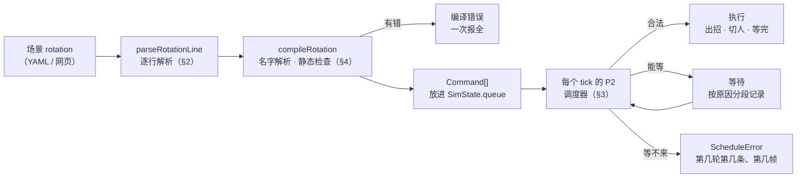

# 鸣潮 DPS 引擎 · TD-09 排轴脚本与调度语义 v0.1.3

> **状态**：v0.1.3（2026-10-04），已实现（`src/engine/scheduler.ts`）。v0.1.3 并回 M4：可选后缀 `?`（§2.2、§3.2）与"插队"（§3.2）。v0.1.2 并回声骸的 `Q`、按次数充能（§3.2）与稳态口径（§3.7，关闭 Q10），见附录。v0.1.1 并回 M2 / M3 实现时的决定（共用冷却、切人交给 TD-05、变奏与接续动作的指令出处、示意轴按现在的规则重算），见附录
> **依据**：《技术总体设计 v0.1.3》（下称"总设计"）§3.3 第 7 步、§3.5、§4 T6 / T7、§5.3、§6.5、第 8 节；《TD-04 仿真内核规格 v0.1》（下称"TD-04"）§1、§6、Q9、Q10；《TD-02 类型与 Schema v0.1.2》§6、§7；《TD-01 数据字典与抽取规格 v0.1.2》§13
> **下游**：TD-05（切人之后的变奏 / 延奏接在本文的 `onSwitch` 上）、TD-06（资源检查接在 `canAfford` 上）、TD-08（角色钩子 `canStart`、角色技能的冷却数值）、TD-10（等待记录、轮次边界、"指令的完成时刻"用于统计窗口）
> **验证**：TypeScript 原型 `src/engine/scheduler.ts`（约 280 行）跑通 11 组 33 个用例（§7）；TD-04 的 35 个用例改用本文的调度器后全部照旧通过；全量 119 条普攻连段按默认与强制各连按一遍（§8）；另请一个未参与编写的审阅者对照代码逐条核对了本文的规则与约 110 个数字（§7.4）

---

## 0. 范围与约定

**本文定**：排轴的文字语法；编译（名字解析、静态检查、报错格式）；调度语义，也就是每个 tick 的 P2 按什么顺序检查、什么时候执行、等待怎么记、什么时候报错；`+N` 与 `wait`；强制；切人的调度条件；技能冷却；循环；结束与帧数上限；指令的完成时刻。

**本文不定**：切人之后发生什么（变奏、延奏、协奏，TD-05）；资源够不够（大招能量、核心资源，TD-06）；角色特有的出招条件与技能冷却数值（TD-08）；DPS 统计窗口怎么取（TD-10）。它们通过 §3 的三个接口接进来。

**约定**：

- "第 k 条"是场景 `rotation` 列表的第 k 项（从 1 起），与 zod 报错路径 `rotation.(k−1)` 对应；一行写了几个动作时再加"第 i 个"。
- 排轴里写的帧数（`+N`、`wait N`）一律是**战斗帧**；等待记录、报错里的"第 f 帧"是世界帧，与事件日志的 `f` 一致。
- 例子里的数字都是 20260707 版数据的实跑结果。

### 0.1 要点

1. 一行是同一角色的若干动作，或一次切人，或一段等待：`散华 E A1 A2 +3 大招!`、`switch 椿`、`wait 30`（也可以写"切人""等待"）。`!` 表示强制，`+N` 表示再晚 N 帧，`?` 表示可选（条件不满足就跳过，v0.1.3）（§2）。
2. 编译期一次查出所有能静态查出的错：角色不在队伍、动作不存在、出招的人不在前台、切人到自己、单独写了变奏 / 延奏、循环时第 2 轮的前台对不上。前台只由 switch 改变，所以"谁在前台"编译期就能推出来（§4）。
3. 每个 tick 的 P2 从队首开始：能执行就执行，一个 tick 可以连续执行多条；不能执行就等；等不来就报错。出招依次检查：连段 → 输入锁 → 优先级 / 派生 → 冷却 → 资源 → 角色钩子 → 就绪 → 本 tick 是否已出过招 → `+N`（§3.2）。
4. 默认等"取消不丢东西"（就绪，TD-04 §6.4），`!` 跳过这一条。全量 119 条普攻连段里，默认策略没有把任何一条等断；有 7 条比强制慢，最多的是椿 A4 → A5，慢 96 帧（A4 的 20 段打完才出 A5，§3.4、§8）。
5. 等待按原因分段记录：原因代码、起止帧、世界帧数与战斗帧数。"不合法"的等待累计超过 `maxWait`（默认 600 世界帧）就报错；`+N` 与 `wait` 是有意的等待，不计入。报错时先写出正在等的那一段，日志保留到出错为止（§3.3）。
6. 切人：切人冷却 60 帧；"第 nF 前不能切人"按上一个动作的局部帧算，可以越过结束帧；切人不打断任何动作（§3.5）。
7. 技能冷却从动作开始时起算，按战斗时钟走，全局时停时不走；声骸技能共用一个冷却（§3.2）。
8. `repeat: N` 让整条轴执行 N 轮，每轮第一次出招或切人时记一条 `loop` 事件。第 2 轮接着第 1 轮结束时的状态跑，所以第 1 轮往往和稳态不一样：散华"E A1"第 1 轮 74 帧，之后每轮 79 帧（§3.7）。

---

## 1. 一条轴从文字到执行



调度器就是 TD-04 `tick(s, k, schedule)` 里的 `schedule`：P2 开头先结束到点的动作，再调用它；它返回"还有没有没执行的指令"，TD-04 据此判断仿真是否结束。

---

## 2. 语法

### 2.1 三种指令

| 指令 | 写法 | 说明 |
|---|---|---|
| 出招 | `<角色> <动作>[!][?] [+N] [<动作>[!][?] [+N] …]` | 该角色依次出这些动作，每个动作在最早合法帧开始 |
| 切人 | `switch <角色>` 或 `切人 <角色>` | 在最早合法帧切人；协奏满时自动变奏 / 延奏（TD-05） |
| 等待 | `wait <N>` 或 `等待 <N>` | 空等 N 个战斗帧；期间所有角色的动作、判定照常推进 |

### 2.2 出招

- **一行多个动作**：`散华 E A1 A2 A3` 等于四条指令（第 k 条的第 1–4 个），依次执行。只能是同一个角色；换人要另起一行 `switch`。
- **动作**写动作 ID（xlsx 的组名，如 `A2`、`大招`、`E1`）或角色模块里的别名（`R` → 大招；椿的 `E` → E1）。体型通用动作（`闪避`、`极限闪避`…）也能直接写。声骸技能写 `Q`（首位声骸的第一组；其余组写动作 ID，如无常凶鹭长按 `Q·喷火`、无冠者第二段 `Q·A2`，TD-01 §13.3）。
- **`!` 紧跟动作名**：强制，不等就绪（§3.4）。
- **`+N` 跟在动作后面**：最早合法之后再等 N 个战斗帧（§3.6）。`A2 +3`、`A2+3` 都行；`大招! +5` 是强制且再晚 5 帧。
- **`?` 紧跟动作名**（v0.1.3）：可选——冷却、资源、角色条件（钩子 `canStart`，谐度破坏要的"目标失谐"也在这里）不满足就跳过这条，不等（§3.2）。可以和 `!` 一起写（`E!?`、`E?!`），也可以与 `!` 一样单独跟在动作后面（`R ?`）。用途：谐度破坏留到写的位置才放（`椿 谐度破坏?`，TD-06 §13.4），"一日花能放就放"（`椿 E3?`）。
- 不支持条件、跳转和绝对时刻（总设计 T6）。

### 2.3 空白、注释与全角

- 空格分隔，全角空格也算；全角的 `！`、`？`、`＋`、`＃` 和全角数字按半角处理（中文输入法下不用切换）。
- 空格后的 `#` 起到行尾是注释。千咲 `电锯A2#2` 这种名字里的 `#` 前面没有空格，不受影响。YAML 本身也会去掉空格加 `#` 起的注释，所以两处写法一致。
- 空行、只有注释的行不产生指令（YAML 里只有注释的列表项读出来是 null，同样当空行）；整条轴一条指令都没有时报错。

### 2.4 语法错误

| 写法 | 报错 |
|---|---|
| `散华` | "散华" 只有角色名：格式为 <角色> <动作> [+N]、switch <角色> 或 wait <帧数> |
| `散华 +3` | "+3" 前面要有动作 |
| `散华 A2 3` | "3" 像是延迟，延迟要写成 +3 |
| `散华 A2 +3 +4` | A2 写了两个延迟 |
| `散华 E??` | 无法识别"E??"：动作写成 <动作>、<动作>!、<动作>? 或 <动作> +N |
| `等待 abc`、`switch` | 格式不对：应为 等待 <帧数> / switch <角色> |

### 2.5 例：M0 队伍的一条示意轴

```yaml
initial: { onField: 1 }            # 散华先上场；能量缺省满、协奏缺省 0
rotation:
  - 散华 E A1 A2 A3 A4 A5 R        # 第 1 条：7 个动作
  - switch 椿
  - 椿 A1 A2 A3 A4 A5!             # A5 强制：不等 A4 的 20 段打完
  - wait 30
  - switch 维里奈
  - 维里奈 E R
  - switch 散华
```

实跑（v0.1.1 按现在的规则重算：有冷却、能量、协奏与角色钩子）：

| 条 | 开始（世界帧） | 主要的等待 |
|---|---|---|
| 1 | E 0、A1 60、A2 86、A3 121、A4 158、A5 196、大招 230 | A1 等 E 的优先级降下来 60 帧；A2–A5 等派生窗口；大招等 A5 出手 34 帧 |
| 2 | 切人 341 | 散华大招的切人锁（局部第 91 帧前不能切人）：等了 111 世界帧，其中 90 帧在大招的全局时停里 |
| 3 | A1 341、A2 361、A3 395、A4 458、A5 510 | A5 强制，不等 A4 打完 |
| 4 | 510 起等 30 帧 | —— |
| 5 | 切人 540 | —— |
| 6 | E 540、大招 566 | 大招等 E 出手 26 帧 |
| 7 | 切人 706 | 切人冷却 140 世界帧：维里奈大招的全局时停里冷却不走 |

全程约 730 世界帧、534 战斗帧。三次都是普通切人：切出时协奏都没满（散华 75，椿 13，维里奈 68）。

- v0.1 的这条轴在椿那行写的是 `椿 E A1 …`：现在 `E` 指一段（白椿→盛绽），盛绽状态下普攻换成盛绽版本，`A1` 会被角色钩子挡住直到超时（TD-08 §5.2），所以改成只打普攻。
- 加上 `options: { repeat: 2 }` 时，第 2 轮的散华 E 要等冷却 90 帧，大招等冷却 394 帧之后还差能量（84.7 / 100），最终超时报错。循环的轴要按冷却与能量排；完整的三人轴见 `scenarios/m0-team.yaml`。

---

## 3. 调度语义

### 3.1 队列

- 指令严格按顺序执行，不并行；只有写了 `?` 的可选指令会被跳过（§3.2）。队首执行完才看下一条；一个 tick 里可以连续执行多条（散华 E、switch 椿、椿 E 可以都落在第 0 帧，T09-10）。
- 队首不能执行时，本 tick 不再往后看。
- 判断一律用 tick 开头的状态（局部帧、优先级、窗口、冷却、战斗帧），与 TD-04 §2.2 一致。
- 同一角色一个 tick 最多开始一个动作（TD-04 §1）。

### 3.2 出招：检查顺序

| # | 检查 | 不满足时 | 原因代码 | 出处 |
|---|---|---|---|---|
| 1 | 出招的人在前台 | 报错（编译期已查，这里兜底） | `notOnField` | §4.2 |
| 2 | 连段前置 `comboFrom` | 窗口未开：等；已过或上一个不是前置：**报错** | `combo` / `comboBroken` | TD-04 §6.2 |
| 3 | 输入锁 | 等 | `inputLock` | TD-04 §6.3 |
| 4 | 优先级 / 派生窗口 | 等 | `priority` / `derive` | TD-04 §6.1 |
| 5 | 技能冷却（含共用冷却组） | 等 | `cooldown` | 本节 |
| 6 | 大招能量（`energyCost`） | 等 | `resource` | TD-06 §2.3 `canAfford` |
| 7 | 角色钩子 `canStart` | 等 | `hook` | TD-08 |
| 8 | 就绪（没写 `!` 时） | 等 | `settled` | TD-04 §6.4、本文 §3.4 |
| 9 | 本 tick 还没开始过动作 | 等 1 帧 | `started` | TD-04 §1 |
| 10 | `+N` | 等 | `delay` | §3.6 |

全部满足就调用 `startAction`（TD-04 §4.2）：旧动作按规则取消，日志 `actionStart` 带上指令出处 `cmd: { line, item, loop }`，有冷却的动作从这一刻起算冷却。

- **为什么第 9 条放在后面**：刚出了 E 的那一帧，下一条 A1 既"本 tick 已出过招"又"优先级不够"。它放在后面，等待记录里才是真正的原因（优先级），而不是先冒出一帧"本 tick 已出过招"。它只在当前动作此刻就已就绪时单独出现：强制打断（`散华 A1 E!`，E 在第 1 帧，记一段 1 帧的 `started`，T09-3），或者当前动作本来就没有要等的判定（`散华 跳跃 大招`，大招在第 1 帧）。为此 TD-04 的 `gate` 也把它挪到了最后（§9.1）。
- **`+N` 放在最后**：它从"其余全部满足"的那个 tick 起算，所以必须排在第 9 条之后，否则会少等一帧（`散华 A1 E! +3`：E 最早第 1 帧，+3 后第 4 帧，T09-4）。
- **冷却**：声骸技能的冷却来自 xlsx 声骸表（`ActionDef.cooldown`）；角色技能的冷却 xlsx 没有，写在角色模块的 `actionOverrides.<动作>.cooldown`（帧）。从动作开始时起算，被取消也照走；P6 按战斗速率递减，全局时停时不走（T09-7）。声骸技能共用一个冷却（键 `echo`）；角色模块写了同一个 `cooldownGroup` 的几个动作共用一个冷却（椿 E1 / E2 共用 4 秒，一日花 E3 单独 25 秒）；其余按动作 ID 分开。按次数充能的技能交给角色钩子。 v0.1.2：冷却键先看 `cooldownGroup`（多段声骸的后续段写自己的 ID，不受声骸冷却限制，TD-01 §13.3）；**按次数充能**的技能（`charges`，如梦魇·无冠者 3 次、每 12 秒 +1）还有次数就能放，次数用完才等（等待原因"N 次都用掉了，下一次回复还要 n 帧"，TD-04 §6.5）。
- 冷却、资源、钩子都是"能等来的"：它们只让指令等待，不报错；真等不来时由 `maxWait` 兜底。
- **可选 `?`**（v0.1.3）：第 5–7 条（冷却、资源、钩子——状态条件）不满足时不等，跳过这条指令，记 `skip` 事件（`cmd`、`code`、`reason`），列进 `Summary.skipped`；第 2–4、8–10 条（门、就绪、本 tick、`+N`）照常等完再判断（冷却中的 `Y?` 先等前一个动作的派生、再判断冷却后跳过，`tests/td09.test.ts`）。被跳过的指令不开始轮次（第一条被跳过时，`loop` 事件记在下一条生效时）。
- **插队**（v0.1.3，`SchedulerOptions.interject`）：每次看队首之前先问一次要不要插一个动作——目前只有谐度破坏（`options.tuneBreak: auto` 时，目标失谐就由前台角色放，TD-06 §13.4）。插的动作按第 3–10 条同样检查（不强制、不延迟），等的时候记在队首指令名下、计入它的 `maxWait`；开始的动作不带指令出处（不影响 §3.9 的完成时刻）。

### 3.3 等待与报错

**原因代码** `WaitCode`：

| 代码 | 含义 | 计入 maxWait |
|---|---|---|
| `combo` | 等前置动作的派生窗口打开 | 是 |
| `inputLock` | 当前动作"第 nF 前不响应输入 / 不能闪避" | 是 |
| `priority` | 新动作优先级低于当前动作此刻的优先级 | 是 |
| `derive` | 优先级相等，等派生窗口 | 是 |
| `cooldown`、`resource`、`hook` | 冷却、资源、角色条件 | 是 |
| `settled` | 等当前动作就绪 | 是 |
| `started` | 同一角色本 tick 已开始过动作 | 是 |
| `switchCd`、`switchLock` | 切人冷却、切人锁 | 是 |
| `delay`、`wait` | `+N`、`wait N` | 否 |
| `at` | 测试台专用：等到某世界帧 | 否 |

**分段记录**：队首连续几个 tick 的原因代码相同，合成一段；代码变了或指令执行了，就结束这一段，写一条 `wait` 事件：

```ts
{ type: 'wait', f: 结束帧, cmd: { line, item, loop }, code, reason: '开始时的说明', from: 开始帧, frames: 世界帧数, battleFrames: 战斗帧数 }
```

例：散华 `E A1 A2 A3 A4 A5 R`（T09-10）记下 7 段——第 2 个动作 `priority` 60 帧、第 3–6 个 `combo` 26 / 35 / 36 / 38 帧、第 5 个另有 `settled` 1 帧、第 7 个 `settled` 34 帧。这就是总设计 T7 说的"等了多少帧、在等什么"。

**超时**：队首因"不合法"等待（`delay`、`wait`、`at` 以外）的世界帧累计超过 `options.maxWait`（默认 600，即 10 秒）时报错，信息带最后一个原因。用世界帧计，是因为它总在走（全局时停时战斗帧不走），保证一定能停下来。

**报错**：`ScheduleError { code, message, cmd, frame }`，仿真就此停止。报错前先把正在累计的等待段写进日志，已写出的事件日志保留，便于看停在哪里、等了什么（T09-8：超时前的 270 帧 `cooldown` 在日志里）。信息里的位置写成"第 k 条"，一行有几个动作时写成"第 k 条第 i 个"，循环中写成"第 2 轮第 k 条"。

| 代码 | 何时 | 例 |
|---|---|---|
| `comboBroken` | 连段前置的窗口已过，或上一个动作不是前置 | 第 1 条第 2 个 甲 A2：A1 的派生窗口已过，连段中断 |
| `timeout` | 不合法的等待超过 maxWait | 第 2 条等了 300 帧仍不能执行：X 冷却还剩 700 帧 |
| `maxFrames` | 到帧数上限时还有指令没执行 | 超过 50 帧，第 3 轮第 1 条还没执行；调大 options.maxFrames |
| `notOnField`、`switchSelf` | 编译期已查；运行期兜底 | 第 3 条：椿 不在前台 |
| `chainDepth` | 一条事件引出的事件链超过 `rules.maxChainDepth`（TD-07 §5） | 事件连锁超过 16 层：起点是第 0 帧的 甲 concerto +1（cast） |
| `invariant` | 不变量不成立（总设计 §11 第 4 条，是引擎的错） | 不变量不成立（第 5 帧）：甲 x 的伤害 … |

### 3.4 默认等就绪，`!` 强制（TD-04 Q9 定稿）

**规则**：同一角色的出招指令，默认还要等当前动作**就绪**——此时打断不会丢掉判定或资源（没走到的延奏触发转尾部照常发生，不用等，TD-04 §6.4）。写 `!` 跳过这一条，按游戏规则的最早时刻打断。切人不取消动作，不受影响。

**为什么默认等**：轴上写"A1 E"，意思是"A1 打出去再接 E"，不是"用 E 把 A1 抢掉"。按优先级 E 第 0 帧就能打断 A1，那样 A1 什么都没打出来。把"抢帧"写成显式的 `!`，轴的意思就不会被误读。

| 轴 | 默认 | 强制 | 差别 |
|---|---|---|---|
| 散华 `A1 E` | E 在第 14 帧 | E 在第 1 帧 | 强制时 A1 作废 |
| 散华 `A5 R` | 大招在 A5 起手后第 34 帧（等 A5 命中） | 第 1 帧 | 强制时 A5 作废 |
| 散华 `QTE` 接大招（第 42 帧起可被大招打断） | 第 56 帧（QTE 伤害第 55 帧出现） | 第 42 帧 | 强制时 QTE 伤害作废；上一位角色的延奏照常触发（Q1 已关闭） |
| 椿 `A1 … A5`（A4 → A5） | A5 在第 265 帧（A4 的 20 段打完） | 第 169 帧 | 强制时 A4 只打出 5 段，少 15 段、快 96 帧 |

哪种更好不是调度器该回答的：两种写法都跑一遍，比 DPS（TD-10）。

**全量检查**（§8）：119 条普攻连段按默认连按，没有一条因为等就绪而错过派生窗口；111 条默认与强制的起手时刻完全相同，7 条默认更慢，1 条（凌阳）两种都接不上。

### 3.5 切人

- **条件**：目标不是当前前台（编译期已查）；切人冷却为 0（`rules.switchCooldown` = 60 帧，按战斗时钟走）；前台角色**上一个动作**的"第 nF 前不能切人"已过。
- **切人锁可以越过结束帧**：按上一个动作的局部帧算，与派生窗口一样动作结束后照走（TD-04 §6.2）。散华 QTE 结束帧 63、备注"第70F前不能切人"，第 70 帧才能切（T09-6）。
- **执行**：换前台、启动切人冷却，然后调用 `onSwitch`（TD-05 §2）：它先算出是不是变奏切人，再记 `switch` 事件（带 `cmd` 与 `intro`），处理切出与切入（清除 buff、挂起的 nextIn、变奏动作）。没接 `onSwitch` 时（测试台）调度器自己记 `switch`。切人本身不碰被切下角色的动作（总设计不变量 3）：它在后台把动作走完（T09-6：A1 同帧切走，第 13 帧照常命中）。例外见 TD-05：变奏切人时切入者在后台的动作被变奏动作取消；"第nF后切人结束技能"的动作在切出时按取消处理。
- 切人后同一 tick 就能让新前台出招（变奏切人时要等变奏动作的优先级与输入锁）。游戏里有没有"出场"的间隔，见 TD-05 Q8（Q5）。
- **切人会结束动作的备注**（TD-05 §5）：
  - 已实现："第nF后切人（立即）结束技能 / 消失"与"切人立即结束 / 消失"由构建脚本抽成 `endOnSwitchOut`，切出时局部帧已过就按取消处理。M0 队伍里是椿 A4（72）与盛绽·A3循环聚怪（24）。
  - 未实现："第nF前切人不消失 / 不离场"（陆·赫斯、赞妮、露帕）；没有帧数的"不能切人"（全量 118 组，大半是谐度破坏）——仍按"切人不打断动作、没有锁"处理（Q6）。

### 3.6 `+N` 与 `wait N`

- 两者都按**战斗帧**：与 DPS 分母同一口径，全局时停期间不走。散华大招（全局时停 90 帧）里写 `wait 30`，世界帧过了 120 帧（T09-5）。
- **`+N`**：从队首第一次"其余检查全部满足"（含本 tick 已出过招；强制时不含就绪）的那个 tick 起算，再过 N 个战斗帧执行。这期间条件又不满足了就接着等；等不来照常报错——`A1 A2 +40`：A2 最早第 26 帧，再等 40 帧时 A1 的派生窗口已在第 55 帧关闭，报"连段中断"（T09-3）。
- **`wait N`**：从队首变成它的那个 tick 起算，N 个战斗帧后完成。`wait 0` 立即完成。
- 两者都不计入 maxWait（T09-8）。

### 3.7 循环

- `options.repeat = N`：整条轴执行 N 轮；第 k 轮的指令出处带 `loop: k`。
- **边界**：每轮第一次出招或切人时记 `{ type: 'loop', loop: k }`；整轮只有等待时，记在开始等待时。等下一轮第一个动作的时间（等能量、等冷却、轮首的 `wait`）因此算在上一轮里：`wait 10、E` × 3 的边界是每轮 E 起手的第 10 / 40 / 70 帧，不是开始等待的第 0 / 10 / 40 帧（T09-4）。
- **状态延续**：第 2 轮接着第 1 轮结束时的状态跑——能量、协奏、冷却、残留的顿帧、后台还在走的动作都在。初始资源只在第 1 轮开头设置。
- 例：散华 `E A1` × 3，三轮从第 0、74、153 帧开始：第 1 轮 74 帧，之后每轮 79 帧。第 2 轮的 E 是在上一轮 A1 命中后起手的，A1 留在散华身上的自身顿帧还没走完，把 E 的优先级变化帧推后了 5 帧（T09-9）。所以稳态要看后面的轮次（Q10）。
- 编译期检查第 2 轮的前台（§4.2）。
- **分轮与稳态**（v0.1.2，总设计 §3.5、TD-10 §2）：汇总按上面的边界给出每一轮的时长、伤害、DPS 与资源首尾差；稳态取完整的轮（第 2 轮到倒数第 2 轮），最后一轮没有下一轮的边界、偏高，不取。要比稳态，轴的结尾要回到第 1 轮开头的局面（如 M0 代表轴结尾 `switch 维里奈`），循环 4 轮左右。

### 3.8 结束与帧数上限

- 仿真在指令全部执行完、三人空闲、没有存活的判定和尾部时结束（TD-04 §1）。
- `options.maxFrames`（默认 3600 世界帧）到了：还有指令没执行 → 报错 `maxFrames`；指令都执行完了、只剩判定或尾部 → 停下，记一条 `warning`（`maxFrames`），已结算的照常汇总。

### 3.9 指令的完成时刻（给 TD-10）

| 指令 | 开始 | 完成 |
|---|---|---|
| 出招 | `actionStart` 的帧 | 该动作实例自然结束（`actionEnd`）或被取消（`actionCancel`）的帧；有接续动作（TD-08 P10）时，按最后一个接续动作结束的帧 |
| 切人 | `switch` 的帧 | 同一帧；变奏切人时变奏动作带这条指令的出处，按变奏动作（及其接续动作）结束的帧（TD-05 §2） |
| `wait N` | 队首变成它的帧 | 等满的帧 |

总设计 §3.5 的统计窗口"到最后一条指令对应动作的结束帧"，就是最后一条指令的完成时刻（实现：最后一个带指令出处的 `actionStart` 对应的结束 / 取消，与最后一次切人、`wait` 取晚的；被跳过的可选指令、插队的动作都不算）。循环时每轮的区间是 [本轮 `loop` 事件, 下一轮 `loop` 事件)；最后一轮没有下一轮的边界，稳态窗口怎么取留给 TD-10（Q10）。

---

## 4. 编译

### 4.1 名字解析

- **角色**：队伍里的名字，原样匹配（只 trim）。
- **动作**：先按动作 ID 精确匹配，再查别名；都没有就报错，并列出这个角色的别名。不做模糊匹配（AGENTS.md）；只认表里自有的键，`toString` 之类不会被误认成动作。
- 动作表 = 角色动作（按链数挑过判定，TD-01 §13.2）+ 体型通用动作 + 首位声骸（M2）。
- **变奏（`intro`）、延奏（`outro`）不能单独写**：它们由切人触发（TD-05）。测试台可以直接开始它们，用来看单个动作的时间线（如 T01-15 的散华 QTE 接大招）。

### 4.2 静态检查

前台只由 switch 改变，引擎不会自动换人，所以每条出招指令执行时谁在前台，编译期就确定了：从 `initial.onField` 起，沿着 switch 往下推。

- 出招的人必须在前台："椿 不在前台（前台是 散华）；先写 switch 椿"。
- switch 的目标不能是当前前台："switch 散华：散华 已经在前台"。
- `repeat ≥ 2` 时，从第 1 轮结束时的前台再推一遍第 2 轮，只报第一处："循环第 2 轮：甲 不在前台（前台是 乙）；循环的轴，末尾要让前台回到 甲"。
- 编译期不查连段窗口、冷却、资源：它们依赖时间，运行期判断。

### 4.3 报错格式

所有问题一次报全，按行排序，每条带第几条、第几个。有错的那一项跳过，其余照常检查，所以一个笔误不会掩盖别处的问题；只有切人的目标写错时不再查前台，免得后面连带报一串"不在前台"（T09-2）：

| 条 | 写法 | 报错 |
|---|---|---|
| 1 | `乙 E` | 乙 不在前台（前台是 甲）；先写 switch 乙 |
| 2 | `甲 QTE` | 甲 QTE 是变奏，由切人自动触发（协奏满时），不能单独写 |
| 3 | `switch 甲` | switch 甲：甲 已经在前台 |
| 4 | `甲 X` | 甲 没有动作"X"（别名：R） |
| 5 | `丁 E` | 丁 不在队伍里（队伍：甲、乙、丙） |

场景 schema（TD-02 §6）在读文件时已经查过语法和角色名，编译再查一遍是为了让网页编辑器、搜索器生成的轴走同一条路。

---

## 5. 类型

`src/data/scenario.schema.ts`：

```ts
export type RotationItem =
  | { kind: 'act'; char: string; action: string; delay: number; force: boolean; optional?: true }   // optional：v0.1.3
  | { kind: 'switch'; char: string }
  | { kind: 'wait'; frames: number }

/** 解析一行：返回这一行的指令（空行、纯注释 → []），或错误说明 */
export function parseRotationLine(text: string): RotationItem[] | { error: string }

/** 编译后的指令。line 从 1 起，item 是行内第几个（从 1 起） */
export type Command =
  | { kind: 'act'; line: number; item: number; slot: Slot; action: ActionId; delay: Frame; force: boolean; optional?: true }
  | { kind: 'switch'; line: number; item: number; to: Slot }
  | { kind: 'wait'; line: number; item: number; frames: Frame }
  | { kind: 'at'; line: number; item: number; frame: number }   // 仅测试台：等到世界帧 frame；排轴语法写不出来
```

`src/engine/types.ts`：

```ts
/** 调度器的状态：放在 SimState 里，随状态一起 structuredClone（总设计 T13） */
export interface QueueState {
  commands: Command[]
  repeat: number                            // 整条轴执行几轮（options.repeat）
  next: number                              // 队首指令的下标
  loop: number                              // 当前第几轮（从 1 起）
  loopBegun: boolean                        // 本轮的第一条指令是否已生效（生效时记 loop 事件）
  waited: number                            // 队首因"不合法"已经等了几个世界帧（maxWait 计时；+N、wait 不算）
  readyAt: number | null                    // 队首第一次全部合法时的战斗帧（+N 从这里起算）
  until: number | null                      // wait N：到这个战斗帧结束
  seg: WaitSegment | null                   // 正在累计的等待段（原因不变就合成一段）
}
export interface WaitSegment { code: WaitCode; reason: string; from: number; battleFrom: number }
export type WaitCode =
  | 'started' | 'combo' | 'inputLock' | 'priority' | 'derive'
  | 'cooldown' | 'resource' | 'hook' | 'settled'
  | 'switchCd' | 'switchLock'
  | 'delay' | 'wait' | 'at'
/** 指令在事件里的出处 */
export interface CommandRef { line: number; item: number; loop: number }

// SimEvent 的变化
//   actionStart、switch：新增 cmd?: CommandRef（由指令触发时）
//   wait：{ cmd, code, reason, from, frames, battleFrames }（取代 v0.1.2 的 { line, frames, reason }）
//   新增 { type: 'loop'; loop: number }
//   新增 { type: 'skip'; cmd; code; reason }（v0.1.3：可选指令被跳过）；Summary.skipped：{ line, item, loop, reason }[]
// SchedulerOptions 新增 interject?(s) → { slot, def, why } | null（v0.1.3：插队）
// Summary.waits：{ line, item, loop, code, frames, reason }[]（v0.1.1：带 item）
```

`src/engine/kernel.ts` 的改动（TD-04 v0.1.1）：`GateResult` 的失败分支带原因代码，连段已断单独是 `{ wait: false, code: 'comboBroken' }`；`gate` 把"本 tick 已开始过动作"放到最后判断；`startAction(s, k, slot, def, cmd?)` 记下指令出处并起算冷却；新增 `cooldownKey(def)`；P6 按战斗速率递减技能冷却。

`src/data/define.ts`：`ActionOverride` 新增 `cooldown`（角色技能冷却）、`cooldownGroup`（v0.1.1：共用冷却的组名）与 `comboFrom`（自动推断之外的连段前置，TD-04 Q8）。

---

## 6. 代码 `src/engine/scheduler.ts`

v0.1.1 起本文不再内嵌代码，以仓库为准。调度器只依赖内核的 `gate` / `settled` / `startAction` / `tick` 与类型；资源、角色条件、切人后续三件事通过 `SchedulerOptions` 的回调接入（仿真里分别接 TD-06 `canAfford`、TD-08 `canStart`、TD-05 `onSwitch`），没接时分别是"总是够""总是允许""只换前台并记 `switch`"。导出：

| 名字 | 作用 |
|---|---|
| `compileRotation(lines, team, onField, repeat?)` | rotation 行 → `Command[]`，静态错误一次报全（§4） |
| `createScheduler(k, actions, opts)` | 返回 P2 用的 `schedule(s)`（§3） |
| `newQueue(commands, repeat?)` | 初始队列状态 |
| `runLoop(s, k, schedule, maxFrames)` | 主循环与帧数上限（§3.8） |
| `ScheduleError` | 运行期报错：`comboBroken`、`timeout`、`maxFrames`、`notOnField`、`switchSelf`、`chainDepth`（TD-07 §5）、`invariant`（总设计 §11 第 4 条） |
| `SchedulerOptions` | `maxWait`、`canAfford?`、`canStart?`、`onSwitch?` |

## 7. 测试用例

### 7.1 测试台

`tests/helpers/kernel-harness.ts` 的 `run()` 改用本文的调度器（`createScheduler` + `runLoop`），原来那个只够 TD-04 用的最小调度器删掉了。指令可以写成已解析的 `Cmd`（槽位 + 动作 ID，另有测试专用的 `at`），也可以直接给编译好的 `Command[]`。`tryRun()` 在调度报错时不抛出，而是连同出错前的状态与日志一起返回。新增 `member(模块, 链数)`：角色动作 + 体型通用动作 + 别名，用来编译真实的轴。

TD-04 的 35 个用例全部照旧通过。唯一的改动是 T04-4："连段中断"的报错现在带出处（"第 3 条 甲 A2：A1 的派生窗口已过，连段中断"），断言改为"包含"。

### 7.2 用例

`tests/td09.test.ts`。T09-1、T09-2、T09-4、T09-6 的前半、T09-7、T09-8 用人造动作，没有数据也能跑；其余用 20260707 版的真实数据，缺数据时跳过。

```ts
// tests/td09.test.ts —— TD-09 排轴脚本与调度语义的用例
// T09-1、T09-2、T09-4、T09-6（前半）、T09-7、T09-8 用人造动作，总能跑；其余依赖 data/generated（没有时跳过）。
import { readFileSync, readdirSync } from 'node:fs'
import { describe, expect, test } from 'vitest'
import { parseRotationLine } from '../src/data/scenario.schema'
import type { ActionDef } from '../src/data/gamedata'
import { compileRotation, ScheduleError, type CompileMember } from '../src/engine/scheduler'
import 椿 from '../data/curated/characters/椿'
import 散华 from '../data/curated/characters/散华'
import 维里奈 from '../data/curated/characters/维里奈'
import { action, block, dataDescribe, eventsOf, hasData, judgment, member, run, tryRun, type Cmd, type RunResult } from './helpers/kernel-harness'

const starts = (r: RunResult) => eventsOf(r, 'actionStart').map(e => `${e.action}@${e.f}`)
const waits = (r: RunResult) => eventsOf(r, 'wait').map(e => `${e.cmd.line}:${e.code} ${e.from}+${e.frames}`)
const thrown = (f: () => unknown): ScheduleError => {
  try { f() } catch (e) { if (e instanceof ScheduleError) return e; throw e }
  throw new Error('没有报错')
}

// 人造动作：A1 → A2 连段、E（优先级 4）、大招（10）、变奏
const A = (id: string, o: Partial<ActionDef> = {}): ActionDef => action({ id, endFrame: 30, ...o })
const acts: Record<string, ActionDef> = {
  A1: A('A1', { cancelWindows: [{ from: 10, until: 40, row: 0 }] }),
  A2: A('A2', { comboFrom: ['A1'] }),
  E: A('E', { priority: [{ fromFrame: 0, value: 4 }] }),
  大招: A('大招', { kind: 'liberation', priority: [{ fromFrame: 0, value: 10 }] }),
  QTE: A('QTE', { kind: 'intro' }),
}
const fake: CompileMember[] = ['甲', '乙', '丙'].map(name => ({ name, actions: acts, aliases: { R: '大招' } }))

describe('T09-1 语法（§2）', () => {
  const act = (action: string, delay = 0, force = false) => ({ kind: 'act', char: '散华', action, delay, force })
  test('一行多个动作、强制、延迟', () => {
    expect(parseRotationLine('散华 E A1 A2 +3 大招!')).toEqual([act('E'), act('A1'), act('A2', 3), act('大招', 0, true)])
    expect(parseRotationLine('散华 大招 ! +5')).toEqual([act('大招', 5, true)])
    expect(parseRotationLine('散华 A2+3')).toEqual([act('A2', 3)])
  })
  test('全角标点与全角空格、注释、中文关键词', () => {
    expect(parseRotationLine('散华　大招！ ＋5   # 开大')).toEqual([act('大招', 5, true)])
    expect(parseRotationLine('# 第二轮')).toEqual([])
    expect(parseRotationLine('千咲 电锯A2#2')).toEqual([{ kind: 'act', char: '千咲', action: '电锯A2#2', delay: 0, force: false }])
    expect(parseRotationLine('切人 长离')).toEqual([{ kind: 'switch', char: '长离' }])
    expect(parseRotationLine('等待 20')).toEqual([{ kind: 'wait', frames: 20 }])
    expect(parseRotationLine('散华 A2 ＋３ E ＃注释')).toEqual([act('A2', 3), act('E')])   // 全角数字、＃ 也按半角
    expect(parseRotationLine('等待 ３０')).toEqual([{ kind: 'wait', frames: 30 }])
  })
  test('错误', () => {
    const err = (s: string) => { const r = parseRotationLine(s); return 'error' in r ? r.error : '' }
    expect(err('散华')).toContain('只有角色名')
    expect(err('散华 +3')).toContain('前面要有动作')
    expect(err('散华 A2 3')).toContain('延迟要写成 +3')
    expect(err('散华 A2 +3 +4')).toContain('两个延迟')
    expect(err('散华 A2 +0 +4')).toContain('两个延迟')
    expect(err('等待 abc')).toContain('格式不对')
    expect(err('switch')).toContain('格式不对')
  })
})

describe('T09-2 编译：名字解析与静态检查（§4）', () => {
  test('别名、行号与行内序号', () => {
    const r = compileRotation(['甲 E R', 'switch 乙', '乙 A1 A2! +3', 'wait 10'], fake, 0)
    expect(r).toEqual({
      ok: true, commands: [
        { kind: 'act', line: 1, item: 1, slot: 0, action: 'E', delay: 0, force: false },
        { kind: 'act', line: 1, item: 2, slot: 0, action: '大招', delay: 0, force: false },
        { kind: 'switch', line: 2, item: 1, to: 1 },
        { kind: 'act', line: 3, item: 1, slot: 1, action: 'A1', delay: 0, force: false },
        { kind: 'act', line: 3, item: 2, slot: 1, action: 'A2', delay: 3, force: true },
        { kind: 'wait', line: 4, item: 1, frames: 10 },
      ],
    })
  })
  test('错误一次报全，按行排序', () => {
    const r = compileRotation(['乙 E', '甲 QTE', 'switch 甲', '甲 X', '丁 E'], fake, 0)
    expect(r.ok).toBe(false)
    if (r.ok) return
    expect(r.issues.map(i => `${i.line}: ${i.message}`)).toEqual([
      '1: 乙 不在前台（前台是 甲）；先写 switch 乙',
      '2: 甲 QTE 是变奏，由切人自动触发（协奏满时），不能单独写',
      '3: switch 甲：甲 已经在前台',
      '4: 甲 没有动作"X"（别名：R）',
      '5: 丁 不在队伍里（队伍：甲、乙、丙）',
    ])
  })
  test('名字按自有键查：toString 之类不会误认成动作；切人写错时不连带报前台', () => {
    const r = compileRotation(['甲 toString', 'switch 丁', '乙 E'], fake, 0)
    expect(r.ok ? [] : r.issues.map(i => `${i.line}: ${i.message}`)).toEqual([
      '1: 甲 没有动作"toString"（别名：R）',
      '2: 丁 不在队伍里（队伍：甲、乙、丙）',
    ])
  })
  test('循环：第 2 轮从第 1 轮结束时的前台开始', () => {
    const lines = ['甲 E', 'switch 乙', '乙 E']
    expect(compileRotation(lines, fake, 0, 1).ok).toBe(true)
    const r = compileRotation(lines, fake, 0, 2)
    expect(r.ok ? [] : r.issues.map(i => i.message)).toEqual(['循环第 2 轮：甲 不在前台（前台是 乙）；循环的轴，末尾要让前台回到 甲'])
    expect(compileRotation([...lines, 'switch 甲'], fake, 0, 2).ok).toBe(true)
  })
})

const common = hasData ? block('通用-中@女') : {}
const sh = hasData ? { ...common, ...block('散华') } : {}
const SH = [sh, sh, sh]
const shRun = (cmds: Cmd[], o = {}) => run(SH, cmds, { names: ['散华', '乙', '丙'], ...o })

dataDescribe('T09-3 最早合法帧与等待记录：散华', () => {
  test('E → A1：A1（2）要等 E 的优先级从 4 降到 2（第 60 帧），记一段"优先级"等待', () => {
    const r = shRun([{ act: 0, action: 'E' }, { act: 0, action: 'A1' }])
    expect(starts(r)).toEqual(['E@0', 'A1@60'])
    expect(waits(r)).toEqual(['2:priority 0+60'])
  })
  test('A1 → E：默认等 A1 的判定出手（第 14 帧）；强制则第 1 帧（同一角色一个 tick 只能开始一个动作）', () => {
    expect(waits(shRun([{ act: 0, action: 'A1' }, { act: 0, action: 'E' }]))).toEqual(['2:settled 0+14'])
    const f = shRun([{ act: 0, action: 'A1' }, { act: 0, action: 'E', force: true }])
    expect(starts(f)).toEqual(['A1@0', 'E@1'])
    expect(waits(f)).toEqual(['2:started 0+1'])
  })
  test('+N：A2 最早第 26 帧（等 A1 的派生窗口），+3 → 第 29 帧', () => {
    const r = shRun([{ act: 0, action: 'A1' }, { act: 0, action: 'A2', delay: 3 }])
    expect(starts(r)).toEqual(['A1@0', 'A2@29'])
    expect(waits(r)).toEqual(['2:combo 0+26', '2:delay 26+3'])
  })
  test('+N 把连段等断：A2 +40 → 窗口关闭时（第 55 帧）报"连段中断"', () => {
    const e = thrown(() => shRun([{ act: 0, action: 'A1' }, { act: 0, action: 'A2', delay: 40 }]))
    expect([e.code, e.frame, e.cmd]).toEqual(['comboBroken', 55, { line: 2, item: 1, loop: 1 }])
    expect(e.message).toBe('第 2 条 散华 A2：A1 的派生窗口已过，连段中断')
  })
})

describe('T09-4 人造动作：+N 从"全部满足"起算；只有等待开头的轮次', () => {
  test('A1 E! +3：E 最早第 1 帧（本 tick 已出过招），再等 3 帧 → 第 4 帧', () => {
    const r = run([acts, acts, acts], [{ act: 0, action: 'A1' }, { act: 0, action: 'E', force: true, delay: 3 }])
    expect(starts(r)).toEqual(['A1@0', 'E@4'])
    expect(waits(r)).toEqual(['2:started 0+1', '2:delay 1+3'])
  })
  test('wait 10、E × 3：轮次边界在每轮的 E 起手时（第 10 / 40 / 70 帧），不在开始等待时', () => {
    const r = run([acts, acts, acts], [{ wait: 10 }, { act: 0, action: 'E' }], { repeat: 3 })
    expect(starts(r)).toEqual(['E@10', 'E@40', 'E@70'])
    expect(eventsOf(r, 'loop').map(e => e.f)).toEqual([10, 40, 70])
  })
  test('空的指令表：直接结束', () => {
    expect(run([acts, acts, acts], [], { repeat: 2 }).frames).toBe(0)
  })
})

dataDescribe('T09-5 wait N 与 +N 按战斗帧：散华', () => {
  test('A1、wait 60、E：E 在第 60 帧', () => {
    const r = shRun([{ act: 0, action: 'A1' }, { wait: 60 }, { act: 0, action: 'E' }])
    expect(starts(r)).toEqual(['A1@0', 'E@60'])
    expect(waits(r)).toEqual(['2:wait 0+60'])
  })
  test('大招的全局时停里 wait 30：战斗帧 30，世界帧 120', () => {
    const r = shRun([{ act: 0, action: '大招' }, { wait: 30 }])
    expect(eventsOf(r, 'wait').map(e => [e.frames, e.battleFrames])).toEqual([[120, 30]])
  })
})

describe('T09-6 切人（§3.5）', () => {
  test('切人冷却 60 帧', () => {
    const r = run([acts, acts, acts], [{ switch: 1 }, { switch: 0 }])
    expect(eventsOf(r, 'switch').map(e => `${e.to}@${e.f}`)).toEqual(['乙@0', '甲@60'])
    expect(waits(r)).toEqual(['2:switchCd 0+60'])
  })
  dataDescribe('真实数据', () => {
    test('切人不打断动作：A1 同帧切走，A1 在后台第 13 帧照常命中', () => {
      const r = shRun([{ act: 0, action: 'A1' }, { switch: 1 }])
      expect(eventsOf(r, 'switch').map(e => e.f)).toEqual([0])
      expect(r.hits.map(h => `${h.judgment}@${h.f}`)).toEqual(['A1@13'])
    })
    test('切人锁越过结束帧：散华 QTE 结束帧 63，"第70F前不能切人" → 第 70 帧才能切', () => {
      const r = shRun([{ act: 0, action: 'QTE' }, { switch: 1 }])
      expect(eventsOf(r, 'switch').map(e => e.f)).toEqual([70])
      expect(waits(r)).toEqual(['2:switchLock 0+70'])
    })
  })
})

describe('T09-7 技能冷却按战斗时钟（§3.2）', () => {
  const X = A('X', { cooldown: 100 })
  const Y = A('Y', { endFrame: 60, dilations: [{ type: '全局时停', anchor: 'action', start: 1, ally: { rate: 0, duration: 50 } }] })
  const T: Record<string, ActionDef>[] = [{ X, Y }, {}, {}]
  test('X 冷却 100：第二次 X 先等 X 结束（30），再等冷却到第 100 帧', () => {
    const r = run(T, [{ act: 0, action: 'X' }, { act: 0, action: 'X' }])
    expect(starts(r)).toEqual(['X@0', 'X@100'])
    expect(waits(r)).toEqual(['2:derive 0+30', '2:cooldown 30+70'])
  })
  test('中间插一个 50 帧的全局时停：冷却停走，第二次 X 推迟到第 150 帧', () => {
    const r = run(T, [{ act: 0, action: 'X' }, { act: 0, action: 'Y' }, { act: 0, action: 'X' }])
    expect(starts(r)).toEqual(['X@0', 'Y@30', 'X@150'])
  })
})

describe('T09-8 等不来：超时与报错位置（§3.3）', () => {
  test('冷却 1000、maxWait 300：第 2 条等满 300 帧报错', () => {
    const T: Record<string, ActionDef>[] = [{ X: A('X', { cooldown: 1000 }) }, {}, {}]
    const e = thrown(() => run(T, [{ act: 0, action: 'X' }, { act: 0, action: 'X' }], { maxWait: 300 }))
    expect([e.code, e.frame, e.cmd?.line]).toEqual(['timeout', 300, 2])
    expect(e.message).toBe('第 2 条等了 300 帧仍不能执行：X 冷却还剩 700 帧')
  })
  test('报错前先把正在等的那一段写进日志；一行多个动作时报到"第几个"', () => {
    const T: Record<string, ActionDef>[] = [{ X: A('X', { cooldown: 1000 }) }, {}, {}]
    const t = tryRun(T, [{ act: 0, action: 'X' }, { act: 0, action: 'X' }], { maxWait: 300 })
    expect([t.error?.code, waits(t)]).toEqual(['timeout', ['2:derive 0+30', '2:cooldown 30+270']])
    const c = compileRotation(['甲 A1 A2 +40'], fake, 0)
    const e = thrown(() => run([acts, acts, acts], c.ok ? c.commands : []))
    expect([e.code, e.frame, e.message]).toEqual(['comboBroken', 40, '第 1 条第 2 个 甲 A2：A1 的派生窗口已过，连段中断'])
  })
  test('帧数上限：还有指令没执行 → 报错并指出下一条；只剩判定 → 停下记警告', () => {
    const e = thrown(() => run([acts, acts, acts], [{ act: 0, action: 'E' }], { repeat: 3, maxFrames: 50 }))
    expect([e.code, e.message]).toEqual(['maxFrames', '超过 50 帧，第 3 轮第 1 条还没执行；调大 options.maxFrames'])
    const long = A('L', { judgments: [judgment({ name: 'L', spawnFrame: 5, lifeFrames: 400, ticks: 4, tickInterval: 100 })] })
    const r = run([{ L: long }, {}, {}], [{ act: 0, action: 'L' }], { maxFrames: 100 })
    expect(eventsOf(r, 'warning').map(w => w.code)).toEqual(['maxFrames'])
  })
  test('+N 与 wait 是写轴的人要的等待，不计入 maxWait', () => {
    const r = run([acts, acts, acts], [{ wait: 500 }, { act: 0, action: 'E', delay: 400 }], { maxWait: 300 })
    expect(starts(r)).toEqual(['E@900'])
  })
})

dataDescribe('T09-9 循环（§3.7）：散华 E A1 × 3', () => {
  const r = shRun([{ act: 0, action: 'E' }, { act: 0, action: 'A1' }], { repeat: 3 })
  test('每轮第一条指令生效时记 loop 事件；第 1 轮从空闲开始，比稳态短 5 帧', () => {
    expect(eventsOf(r, 'loop').map(e => `${e.loop}@${e.f}`)).toEqual(['1@0', '2@74', '3@153'])
    expect(starts(r)).toEqual(['E@0', 'A1@60', 'E@74', 'A1@139', 'E@153', 'A1@218'])
  })
  test('等待记录带轮次', () => {
    expect(eventsOf(r, 'wait').map(e => `${e.cmd.loop}.${e.cmd.line}:${e.code} ${e.frames}`))
      .toEqual(['1.2:priority 60', '2.1:settled 14', '2.2:priority 65', '3.1:settled 14', '3.2:priority 65'])
  })
})

dataDescribe('T09-10 编译 + 运行：M0 队伍（椿 0 链、散华 6 链、维里奈 3 链）', () => {
  const team = hasData ? [member(椿, 0), member(散华, 6), member(维里奈, 3)] : []
  const go = (lines: string[], onField: 0 | 1 | 2, repeat = 1) => {
    const c = compileRotation(lines, team, onField, repeat)
    if (!c.ok) throw new Error(c.issues.map(i => i.message).join('；'))
    return run(team.map(m => m.actions), c.commands, { names: ['椿', '散华', '维里奈'], onField, repeat, maxWait: 600 })
  }
  test('散华 E A1…A5 R：大招默认等 A5 出手，第 230 帧', () => {
    const r = go(['散华 E A1 A2 A3 A4 A5 R'], 1)
    expect(starts(r)).toEqual(['E@0', 'A1@60', 'A2@86', 'A3@121', 'A4@158', 'A5@196', '大招@230'])
    expect(eventsOf(r, 'wait').map(e => `${e.cmd.item}:${e.code} ${e.frames}`))
      .toEqual(['2:priority 60', '3:combo 26', '4:combo 35', '5:combo 36', '5:settled 1', '6:combo 38', '7:settled 34'])
  })
  test('椿 A1…A5：默认等 A4 的 20 段打完，A5 在第 265 帧；强制 A5 在第 169 帧，A4 只打出 5 段', () => {
    const d = go(['椿 A1 A2 A3 A4 A5'], 0)
    const f = go(['椿 A1 A2 A3 A4 A5!'], 0)
    expect([starts(d).at(-1), starts(f).at(-1)]).toEqual(['A5@265', 'A5@169'])
    const a4 = (r: RunResult) => r.hits.filter(h => h.judgment.startsWith('A4-')).length
    expect([a4(d), a4(f)]).toEqual([20, 5])
  })
  test('三人各放一次 E 轮换两轮：切人不打断动作，每次切人等切人冷却', () => {
    const r = go(['散华 E', 'switch 椿', '椿 E', 'switch 维里奈', '维里奈 E', 'switch 散华'], 1, 2)
    expect(eventsOf(r, 'switch').map(e => e.f)).toEqual([0, 60, 120, 180, 240, 300])
    expect(eventsOf(r, 'loop').map(e => e.f)).toEqual([0, 120])
    expect(starts(r)).toEqual(['E@0', 'E1@0', 'E@60', 'E@120', 'E1@180', 'E@240'])
  })
})

dataDescribe('T09-11 全量：每条普攻连段按默认与强制各连按一遍（§8）', () => {
  const dir = new URL('../data/generated/', import.meta.url)
  const chars = JSON.parse(readFileSync(new URL('characters.json', dir), 'utf8')) as Record<string, { commonBlock: string | null }>
  let chains = 0, slower = 0, maxGap = 0
  const broken: string[] = [], noWindow: string[] = []
  for (const f of readdirSync(new URL('actions/', dir))) {
    const key = f.replace(/\.json$/, '')
    if (key.startsWith('通用')) continue
    const cb = chars[key]?.commonBlock
    const b = { ...(cb ? block(cb) : {}), ...block(key) }
    for (const [id, d] of Object.entries(b)) {
      if (d.flags.includes('comboNoWindow')) noWindow.push(`${key} ${id}`)
      if (!d.comboFrom?.length || Object.values(b).some(x => x.comboFrom?.includes(id))) continue   // 只从链尾往回找
      const chain = [id]
      for (let cur = d; cur.comboFrom?.length && b[cur.comboFrom[0]!]; cur = b[cur.comboFrom[0]!]!) chain.unshift(cur.comboFrom[0]!)
      chains++
      const last = (force: boolean) => {
        const r = run([b, b, b], chain.map(a => ({ act: 0 as const, action: a, force })), { maxFrames: 5000 })
        return eventsOf(r, 'actionStart').at(-1)!.f
      }
      try {
        const gap = last(false) - last(true)
        if (gap > 0) { slower++; maxGap = Math.max(maxGap, gap) }
      } catch { broken.push(`${key} ${chain.join('→')}`) }
    }
  }
  test('119 条连段，默认策略没有把任何一条等断；断的只有凌阳 A3 → A4（A4 起手优先级 2 低于 A3 的 3，数据问题）', () => {
    expect(chains).toBe(119)
    expect(broken).toEqual(['凌阳 A1→A2→A3→A4→A5'])
  })
  test('前置动作没有派生窗口的 7 组不设连段前置（comboNoWindow）', () => {
    expect(noWindow.sort()).toEqual(['布兰特 空中A2', '布兰特 空中A4', '洛瑟菈 强化A4', '陆·赫斯 空中A3', '陆·赫斯 空中A4', '露西 A2', '鉴心 A4'].sort())
  })
  test('默认比强制慢的 7 条，最多慢 96 帧（椿 A4 → A5）', () => { expect([slower, maxGap]).toEqual([7, 96]) })
})
```

### 7.3 结果

TypeScript 严格模式编译通过，33 个用例全部通过：

| 组 | 内容 | 结果 |
|---|---|---|
| T09-1 | 语法：一行多个动作、`!`、`+N`、全角（含数字与 `＃`）、注释、中文关键词、7 种错误 | 通过 |
| T09-2 | 编译：别名与行号；5 类错误一次报全；`toString` 不算动作、切人写错不连带报前台；循环第 2 轮的前台 | 通过 |
| T09-3 | 散华：E → A1 等优先级 60 帧；A1 → E 默认第 14 帧、强制第 1 帧；A2 +3 → 第 29 帧；A2 +40 在第 55 帧报连段中断 | 通过 |
| T09-4 | 人造：`A1 E! +3` → 第 4 帧；`wait 10、E` × 3 的轮次边界在第 10 / 40 / 70 帧；空指令表直接结束 | 通过 |
| T09-5 | wait 60 后 E 在第 60 帧；大招全局时停里 wait 30 = 世界帧 120 | 通过 |
| T09-6 | 切人冷却 60；A1 同帧切走照常命中；散华 QTE 的切人锁越过结束帧到第 70 帧 | 通过 |
| T09-7 | 冷却 100：第二次在第 100 帧；插入 50 帧全局时停后推到第 150 帧 | 通过 |
| T09-8 | maxWait 300：第 300 帧报"冷却还剩 700 帧"，日志里有最后一段 270 帧的 `cooldown`；"第 1 条第 2 个"；`+N` 与 `wait` 不计入；帧数上限的两种结局 | 通过 |
| T09-9 | 散华 E A1 × 3：轮次从第 0 / 74 / 153 帧开始；等待记录带轮次 | 通过 |
| T09-10 | M0 队伍：散华 E A1…A5 R 的起手与等待；椿 A1…A5 默认 vs 强制（265 vs 169，A4 20 段 vs 5 段）；三人 E 轮换两轮 | 通过 |
| T09-11 | 全量 119 条连段：只断凌阳一条；7 组 `comboNoWindow`；7 条默认更慢、最多 96 帧 | 通过 |

同时 TD-01 的 14 个、TD-02 的 22 个、TD-03 的 20 个、TD-04 的 35 个用例全部通过；去掉 `data/generated` 后，依赖数据的组全部标为跳过，其余照常通过。

### 7.4 审阅

一个未参与编写的审阅者对照代码逐条核对了本文：内嵌代码与仓库一致；约 110 处数字（§2.5 的整张时间表、§3 各例、§7.3、§8）除一处外全部复现。提出的问题都已处理：

- 代码改了 7 处：`+N` 在"本 tick 已出过招"时少等一帧（改为排在它之后，新增 T09-4 第一例）；报错时丢了正在等的那一段（改为先写日志，T09-8）；轮首是 `wait` 时轮次边界落在上一轮的最后一个动作上（改为以出招 / 切人为界，T09-4）；空指令表循环时崩溃；`toString` 之类被当成动作；`A2 +0 +4` 被接受、全角数字与 `＃` 没有归一；场景 schema 拒收空行与 YAML 的纯注释项。
- 报错信息：运行期也带"第几个"；帧数上限报出真正的下一条（原来总写"第 1 轮"）。
- 表述：§8 的"112 条相同"应为 111；"本 tick 已出过招"不只在强制时单独出现；§2.5 的切人锁等待是世界帧；§3.5 的切人类备注远不止 3 组（改为 33 组 + 118 组两类）；代码注释里过时的章节号。

## 8. 全量数据跑出来的事实

对 70 个块里的每条普攻连段（`A1 → A2 → …`，含体型通用块的 `极限闪避 → 闪避反击`），从链头开始按默认、按强制各连按一遍：

- **119 条**。默认策略没有把任何一条等断。唯一断的是凌阳 `A1 → … → A5`：A4 起手优先级 2，低于 A3 此时的 3，强制也接不上，是数据问题，启用凌阳时在角色模块里修。
- **7 组的前置动作一个派生窗口都没有**（布兰特 空中A1 / 空中A3、洛瑟菈 强化A3、鉴心 A3、陆·赫斯 空中A2 / 空中A3、露西 A1），按原来的推断，它们后面那一段永远接不上。装配改为：前置动作没有派生窗口时不设连段前置，打 `comboNoWindow`，留给启用该角色时手写（TD-01 §13.1）。
- **111 条默认与强制的起手时刻完全相同**：普攻的派生窗口通常开在上一段判定出手之后，等就绪不花额外时间。
- **7 条默认更慢**：

| 连段 | 默认最后一段起手 | 强制 | 慢 |
|---|---|---|---|
| 椿 A1 → A5 | 265 | 169 | 96（A4 有 20 段） |
| 千咲 电锯A1 → 电锯A4 | 230 | 170 | 60 |
| 菲比 强化A1 → 强化A3 | 79 | 54 | 25 |
| 白芷 A1 → A4 | 71 | 60 | 11 |
| 旧椿 A1 → A5 | 149 | 141 | 8 |
| 散华 A1 → A5 | 136 | 135 | 1 |
| 渊武 强化A1 → 强化A5 | 177 | 176 | 1 |

---

## 9. 对其他文档的调整

### 9.1 TD-04 → v0.1.1

- §6.5：`GateResult` 的失败分支带原因代码；"本 tick 已开始过动作"放到最后判断（§3.2）。
- §1 的 P6：技能冷却按战斗速率递减；`startAction` 起算冷却、记下指令出处。
- §10.1：测试台改用本文的调度器；T04-4 的断言改为"包含"。
- Q9 关闭：默认等就绪，`!` 强制（§3.4）。

### 9.2 TD-02 → v0.1.3

- `RotationItem`；`parseRotationLine` 改为返回数组；`Command` 加 `item`、`force` 与测试专用的 `at`；`QueueState`、`WaitSegment`、`WaitCode`、`CommandRef`；`SimEvent` 的 `wait` / `loop` / `cmd`；`Summary.waits`；T02-3 按新语法改写。
- 一并记入 M0 确认带来的变化：`JudgmentDef.chainRange` 与 `ChainRange`；`ActionOverride` 的 `dropRows`、`comboFrom`、`cooldown`。

### 9.3 TD-01 → v0.1.3

- §13.1：`comboNoWindow`；`multiEnd` 只在几行的结束帧取值不同时才标（188 → 156 组）；`kind` 的回退加上"延奏 → outro"。
- §13.2：共鸣链版本 `chainRange` 与 `chainAdditive`；§13.4：覆盖字段、"覆盖即处理"；§14：`pnpm check:data -- --flags`；新增用例 T01-13 至 T01-15。
- 并回 AGENTS.md 里记下的 5 处实现差异（构建脚本用 Python、`dmg-join.json`、构建时打 `noDmg`、资源列的查表公式、`positionChange`）。

### 9.4 总设计 → v0.1.4

- §3.3 第 4 步加"按共鸣链数挑判定"，第 7 步加"静态检查、一次报全"；§6.5 按本文重写；第 8 节的示例；第 9 节的事件类型加 `loop`；§13、§14、附录 C。

---

## 10. 待定问题

| # | 问题 | 当前做法 | 如何关闭 |
|---|---|---|---|
| Q1 | 在变奏的延奏触发帧（散华 QTE 第 53 帧）之前用大招强制打断，上一位角色的延奏还触不触发 | **已关闭（2026-09-27 用户确认）**：照常触发——延奏是下场角色发出的，没走到的触发转为尾部（TD-04 §4.2、TD-05 §4.1） | —— |
| Q2 | 默认等就绪是否贴近玩家的实际操作（椿 A4 → A5 默认慢 96 帧） | 默认等，`!` 抢 | 用户手感；M2 对轴时长 |
| Q3 | 输入缓存（预输入） | 不模拟，窗口一开就执行（TD-04 Q10） | 实测轴时长系统性偏长时再引入 |
| Q4 | `+N`、`wait` 用战斗帧：在全局时停里写 `wait` 会比直觉长 | 战斗帧 | 用户反馈；需要时加"世界帧"写法 |
| Q5 | 切人后同一帧就能出招，游戏里有没有出场间隔 | 没有 | 转 TD-05 Q8 |
| Q6 | 切人会结束 / 消失 / 不离场的动作；没有帧数的"不能切人" | **部分关闭**："第nF后切人结束 / 消失"与"切人立即结束 / 消失"由 `endOnSwitchOut` 实现（TD-05 §5）；"第nF前切人不消失 / 不离场"与没有帧数的"不能切人"仍未实现 | 做到相关角色时（TD-05 Q6） |
| Q7 | 自动推断之外的连段前置（E1 → E2、重击蓄力…）；`comboNoWindow` 的 7 组 | 角色模块 `actionOverrides.comboFrom` 手写 | 启用角色时补（TD-04 Q8） |
| Q8 | 凌阳 A3 → A4：A4 起手优先级低于 A3 | 连段接不上 | 启用凌阳时修 |
| Q9 | 角色技能的冷却不在 xlsx | **已关闭**：写在角色模块 `actionOverrides.<动作>.cooldown`（共用的写 `cooldownGroup`），`check:data --flags` 拿 nanoka 核对；M0 三人已补 | —— |
| Q10 | 稳态 DPS 的统计窗口：第 1 轮与稳态不同，最后一轮又没有下一轮的边界 | **已关闭**（v0.1.2）：稳态取完整的轮（第 2 轮到倒数第 2 轮，只有 2 轮时取第 2 轮），见 §3.7、TD-10 §2 | —— |

---

## 附录：变更历史

- **v0.1（2026-09-27）**：初版。定排轴语法（一行多个动作、`!` 强制、`+N`、中文关键词、注释与全角）；编译期的名字解析与静态检查（前台由 switch 静态推出，循环时查第 2 轮）；调度的检查顺序、原因代码、分段等待记录与超时；默认等就绪 / 强制（关闭 TD-04 Q9）；切人条件（切人锁越过结束帧）；技能冷却；`+N` 与 `wait` 按战斗帧；循环的边界与状态延续；帧数上限；指令的完成时刻。附 TypeScript 原型调度器与 27 个用例；TD-04 的测试台改用它；全量 119 条普攻连段各按默认与强制跑一遍，由此在装配里新增 `comboNoWindow`。同步提出 TD-01 v0.1.3、TD-02 v0.1.3、TD-04 v0.1.1、总设计 v0.1.4 的修订。
- **v0.1.1（2026-10-03）**：并回 M2 / M3 实现时的决定（AGENTS.md 差异 1、2、3、7）。§2.5 示意轴按现在的规则重算（v0.1 的 `椿 E A1 …` 会被角色钩子挡住，改为只打普攻；循环两轮会卡在冷却与能量）；§3.2 共用冷却 `cooldownGroup`、资源检查指向 TD-06 §2.3；§3.3 新增报错代码 `chainDepth`、`invariant`；§3.4 延奏触发不挡就绪；§3.5 `switch` 事件改由 `onSwitch` 记，补 TD-05 的两个例外与 `endOnSwitchOut`；§3.9 接续动作与变奏动作带指令出处；Q1、Q9 关闭，Q6 部分关闭，Q5 转 TD-05 Q8；§6 不再内嵌代码，改为导出接口一览。
- **v0.1.2（2026-10-04）**：并回声骸与 M5 的决定（AGENTS.md 差异 1–3）。§2.2 声骸技能 `Q` 与其余声骸动作的写法；§3.2 冷却键先看 `cooldownGroup`、按次数充能；§3.7 分轮与稳态，Q10 关闭。
- **v0.1.3（2026-10-04）**：并回 M4（TD-06 v0.2 §17、AGENTS.md 差异 1）。§2 新增可选后缀 `?`（全角也认，`??` 报错）；§3.1 / §3.2：可选指令遇到冷却、资源、钩子条件不满足时跳过，记 `skip` 事件、列进 `Summary.skipped`，门与就绪照常等；新增"插队"（`SchedulerOptions.interject`，目前用于自动放谐度破坏）；§3.9 跳过的指令与插队的动作不算完成时刻；§5 类型。
